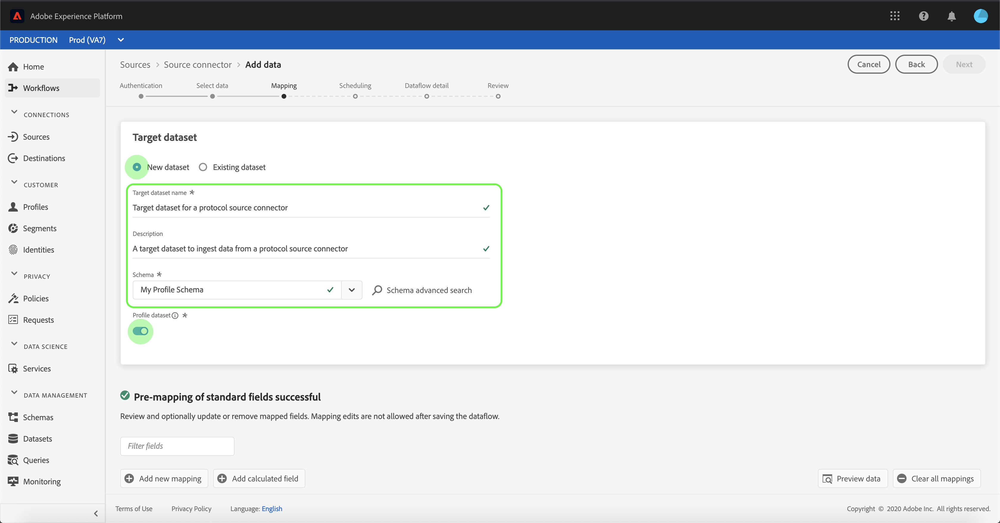

# Configuration d’un flux de données pour une connexion au protocole dans l’interface utilisateur

Un flux de données est une tâche planifiée qui récupère et ingère des données d’une source vers un jeu de données Adobe Experience Platform. Ce tutoriel décrit les étapes à suivre pour configurer un nouveau flux de données à l’aide de votre compte de protocoles.

## Prise en main

Ce tutoriel nécessite une compréhension du fonctionnement des composants suivants d’Adobe Experience Platform :

- [[!DNL Experience Data Model (XDM)] Système](../../../../xdm/home.md): Le cadre normalisé selon lequel [!DNL Experience Platform] organise les données d’expérience client.
   - [Principes de base de la composition des schémas](../../../../xdm/schema/composition.md) : découvrez les blocs de création de base des schémas XDM, y compris les principes clés et les bonnes pratiques en matière de composition de schémas.
   - [Tutoriel de l’éditeur de schémas](../../../../xdm/tutorials/create-schema-ui.md): Découvrez comment créer des schémas personnalisés à l’aide de l’interface utilisateur de l’éditeur de schémas.
- [[!DNL Real-time Customer Profile]](../../../../profile/home.md) : fournit un profil client en temps réel unifié basé sur des données agrégées issues de plusieurs sources.

En outre, ce tutoriel nécessite que vous ayez déjà créé un compte de protocoles. Vous trouverez une liste des tutoriels relatifs à la création de différents connecteurs de protocole dans l’interface utilisateur de la section [Présentation des connecteurs source](../../../home.md).

## Sélectionner des données

Après avoir créé votre compte de protocoles, la variable **[!UICONTROL Sélectionner des données]** s’affiche, fournissant ainsi une interface interactive vous permettant d’explorer votre hiérarchie de fichiers.

- La moitié gauche de l’interface est un navigateur de répertoires qui affiche les fichiers et répertoires de votre serveur.
- La moitié droite de l&#39;interface permet de prévisualiser jusqu&#39;à 100 lignes de données à partir d&#39;un fichier compatible.

Vous pouvez utiliser la variable **[!UICONTROL Rechercher]** en haut de la page pour identifier rapidement les données source que vous prévoyez d’utiliser.

>[!NOTE]
>
>L’option de données de source de recherche est disponible pour tous les connecteurs source tabulaires, à l’exception des connecteurs Analytics, Classifications, Hubs d’événements et Kinesis.

Une fois que vous avez trouvé les données source, sélectionnez le répertoire, puis cliquez sur **[!UICONTROL Suivant]**.

## Mappage des champs de données à un schéma XDM

Le **[!UICONTROL Mappage]** s’affiche, fournissant une interface interactive pour mapper les données source à une [!DNL Platform] jeu de données.

Sélectionnez un jeu de données dans lequel ingérer les données entrantes. Vous pouvez utiliser un jeu de données existant ou en créer un nouveau.

### Utilisation d’un jeu de données existant

Pour ingérer des données dans un jeu de données existant, sélectionnez **[!UICONTROL Utilisation d’un jeu de données existant]**, puis cliquez sur l’icône du jeu de données.

Le **[!UICONTROL Sélectionner un jeu de données]** s’affiche. Recherchez le jeu de données que vous souhaitez utiliser, sélectionnez-le, puis cliquez sur **[!UICONTROL Continuer]**.

### Utilisation d’un nouveau jeu de données

Pour ingérer des données dans un nouveau jeu de données, sélectionnez **[!UICONTROL Création d’un jeu de données]** et saisissez un nom et une description pour le jeu de données dans les champs fournis.

Vous pouvez joindre un champ de schéma en saisissant un nom de schéma dans la variable **[!UICONTROL Sélectionner un schéma]** barre de recherche. Vous pouvez également sélectionner l’icône déroulante pour afficher la liste des schémas existants. Vous pouvez également sélectionner **[!UICONTROL Recherche avancée]** pour accéder à l’écran des schémas existants, y compris leurs détails respectifs.

Au cours de cette étape, vous pouvez activer votre jeu de données pour [!DNL Real-time Customer Profile] et créer une vision globale des attributs et des comportements d’une entité. Les données de tous les jeux de données activés seront incluses dans [!DNL Profile] les modifications et sont appliquées lorsque vous enregistrez votre flux de données.

Activez/désactivez la variable **[!UICONTROL Jeu de données de profil]** pour activer votre jeu de données cible [!DNL Profile].

Le **[!UICONTROL Sélectionner un schéma]** s’affiche. Sélectionnez le schéma que vous souhaitez appliquer au nouveau jeu de données, puis cliquez sur **[!UICONTROL Terminé]**.

Selon vos besoins, vous pouvez choisir de mapper directement des champs ou d’utiliser des fonctions de préparation de données pour transformer les données sources afin d’obtenir des valeurs calculées ou calculées. Pour obtenir des instructions complètes sur l’utilisation de l’interface du mappeur et des champs calculés, reportez-vous à la section [Guide de l’interface utilisateur de la préparation de données](../../../../data-prep/ui/mapping.md).

>[!TIP]
>
>Platform fournit des recommandations intelligentes pour les champs mappés automatiquement en fonction du schéma ou du jeu de données cible que vous avez sélectionné. Vous pouvez ajuster manuellement les règles de mappage en fonction de vos cas d’utilisation.

Sélectionner **[!UICONTROL Aperçu des données]** pour afficher les résultats de mappage de 100 lignes maximum de données d’exemple du jeu de données sélectionné.

Lors de la prévisualisation, la colonne d’identité est considérée comme le premier champ, car il s’agit des informations clés nécessaires à la validation des résultats du mapping.

Une fois les données source mappées, sélectionnez **[!UICONTROL Fermer]**.

## Planification des exécutions d’ingestion

Le **[!UICONTROL Planification]** s’affiche, ce qui vous permet de configurer un planning d’ingestion pour ingérer automatiquement les données source sélectionnées à l’aide des mappages configurés. Le tableau suivant décrit les différents champs configurables pour la planification :

| Champ | Description |
| --- | --- |
| Fréquence | Les fréquences sélectionnées incluent `Once`, `Minute`, `Hour`, `Day`, et `Week`. |
| Intervalle | Entier qui définit l’intervalle pour la fréquence sélectionnée. |
| Heure de début | Horodatage UTC indiquant quand la toute première ingestion est configurée pour se produire. |
| Renvoi | Valeur boolean qui détermine les données ingérées initialement. If **[!UICONTROL Renvoi]** est activée, tous les fichiers actuels du chemin spécifié seront ingérés lors de la première ingestion planifiée. If **[!UICONTROL Renvoi]** est désactivé, seuls les fichiers chargés entre la première exécution de l’ingestion et l’heure de début seront ingérés. Les fichiers chargés avant l’heure de début ne seront pas ingérés. |
| Colonne delta | Une option avec un ensemble filtré de champs de schéma source de type, date ou heure. Ce champ sert à différencier les données nouvelles des données existantes. Les données incrémentielles seront ingérées en fonction de l’horodatage de la colonne sélectionnée. |

Les flux de données sont conçus pour ingérer automatiquement des données selon un calendrier précis. Sélectionnez tout d’abord la fréquence d’ingestion. Définissez ensuite l’intervalle pour désigner la période entre deux exécutions de flux. La valeur de l’intervalle doit être un entier non nul et doit être définie sur supérieur ou égal à 15.

Pour définir l’heure de début de l’ingestion, ajustez la date et l’heure affichées dans la zone d’heure de début. Vous pouvez également sélectionner l’icône de calendrier pour modifier la valeur de l’heure de début. L’heure de début doit être supérieure ou égale à l’heure UTC actuelle.

Sélectionner **[!UICONTROL Chargement des données incrémentielles par]** pour affecter la colonne delta. Ce champ établit une distinction entre les données nouvelles et existantes.

### Configuration d’un flux de données d’ingestion unique

Pour configurer l’ingestion unique, sélectionnez la flèche de liste déroulante Fréquence et choisissez **[!UICONTROL Une fois]**.

>[!TIP]
>
>**[!UICONTROL Intervalle]** et **[!UICONTROL Renvoi]** ne sont pas visibles lors d’une ingestion unique.

Une fois que vous avez fourni les valeurs appropriées au planning, sélectionnez **[!UICONTROL Suivant]**.

## Fournir des détails sur les flux de données

Le **[!UICONTROL Détails du flux de données]** s’affiche, vous permettant de nommer et de fournir une brève description de votre nouveau flux de données.

Au cours de ce processus, vous pouvez également activer **[!UICONTROL Ingestion partielle]** et **[!UICONTROL Diagnostics d’erreur]**. Activation **[!UICONTROL Ingestion partielle]** permet d’ingérer des données contenant des erreurs jusqu’à un certain seuil. Une fois **[!UICONTROL Ingestion partielle]** est activé, faites glisser le **[!UICONTROL Seuil d’erreur %]** composez pour ajuster le seuil d’erreur du lot. Vous pouvez également régler manuellement le seuil en sélectionnant la zone de saisie. Pour plus d’informations, voir [Présentation de l’ingestion par lots partielle](../../../../ingestion/batch-ingestion/partial.md).

Indiquez des valeurs pour le flux de données et sélectionnez **[!UICONTROL Suivant]**.

## Vérification du flux de données

Le **[!UICONTROL Réviser]** s’affiche, ce qui vous permet de consulter votre nouveau flux de données avant qu’il ne soit créé. Les détails sont regroupés dans les catégories suivantes :

- **[!UICONTROL Connexion]**: Affiche le type de source, le chemin d’accès approprié du fichier source choisi et la quantité de colonnes qu’il contient.
- **[!UICONTROL Attribution de champs de jeu de données et de mappage]**: Affiche le jeu de données dans lequel les données source sont ingérées, y compris le schéma auquel le jeu de données adhère.
- **[!UICONTROL Planification]**: Affiche la période, la fréquence et l’intervalle principaux du planning d’ingestion.

Une fois que vous avez examiné votre flux de données, cliquez sur **[!UICONTROL Terminer]** et accorder un certain temps pour la création du flux de données.

## Surveillance de votre flux de données

Une fois votre flux de données créé, vous pouvez surveiller les données ingérées pour afficher des informations sur les taux d’ingestion, les succès et les erreurs. Pour plus d’informations sur la surveillance du flux de données, consultez le tutoriel sur [surveillance des comptes et des flux de données dans l’interface utilisateur](../monitor.md).

## Suppression de votre flux de données

Vous pouvez supprimer les flux de données qui ne sont plus nécessaires ou qui ont été créés de manière incorrecte à l’aide de la fonction **[!UICONTROL Supprimer]** de la fonction **[!UICONTROL Flux de données]** workspace. Pour plus d’informations sur la suppression des flux de données, consultez le tutoriel sur [suppression de flux de données dans l’interface utilisateur](../delete.md).

## Étapes suivantes

En suivant ce tutoriel, vous avez réussi à créer un flux de données pour importer des données d’un système d’automatisation marketing et vous avez obtenu des informations sur la surveillance des jeux de données. Les données entrantes peuvent désormais être utilisées par en aval. [!DNL Platform] des services tels que [!DNL Real-time Customer Profile] et [!DNL Data Science Workspace]. Pour plus d’informations, consultez les documents suivants :

- [Présentation de [!DNL Real-time Customer Profile]](../../../../profile/home.md)
- [Présentation de [!DNL Data Science Workspace]](../../../../data-science-workspace/home.md)

## Annexe

Les sections suivantes apportent des informations supplémentaires sur l’utilisation des connecteurs source.

### Désactivation d’un flux de données

Lorsqu’un flux de données est créé, il devient immédiatement principal et ingère des données selon le planning qu’il a été donné. Vous pouvez désactiver un principal flux de données à tout moment en suivant les instructions ci-dessous.

Dans le **[!UICONTROL Flux de données]** sélectionnez le nom du flux de données que vous souhaitez désactiver.

Le **[!UICONTROL Propriétés]** s’affiche sur le côté droit de l’écran. Ce panneau contient une **[!UICONTROL Activé]** bouton bascule . Cliquez sur le bouton bascule pour désactiver le flux de données. Le même bouton peut être utilisé pour réactiver un flux de données une fois qu’il a été désactivé.

### Activer les données entrantes pour [!DNL Profile] population

Les données entrantes provenant de votre connecteur source peuvent être utilisées pour enrichir et remplir vos [!DNL Real-time Customer Profile] data. Pour plus d’informations sur le remplissage de votre [!DNL Real-time Customer Profile] data, consultez le tutoriel sur [Population du profil](../profile.md).
