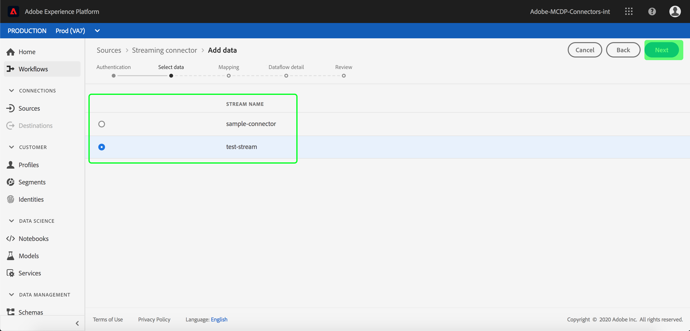
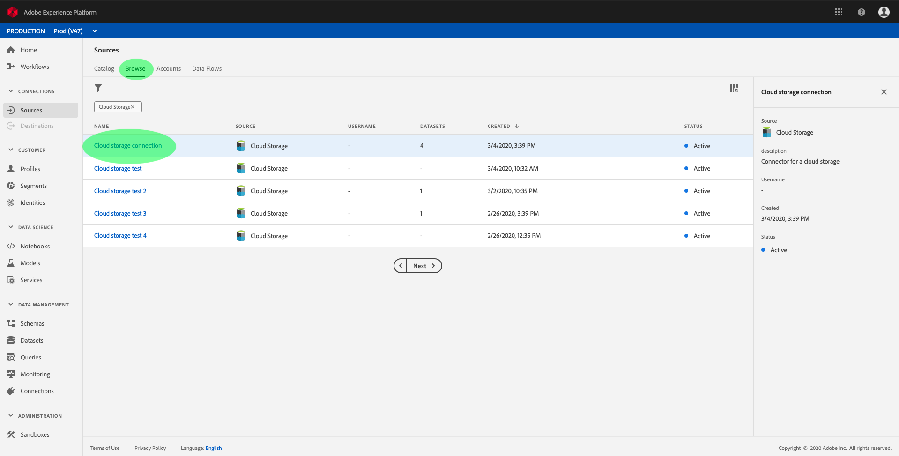

# Configuration d’un flux de données pour une connexion de flux continu d’enregistrement cloud dans l’interface utilisateur

Un flux de données est une tâche planifiée qui récupère et ingère des données d&#39;une source dans un jeu de données [!DNL Platform]. Ce didacticiel décrit les étapes à suivre pour configurer un nouveau flux de données à l’aide de votre connecteur de base d’enregistrements de cloud.

## Prise en main

Ce tutoriel nécessite une compréhension du fonctionnement des composants suivants d’Adobe Experience Platform :

- [[!DNL Experience Data Model (XDM)] Système](../../../../../xdm/home.md) : Cadre normalisé selon lequel  [!DNL Experience Platform] organiser les données d’expérience client.
   - [Principes de base de la composition des schémas](../../../../../xdm/schema/composition.md) : découvrez les blocs de création de base des schémas XDM, y compris les principes clés et les bonnes pratiques en matière de composition de schémas.
   - [Didacticiel](../../../../../xdm/tutorials/create-schema-ui.md) sur l’éditeur de schéma : Découvrez comment créer des schémas personnalisés à l’aide de l’interface utilisateur de l’éditeur de Schémas.
- [[!DNL Real-time Customer Profile]](../../../../../profile/home.md) : fournit un profil client en temps réel unifié basé sur des données agrégées issues de plusieurs sources.

De plus, ce didacticiel nécessite que vous ayez déjà créé un connecteur d’enregistrement de cloud. Vous trouverez une liste de didacticiels pour la création de différents connecteurs d’enregistrement de cloud dans l’interface utilisateur dans la section [présentation des connecteurs source](../../../../home.md).

## Sélectionner des données

Après avoir créé votre connecteur d’enregistrement de cloud, l’étape *Sélectionner les données* s’affiche, ce qui vous permet de sélectionner le flux à partir duquel vous diffuserez les données.

## Mappage des champs de données à un schéma XDM

L’étape **[!UICONTROL Mappage]** s’affiche, fournissant une interface interactive permettant de mapper les données source à un jeu de données [!DNL Platform].

Choisissez un jeu de données dans lequel les données entrantes doivent être assimilées. Vous pouvez soit utiliser un jeu de données existant, soit en créer un nouveau.

**Utilisation d’un jeu de données existant**

Pour importer des données dans un jeu de données existant, sélectionnez **[!UICONTROL Utiliser le jeu de données existant]**, puis cliquez sur l&#39;icône du jeu de données.

La boîte de dialogue **[!UICONTROL Sélectionner un jeu de données]** s&#39;affiche. Recherchez le jeu de données que vous souhaitez utiliser, sélectionnez-le, puis cliquez sur **[!UICONTROL Continuer]**.

**Utiliser un nouveau jeu de données**

Pour importer des données dans un nouveau jeu de données, sélectionnez **[!UICONTROL Créer un nouveau jeu de données]** et entrez un nom et une description pour le jeu de données dans les champs fournis. Sélectionnez ensuite le schéma à utiliser dans la liste déroulante.

## Nommer votre flux de données

L&#39;étape **[!UICONTROL Détails du flux de données]** s&#39;affiche, vous permettant de nommer et de décrire brièvement votre nouveau flux de données.

Fournissez des valeurs pour le flux de données et cliquez sur **[!UICONTROL Suivant]**.

### Vérifier votre flux de données

L&#39;étape **[!UICONTROL Réviser]** s&#39;affiche, vous permettant de vérifier votre nouveau flux de données avant sa création. Les détails sont regroupés dans les catégories suivantes :

- **[!UICONTROL Détails]** de la source : Affiche le type de source et d’autres détails pertinents sur la source.
- **[!UICONTROL Détails]** de la cible : Affiche le jeu de données dans lequel les données source sont ingérées, y compris le schéma auquel le jeu de données adhère.

Une fois que vous avez passé en revue votre flux de données, cliquez sur **[!UICONTROL Terminer]** et attendez un certain temps pour que le flux de données soit créé.

## Surveiller et supprimer votre flux de données

Une fois le flux de données de votre enregistrement cloud créé, vous pouvez surveiller les données qui y sont ingérées. Pour plus d&#39;informations sur la surveillance et la suppression des flux de données, consultez le didacticiel [surveillance des flux de données](../../../../../ingestion/quality/monitor-data-ingestion.md).

## Étapes suivantes

En suivant ce didacticiel, vous avez réussi à créer un flux de données pour importer des données à partir d’un enregistrement cloud externe et à mieux comprendre la surveillance des jeux de données. Les données entrantes peuvent désormais être utilisées par les services [!DNL Platform] en aval tels que [!DNL Real-time Customer Profile] et [!DNL Data Science Workspace]. Pour plus d’informations, voir les documents suivants :

- [[!DNL Real-time Customer Profile] aperçu](../../../../../profile/home.md)
- [[!DNL Data Science Workspace] aperçu](../../../../../data-science-workspace/home.md)

## Annexe

Les sections suivantes fournissent des informations supplémentaires sur l’utilisation des connecteurs source.

### Désactivation d’un flux de données

Lorsqu’un flux de données est créé, il devient immédiatement principal et ingère les données selon le planning qu’il a reçu. Vous pouvez désactiver un flux de données principal à tout moment en suivant les instructions ci-dessous.

Dans l&#39;espace de travail **[!UICONTROL Sources]**, cliquez sur l&#39;onglet **[!UICONTROL Parcourir]**. Cliquez ensuite sur le nom de la connexion associée au flux de données principal que vous souhaitez désactiver.

La page **[!UICONTROL activité source]** s&#39;affiche. Sélectionnez le flux de données principal dans la liste pour ouvrir sa colonne **[!UICONTROL Propriétés]** sur le côté droit de l&#39;écran, qui contient un bouton d&#39;activation **[!UICONTROL Activé]**. Cliquez sur la bascule pour désactiver le flux de données. La même bascule peut être utilisée pour réactiver un flux de données après sa désactivation.

### Activer les données entrantes pour la population [!DNL Profile]

Les données entrantes de votre connecteur source peuvent être utilisées pour enrichir et renseigner vos données [!DNL Real-time Customer Profile]. Pour plus d&#39;informations sur le renseignement de vos données [!DNL Real-time Customer Profile], consultez le tutoriel sur [population de Profils](../../profile.md).
