# Créer un flux de données en continu pour une source d’espace de stockage dans l’interface utilisateur

Un flux de données est une tâche planifiée qui récupère et ingère des données d’une source vers un jeu de données Adobe Experience Platform. Ce tutoriel décrit les étapes à suivre pour créer un flux de données en continu pour une source d’espace de stockage dans l’interface utilisateur.

Avant de suivre ce tutoriel, vous devez d’abord établir une connexion valide et authentifiée entre votre compte d’espace de stockage et Experience Platform. Si vous ne disposez pas déjà d’une connexion authentifiée, consultez l’un des tutoriels suivants pour obtenir des informations sur l’authentification de vos comptes d’espace de stockage dans le cloud en flux continu :

- [[!DNL Amazon Kinesis]](../../../ui/create/cloud-storage/kinesis.md)
- [[!DNL Azure Event Hubs]](../../../ui/create/cloud-storage/eventhub.md)
- [[!DNL Google PubSub]](../../../ui/create/cloud-storage/google-pubsub.md)

## Prise en main

Ce tutoriel nécessite une compréhension du fonctionnement des composants suivants d’Adobe Experience Platform :

- [Flux de données](../../../../../dataflows/home.md) : les flux de données sont une représentation des tâches de données qui déplacent ces dernières dans Experience Platform. Les flux de données sont configurés sur différents services, des sources aux [!DNL Identity Service], en passant par les [!DNL Profile] et les [!DNL Destinations].
- [Préparation de données](../../../../../data-prep/home.md) : la préparation des données permet aux ingénieur(e)s de données de mapper, de transformer et de valider les données vers et à partir du modèle de données d’expérience (XDM). La préparation des données apparaît comme étape de « mappage » dans les processus dʼingestion de données, y compris le workflow dʼingestion de données CSV.
- [[!DNL Experience Data Model (XDM)] Système](../../../../../xdm/home.md) : le cadre normalisé en fonction duquel [!DNL Experience Platform] organise les données d’expérience client.
   - [Principes de base de la composition des schémas](../../../../../xdm/schema/composition.md) : découvrez les blocs de création de base des schémas XDM, y compris les principes clés et les bonnes pratiques en matière de composition de schémas.
   - [Tutoriel sur l’éditeur de schémas](../../../../../xdm/tutorials/create-schema-ui.md) : découvrez comment créer des schémas personnalisés à l’aide de l’interface utilisateur de l’éditeur de schémas.
- [[!DNL Real-Time Customer Profile]](../../../../../profile/home.md) : fournit un profil de consommateur unifié en temps réel, basé sur des données agrégées provenant de plusieurs sources.

## Ajouter des données

>[!NOTE]
>
>Vous ne pouvez créer qu’un seul flux de données source par groupe de clients pour un hub d’événements donné.

Une fois que vous avez créé votre compte d’espace de stockage dans le cloud pour la diffusion en continu, l’étape **[!UICONTROL Select data]** s’affiche, vous permettant de sélectionner le flux de données à importer dans Experience Platform.

- La partie gauche de l’interface est un navigateur qui vous permet d’afficher les flux de données disponibles dans votre compte ;
- La partie droite de l’interface vous permet de prévisualiser jusqu’à 100 lignes de données à partir d’un fichier JSON.

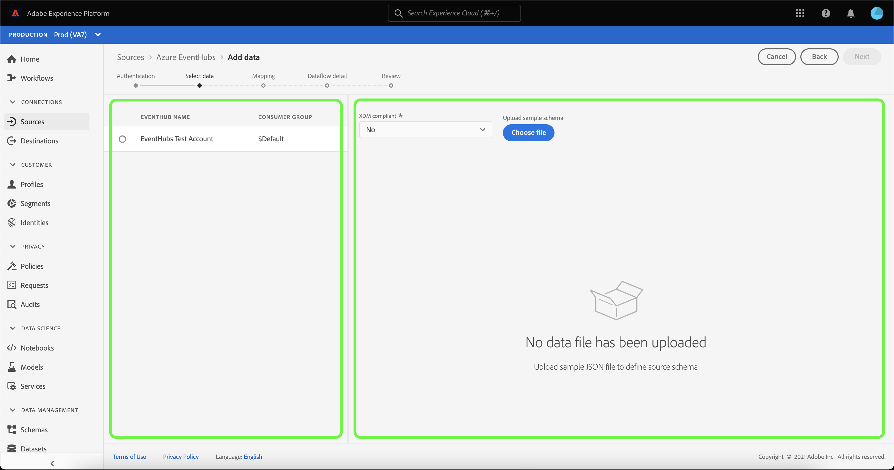

Sélectionnez le flux de données à utiliser, puis sélectionnez **[!UICONTROL Choose file]** pour charger un exemple de schéma.

>[!TIP]
>
>Si vos données sont conformes à XDM, vous pouvez ignorer le chargement d’un exemple de schéma et sélectionner **[!UICONTROL Next]** pour continuer.

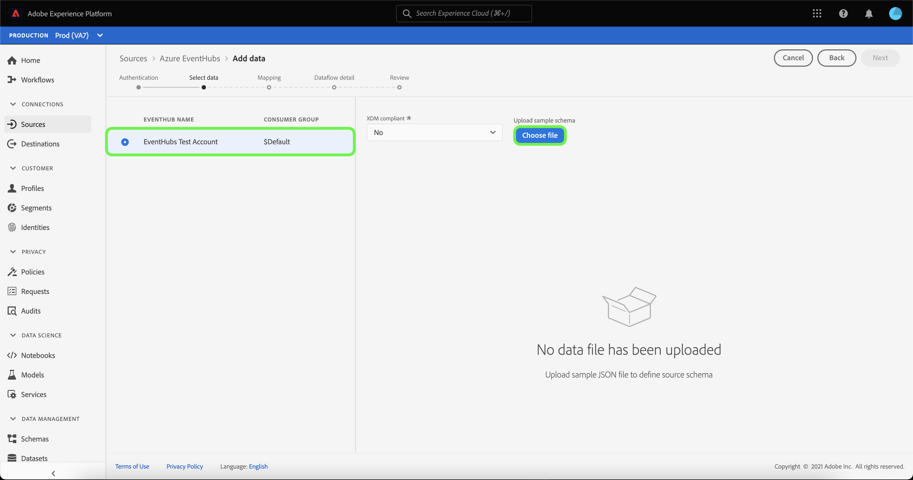

Une fois le schéma chargé, l’interface de prévisualisation se met à jour pour afficher un aperçu du schéma que vous avez chargé. L’interface de prévisualisation vous permet d’examiner le contenu et la structure d’un fichier. Vous pouvez également utiliser l’utilitaire [!UICONTROL Search field] pour accéder à des éléments spécifiques depuis votre schéma.

Lorsque vous avez terminé, sélectionnez **[!UICONTROL Next]**.

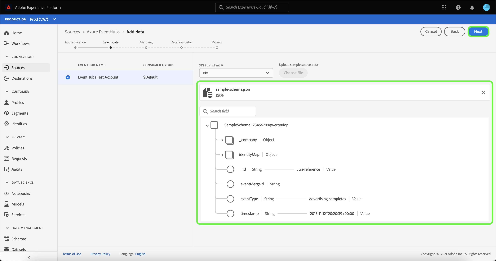

## Mappage

L’étape **[!UICONTROL Mapping]** s’affiche, fournissant une interface pour mapper les données sources à un jeu de données Experience Platform.

Sélectionnez un jeu de données dans lequel ingérer les données entrantes. Vous pouvez utiliser un jeu de données existant ou en créer un nouveau.

### Nouveau jeu de données

Pour ingérer des données dans un nouveau jeu de données, sélectionnez **[!UICONTROL New dataset]** et saisissez un nom et une description pour le jeu de données dans les champs fournis. Pour ajouter un schéma, vous pouvez saisir un nom de schéma existant dans la boîte de dialogue **[!UICONTROL Select schema]**. Vous pouvez également sélectionner **[!UICONTROL Schema advanced search]** pour rechercher un schéma approprié.

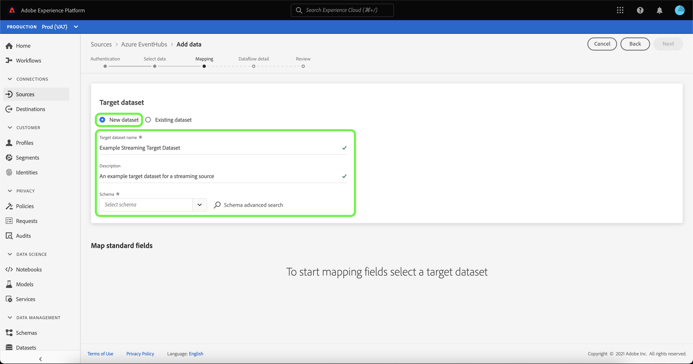

La fenêtre [!UICONTROL Select schema] s’affiche, vous fournissant une liste des schémas disponibles parmi lesquels choisir. Sélectionnez un schéma dans la liste pour mettre à jour le rail de droite afin d’afficher les détails spécifiques au schéma que vous avez sélectionné, y compris des informations indiquant si le schéma est activé pour la [!DNL Profile].

Une fois que vous avez identifié et sélectionné le schéma à utiliser, cliquez sur **[!UICONTROL Done]**.

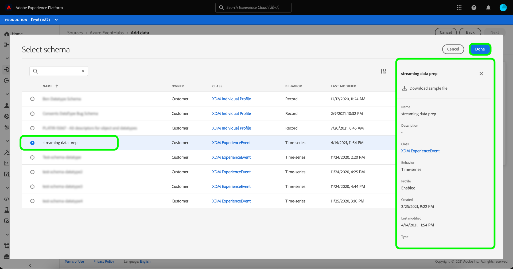

La page [!UICONTROL Target dataset] est mise à jour avec le schéma sélectionné affiché dans le jeu de données. Au cours de cette étape, vous pouvez activer votre jeu de données pour la [!DNL Profile] et créer une vue holistique des attributs et des comportements d’une entité. Les données de tous les jeux de données activés seront incluses dans [!DNL Profile] et les modifications sont appliquées lorsque vous enregistrez votre flux de données.

Activez le bouton **[!UICONTROL Profile dataset]** pour activer votre jeu de données cible pour la [!DNL Profile].

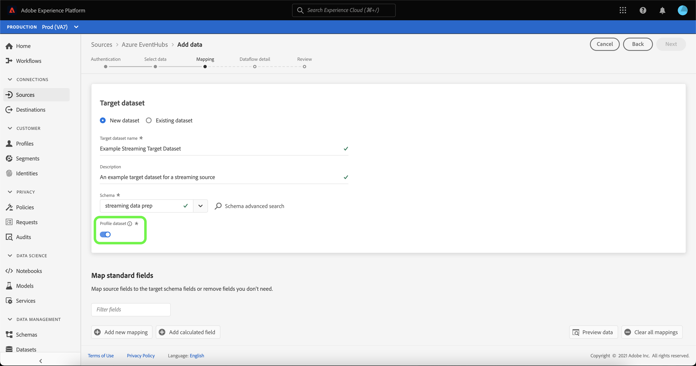

### Jeu de données existant

Pour ingérer des données dans un jeu de données existant, sélectionnez **[!UICONTROL Existing dataset]**, puis l’icône du jeu de données.

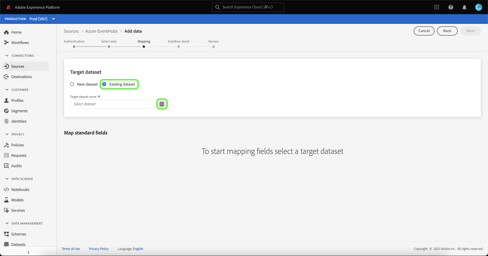

La boîte de dialogue **[!UICONTROL Select dataset]** s’affiche, vous fournissant une liste des jeux de données disponibles parmi lesquels choisir. Sélectionnez un jeu de données dans la liste pour mettre à jour le rail de droite afin d’afficher les détails spécifiques au jeu de données que vous avez sélectionné, y compris des informations indiquant si le jeu de données peut être activé pour [!DNL Profile].

Une fois que vous avez identifié et sélectionné le jeu de données à utiliser, sélectionnez **[!UICONTROL Done]**.

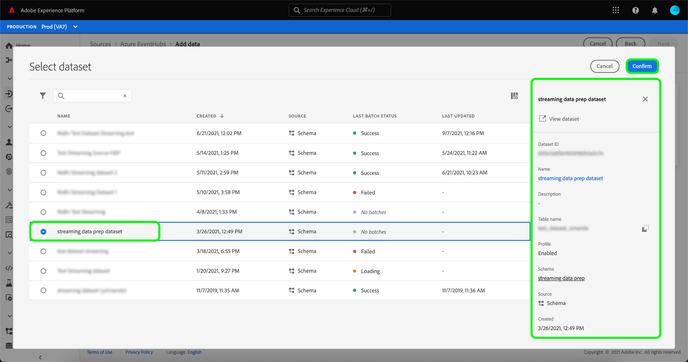

Une fois que vous avez sélectionné votre jeu de données, cliquez sur le bouton (bascule) [!DNL Profile] pour activer votre jeu de données à des fins d’[!DNL Profile].

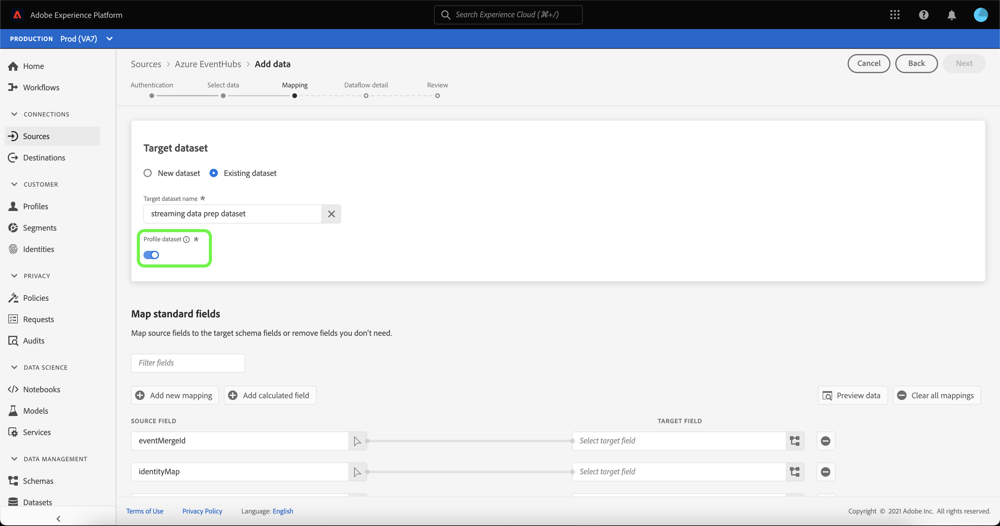

### Mappage des champs standard

Une fois votre jeu de données et votre schéma établis, l’interface **[!UICONTROL Map standard fields]** s’affiche, vous permettant de configurer manuellement les champs de mappage pour vos données.

>[!TIP]
>
>Experience Platform fournit des recommandations intelligentes pour les champs mappés automatiquement en fonction du schéma ou du jeu de données cible que vous avez sélectionné. Vous pouvez ajuster manuellement les règles de mappage en fonction de vos cas d’utilisation.

Selon vos besoins, vous pouvez choisir de mapper directement des champs ou d’utiliser des fonctions de préparation de données pour transformer les données sources afin d’obtenir des valeurs informatisées ou calculées. Pour obtenir des instructions complètes sur l’utilisation de l’interface du mappeur et des champs calculés, consultez le [ Guide de l’interface utilisateur de la préparation des données ](../../../../../data-prep/ui/mapping.md).

Une fois vos données source mappées, sélectionnez **[!UICONTROL Next]**.

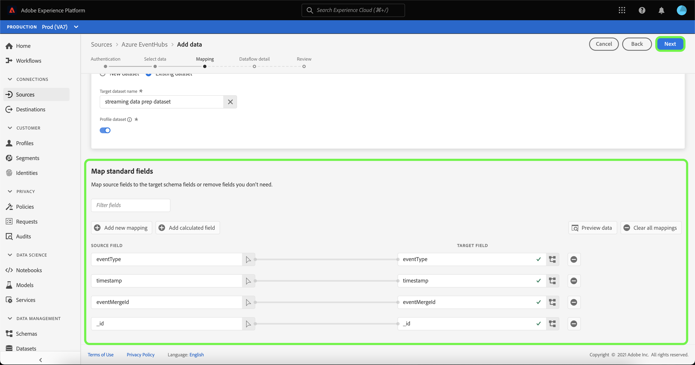

## Détails du flux de données

L’étape **[!UICONTROL Dataflow detail]** s’affiche, vous permettant de nommer et de donner une brève description de votre nouveau flux de données.

Fournissez des valeurs pour le flux de données et sélectionnez **[!UICONTROL Next]**.

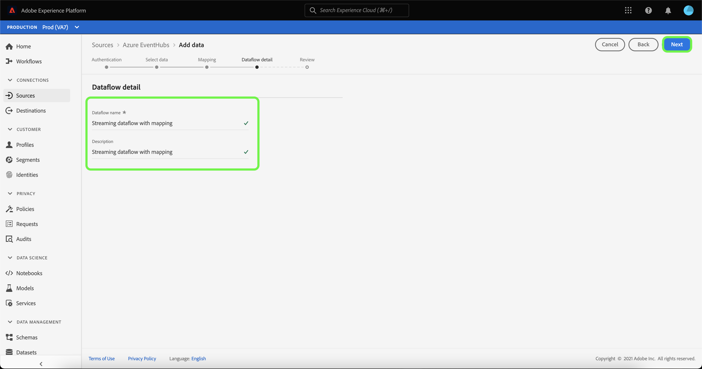

### Réviser

L’étape **[!UICONTROL Review]** s’affiche, vous permettant de vérifier votre nouveau flux de données avant sa création. Les détails sont regroupés dans les catégories suivantes :

- **[!UICONTROL Connection]** : affiche le nom de votre compte, le type de source et d’autres informations diverses spécifiques à la source d’espace de stockage en flux continu que vous utilisez.
- **[!UICONTROL Assign dataset and map fields]** : affiche le jeu de données cible et le schéma que vous utilisez pour votre flux de données.

Une fois que vous avez révisé votre flux de données, sélectionnez **[!UICONTROL Finish]** et patientez quelques instants le temps que le flux de données soit créé.

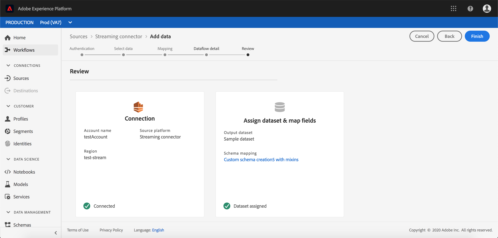

## Surveiller et supprimer le flux de données

Une fois votre flux de données de stockage dans le cloud en flux continu créé, vous pouvez surveiller les données ingérées par celui-ci. Pour plus d’informations sur la surveillance et la suppression des flux de données en flux continu, consultez le tutoriel sur la [surveillance des flux de données en flux continu](../../monitor-streaming.md).

## Étapes suivantes

Ce tutoriel vous a permis de créer un flux de données pour diffuser des données à partir d’une source d’espace de stockage dans le cloud. Ces données entrantes peuvent désormais être utilisées par les services Experience Platform en aval tels que [!DNL Real-Time Customer Profile] et [!DNL Data Science Workspace]. Consultez les documents suivants pour plus d’informations :

- [Présentation de [!DNL Real-Time Customer Profile]](../../../../../profile/home.md)
- [Présentation de [!DNL Data Science Workspace]](../../../../../data-science-workspace/home.md)