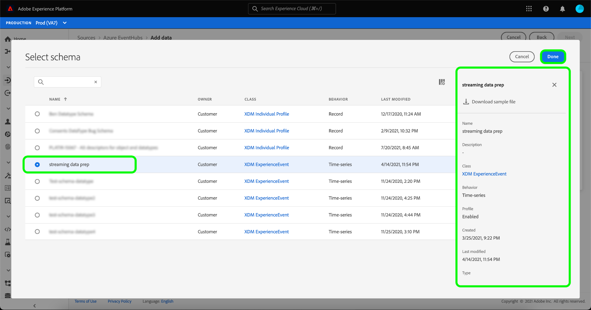

# Création d’un flux de données en continu pour une source de stockage dans le cloud dans l’interface utilisateur

Un flux de données est une tâche planifiée qui récupère et ingère des données d’une source vers un jeu de données Adobe Experience Platform. Ce tutoriel décrit les étapes à suivre pour créer un flux de données en continu pour une source de stockage dans le cloud dans l’interface utilisateur.

Avant de lancer ce tutoriel, vous devez établir une connexion valide et authentifiée entre votre compte de stockage dans le cloud et Platform. Si vous ne disposez pas déjà d’une connexion authentifiée, consultez l’un des tutoriels suivants pour plus d’informations sur l’authentification de vos comptes de stockage dans le cloud en continu :

- [[!DNL Amazon Kinesis]](../../../ui/create/cloud-storage/kinesis.md)
- [[!DNL Azure Event Hubs]](../../../ui/create/cloud-storage/eventhub.md)
- [[!DNL Google PubSub]](../../../ui/create/cloud-storage/google-pubsub.md)

## Prise en main

Ce tutoriel nécessite une compréhension du fonctionnement des composants suivants d’Adobe Experience Platform :

- [Flux de données](../../../../../dataflows/home.md) : les flux de données sont une représentation des tâches de données qui déplacent ces dernières dans Platform. Les flux de données sont configurés entre différents services, de sources, à [!DNL Identity Service], à [!DNL Profile] et à [!DNL Destinations].
- [Préparation de données](../../../../../data-prep/home.md) : la préparation de données permet aux ingénieurs de données de mapper, de transformer et de valider des données vers et depuis le modèle de données d’expérience (XDM). La préparation des données apparaît comme étape de « mappage » dans les processus dʼingestion de données, y compris le workflow dʼingestion de données CSV.
- [[!DNL Experience Data Model (XDM)] Système](../../../../../xdm/home.md) : le cadre normalisé en fonction duquel [!DNL Experience Platform] organise les données d’expérience client.
   - [Principes de base de la composition des schémas](../../../../../xdm/schema/composition.md) : découvrez les blocs de création de base des schémas XDM, y compris les principes clés et les bonnes pratiques en matière de composition de schémas.
   - [Tutoriel sur l’éditeur de schémas](../../../../../xdm/tutorials/create-schema-ui.md) : découvrez comment créer des schémas personnalisés à l’aide de l’interface utilisateur de l’éditeur de schémas.
- [[!DNL Real-Time Customer Profile]](../../../../../profile/home.md) : fournit un profil de consommateur unifié en temps réel, basé sur des données agrégées provenant de plusieurs sources.

## Ajouter des données

>[!NOTE]
>
>Vous ne pouvez créer qu’un seul flux de données source par groupe de consommateurs pour un Hub d’événements donné.

Après avoir créé votre compte d’authentification de stockage dans le cloud en continu, l’étape **[!UICONTROL Sélectionner les données]** s’affiche, vous permettant ainsi de sélectionner le flux de données que vous allez apporter à Platform.

- La partie gauche de l’interface est un navigateur qui vous permet d’afficher les flux de données disponibles dans votre compte ;
- La partie droite de l’interface vous permet de prévisualiser jusqu’à 100 lignes de données à partir d’un fichier JSON.

Sélectionnez le flux de données à utiliser, puis **[!UICONTROL Choisir le fichier]** pour charger un exemple de schéma.

>[!TIP]
>
>Si vos données sont conformes à XDM, vous pouvez ignorer le téléchargement d’un exemple de schéma et sélectionner **[!UICONTROL Suivant]** pour continuer.

Une fois votre schéma chargé, l’interface d’aperçu se met à jour pour afficher un aperçu du schéma que vous avez chargé. L’interface d’aperçu vous permet d’examiner le contenu et la structure d’un fichier. Vous pouvez également utiliser l’utilitaire [!UICONTROL Search field] pour accéder à des éléments spécifiques à partir de votre schéma.

Lorsque vous avez terminé, sélectionnez **[!UICONTROL Suivant]**.

## Mappage

L’étape **[!UICONTROL Mapping]** s’affiche, fournissant une interface pour mapper les données source à un jeu de données Platform.

Sélectionnez un jeu de données dans lequel ingérer les données entrantes. Vous pouvez utiliser un jeu de données existant ou en créer un nouveau.

### Nouveau jeu de données

Pour ingérer des données dans un nouveau jeu de données, sélectionnez **[!UICONTROL Nouveau jeu de données]** et saisissez un nom et une description pour le jeu de données dans les champs fournis. Pour ajouter un schéma, vous pouvez saisir un nom de schéma existant dans la boîte de dialogue **[!UICONTROL Sélectionner un schéma]**. Vous pouvez également sélectionner **[!UICONTROL Recherche avancée de schéma]** pour rechercher un schéma approprié.

La fenêtre [!UICONTROL Sélectionner un schéma] s’affiche, vous indiquant la liste des schémas disponibles dans lesquels effectuer votre choix. Sélectionnez un schéma dans la liste pour mettre à jour le rail droit afin d’afficher les détails spécifiques au schéma que vous avez sélectionné, y compris des informations sur l’activation ou non du schéma pour [!DNL Profile].

Une fois que vous avez identifié et sélectionné le schéma que vous souhaitez utiliser, sélectionnez **[!UICONTROL Terminé]**.

La page [!UICONTROL Jeu de données Target] se met à jour avec votre schéma sélectionné affiché dans le cadre du jeu de données. Au cours de cette étape, vous pouvez activer votre jeu de données pour [!DNL Profile] et créer une vue holistique des attributs et des comportements d’une entité. Les données de tous les jeux de données activés seront incluses dans [!DNL Profile] et les modifications sont appliquées lorsque vous enregistrez votre flux de données.

Active/désactive le bouton **[!UICONTROL Jeu de données de profil]** pour activer votre jeu de données cible pour [!DNL Profile].

### Jeu de données existant

Pour ingérer des données dans un jeu de données existant, sélectionnez **[!UICONTROL Jeu de données existant]**, puis sélectionnez l’icône du jeu de données.

La boîte de dialogue **[!UICONTROL Sélectionner un jeu de données]** s’affiche, vous fournissant une liste des jeux de données disponibles parmi lesquels choisir. Sélectionnez un jeu de données dans la liste pour mettre à jour le rail droit afin d’afficher les détails spécifiques au jeu de données que vous avez sélectionné, y compris des informations sur l’activation ou non du jeu de données pour [!DNL Profile].

Une fois que vous avez identifié et sélectionné le jeu de données à utiliser, sélectionnez **[!UICONTROL Terminé]**.

Une fois que vous avez sélectionné votre jeu de données, sélectionnez la bascule [!DNL Profile] pour activer votre jeu de données pour [!DNL Profile].

### Mappage des champs standard

Une fois votre jeu de données et votre schéma créés, l’interface **[!UICONTROL Mapper les champs standard]** s’affiche, ce qui vous permet de configurer manuellement les champs de mappage pour vos données.

>[!TIP]
>
>Platform fournit des recommandations intelligentes pour les champs mappés automatiquement en fonction du schéma ou du jeu de données cible que vous avez sélectionné. Vous pouvez ajuster manuellement les règles de mappage en fonction de vos cas d’utilisation.

Selon vos besoins, vous pouvez choisir de mapper directement des champs ou d’utiliser des fonctions de préparation de données pour transformer les données sources afin d’obtenir des valeurs informatisées ou calculées. Pour obtenir des instructions complètes sur l’utilisation de l’interface du mappeur et des champs calculés, consultez le [guide de l’interface utilisateur de la préparation des données](../../../../../data-prep/ui/mapping.md).

Une fois vos données source mappées, sélectionnez **[!UICONTROL Suivant]**.

## Détails du flux de données

L’étape **[!UICONTROL Détails du flux de données]** s’affiche, vous permettant de nommer et de donner une brève description de votre nouveau flux de données.

Indiquez les valeurs du flux de données et sélectionnez **[!UICONTROL Suivant]**.

### Révision

L’écran de **[!UICONTROL Révision]** s’affiche, vous permettant dʼexaminer votre nouveau flux de données avant sa création. Les détails sont regroupés dans les catégories suivantes :

- **[!UICONTROL Connexion]** : affiche le nom de votre compte, le type de source et d’autres informations diverses spécifiques à la source de stockage dans le cloud en continu que vous utilisez.
- **[!UICONTROL Attribuer des champs de jeu de données et de mappage]** : affiche le jeu de données et le schéma cible que vous utilisez pour votre flux de données.

Une fois que vous avez vérifié votre flux de données, sélectionnez **[!UICONTROL Terminer]** et patientez quelques instants le temps que le flux de données soit créé.

## Surveillance et suppression de votre flux de données

Une fois votre flux de données de stockage dans le cloud en continu créé, vous pouvez surveiller les données qui sont ingérées par celui-ci. Pour plus d’informations sur la surveillance et la suppression des flux de données en continu, consultez le tutoriel sur la [surveillance des flux de données en continu](../../monitor-streaming.md).

## Étapes suivantes

En suivant ce tutoriel, vous avez créé un flux de données pour diffuser des données à partir d’une source de stockage dans le cloud. Ces données entrantes peuvent désormais être utilisées par les services de Platform en aval, comme [!DNL Real-Time Customer Profile] et [!DNL Data Science Workspace]. Consultez les documents suivants pour plus d’informations :

- [Présentation de [!DNL Real-Time Customer Profile]](../../../../../profile/home.md)
- [Présentation de [!DNL Data Science Workspace]](../../../../../data-science-workspace/home.md)