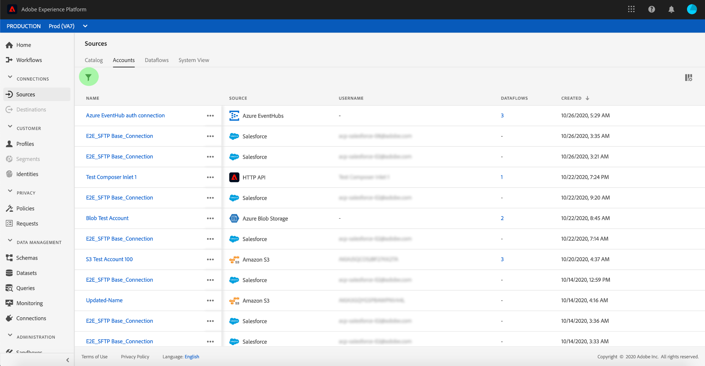
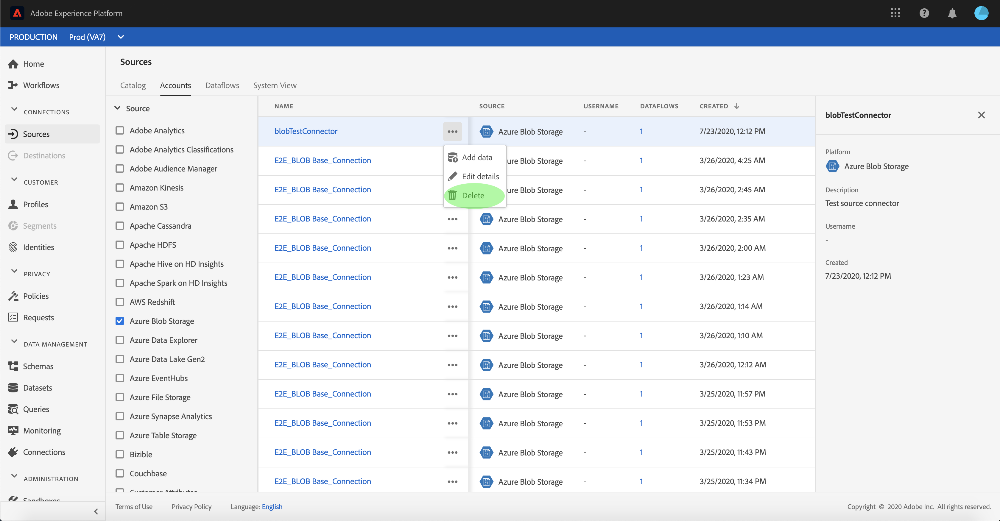

# Suppression des comptes de connexion source

Les connecteurs Source dans Adobe Experience Platform permettent d’ingérer des données provenant de l’extérieur de manière planifiée. Ce tutoriel décrit les étapes à suivre pour supprimer des comptes de l’espace de travail **[!UICONTROL Sources]** .

## Prise en main

Ce tutoriel nécessite une compréhension du fonctionnement des composants suivants d’Adobe Experience Platform :

- [[!DNL Experience Data Model (XDM)] Système](../../../xdm/home.md) : le cadre normalisé en fonction duquel [!DNL Experience Platform] organise les données d’expérience client.
   - [Principes de base de la composition des schémas](../../../xdm/schema/composition.md) : découvrez les blocs de création de base des schémas XDM, y compris les principes clés et les bonnes pratiques en matière de composition de schémas.
   - [Tutoriel sur l’éditeur de schémas](../../../xdm/tutorials/create-schema-ui.md) : découvrez comment créer des schémas personnalisés à l’aide de l’interface utilisateur de l’éditeur de schémas.
- [[!DNL Real-Time Customer Profile]](../../../profile/home.md) : fournit un profil de consommateur unifié en temps réel, basé sur des données agrégées provenant de plusieurs sources.

## Suppression de comptes dans l’interface utilisateur

>[!TIP]
>
>Avant de supprimer le compte source, vous devez d’abord supprimer les flux de données existants associés à ce compte source. Pour supprimer des flux de données existants, reportez-vous au tutoriel sur la [suppression des flux de données de sources dans l’interface utilisateur](./delete.md).

Connectez-vous à [Adobe Experience Platform](https://platform.adobe.com), puis sélectionnez **[!UICONTROL Sources]** dans la barre de navigation de gauche pour accéder à l’espace de travail **[!UICONTROL Sources]**. L’écran **[!UICONTROL Catalogue]** affiche diverses sources pour lesquelles vous pouvez créer des comptes et des flux de données. Chaque source indique le nombre de comptes et de flux de données existants qui lui sont associés.

Sélectionnez **[!UICONTROL Comptes]** pour accéder à la page **[!UICONTROL Comptes]**.

Une liste des comptes existants s’affiche. Cette page contient une liste d’informations pouvant être triées pour les comptes existants, tels que la source, le nom d’utilisateur, les flux de données associés et la date de création. Sélectionnez l’ **icône d’entonnoir** en haut à gauche pour effectuer le tri.

Le panneau de tri s’affiche sur le côté gauche de l’écran, avec une liste des sources disponibles. Vous pouvez sélectionner plusieurs sources à l’aide de la fonction de tri.

Sélectionnez la source à laquelle vous souhaitez accéder et localisez le compte que vous avez l’intention de supprimer de la liste des comptes dans l’interface principale. Dans cet exemple, la source sélectionnée est **[!DNL Azure Blob Storage]** et le nom du compte est **[!UICONTROL blobTestConnector]**. Lors de la sélection de plusieurs sources dans le panneau de tri, vos comptes créés le plus récemment apparaissent en premier, car la liste est triée par date de création.

Sélectionnez le compte que vous souhaitez supprimer.

Le panneau **[!UICONTROL Propriétés]** s’affiche sur le côté droit de l’écran, contenant des informations concernant le compte sélectionné.

Sélectionnez les points de suspension (`...`) à côté du nom du compte que vous avez l’intention de supprimer. Un panneau contextuel s’affiche, fournissant des options pour **[!UICONTROL Ajouter des données]**, **[!UICONTROL Modifier les détails]** et **[!UICONTROL Supprimer]**. Sélectionnez **[!UICONTROL Supprimer]** pour supprimer le compte.

Une boîte de dialogue de confirmation finale s’affiche. Sélectionnez **[!UICONTROL Supprimer]** pour terminer le processus.

## Étapes suivantes

En suivant ce tutoriel, vous avez réussi à utiliser l’espace de travail **[!UICONTROL Sources]** pour supprimer des comptes existants.

Pour savoir comment effectuer ces opérations par programmation à l’aide de l’API [!DNL Flow Service], reportez-vous au tutoriel sur la [&#x200B; suppression des connexions à l’aide de l’API Flow Service](../../tutorials/api/delete.md).
