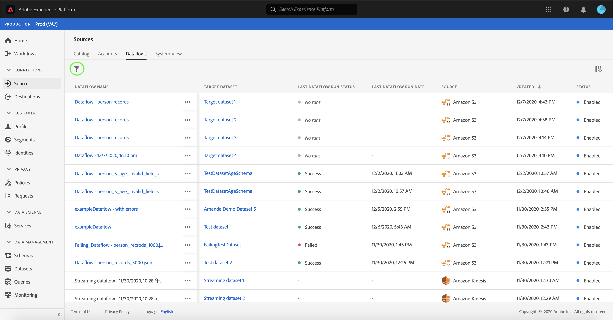

# Supprimer des flux de données

Les connecteurs source de Adobe Experience Platform permettent d’importer des données provenant de l’extérieur sur une base planifiée. Ce didacticiel décrit les étapes à suivre pour supprimer des flux de données de l&#39;espace de travail [!UICONTROL Sources] .

## Prise en main

Ce tutoriel nécessite une compréhension du fonctionnement des composants suivants d’Adobe Experience Platform :

- [[!DNL Experience Data Model] (XDM) Système](../../../xdm/home.md): Cadre normalisé selon lequel [!DNL Experience Platform] organiser les données d’expérience client.
   - [Principes de base de la composition des schémas](../../../xdm/schema/composition.md) : découvrez les blocs de création de base des schémas XDM, y compris les principes clés et les bonnes pratiques en matière de composition de schémas.
   - [Didacticiel](../../../xdm/tutorials/create-schema-ui.md)sur l’éditeur de schéma : Découvrez comment créer des schémas personnalisés à l’aide de l’interface utilisateur de l’éditeur de Schémas.
- [[ !Profil client en temps réel DNL]](../../../profile/home.md): Fournit un profil de consommation unifié en temps réel basé sur des données agrégées provenant de plusieurs sources.

## Suppression de flux de données à l’aide de l’interface utilisateur

Connectez-vous à [Adobe Experience Platform](https://platform.adobe.com) , puis sélectionnez **[!UICONTROL Sources]** dans la barre de navigation de gauche pour accéder à l’espace de travail **[!UICONTROL Sources]** . L’écran **[!UICONTROL Catalogue]** affiche diverses sources pour lesquelles vous pouvez créer des comptes et des flux de données. Chaque source indique le nombre de comptes et de flux de données existants qui leur sont associés.

Sélectionnez **[!UICONTROL Flux de données]** pour accéder à la page Flux de **[!UICONTROL données]** .

Une liste de flux de données existants s’affiche. Cette page contient une liste d&#39;informations pouvant être triées pour les flux de données existants tels que la source, le nom d&#39;utilisateur, l&#39;état d&#39;exécution et la date de dernière exécution. Sélectionnez l’icône **** d’entonnoir située en haut à gauche pour effectuer le tri.

Le panneau de tri s’affiche sur le côté gauche de l’écran, avec une liste de sources disponibles.
Vous pouvez sélectionner plusieurs sources à l’aide de la fonction de tri.

Sélectionnez la source à laquelle vous souhaitez accéder et localisez le flux de données que vous souhaitez supprimer de la liste des flux de données dans l&#39;interface principale. Dans l’exemple, la source sélectionnée est **[!DNL Azure Blob Storage]** et le nom du flux de données est **[!UICONTROL Client profils data flow]**. Lors de la sélection de plusieurs sources dans le panneau de tri, les flux de données que vous avez créés le plus récemment apparaissent en premier, car la liste est triée par date de création.

Sélectionnez le flux de données que vous souhaitez supprimer.

Le panneau **[!UICONTROL Propriétés]** s&#39;affiche sur le côté droit de l&#39;écran. Il contient des informations concernant le flux de données sélectionné ainsi qu&#39;une option permettant de **[!UICONTROL modifier la planification]**.

Pour supprimer le flux de données, sélectionnez **[!UICONTROL Supprimer]**.

Une boîte de dialogue de confirmation finale s’affiche, sélectionnez **[!UICONTROL Supprimer]** pour terminer le processus.

Après quelques instants, une boîte de confirmation verte s’affiche en bas de l’écran pour confirmer une suppression réussie.

## Étapes suivantes

En suivant ce didacticiel, vous avez accédé à des comptes et flux de données existants à partir de l’espace de travail **[!UICONTROL Sources]** . Les données entrantes peuvent désormais être utilisées par [!DNL Platform] les services en aval tels que [!DNL Real-time Customer Profile] et [!DNL Data Science Workspace]. Pour plus d’informations, voir les documents suivants :

- [[!DNL Real-time Customer Profile] aperçu](../../../profile/home.md)
- [[!DNL Data Science Workspace] aperçu](../../../data-science-workspace/home.md)