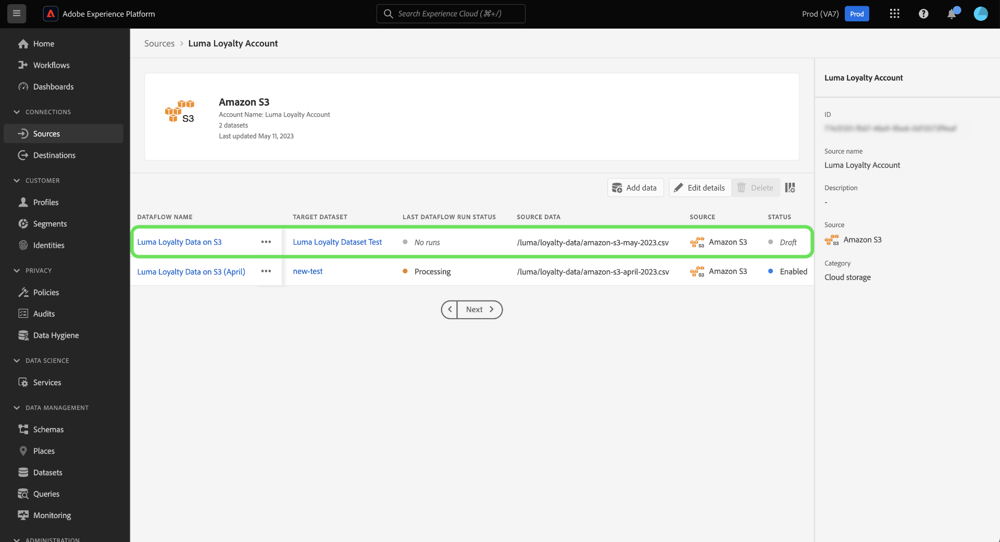

# Flux de données de brouillon dans l’interface utilisateur

Enregistrez la progression de votre workflow d’ingestion de données inachevé en définissant votre flux de données sur un état de brouillon. Vous pouvez reprendre et terminer vos flux de données préliminaires ultérieurement.

Ce document décrit les étapes à suivre pour enregistrer vos flux de données lors de l’utilisation de l’espace de travail des sources dans l’interface utilisateur de Adobe Experience Platform.

## Commencer

Ce document nécessite une compréhension pratique des composants suivants de Adobe Experience Platform :

* [Sources](../../home.md) : Experience Platform permet d’ingérer des données provenant de diverses sources tout en vous offrant la possibilité de structurer, de libeller et d’améliorer les données entrantes à l’aide des services de Platform.

## Enregistrer un flux de données en tant que brouillon

Vous pouvez suspendre à tout moment la progression de la création de votre flux de données après avoir sélectionné les données que vous apporterez dans Platform.

Par exemple, si vous souhaitez enregistrer votre progression au cours de l’étape détaillée du flux de données, sélectionnez **[!UICONTROL Enregistrer en tant que brouillon]**.

Une fois que vous avez enregistré votre brouillon, vous êtes dirigé vers la page de votre compte, où vous pouvez voir la liste de vos flux de données existants, y compris vos brouillons.

>[!TIP]
>
>Les flux de données préliminaires ne seront pas activés et leur état sera défini sur `draft`.

Pour continuer sur votre brouillon, sélectionnez les ellipses (`...`) en regard du nom de votre flux de données, puis sélectionnez **[!UICONTROL Mettre à jour le flux de données]**.

>[!NOTE]
>
>Si votre brouillon contient des informations de planification, la fenêtre déroulante vous donnera également la possibilité de **[!UICONTROL Modifier le planning]**.

### Accès à vos brouillons à partir du catalogue source

Vous pouvez également accéder à vos flux de données de brouillon par le biais du catalogue des flux de données. Sélectionnez **[!UICONTROL Flux de données]** dans l’en-tête supérieur pour accéder au catalogue des flux de données. À partir de là, recherchez votre brouillon dans la liste des flux de données existants de votre organisation, sélectionnez les ellipses (`...`) en regard de son nom, puis sélectionnez **[!UICONTROL Mettre à jour le flux de données]**.

## Publier votre brouillon de flux de données

Vous revenez à l’étape [!UICONTROL Ajouter des données] du workflow des sources, où vous pouvez confirmer à nouveau le format de vos données et continuer à progresser dans votre flux de données.

Une fois que vous avez confirmé le formatage, le délimiteur et le type de compression de vos données, sélectionnez **[!UICONTROL Suivant]** pour continuer.

Ensuite, confirmez les détails de votre flux de données. Utilisez l’interface des détails du flux de données pour mettre à jour les configurations entourant le nom, la description, l’ingestion partielle, les paramètres de diagnostic d’erreur et les préférences d’alerte de votre flux de données.

Une fois vos configurations terminées, sélectionnez **[!UICONTROL Suivant]** pour continuer.

L’étape [!UICONTROL Mappage] apparaît. Pendant cette étape, vous pouvez reconfigurer les configurations de mappage de votre flux de données. Pour obtenir un guide complet sur les fonctions de prép de données utilisées pour le mappage, consultez le [guide de l’interface utilisateur de prép de données](../../../data-prep/ui/mapping.md).

Une fois la reconfiguration du mapping terminée, sélectionnez **[!UICONTROL Suivant]** pour continuer.

Utilisez l’étape [!UICONTROL Planification] pour établir un planning d’ingestion pour votre flux de données. Vous pouvez définir la fréquence d&#39;ingestion sur `once`, `minute`, `hour`, `day` ou `week`. Lorsque vous avez terminé, sélectionnez **[!UICONTROL Suivant]** pour continuer.

Enfin, passez en revue les détails de votre flux de données, puis sélectionnez **[!UICONTROL Terminer]** pour publier votre brouillon.

Une fois que vous avez enregistré et publié un brouillon, le flux de données est activé et vous ne pourrez plus le réinitialiser en tant que brouillon.

## Étapes suivantes

En suivant ce tutoriel, vous avez appris à enregistrer votre progression et à définir un flux de données en tant que brouillon. Pour plus d’informations sur les sources, consultez la [présentation des sources](../../home.md).
