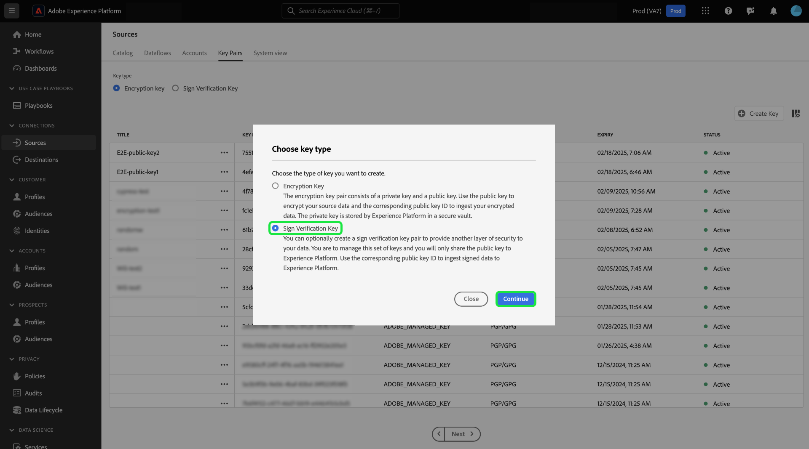
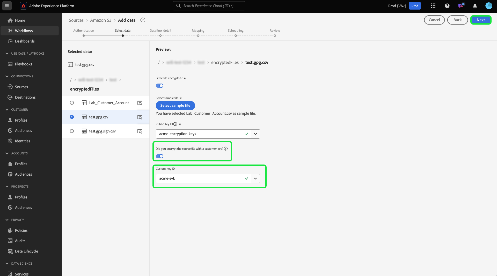

# Ingestion de données chiffrées dans l’interface utilisateur des sources

Vous pouvez ingérer des fichiers et des dossiers de données chiffrés vers Adobe Experience Platform à l’aide de sources de lots de stockage dans le cloud. Avec l’ingestion de données chiffrées, vous pouvez utiliser des mécanismes de chiffrement asymétrique pour transférer en toute sécurité des données par lots dans Experience Platform. Les mécanismes de chiffrement asymétrique pris en charge sont PGP et GPG.

Lisez ce guide pour savoir comment ingérer des données chiffrées avec des sources de lots de stockage dans le cloud à l’aide de l’interface utilisateur.

## Commencer

Avant de poursuivre ce tutoriel, veuillez lire les documents ci-après pour mieux comprendre les fonctionnalités et concepts d’Experience Platform.

* [Sources](../../home.md) : utilisez des sources dans Experience Platform pour ingérer des données à partir d’une application Adobe ou d’une source de données tierce.
* [Flux de données](../../../dataflows/home.md) : les flux de données sont des représentations des tâches de données qui déplacent ces dernières dans Experience Platform. Vous pouvez utiliser l’espace de travail des sources pour créer des flux de données qui ingèrent des données d’une source donnée vers Experience Platform.
* [Sandbox](../../../sandboxes/home.md) : utilisez les sandbox d’Experience Platform pour créer des partitions virtuelles entre vos instances Experience Platform et créer des environnements dédiés au développement ou à la production.

### Composition de haut niveau

* Créez une paire de clés de chiffrement à l’aide de l’espace de travail sources dans l’interface utilisateur d’Experience Platform.
   * Vous pouvez également créer votre propre paire de clés de vérification des signatures pour fournir une couche de sécurité supplémentaire à vos données chiffrées.
* Utilisez la clé publique de votre paire de clés de chiffrement pour chiffrer vos données.
* Placez vos données chiffrées dans votre espace de stockage dans le cloud. Au cours de cette étape, vous devez également vous assurer que vous disposez d’un exemple de fichier de vos données dans votre espace de stockage cloud qui peut être utilisé comme référence pour mapper vos données source à un schéma de modèle de données d’expérience (XDM).
* Utilisez votre source de lots de stockage dans le cloud et commencez le processus d’ingestion de données dans l’espace de travail des sources dans l’interface utilisateur d’Experience Platform.
* Pendant le processus de création de la connexion source, indiquez l’identifiant de clé qui correspond à la clé publique que vous avez utilisée pour chiffrer vos données.
   * Si vous avez également utilisé le mécanisme de paire de clés de vérification des signatures, vous devez également fournir l’identifiant de clé de vérification des signatures qui correspond à vos données chiffrées.
* Passez aux étapes de création du flux de données.

## Créer une paire de clés de chiffrement {#create-an-encryption-key-pair}

>[!CONTEXTUALHELP]
>id="platform_sources_encrypted_encryptionKeyId"
>title="ID de clé de chiffrement"
>abstract="Indiquez l’ID de clé de chiffrement correspondant à la clé de chiffrement qui a été utilisée pour chiffrer vos données source."

>[!BEGINSHADEBOX]

**Qu’est-ce qu’une paire de clés de chiffrement ?**

Une paire de clés de chiffrement est un mécanisme de chiffrement asymétrique qui se compose d’une clé publique et d’une clé privée. La clé publique est utilisée pour chiffrer des données et la clé privée est ensuite utilisée pour déchiffrer lesdites données.

Vous pouvez créer votre paire de clés de chiffrement via l’interface utilisateur d’Experience Platform. Une fois générée, vous recevrez une clé publique et un identifiant de clé correspondant. Utilisez la clé publique pour chiffrer vos données, puis utilisez l’ID de clé pour confirmer votre identité lorsque vous êtes en train d’ingérer vos données chiffrées. La clé privée est automatiquement transférée vers Experience Platform, où elle est stockée dans un coffre sécurisé. Elle n’est utilisée qu’une fois vos données prêtes à être déchiffrées.

>[!ENDSHADEBOX]

Dans l’interface utilisateur d’Experience Platform, accédez à l’espace de travail des sources, puis sélectionnez [!UICONTROL Paires de clés] dans l’en-tête supérieur.

Vous accédez à une page qui affiche la liste des paires de clés de chiffrement existantes dans votre organisation. Cette page fournit des informations sur le titre, l’identifiant, le type, l’algorithme de chiffrement, l’expiration et le statut d’une clé donnée. Pour créer une paire de clés, sélectionnez **[!UICONTROL Créer une clé]**.

Choisissez ensuite le type de clé à créer. Pour créer une clé de chiffrement, sélectionnez **[!UICONTROL Clé de chiffrement]** puis **[!UICONTROL Continuer]**.

Fournissez un titre et une phrase secrète pour votre clé de chiffrement. La phrase secrète est une couche supplémentaire de protection pour vos clés de chiffrement. Lors de sa création, Experience Platform stocke la phrase secrète dans un coffre sécurisé différent de celui de la clé publique. Vous devez fournir une chaîne non vide comme phrase secrète. Lorsque vous avez terminé, cliquez sur **[!UICONTROL Créer]**.

En cas de réussite, une nouvelle fenêtre s’affiche, affichant votre nouvelle clé de chiffrement, y compris son titre, sa clé publique et son identifiant de clé. Utilisez la valeur de clé publique pour chiffrer vos données. Vous utiliserez l’identifiant de clé à une étape ultérieure pour prouver votre identité lors de l’ingestion de vos données chiffrées pendant le processus de création du flux de données.

Pour afficher des informations sur une clé de chiffrement existante, sélectionnez les points de suspension (`...`) à côté du titre de la clé. Sélectionnez **[!UICONTROL Détails de la clé]** pour afficher la clé publique et l’ID de clé. Pour supprimer la clé de chiffrement, vous pouvez également sélectionner **[!UICONTROL Supprimer]**.

### Créer une clé de vérification de signe {#create-a-sign-verification-key}

>[!CONTEXTUALHELP]
>id="platform_sources_encrypted_signVerificationKeyId"
>title="ID de clé de vérification de signe"
>abstract="Fournissez l’ID de clé de vérification de signe qui correspond à vos données source signées et chiffrées."

>[!BEGINSHADEBOX]

**Qu’est-ce qu’une clé de vérification de signe ?**

Une clé de vérification de signature est un autre mécanisme de chiffrement qui implique une clé privée et une clé publique. Dans ce cas, vous pouvez créer votre paire de clés de vérification de signature et utiliser la clé privée pour signer et fournir une couche supplémentaire de chiffrement à vos données. Vous partagerez ensuite la clé publique correspondante avec Experience Platform. Lors de l’ingestion, Experience Platform utilisera la clé publique pour vérifier la signature associée à votre clé privée.

>[!ENDSHADEBOX]

Pour créer une clé de vérification de signature, sélectionnez **[!UICONTROL Clé de vérification de signature]** dans la fenêtre de sélection du type de clé, puis sélectionnez **[!UICONTROL Continuer]**.

Ensuite, fournissez un titre et une clé PGP codée en [!DNL Base64] comme clé publique, puis sélectionnez **[!UICONTROL Créer]**.

En cas de réussite, une nouvelle fenêtre s’affiche, affichant votre nouvelle clé de vérification de signature, y compris son titre et son identifiant de clé.

## Ingérer des données chiffrées {#ingest-encrypted-data}

>[!CONTEXTUALHELP]
>id="platform_sources_encrypted_isFileEncrypted"
>title="Le fichier est-il chiffré ?"
>abstract="Sélectionnez ce bouton (bascule) si vous ingérez un fichier déjà chiffré."

>[!CONTEXTUALHELP]
>id="platform_sources_encrypted_sampleFile"
>title="Sélectionner le fichier d’exemple"
>abstract="Vous devez ingérer un fichier d’exemple lors de l’ingestion de données chiffrées afin de créer un mapping."

Vous pouvez ingérer des données chiffrées à l’aide des sources de lots de stockage dans le cloud suivantes :

* [[!DNL Amazon S3]](../ui/create/cloud-storage/s3.md)
* [[!DNL Azure Blob]](../ui/create/cloud-storage/blob.md)
* [[!DNL Azure Data Lake Storage Gen2]](../ui/create/cloud-storage/adls-gen2.md)
* [[!DNL Azure File Storage]](../ui/create/cloud-storage/azure-file-storage.md)
* [[!DNL Data Landing Zone]](../ui/create/cloud-storage/data-landing-zone.md)
* [[!DNL FTP]](../ui/create/cloud-storage/ftp.md)
* [[!DNL Google Cloud Storage]](../ui/create/cloud-storage/google-cloud-storage.md)
* [[!DNL HDFS]](../ui/create/cloud-storage/hdfs.md)
* [[!DNL Oracle Object Storage]](../ui/create/cloud-storage/oracle-object-storage.md)
* [[!DNL SFTP]](../ui/create/cloud-storage/sftp.md)

Authentifiez-vous avec la source d’espace de stockage de votre choix. Au cours de l’étape de sélection des données du workflow, sélectionnez le fichier ou le dossier chiffré à ingérer, puis activez le bouton (bascule) **[!UICONTROL Le fichier est-il chiffré]**.

Sélectionnez ensuite un exemple de fichier à partir de vos données source. Puisque vos données sont chiffrées, Experience Platform a besoin d’un exemple de fichier pour créer un schéma XDM qui peut être mappé à vos données source.

Une fois que vous avez sélectionné votre fichier d’exemple, configurez les paramètres de vos données, tels que le format de données, le délimiteur et le type de compression correspondants. Patientez quelques instants le temps que l’interface de prévisualisation effectue entièrement le rendu, puis sélectionnez **[!UICONTROL Enregistrer]**.

À partir de là, utilisez le menu déroulant pour sélectionner le titre de clé publique de l’identifiant de clé publique qui correspond à la clé publique que vous avez utilisée pour chiffrer vos données.

Si vous avez également utilisé la paire de clés de vérification des signatures pour fournir une couche supplémentaire de chiffrement, activez le bouton (bascule) Clé de vérification des signatures , puis de même, utilisez la liste déroulante pour sélectionner l’identifiant de clé de vérification des signatures qui correspond à la clé que vous avez utilisée pour chiffrer vos données.

Lorsque vous avez terminé, sélectionnez **[!UICONTROL Suivant]**.

Suivez les étapes restantes du workflow des sources pour terminer la création de votre flux de données.

* [Fournir des détails sur le flux de données et le jeu de données](../ui/dataflow/batch/cloud-storage.md#provide-dataflow-details)
* [Mapper vos données source à un schéma XDM](../ui/dataflow/batch/cloud-storage.md#map-data-fields-to-an-xdm-schema)
* [Configurer un planning d’ingestion pour votre flux de données](../ui/dataflow/batch/cloud-storage.md#schedule-ingestion-runs)
* [Vérifier le flux de données](../ui/dataflow/batch/cloud-storage.md#review-your-dataflow)

Vous pouvez continuer à [effectuer des mises à jour sur votre flux de données](../ui/update-dataflows.md) une fois qu’il a été créé.

## Étapes suivantes

En lisant ce document, vous pouvez désormais ingérer des données chiffrées à partir de votre source de lots d’espace de stockage dans le cloud vers Experience Platform. Pour plus d’informations sur l’ingestion de données chiffrées à l’aide des API, consultez le guide sur l’[ingestion de données chiffrées à l’aide de l’API  [!DNL Flow Service] ](../api/encrypt-data.md). Pour obtenir des informations générales sur les sources dans Experience Platform, lisez la [présentation des sources](../../home.md).
