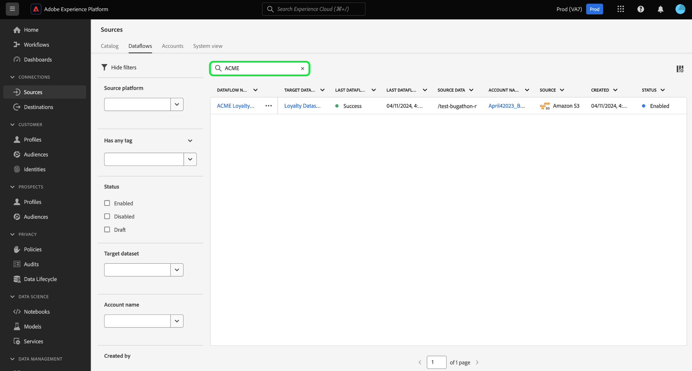

# Filtrer les objets sources dans l’interface utilisateur

Utilisez les outils de filtrage, de recherche et d’action intégrée de l’interface utilisateur de Adobe Experience Platform pour rationaliser votre workflow dans l’espace de travail [!UICONTROL Sources]

* Utilisez les fonctionnalités de filtrage et de recherche pour vous frayer un chemin parmi les comptes sources et les flux de données de votre organisation.
* Utilisez des actions intégrées pour modifier les paramètres de configuration appliqués à vos flux de données et améliorer les workflows d’organisation. Vous pouvez utiliser des actions intégrées pour appliquer des balises, configurer des alertes ou créer des traitements d’ingestion à la demande.

## Commencer

Il est utile de comprendre les fonctionnalités et concepts d’Experience Platform ci-après avant d’utiliser les outils de navigation d’objets dans l’espace de travail des sources :

* [Sources](../../home.md) : utilisez des sources dans Experience Platform pour ingérer des données à partir d’une application Adobe ou d’une source de données tierce.
* [Balises d’administration](../../../administrative-tags/overview.md) : utilisez les balises d’administration pour appliquer des mots-clés de métadonnées à vos objets et permettre à la recherche de trouver cet objet dans l’écosystème Experience Platform.
* [Alertes](../../../observability/home.md) : utilisez des alertes pour recevoir des notifications qui fournissent une mise à jour sur le statut des objets tels que vos flux de données sources.
* [Flux de données](../../../dataflows/home.md) : les flux de données sont des représentations des tâches de données qui déplacent ces dernières dans Experience Platform. Vous pouvez utiliser l’espace de travail des sources pour créer des flux de données qui ingèrent des données d’une source donnée vers Experience Platform.
* [Jeux de données](../../../catalog/datasets/user-guide.md) : un jeu de données est une structure de stockage et de gestion pour une collection de données, généralement sous la forme d’un tableau, qui contient un schéma (colonnes) et des champs (lignes).
* [Sandbox](../../../sandboxes/home.md) : utilisez les sandbox d’Experience Platform pour créer des partitions virtuelles entre vos instances Experience Platform et créer des environnements dédiés au développement ou à la production.

## Filtrer les flux de données des sources {#filter-sources-dataflows}

Dans l’interface utilisateur d’Experience Platform, sélectionnez **[!UICONTROL Sources]** dans le volet de navigation de gauche, puis sélectionnez **[!UICONTROL Dataflows]** dans l’en-tête supérieur.

Par défaut, le menu de filtrage s’affiche à gauche de l’interface. Pour masquer le menu, sélectionnez **[!UICONTROL Hide filters]**.

Vous pouvez filtrer vos flux de données sources à l’aide des paramètres suivants :

| Filtre | Description |
| --- | --- |
| [plateforme ](#filter-dataflows-by-source-platform) | Filtrez vos flux de données en fonction de la source avec laquelle ils ont été créés. |
| [Balises](#filter-dataflows-by-tags) | Filtrez vos flux de données en fonction des balises qui leur sont appliquées. |
| [Statut](#filter-dataflows-by-status) | Filtrez vos flux de données en fonction de leur statut actuel. |
| [ Jeu de données cible ](#filter-dataflows-by-target-dataset) | Filtrez vos flux de données en fonction du jeu de données cible avec lequel ils ont été créés. |
| [ Nom du compte ](#filter-dataflows-by-account-name) | Filtrez vos flux de données en fonction du nom du compte auquel ils correspondent. |
| [Créé par](#filter-dataflows-by-user) | Filtrez vos flux de données en fonction de la personne qui les a créés. |
| [Date de création](#filter-dataflows-by-creation-date) | Filtrez vos flux de données en fonction de la date de leur création. |
| [Date de modification](#filter-dataflows-by-modification-date) | Filtrez vos flux de données en fonction de la date de leur dernière mise à jour. |

### Filtrer les flux de données par plateforme source {#filter-dataflows-by-source-platform}

Utilisez le panneau [!UICONTROL Source platform] pour filtrer vos flux de données par type de source. Vous pouvez saisir une source particulière ou utiliser le menu déroulant pour afficher une liste de sources dans le catalogue. Vous pouvez également filtrer plusieurs sources différentes pour une requête donnée. Par exemple, vous pouvez sélectionner [!DNL Amazon S3], [!DNL Azure Data Lake Storage Gen2] et [!DNL Google Cloud Storage] pour mettre à jour le catalogue et afficher uniquement les flux de données créés avec les sources sélectionnées.

### Filtrer les flux de données par balises {#filter-dataflows-by-tags}

Utilisez le panneau Balises pour filtrer vos flux de données en fonction de leurs balises respectives.

Sélectionnez **[!UICONTROL Has any tag]** puis sélectionnez les balises à filtrer à l’aide du menu déroulant. Utilisez ce paramètre pour filtrer les flux de données contenant l’une des balises sélectionnées.

Sélectionnez **[!UICONTROL Has all tags]** puis sélectionnez les balises à filtrer à l’aide du menu déroulant. Utilisez ce paramètre pour filtrer les flux de données contenant toutes les balises que vous avez sélectionnées.

### Filtrer les flux de données par statut {#filter-dataflows-by-status}

Vous pouvez filtrer par statut à l’aide du panneau [!UICONTROL Status].

| État | Description |
| --- | --- |
| Activé | Sélectionnez **[!UICONTROL Enabled]** pour filtrer l’affichage et afficher uniquement les flux de données actifs. |
| Désactivé | Sélectionnez **[!UICONTROL Disabled]** pour filtrer l’affichage et afficher uniquement les flux de données désactivés. |
| Brouillon | Sélectionnez **[!UICONTROL Draft]** pour filtrer l’affichage et afficher uniquement les flux de données en mode brouillon. |

### Filtrer les flux de données par jeu de données cible {#filter-dataflows-by-target-dataset}

Sélectionnez **[!UICONTROL Target dataset]** pour accéder à un menu déroulant de tous les jeux de données cibles. Sélectionnez ensuite un jeu de données cible pour filtrer votre vue et afficher uniquement les flux de données créés à l’aide des jeux de données cible spécifiés.

### Filtrer les flux de données par nom de compte {#filter-dataflows-by-account-name}

Sélectionnez **[!UICONTROL Account name]** pour accéder à un menu déroulant de tous les comptes. Sélectionnez ensuite un compte pour filtrer l’affichage et afficher les flux de données créés par le compte sélectionné.

### Filtrer les flux de données par utilisateur {#filter-dataflows-by-user}

Utilisez le panneau [!UICONTROL Created by] pour filtrer les flux de données selon l’utilisateur qui les a créés ou mis à jour pour la dernière fois. Sélectionnez la liste déroulante, puis sélectionnez le nom d’utilisateur en fonction duquel filtrer vos flux de données.

### Filtrer les flux de données par date de création {#filter-dataflows-by-creation-date}

Vous pouvez filtrer vos flux de données en fonction de leurs dates de création. Dans le panneau [!UICONTROL Created date], configurez une date de début et une date de fin pour créer une fenêtre de période et filtrez votre vue pour afficher uniquement les flux de données créés dans cette fenêtre.

Vous pouvez configurer votre période en saisissant vos dates de début et de fin. Vous pouvez également sélectionner l’icône de calendrier et utiliser le calendrier pour configurer vos dates.

Vous pouvez également suivre les mêmes étapes, mais en filtrant les flux de données selon leur date de dernière modification, par opposition à leur date de création.

### Filtrer les flux de données par date de modification {#filter-dataflows-by-modification-date}

De même, vous pouvez appliquer les mêmes principes et filtrer votre flux de données selon leurs dates de modification. Utilisez l’**[!UICONTROL Modified date]** pour configurer une période spécifique et filtrer votre affichage afin d’afficher uniquement les flux de données qui ont été modifiés au cours de cette période.

### Combinaison de filtres {#combine-filters}

Vous pouvez combiner différents filtres pour élargir ou affiner votre recherche. Dans l’exemple ci-dessous, un filtre est appliqué pour rechercher :

* Flux de données créés à l’aide de la source [!DNL Amazon S3].
* Flux de données contenant la balise **[!DNL ACME]**.
* Flux de données actuellement activés.
* Flux de données créés à l’aide du jeu de données [!DNL Loyalty Dataset B2C].
* Flux de données créés entre le 4/1/2024 et le 4/19/2024.

Pour supprimer tous les filtres, sélectionnez **[!UICONTROL Clear all]**.

## Filtrer les comptes sources {#filter-sources-accounts}

Dans l’interface utilisateur d’Experience Platform, sélectionnez [!UICONTROL Sources] dans le volet de navigation de gauche, puis sélectionnez **[!UICONTROL Accounts]** dans l’en-tête supérieur. Vous pouvez filtrer vos comptes sources en fonction de la source avec laquelle ils ont été créés ou de l’utilisateur qui les a créés.

## Rechercher des comptes et des flux de données {#search-for-accounts-and-dataflows}

Vous pouvez gagner en efficacité en utilisant la barre de recherche pour accéder immédiatement à un compte ou à un flux de données spécifique.

>[!BEGINTABS]

>[!TAB Rechercher des flux de données]

Utilisez la barre de recherche de la page [!UICONTROL Dataflows] pour rechercher un flux de données spécifique. Vous pouvez rechercher un flux de données à l’aide de son nom ou de sa description.

>[!TAB Rechercher des comptes]

Utilisez la barre de recherche de la page [!UICONTROL Accounts] pour rechercher un compte spécifique. Vous pouvez rechercher un compte en utilisant son nom ou sa description.

>[!ENDTABS]

## Actions intégrées pour les flux de données sources {#inline-actions-for-sources-dataflows}

Sélectionnez les points de suspension (`...`) à côté du nom du flux de données pour obtenir une liste d’actions intégrées que vous pouvez utiliser pour apporter des modifications à votre flux de données.

| Actions intégrées | Description |
| --- | --- |
| [!UICONTROL Edit schedule] | Sélectionnez **[!UICONTROL Edit schedule]** pour mettre à jour le planning de l’ingestion de votre flux de données. Un flux de données défini sur une ingestion unique ne peut pas être modifié. |
| [!UICONTROL Disable dataflow] | Sélectionnez **[!UICONTROL Disable dataflow]** pour désactiver une exécution de flux de données. Cette option ne supprime pas le flux de données. |
| [!UICONTROL View in monitoring] | Sélectionnez **[!UICONTROL View in monitoring]** pour afficher les mesures et le statut de votre flux de données dans le tableau de bord de surveillance. Pour plus d’informations, consultez le guide sur la [surveillance des flux de données des sources](../../../dataflows/ui/monitor-sources.md). |
| [!UICONTROL Delete] | Sélectionnez **[!UICONTROL Delete]** pour supprimer le flux de données. |
| [!UICONTROL Run on-demand] | Sélectionnez **[!UICONTROL Run on-demand]** pour déclencher une seule itération d’une exécution de flux de données. Pour plus d’informations, consultez le guide sur la [création d’une exécution de flux de données à la demande](../ui/on-demand-ingestion.md). |
| [!UICONTROL Subscribe to alerts] | Sélectionnez **[!UICONTROL Subscribe to alerts]** pour afficher une fenêtre pop-up d’alertes à laquelle vous pouvez vous abonner : <ul><li>Démarrage de l’exécution du flux de données des sources : sélectionnez cette alerte pour recevoir une notification lorsque votre exécution de flux de données à la demande commence.</li><li>Succès de l’exécution du flux de données des sources : sélectionnez cette alerte pour recevoir une notification lorsque l’exécution de votre flux de données à la demande se termine avec succès.</li><li>Échec de l’exécution du flux de données des sources : sélectionnez cette alerte lorsque votre exécution de flux de données à la demande échoue en raison d’erreurs.</li></ul> Pour plus d’informations, consultez le guide sur [l’abonnement aux alertes pour les flux de données des sources](../ui/alerts.md). |
| [!UICONTROL Add to package] | Sélectionnez **[!UICONTROL Add to package]** pour ajouter votre flux de données à un package et l’exporter pour l’utiliser dans un autre sandbox. Au cours de cette étape, vous pouvez créer un package ou ajouter votre flux de données à un package existant. Pour plus d’informations, consultez le guide sur [l’outil sandbox](../../../sandboxes/ui/sandbox-tooling.md). |
| [!UICONTROL Manage tags] | Sélectionnez **[!UICONTROL Manage tags]** pour ajouter ou supprimer des balises de votre flux de données. Utilisez les balises pour gérer les taxonomies des métadonnées et classer les objets d’entreprise afin de faciliter la découverte et la catégorisation. Pour plus d’informations, consultez le guide sur la [gestion des balises](../../../administrative-tags/ui/managing-tags.md). |

## Étapes suivantes

En lisant ce document, vous avez appris à parcourir les pages Comptes sources et Flux de données . Pour plus d’informations sur les sources, consultez la [vue d’ensemble des sources](../../home.md).
