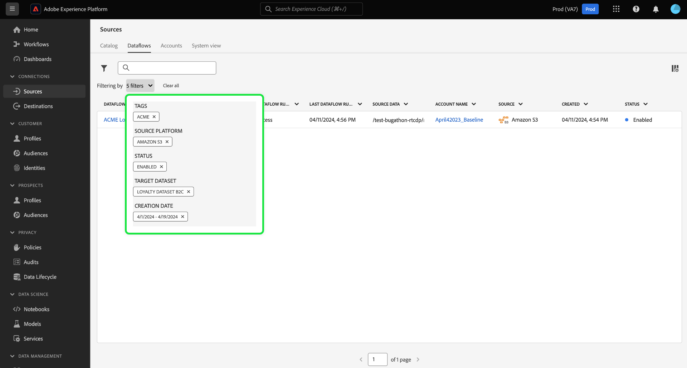

# Filtrage des objets de sources dans l’interface utilisateur

Utilisez les outils de filtrage, de recherche et d’action intégrée de l’interface utilisateur de Adobe Experience Platform pour rationaliser votre workflow dans l’espace de travail [!UICONTROL Sources]

* Utilisez les fonctionnalités de filtrage et de recherche pour parcourir les sources, les comptes et les flux de données de votre entreprise.
* Utilisez les actions intégrées pour modifier les paramètres de configuration appliqués à vos flux de données et améliorer les workflows organisationnels. Vous pouvez utiliser des actions intégrées pour appliquer des balises, configurer des alertes ou créer des tâches d’ingestion à la demande.

## Commencer

Il est utile de connaître les fonctions et concepts Experience Platform suivants avant d’utiliser les outils de navigation d’objet dans l’espace de travail des sources :

* [Sources](../../home.md) : utilisez des sources en Experience Platform pour ingérer des données à partir d’une application d’Adobe ou d’une source de données tierce.
* [Balises administratives](../../../administrative-tags/overview.md) : utilisez des balises administratives pour appliquer des mots-clés de métadonnées à vos objets et permettre à la recherche de trouver cet objet dans l’écosystème Experience Platform.
* [Alertes](../../../observability/home.md) : utilisez des alertes pour recevoir des notifications qui fournissent une mise à jour de l’état des objets tels que les flux de données de vos sources.
* [Flux de données](../../../dataflows/home.md) : les flux de données sont des représentations des tâches de données qui déplacent les données entre Experience Platform. Vous pouvez utiliser l’espace de travail des sources pour créer des flux de données qui assimilent des données d’une source donnée à un Experience Platform.
* [Jeux de données](../../../catalog/datasets/user-guide.md) : un jeu de données est une structure de stockage et de gestion pour une collecte de données, généralement un tableau, qui contient un schéma (des colonnes) et des champs (des lignes).
* [Environnements de test](../../../sandboxes/home.md) : utilisez des environnements de test dans Experience Platform pour créer des partitions virtuelles entre vos instances Experience Platform et créez des environnements dédiés au développement ou à la production.

## Filtrage des flux de données de sources {#filter-sources-dataflows}

Dans l’interface utilisateur de l’Experience Platform, sélectionnez **[!UICONTROL Sources]** dans le volet de navigation de gauche, puis **[!UICONTROL Flux de données]** dans l’en-tête supérieur.

Par défaut, le menu de filtrage s’affiche à gauche de l’interface. Pour masquer le menu, sélectionnez **[!UICONTROL Masquer les filtres]**.

Vous pouvez filtrer les flux de données de vos sources selon les paramètres suivants :

| Filtre | Description |
| --- | --- |
| [Plateforme Source](#filter-dataflows-by-source-platform) | Filtrez vos flux de données en fonction de la source avec laquelle ils ont été créés. |
| [Balises](#filter-dataflows-by-tags) | Filtrez vos flux de données en fonction des balises qui leur sont appliquées. |
| [Statut](#filter-dataflows-by-status) | Filtrez vos flux de données en fonction de leur état actuel. |
| [Jeu de données cible](#filter-dataflows-by-target-dataset) | Filtrez vos flux de données en fonction du jeu de données cible avec lequel ils ont été créés. |
| [Nom du compte](#filter-dataflows-by-account-name) | Filtrez vos flux de données en fonction du nom du compte avec lequel ils correspondent. |
| [Créé par](#filter-dataflows-by-user) | Filtrez vos flux de données en fonction de la personne qui les a créés. |
| [Date de création](#filter-dataflows-by-creation-date) | Filtrez vos flux de données en fonction de la date à laquelle ils ont été créés. |
| [Date de modification](#filter-dataflows-by-modification-date) | Filtrez vos flux de données en fonction de la date de leur dernière mise à jour. |

### Filtrage des flux de données par plateforme source {#filter-dataflows-by-source-platform}

Utilisez le panneau [!UICONTROL Plateforme Source] pour filtrer vos flux de données par type de source. Vous pouvez saisir une source spécifique ou utiliser le menu déroulant pour afficher une liste de sources dans le catalogue. Vous pouvez également filtrer plusieurs sources différentes pour une requête donnée. Par exemple, vous pouvez sélectionner [!DNL Amazon S3], [!DNL Azure Data Lake Storage Gen2] et [!DNL Google Cloud Storage] pour mettre à jour le catalogue et afficher uniquement les flux de données créés avec les sources sélectionnées.

### Filtrage des flux de données par balises {#filter-dataflows-by-tags}

Utilisez le panneau Balises pour filtrer vos flux de données selon leurs balises respectives.

Sélectionnez **[!UICONTROL Avec balise]** , puis sélectionnez les balises que vous souhaitez filtrer à l’aide du menu déroulant. Utilisez ce paramètre pour filtrer les flux de données contenant l’une des balises que vous avez sélectionnées.

Sélectionnez **[!UICONTROL Comporte toutes les balises]**, puis sélectionnez les balises que vous souhaitez filtrer à l’aide du menu déroulant. Utilisez ce paramètre pour filtrer les flux de données contenant toutes les balises que vous avez sélectionnées.

### Filtrage des flux de données par état {#filter-dataflows-by-status}

Vous pouvez filtrer par état à l’aide du panneau [!UICONTROL État].

| État | Description |
| --- | --- |
| Activé | Sélectionnez **[!UICONTROL Activé]** pour filtrer votre vue et afficher uniquement les flux de données actifs. |
| Désactivé | Sélectionnez **[!UICONTROL Désactivé]** pour filtrer votre vue et afficher uniquement les flux de données désactivés. |
| Brouillon | Sélectionnez **[!UICONTROL Version préliminaire]** pour filtrer votre vue et afficher uniquement les flux de données en mode préliminaire. |

### Filtrage des flux de données par jeu de données cible {#filter-dataflows-by-target-dataset}

Sélectionnez **[!UICONTROL Jeu de données cible]** pour accéder à un menu déroulant de tous les jeux de données cibles. Sélectionnez ensuite un jeu de données cible pour filtrer votre vue et afficher uniquement les flux de données créés à l’aide de vos jeux de données cibles spécifiés.

### Filtrage des flux de données par nom de compte {#filter-dataflows-by-account-name}

Sélectionnez **[!UICONTROL Nom du compte]** pour accéder à un menu déroulant de tous les comptes. Sélectionnez ensuite un compte pour filtrer votre vue et afficher les flux de données créés par votre compte sélectionné.

### Filtrage des flux de données par utilisateur {#filter-dataflows-by-user}

Utilisez le panneau [!UICONTROL Créé par] pour filtrer les flux de données par l’utilisateur qui a créé ou mis à jour pour la dernière fois les flux de données. Sélectionnez la liste déroulante, puis le nom d’utilisateur selon lequel filtrer vos flux de données.

### Filtrage des flux de données par date de création {#filter-dataflows-by-creation-date}

Vous pouvez filtrer vos flux de données selon leurs dates de création. Dans le panneau [!UICONTROL Date de création] , configurez une date de début et une date de fin pour créer une période et filtrez votre affichage afin de n’afficher que les flux de données créés dans cette fenêtre.

Vous pouvez configurer la période en saisissant les dates de début et de fin. Vous pouvez également sélectionner l’icône du calendrier et utiliser le calendrier pour configurer vos dates.

Vous pouvez également suivre les mêmes étapes, mais filtrer les flux de données selon leur date de dernière modification, par opposition à leur date de création.

### Filtrage des flux de données par date de modification {#filter-dataflows-by-modification-date}

De même, vous pouvez appliquer les mêmes principes et filtrer votre flux de données selon leurs dates de modification. Utilisez la **[!UICONTROL date de modification]** pour configurer une période spécifique et filtrer votre vue afin d’afficher uniquement les flux de données qui ont été modifiés au cours de cette période.

### Combiner des filtres {#combine-filters}

Vous pouvez combiner différents filtres pour élargir ou affiner votre recherche. Dans l’exemple ci-dessous, un filtre est appliqué pour rechercher :

* Flux de données créés à l’aide de la source [!DNL Amazon S3].
* Flux de données contenant la balise **[!DNL ACME]**.
* Flux de données actuellement activés.
* Flux de données créés à l’aide du jeu de données [!DNL Loyalty Dataset B2C].
* Flux de données créés entre 4/1/2024 et 4/19/2024.

Pour supprimer tous les filtres, sélectionnez **[!UICONTROL Effacer tout]**.

## Filtrage des comptes de sources {#filter-sources-accounts}

Dans l’interface utilisateur de l’Experience Platform, sélectionnez [!UICONTROL Sources] dans le volet de navigation de gauche, puis **[!UICONTROL Comptes]** dans l’en-tête supérieur. Vous pouvez filtrer les comptes de sources en fonction de la source avec laquelle ils ont été créés ou de l’utilisateur qui les a créés.

## Recherche de comptes et de flux de données {#search-for-accounts-and-dataflows}

Vous pouvez accélérer l’efficacité en utilisant la barre de recherche pour accéder immédiatement à un compte ou à un flux de données spécifique.

>[!BEGINTABS]

>[!TAB Rechercher des flux de données]

Utilisez la barre de recherche de la page [!UICONTROL Flux de données] pour trouver un flux de données spécifique. Vous pouvez rechercher un flux de données en utilisant son nom ou sa description.

>[!TAB Rechercher des comptes]

Utilisez la barre de recherche de la page [!UICONTROL Comptes] pour trouver un compte spécifique. Vous pouvez rechercher un compte à l’aide de son nom ou de sa description.

>[!ENDTABS]

## Actions intégrées pour les flux de données de sources {#inline-actions-for-sources-dataflows}

Sélectionnez les ellipses (`...`) en regard d’un nom de flux de données pour obtenir la liste des actions intégrées que vous pouvez utiliser pour apporter des modifications à votre flux de données.

| Actions intégrées | Description |
| --- | --- |
| [!UICONTROL Modifier le planning] | Sélectionnez **[!UICONTROL Modifier le planning]** pour mettre à jour le planning d&#39;ingestion de votre flux de données. Un flux de données qui a été défini sur une ingestion unique ne peut pas être modifié. |
| [!UICONTROL Désactiver le flux de données] | Sélectionnez **[!UICONTROL Désactiver le flux de données]** pour désactiver une exécution de flux de données. Cette option ne supprime pas votre flux de données. |
| [!UICONTROL Afficher dans la surveillance] | Sélectionnez **[!UICONTROL Afficher dans la surveillance]** pour afficher les mesures et l’état de votre flux de données dans le tableau de bord de surveillance. Pour plus d’informations, consultez le guide sur la [surveillance des flux de données de sources](../../../dataflows/ui/monitor-sources.md). |
| [!UICONTROL Supprimer] | Sélectionnez **[!UICONTROL Supprimer]** pour supprimer votre flux de données. |
| [!UICONTROL Exécuter à la demande] | Sélectionnez **[!UICONTROL Exécuter à la demande]** pour déclencher une itération unique d’une exécution de flux de données. Pour plus d’informations, consultez le guide sur la [création d’une exécution de flux de données à la demande](../ui/on-demand-ingestion.md). |
| [!UICONTROL Abonner aux alertes] | Sélectionnez **[!UICONTROL S’abonner aux alertes]** pour afficher une fenêtre contextuelle d’alertes auxquelles vous pouvez vous abonner : <ul><li>Démarrage de l’exécution du flux de données des sources : sélectionnez cette alerte pour recevoir une notification lorsque l’exécution du flux de données à la demande démarre.</li><li>Sources Exécution du flux de données : sélectionnez cette alerte pour recevoir une notification lorsque l’exécution du flux de données à la demande se termine correctement.</li><li>Sources Échec de l’exécution du flux de données : sélectionnez cette alerte lorsque l’exécution du flux de données à la demande échoue en raison d’erreurs.</li></ul> Pour plus d’informations, lisez le guide sur l’ [abonnement aux alertes pour les flux de données de sources](../ui/alerts.md). |
| [!UICONTROL Ajouter au package] | Sélectionnez **[!UICONTROL Ajouter au package]** pour ajouter votre flux de données à un package et l’exporter pour l’utiliser dans un autre environnement de test. Au cours de cette étape, vous pouvez créer un nouveau module ou ajouter votre flux de données à un module existant. Pour plus d’informations, consultez le guide sur l’ [outil de test](../../../sandboxes/ui/sandbox-tooling.md). |
| [!UICONTROL Gérer les balises] | Sélectionnez **[!UICONTROL Gérer les balises]** pour ajouter ou supprimer des balises de votre flux de données. Utilisez les balises pour gérer les taxonomies de métadonnées et classer les objets commerciaux afin de faciliter la découverte et la catégorisation. Pour plus d’informations, consultez le guide sur la [gestion des balises](../../../administrative-tags/ui/managing-tags.md). |

## Étapes suivantes

En lisant ce document, vous avez appris à parcourir les pages des comptes de sources et des flux de données. Pour plus d’informations sur les sources, consultez la [vue d’ensemble des sources](../../home.md).
