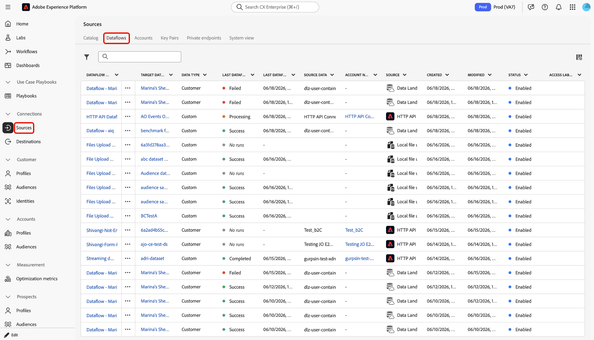
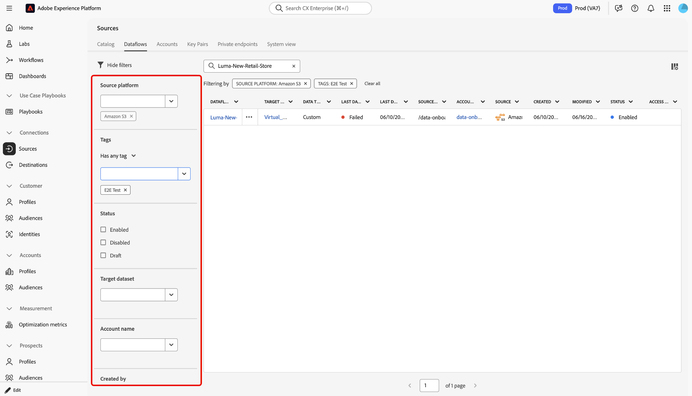
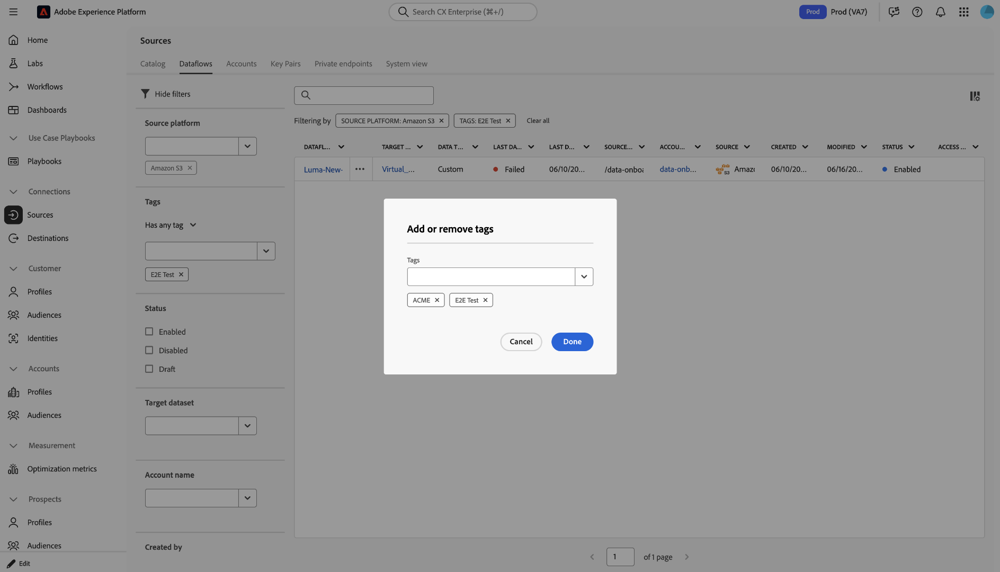
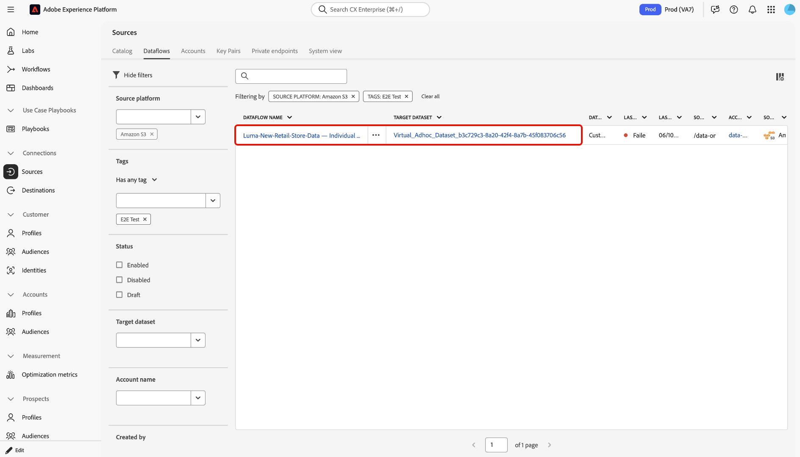
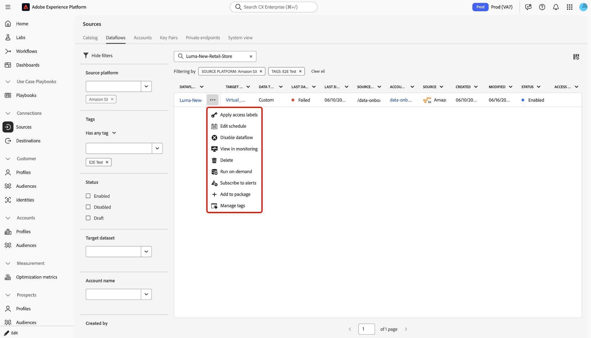

# Gestion des flux de données de sources dans l’interface utilisateur

Vous pouvez utiliser l’espace de travail *Sources* dans l’interface utilisateur de Adobe Experience Platform pour gérer vos flux de données source existants.

- Utilisez la page [!UICONTROL Flux de données] pour accéder à une vue centralisée des flux de données existants de votre organisation et rechercher, filtrer, organiser et agir sur des flux individuels.
- Utilisez les fonctionnalités de filtrage et de recherche pour parcourir les comptes sources et les flux de données dans votre organisation
- Utilisez des actions intégrées pour modifier les paramètres de configuration appliqués à vos flux de données, améliorer les workflows organisationnels et appliquer des balises, vous abonner à des alertes ou créer des traitements d’ingestion à la demande.

## Commencer

Avant de commencer, vérifiez que vous disposez des éléments suivants :

- Accès à Adobe Experience Platform.
- Les autorisations **[!UICONTROL Afficher les sources]** et **[!UICONTROL Gérer les sources]** sont requises.

Il est utile de comprendre les fonctionnalités et concepts d’Experience Platform ci-après avant d’utiliser les outils de navigation d’objets dans l’espace de travail Sources :

- [Sources](../../home.md) : découvrez comment connecter, gérer et surveiller les sources de données externes dans Experience Platform.
- [Sandbox](../../../sandboxes/home.md) : découvrez comment les sandbox vous permettent de développer et de tester différents projets dans des environnements isolés.
- [Balises d’administration](../../../administrative-tags/overview.md) : utilisez les balises d’administration pour appliquer des mots-clés de métadonnées à vos objets et permettre à la recherche de trouver cet objet dans l’écosystème Experience Platform.
- [Jeux de données](../../../catalog/datasets/user-guide.md) : un jeu de données est une structure de gestion pour une collection de données, généralement un tableau, qui contient un schéma (colonnes) et des champs (lignes).

## Accéder à vos flux de données sources

Dans l’interface utilisateur d’Experience Platform, sélectionnez **[!UICONTROL Sources]** dans le volet de navigation de gauche pour accéder à l’espace de travail Sources, puis sélectionnez **[!UICONTROL Flux de données]** dans l’en-tête supérieur. La page *[!UICONTROL Flux de données]* affiche une liste des flux de données existants dans votre organisation. Cette page vous permet de rechercher des flux de données spécifiques, d’appliquer des filtres pour limiter les résultats, d’organiser les flux de données à l’aide de balises, d’inspecter les métadonnées du tableau et de poursuivre les actions associées, comme la mise à jour ou la suppression d’un flux de données.

## Rechercher et filtrer des flux de données

Utilisez la page Flux de données pour localiser rapidement un flux de données spécifique ou limiter les résultats.

### Rechercher un flux de données

Utilisez le champ de recherche de la page **[!UICONTROL Flux de données]** pour rechercher un flux de données à partir de la vue d’inventaire actuelle. Après avoir saisi un terme de recherche, le tableau se met à jour pour afficher les résultats correspondants.

### Filtrer vos flux de données

Sélectionnez l’icône de filtre () pour affiner la liste des flux de données disponibles. Vous pouvez appliquer un ou plusieurs filtres pour affiner les résultats en fonction des métadonnées associées à chaque flux de données.

Les catégories de filtre disponibles sont les suivantes :

| Filtre | Description |
| --- | --- |
| Plateforme source | Filtrez vos flux de données en fonction de la source avec laquelle ils ont été créés. |
| Balises | Filtrez vos flux de données en fonction des balises qui leur sont appliquées. |
| Statut | Filtrez vos flux de données en fonction de leur statut actuel. |
| Jeu de données cible | Filtrez vos flux de données en fonction du jeu de données cible avec lequel ils ont été créés. |
| Nom du compte | Filtrez vos flux de données en fonction du nom du compte auquel ils correspondent. |
| Créé par | Filtrez vos flux de données en fonction de la personne qui les a créés. |
| Date de création | Filtrez vos flux de données en fonction de la date de leur création. |
| Date de modification | Filtrez vos flux de données en fonction de la date de leur dernière mise à jour. |

{style="table-layout:auto"}

Pour filtrer vos flux de données :

1. Sélectionnez la commande de filtrage pour ouvrir le panneau de filtrage.
2. Sélectionnez un ou plusieurs critères de filtre.
3. Consultez les résultats mis à jour dans le tableau des flux de données .
4. Effacez les filtres individuels ou sélectionnez [!UICONTROL Effacer tout] pour supprimer tous les filtres et revenir à la liste complète.

Utilisez des filtres pour rechercher des flux de données par plateforme source, identifier les flux de données avec un statut particulier ou limiter le tableau aux flux de données associés à un jeu de données ou à un compte spécifique.

## Organisation des flux de données à l’aide de balises

Vous pouvez utiliser les balises pour organiser vos flux de données et améliorer la visibilité sur la page **[!UICONTROL Flux de données]**. Les balises sont particulièrement utiles lorsque vous souhaitez regrouper des flux de données associés, puis utiliser des filtres pour les retrouver ultérieurement

Pour organiser un flux de données avec des balises :

1. Recherchez le flux de données à mettre à jour.
2. Sélectionnez les points de suspension (`...`) à côté du nom du flux de données pour ouvrir le menu d’actions.
3. Sélectionnez l’action liée à la balise.
4. Ajoutez ou supprimez des balises selon les besoins.
5. Sélectionnez **[!UICONTROL Terminé]** pour enregistrer vos modifications.
6. Utilisez le filtre **Balises** pour rechercher des flux de données balisés de manière similaire.

Utilisez les balises pour créer une couche organisationnelle afin de parcourir et de filtrer les workflows et de gérer un plus grand nombre de flux de données plus efficacement.

## Redimensionner les colonnes du tableau

Vous pouvez redimensionner les colonnes du tableau sur la page **[!UICONTROL Flux de données]** pour afficher davantage de métadonnées lorsque les valeurs sont tronquées dans la vue du tableau par défaut. Cela s’avère utile lorsque vous souhaitez examiner des valeurs plus longues telles que les noms de flux de données, les détails de compte ou les informations de jeu de données cible.

Pour redimensionner une colonne, passez le curseur au-dessus du bord d’un en-tête de colonne et faites glisser la bordure pour ajuster sa largeur.

Redimensionnez les colonnes selon vos besoins pour faciliter la vérification des détails du flux de données avant d’effectuer une action.

## Agir sur un flux de données

Une fois que vous avez localisé le flux de données à utiliser, sélectionnez les points de suspension (`...`) à côté du nom du flux de données pour afficher les actions intégrées disponibles. Selon le type de flux de données et vos autorisations, les actions disponibles peuvent inclure la modification d’un planning, la désactivation ou la suppression d’un flux de données, l’exécution d’un flux de données à la demande, la gestion des balises, etc.

| Actions intégrées | Description |
| --- | --- |
| [!UICONTROL Modifier le planning] | Sélectionnez **[!UICONTROL Modifier le planning]** pour mettre à jour le planning d’ingestion de votre flux de données. Un flux de données défini sur une ingestion unique ne peut pas être modifié. |
| [!UICONTROL Désactiver le flux de données] | Sélectionnez **[!UICONTROL Désactiver le flux de données]** pour désactiver une exécution de flux de données. Cette option ne supprime pas le flux de données. |
| [!UICONTROL Afficher dans la surveillance] | Sélectionnez **[!UICONTROL Afficher dans la surveillance]** pour afficher les mesures et le statut de votre flux de données dans le tableau de bord de surveillance. Pour plus d’informations, consultez le guide sur la [surveillance des flux de données des sources](../../../dataflows/ui/monitor-sources.md). |
| [!UICONTROL Supprimer] | Sélectionnez **[!UICONTROL Supprimer]** pour supprimer le flux de données. |
| [!UICONTROL Exécuter à la demande] | Sélectionnez **[!UICONTROL Exécuter à la demande]** pour déclencher une seule itération d’exécution de flux de données. Pour plus d’informations, consultez le guide sur la [création d’une exécution de flux de données à la demande](../ui/on-demand-ingestion.md). |
| [!UICONTROL S’abonner aux alertes] | Sélectionnez **[!UICONTROL S’abonner aux alertes]** pour afficher une fenêtre pop-up d’alertes à laquelle vous pouvez vous abonner : <ul><li>Démarrage de l’exécution du flux de données des sources : sélectionnez cette alerte pour recevoir une notification lorsque votre exécution de flux de données à la demande commence.</li><li>Succès de l’exécution du flux de données des sources : sélectionnez cette alerte pour recevoir une notification lorsque l’exécution de votre flux de données à la demande se termine avec succès.</li><li>Échec de l’exécution du flux de données des sources : sélectionnez cette alerte pour recevoir une notification lorsque l’exécution de votre flux de données à la demande échoue en raison d’erreurs.</li></ul> Pour plus d’informations, consultez le guide sur [l’abonnement aux alertes pour les flux de données des sources](../ui/alerts.md). |
| [!UICONTROL Ajouter au package &#x200B;] | Sélectionnez **[!UICONTROL Ajouter au package]** pour ajouter votre flux de données à un package et l’exporter pour l’utiliser dans un autre sandbox. Au cours de cette étape, vous pouvez créer un package ou ajouter votre flux de données à un package existant. Pour plus d’informations, consultez le guide sur [l’outil sandbox](../../../sandboxes/ui/sandbox-tooling.md). |
| [!UICONTROL Gérer les balises] | Sélectionnez **[!UICONTROL Gérer les balises]** pour ajouter ou supprimer des balises de votre flux de données. Utilisez les balises pour gérer les taxonomies des métadonnées et classer les objets d’entreprise afin de faciliter la découverte et la catégorisation. Pour plus d’informations, consultez le guide sur la [gestion des balises](../../../administrative-tags/ui/managing-tags.md). |

## Étapes suivantes

En lisant ce document, vous avez appris à parcourir les pages Comptes sources et Flux de données . Pour plus d’informations sur les sources, consultez la [vue d’ensemble des sources](../../home.md).

