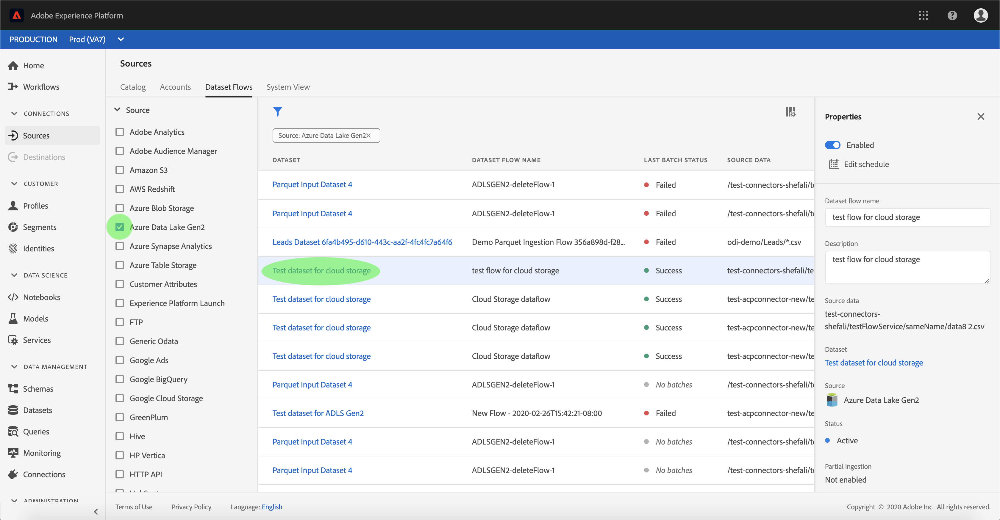

# Surveiller les comptes et les flux de jeux de données

Les connecteurs source d’Adobe Experience Platform permettent d’assimiler des données externes sur une base planifiée. Ce didacticiel décrit la procédure à suivre pour afficher les comptes et les flux de jeux de données existants à partir de l’espace de travail *Sources* .

## Prise en main

Ce didacticiel nécessite une compréhension pratique des composants suivants d’Adobe Experience Platform :

- [Système](../../../xdm/home.md)de modèle de données d’expérience (XDM) : Cadre normalisé selon lequel la plateforme d’expérience organise les données d’expérience client.
   - [Principes de base de la composition](../../../xdm/schema/composition.md)de  : Découvrez les éléments de base des  XDM, y compris les principes clés et les bonnes pratiques en matière de composition de .
   - [Didacticiel](../../../xdm/tutorials/create-schema-ui.md)de l’éditeur de  : Découvrez comment créer des  personnalisées à l’aide de l’interface utilisateur de l’éditeur de  de.
- du client en temps réel : Fournit un client en temps réel unifié basé sur des données agrégées provenant de plusieurs sources.

## Surveiller les comptes

Connectez-vous à <a href="https://platform.adobe.com" target="_blank">Adobe Experience Platform</a> , puis sélectionnez **Sources** dans la barre de navigation de gauche pour accéder à l’espace de travail *Sources* . L’écran *Catalogue* affiche diverses sources pour lesquelles vous pouvez créer des flux de données de comptes. Chaque source affiche le nombre de comptes et de flux de jeux de données existants qui leur sont associés.

Sélectionnez *Comptes* dans l’en-tête supérieur pour des comptes existants.

Les pages *Comptes* s&#39;affichent. Cette page contient un  de comptes affichables, y compris des informations sur leur source, leur nom d’utilisateur, le nombre de flux de jeux de données et la date de création.

Sélectionnez l’icône en haut à gauche pour lancer la fenêtre de tri.

Le panneau de tri vous permet d’accéder aux comptes à partir d’une source spécifique. Sélectionnez la source avec laquelle vous souhaitez travailler et sélectionnez le compte dans le  de droite.

Dans la page *Comptes* , vous pouvez  un de flux de jeux de données existants associés au compte auquel vous avez accédé. Sélectionnez le flux de jeux de données à .

L’écran de flux de *jeux de données* s’affiche. Cette page affiche le taux de messages consommés sous forme de graphique.

## Surveiller les flux de données

Les flux de jeux de données sont accessibles directement à partir de la page *Catalogue* sans consulter *Comptes*. Sélectionnez *Flux* de jeux de données depuis l’en-tête supérieur pour  un de flux de jeux de données existants.

Comme pour les comptes, vous pouvez trier le des flux de jeux de données à l’aide de l’icône de tri en haut à gauche. Sélectionnez la source que vous souhaitez  et sélectionnez le flux du jeu de données dans le de droite.

L’écran de flux de *jeux de données* s’affiche. Cette page affiche le taux de messages consommés sous forme de graphique.

Pour plus d&#39;informations sur la surveillance des jeux de données et l&#39;assimilation, consultez le didacticiel sur la [surveillance des flux de données](../../../ingestion/quality/monitor-data-flows.md)en flux continu.

## Étapes suivantes

En suivant ce didacticiel, vous avez accédé avec succès aux comptes et aux flux de jeux de données existants à partir de l’espace de travail *Sources* . Les données entrantes peuvent désormais être utilisées par les services Plateforme en aval, tels que les  de clients en temps réel et l’espace de travail des sciences de données. Pour plus d’informations, reportez-vous au  suivant :

- [Présentation du profil client en temps réel](../../../profile/home.md)
- [Présentation de l’espace de travail Data Science](../../../data-science-workspace/home.md)