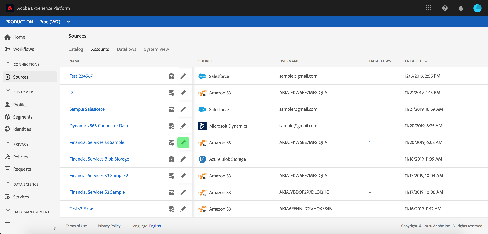

# Surveiller les comptes et les flux de données dans l’interface utilisateur

Les connecteurs source de Adobe Experience Platform permettent d’importer des données provenant de l’extérieur sur une base planifiée. Ce didacticiel décrit les étapes à suivre pour afficher les comptes et flux de données existants à partir de l&#39;espace de travail [!UICONTROL Sources] .

## Prise en main

Ce tutoriel nécessite une compréhension du fonctionnement des composants suivants d’Adobe Experience Platform :

- [[!DNL Experience Data Model] (XDM) Système](../../../xdm/home.md): Cadre normalisé selon lequel [!DNL Experience Platform] organiser les données d’expérience client.
   - [Principes de base de la composition des schémas](../../../xdm/schema/composition.md) : découvrez les blocs de création de base des schémas XDM, y compris les principes clés et les bonnes pratiques en matière de composition de schémas.
   - [Didacticiel](../../../xdm/tutorials/create-schema-ui.md)sur l’éditeur de schéma : Découvrez comment créer des schémas personnalisés à l’aide de l’interface utilisateur de l’éditeur de Schémas.
- [[ !Profil client en temps réel DNL]](../../../profile/home.md): Fournit un profil de consommation unifié en temps réel basé sur des données agrégées provenant de plusieurs sources.

## Surveiller les comptes

Connectez-vous à [Adobe Experience Platform](https://platform.adobe.com) , puis sélectionnez **[!UICONTROL Sources]** dans la barre de navigation de gauche pour accéder à l’espace de travail **[!UICONTROL Sources]** . L’écran **[!UICONTROL Catalogue]** affiche diverses sources pour lesquelles vous pouvez créer des comptes et des flux de données. Chaque source indique le nombre de comptes et de flux de données existants qui leur sont associés.

Sélectionnez **[!UICONTROL Comptes]** dans l&#39;en-tête supérieur pour vue des comptes existants.

Les pages **[!UICONTROL Comptes]** s&#39;affichent. Cette page contient une liste de comptes consultables, y compris des informations sur leur source, leur nom d&#39;utilisateur, le nombre de flux de données et la date de création.

Sélectionnez l&#39;icône d&#39;entonnoir en haut à gauche pour lancer la fenêtre de tri.

Le panneau de tri vous permet d’accéder aux comptes à partir d’une source spécifique. Sélectionnez la source à utiliser et sélectionnez le compte dans la liste de droite.

>[!TIP]
>
> Utilisez le bouton  de la colonne **[!UICONTROL Nom]** pour créer un nouveau flux de données source pour le compte sélectionné.

De plus, vous pouvez modifier les informations de compte existantes et mettre à jour les informations de connexion de votre compte. Sélectionnez l&#39;icône représentant un crayon pour les informations de compte à modifier.

Le module **[!UICONTROL Modifier les détails]** du compte s&#39;affiche. Cette page vous permet de mettre à jour les informations de compte et les informations d’identification d’authentification existantes.

Sur la page **[!UICONTROL Comptes]** , vous pouvez vue une liste de flux de données ou de jeux de données de cible existants associés au compte auquel vous avez accédé. Sélectionnez le bouton ellipses (`...`) pour afficher d&#39;autres options disponibles pour le flux de données sélectionné. Ces options sont décrites plus en détail ci-dessous :

| Contrôle | Description |
| ------- | ----------- |
| [!UICONTROL Modifier le planning] | Permet de modifier le calendrier d’assimilation du flux de données. |
| [!UICONTROL Désactiver le flux de données] | Permet de désactiver l&#39;assimilation des données pour le flux de données sélectionné. |
| [!UICONTROL Supprimer] | Permet de supprimer le flux de données sélectionné. |

## Surveiller les flux de données

Les flux de données sont accessibles directement à partir de la page **[!UICONTROL Catalogue]** sans afficher **[!UICONTROL les comptes]**. Sélectionnez **[!UICONTROL Flux de données]** dans l&#39;en-tête supérieur pour vue d&#39;une liste de flux de données.

Une liste de flux de données existants s’affiche. Cette page contient une liste de flux de données affichables, y compris des informations sur leur source, leur nom d&#39;utilisateur, leur nombre de flux de données et leur état.

Pour plus d’informations sur les états, voir le tableau suivant :

| État | Description |
| ------ | ----------- |
| Activé | L’ `Enabled` état indique qu’un flux de données est principal et qu’il ingère des données selon le calendrier prévu. |
| Désactivé | L’ `Disabled` état indique qu’un flux de données est inactif et n’ingère aucune donnée. |
| En cours de traitement | L’ `Processing` état indique qu’un flux de données n’est pas encore principal. Cet état est souvent rencontré immédiatement après la création d’un nouveau flux de données. |
| Erreur | L’ `Error` état indique que le processus d’activation d’un flux de données a été interrompu. |

Sélectionnez l’icône d’entonnoir en haut à gauche pour effectuer le tri.

Le panneau de tri s’affiche. Sélectionnez la source à laquelle vous souhaitez accéder dans le menu de défilement et sélectionnez le flux de données dans la liste située à droite. Vous pouvez également sélectionner le bouton ellipses (`...`) pour afficher d&#39;autres options disponibles pour le flux de données sélectionné.

La page activité **** de flux de données contient des détails sur le nombre d&#39;enregistrements ingérés et ayant échoué, ainsi que des informations sur l&#39;état et le temps de traitement des flux de données. Sélectionnez l&#39;icône de calendrier au-dessus du flux de données pour ajuster la période de vos enregistrements d&#39;assimilation.

Le calendrier vous permet de vue les différentes périodes des enregistrements assimilés. Vous pouvez sélectionner l’une des deux options prédéfinies **[!UICONTROL Derniers 7 jours]** ou **[!UICONTROL Derniers 30 jours]**. Vous pouvez également définir une période personnalisée à l’aide du calendrier. Sélectionnez la période de votre choix et sélectionnez **[!UICONTROL Appliquer]** pour continuer.

Par défaut, l’activité **** de flux de données affiche le panneau **[!UICONTROL Propriétés]** associé au flux de données. Sélectionnez l’exécution de flux à partir de la liste pour afficher les métadonnées associées, y compris des informations sur son ID d’exécution unique.

Sélectionnez début **[!UICONTROL d’exécution]** de flux de données pour accéder à l’aperçu **[!UICONTROL d’exécution de flux de]** données.

L’aperçu **[!UICONTROL de l’exécution]** de flux de données affiche des informations sur le flux de données, notamment ses métadonnées, l’état d’assimilation **** partielle et le seuil **[!UICONTROL d’]** erreur attribué. L’en-tête supérieur comprend également un résumé **[!UICONTROL des]** erreurs. Le résumé **** d&#39;erreur contient l&#39;erreur de niveau supérieur spécifique qui indique à quelle étape le processus d&#39;assimilation a rencontré une erreur.

Consultez le tableau suivant pour connaître les erreurs répertoriées dans le résumé **** d’erreurs.

| Erreur | Description |
| ---------- | ----------- |
| `CONNECTOR-1001-500` | Une erreur s&#39;est produite lors de la copie des données à partir d&#39;une source. |
| `CONNECTOR-2001-500` | Une erreur s&#39;est produite lors du traitement des données copiées vers [!DNL Platform]. Cette erreur peut concerner l’analyse, la validation ou la transformation. |

La moitié inférieure de l&#39;écran contient des informations sur les erreurs **[!UICONTROL d&#39;exécution de flux de]** données. À partir de là, vous pouvez également vue les fichiers assimilés, prévisualisation et télécharger les diagnostics d&#39;erreur, ou télécharger le manifeste de fichier.

La section Erreurs **[!UICONTROL d&#39;exécution de flux de]** données affiche le code **[!UICONTROL d&#39;]** erreur, le nombre d&#39;enregistrements ayant échoué et des informations décrivant l&#39;erreur.

Sélectionnez Diagnostic **[!UICONTROL des erreurs de]** Prévisualisation pour afficher plus d&#39;informations sur l&#39;erreur d&#39;assimilation.

Le panneau prévisualisation **[!UICONTROL de diagnostics d&#39;]** erreur s&#39;affiche. Cet écran affiche des informations spécifiques concernant l&#39;échec d&#39;assimilation, notamment le nom **[!UICONTROL du]** fichier, le code **** d&#39;erreur, le nom de la colonne dans laquelle l&#39;erreur s&#39;est produite et une description de l&#39;erreur.

Cette section comprend également une prévisualisation de la colonne qui contient l’erreur.

>[!IMPORTANT]
>
>Pour activer la prévisualisation **[!UICONTROL de diagnostics d&#39;]** erreur, vous devez activer les diagnostics **[!UICONTROL d&#39;assimilation]** **[!UICONTROL partielle et d&#39;]** erreur lors de la configuration d&#39;un flux de données. Cela permettra au système d&#39;analyser tous les enregistrements ingérés pendant l&#39;exécution du flux.

Après avoir prévisualisé les erreurs, vous pouvez sélectionner **[!UICONTROL Télécharger]** dans le panneau d’aperçu **[!UICONTROL des exécutions de flux de]** données pour accéder aux diagnostics d’erreur complets et télécharger le manifeste de fichier. Pour plus d’informations, consultez les documents sur les diagnostics [d’](../../../ingestion/batch-ingestion/partial.md#retrieve-errors) erreur et le [téléchargement des métadonnées](../../../ingestion/batch-ingestion/partial.md#download-metadata) .

Pour plus d&#39;informations sur la surveillance des flux de données et l&#39;assimilation, consultez le didacticiel sur la [surveillance des flux de données](../../../ingestion/quality/monitor-data-flows.md)en flux continu.

## Étapes suivantes

En suivant ce didacticiel, vous avez accédé à des comptes et flux de données existants à partir de l’espace de travail **[!UICONTROL Sources]** . Les données entrantes peuvent désormais être utilisées par [!DNL Platform] les services en aval tels que [!DNL Real-time Customer Profile] et [!DNL Data Science Workspace]. Pour plus d’informations, voir les documents suivants :

- [Présentation du profil client en temps réel](../../../profile/home.md)
- [Présentation de Data Science Workspace](../../../data-science-workspace/home.md)
