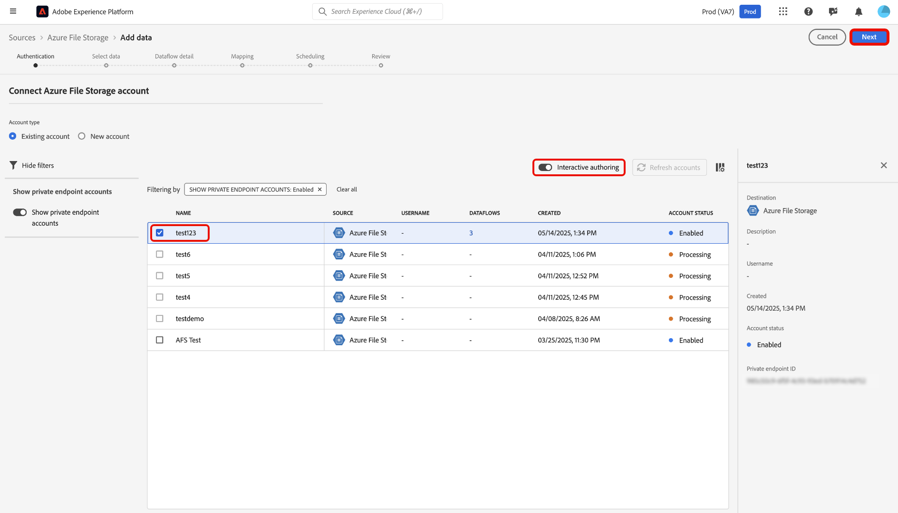

# Utilisation de [!DNL Azure Private Link] pour les sources dans l’interface utilisateur

>[!AVAILABILITY]
>
>Cette fonctionnalité est en version bêta et n’est actuellement prise en charge que pour les sources suivantes :
>
>* [[!DNL Azure Blob Storage]](../../connectors/cloud-storage/blob.md)
>* [[!DNL ADLS Gen2]](../../connectors/cloud-storage/adls-gen2.md)
>* [[!DNL Azure File Storage]](../../connectors/cloud-storage/azure-file-storage.md)
>* [[!DNL Snowflake]](../../connectors/databases/snowflake.md)

Vous pouvez utiliser la fonction [!DNL Azure Private Link] pour créer des points d’entrée privés auxquels vos sources Adobe Experience Platform peuvent se connecter. Connectez vos sources en toute sécurité à un réseau virtuel à l&#39;aide d&#39;adresses IP privées, éliminez le besoin d&#39;adresses IP publiques et réduisez votre surface d&#39;attaque.Simplifiez votre configuration réseau en supprimant la nécessité de configurations complexes de pare-feu ou de traduction d&#39;adresses réseau, tout en veillant à ce que le trafic de données atteigne uniquement les services approuvés.

Lisez ce guide pour savoir comment utiliser l’espace de travail des sources dans l’interface utilisateur d’Experience Platform pour créer et utiliser un point d’entrée privé.

## Créer un point d’entrée privé

Pour commencer à utiliser [!DNL Azure Private Link], accédez au catalogue *[!UICONTROL Sources]* de l’interface utilisateur d’Experience Platform et sélectionnez **[!UICONTROL Points d’entrée privés]** dans le menu des onglets de l’espace de travail des sources.

Utilisez l’interface pour afficher des informations sur les points d’entrée privés existants, tels que leur identifiant, la source associée et le statut actuel. Pour créer un point d’entrée privé, sélectionnez **[!UICONTROL Créer un point d’entrée privé]**.

Choisissez ensuite la source de votre choix, puis saisissez des valeurs pour les propriétés suivantes :

| Propriété | Description |
| --- | --- |
| `name` | Nom de votre point d’entrée privé. |
| `subscriptionId` | ID associé à votre abonnement [!DNL Azure]. Pour plus d’informations, consultez le guide de [!DNL Azure] sur la [récupération des ID d’abonnement et de client de l’ [!DNL Azure Portal]](https://learn.microsoft.com/en-us/azure/azure-portal/get-subscription-tenant-id). |
| `resourceGroupName` | Nom de votre groupe de ressources sur [!DNL Azure]. Un groupe de ressources contient les ressources associées à une solution [!DNL Azure]. Pour plus d’informations, consultez le guide [!DNL Azure] sur [la gestion des groupes de ressources](https://learn.microsoft.com/en-us/azure/azure-resource-manager/management/manage-resource-groups-portal). |
| `resourceGroup` | Nom de la ressource. Dans [!DNL Azure], une ressource fait référence à des instances telles que des machines virtuelles, des applications web et des bases de données. Pour plus d’informations, consultez le guide [!DNL Azure] sur [présentation du gestionnaire  [!DNL Azure]  ressources](https://learn.microsoft.com/en-us/azure/azure-resource-manager/management/overview). |
| `fqdns` | Noms de domaine complets pour votre source. **REMARQUE** : cette propriété est requise uniquement lors de l’utilisation de la source [!DNL Snowflake]. |

{style="table-layout:auto"}

Lorsque vous avez terminé, sélectionnez **[!UICONTROL Soumettre]**.

### Approuver un point d’entrée privé

Un nouveau point d’entrée reste en attente jusqu’à ce qu’il soit approuvé par un administrateur.

Pour approuver une demande de point d’entrée privé pour les sources [!DNL Azure Blob] et [!DNL Azure Data Lake Gen2], connectez-vous au [!DNL Azure Portal] . Dans le volet de navigation de gauche, sélectionnez **[!DNL Data storage]**, puis accédez à l’onglet **[!DNL Security + networking]** et choisissez **[!DNL Networking]**. Sélectionnez ensuite **[!DNL Private endpoints]** pour afficher la liste des points d’entrée privés associés à votre compte et leurs états de connexion actuels. Pour approuver une demande en attente, sélectionnez le point d’entrée souhaité, puis cliquez sur **[!DNL Approve]**.

## Créer un compte avec un point d’entrée privé

Accédez au catalogue de sources et sélectionnez une source qui prend en charge les points d’entrée privés. Créez ensuite un compte avec votre source et, lors de l’authentification du compte, activez le bouton (bascule) **[!UICONTROL Point d’entrée privé]**. Fournissez les informations d’authentification de votre source, puis sélectionnez **[!UICONTROL Se connecter à la source]** Patientez quelques minutes le temps que la connexion soit établie.

>[!NOTE]
>
>Si l’option [!UICONTROL Point d’entrée privé] est activée, Experience Platform vérifie si un point d’entrée privé approuvé existe pour la source sélectionnée. Si aucun point d’entrée approuvé n’est trouvé, vous ne pourrez pas établir de connexion.

Accédez ensuite à l’interface [!UICONTROL Compte existant] de votre source. Utilisez cette interface pour afficher la liste de vos comptes existants et leurs statuts correspondants. Vous pouvez sélectionner l’icône de filtre  pour afficher uniquement les comptes qui ont été activés pour se connecter à un point d’entrée privé.

Sélectionnez le compte à utiliser, puis activez la **[!UICONTROL création interactive]**. Ce bouton (bascule) active la [!UICONTROL création interactive], une fonctionnalité [!DNL Azure] qui vous permet de tester les connexions, de parcourir les listes de dossiers et de prévisualiser les données. L’activation de la [!UICONTROL création interactive] est requise pour les connexions de point d’entrée privé. Notez que vous ne pouvez pas désactiver manuellement ce bouton ; il se désactive automatiquement au bout de 60 minutes.

L’activation de la [!UICONTROL création interactive] prend quelques minutes. Une fois le paramètre activé, sélectionnez **[!UICONTROL Suivant]** pour passer à l’étape suivante et sélectionner les données à ingérer.

## Étapes suivantes

Maintenant que vous avez créé un point d’entrée privé, vous pouvez créer des connexions source et des flux de données, et ingérer des données à l’aide de points d’entrée privés. Lisez les guides suivants pour plus d’informations sur la création de flux de données dans l’interface utilisateur :

* [Créer un flux de données pour une source d’espace de stockage dans le cloud](../ui/dataflow/batch/cloud-storage.md)
* [Créer un flux de données pour une source de base de données](../ui/dataflow/databases.md)