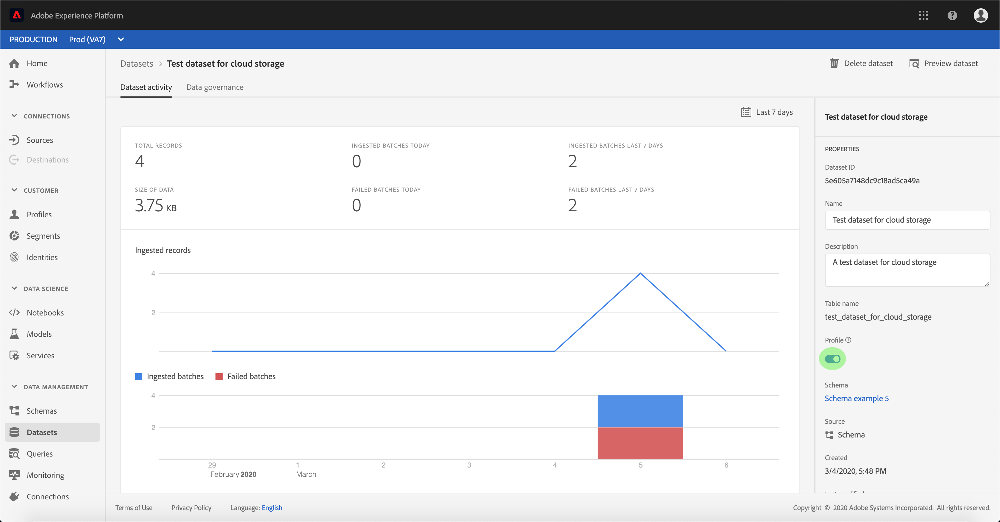

# Activer les données source entrantes pour renseigner les profils client

Les données entrantes de votre connecteur source peuvent être utilisées pour enrichir et renseigner vos données de Profil client en temps réel.

## Prise en main

Ce didacticiel nécessite une compréhension pratique des composants suivants d’Adobe Experience Platform :

- [Système](../../../xdm/home.md)de modèle de données d’expérience (XDM) : Cadre normalisé selon lequel la plate-forme d’expérience organise les données d’expérience client.
   - [Principes de base de la composition](../../../xdm/schema/composition.md)des schémas : Découvrez les éléments de base des schémas XDM, y compris les principes clés et les meilleures pratiques en matière de composition des schémas.
   - [Didacticiel](../../../xdm/tutorials/create-schema-ui.md)sur l’éditeur de Schéma : Découvrez comment créer des schémas personnalisés à l’aide de l’interface utilisateur de l’éditeur de Schémas.
- [Profil](../../../profile/home.md)client en temps réel : Fournit un profil de consommation unifié en temps réel basé sur des données agrégées provenant de plusieurs sources.

De plus, ce didacticiel nécessite que vous ayez déjà créé et configuré un connecteur source.  Vous trouverez une liste de didacticiels pour la création de différents connecteurs dans l’interface utilisateur dans l’aperçu [des connecteurs](../../home.md)source.

## Renseigner vos données de Profil client en temps réel

Pour enrichir les profils clients, le schéma source du jeu de données de cible doit être compatible avec le Profil client en temps réel. Un schéma compatible satisfait aux exigences suivantes :

- Le schéma comporte au moins un attribut spécifié comme propriété d&#39;identité.
- Le schéma possède une propriété d&#39;identité définie en tant qu&#39;identité principale.
- Il existe un mappage dans le flux de données où l&#39;identité principale est un attribut de cible.

Dans l’espace de travail Sources, cliquez sur l’onglet **Parcourir** pour liste vos connexions de base. Dans la liste affichée, recherchez la connexion qui contient le flux de données que vous souhaitez renseigner sur les profils. Cliquez sur le nom de la connexion pour accéder à ses détails.

L&#39;écran activité ** source de la connexion s&#39;affiche, affichant les jeux de données dans lesquels la connexion imbrique des données source. Cliquez sur le nom du jeu de données que vous souhaitez activer pour le Profil.

L’écran activité *des* jeux de données s’affiche. La colonne *Propriétés* située à droite de l&#39;écran affiche les détails du jeu de données et inclut un commutateur de **Profil** et un lien vers le schéma auquel adhère le jeu de données. Cliquez sur le nom du schéma pour en vue la composition.

L’éditeur *de* Schéma s’affiche, indiquant la structure du schéma dans la trame centrale. Dans la trame, sélectionnez le champ à définir comme identité principale. Sous l’onglet Propriétés *des* champs qui s’affiche, cochez la case **Identité** , puis l’identité **** principale. Enfin, sélectionnez un espace de nommage **d&#39;** identité approprié, puis cliquez sur **Appliquer**.

Cliquez sur l’objet de niveau supérieur de la structure du schéma et la colonne des propriétés *du* Schéma s’affiche. Activez le schéma pour le Profil en basculant le commutateur **Profil** . Cliquez sur **Enregistrer** pour finaliser vos modifications.

Maintenant que le schéma est activé pour le Profil, revenez à l&#39;écran activité *du jeu de* données et activez le jeu de données pour le Profil en cliquant sur la bascule **Profil** dans la colonne *Propriétés* .

Avec le schéma et le jeu de données activés pour le Profil, les données ingérées dans ce jeu de données renseigneront également les profils client.

>[!NOTE] Les données existantes dans un jeu de données récemment activé ne sont pas consommées par Profil.

## Étapes suivantes

En suivant ce didacticiel, vous avez activé avec succès les données entrantes pour la population de Profils. Pour plus d’informations, voir la présentation [du Profil client en temps](../../../profile/home.md)réel.