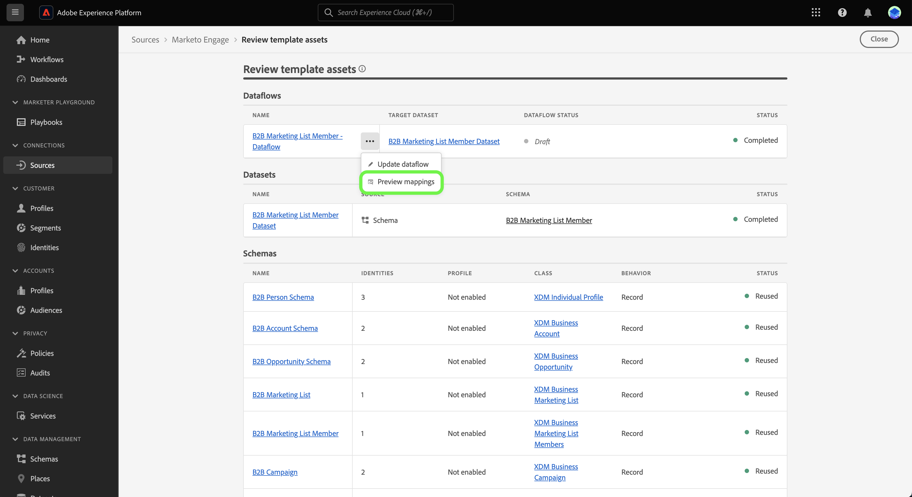

# Créer un flux de données de sources à l’aide de modèles dans l’interface utilisateur {#create-a-sources-dataflow-using-templates-in-the-ui}

>[!CONTEXTUALHELP]
>id="platform_sources_marketo_mapping"
>title="Modèles de sources dans l’IU d’Experience Platform"
>abstract="Les modèles comprennent des ressources générées automatiquement telles que des schémas, des jeux de données, des identités, des règles de mappage, des espaces de noms d’identité et des flux de données que vous pouvez utiliser lors de l’importation de données d’une source vers Experience Platform. Vous pouvez mettre à jour des ressources générées automatiquement pour les personnaliser en fonction de vos cas d’utilisation."

>[!IMPORTANT]
>
>Les modèles sont en version bêta et sont pris en charge par les sources suivantes :
>
>* [[!DNL Marketo Engage]](../../connectors/adobe-applications/marketo/marketo.md)
>* [[!DNL Microsoft Dynamics]](../../connectors/crm/ms-dynamics.md)
>* [[!DNL Salesforce]](../../connectors/crm/salesforce.md)
>
>La documentation et les fonctionnalités peuvent changer.

Adobe Experience Platform fournit des modèles préconfigurés que vous pouvez utiliser pour accélérer votre processus d’ingestion de données. Les modèles comprennent des ressources générées automatiquement telles que des schémas, des jeux de données, des identités, des règles de mappage, des espaces de noms d’identité et des flux de données que vous pouvez utiliser lors de l’importation de données d’une source vers Experience Platform.

Avec les modèles, vous pouvez :

* Réduire le délai de valorisation de l’ingestion en accélérant la création de ressources modélisées.
* Minimiser les erreurs qui peuvent se produire pendant le processus d’ingestion manuelle des données.
* Mettre à jour les ressources générées automatiquement à tout moment en fonction de vos cas d’utilisation.

Le tutoriel suivant décrit les étapes à suivre pour utiliser des modèles dans l’interface utilisateur d’Experience Platform.

## Prise en main

Ce tutoriel nécessite une compréhension du fonctionnement des composants suivants d’Adobe Experience Platform : 

* [Sources](../../home.md) : Experience Platform permet d’ingérer des données provenant de diverses sources tout en vous offrant la possibilité de structurer, d’étiqueter et d’améliorer les données entrantes à l’aide des services d’Experience Platform.
* [[!DNL Experience Data Model (XDM)] Système](../../../xdm/home.md) : Cadre normalisé selon lequel Experience Platform organise les données d’expérience client.
* [Sandbox](../../../sandboxes/home.md) : Experience Platform fournit des sandbox virtuels qui divisent une instance Experience Platform unique en environnements virtuels distincts pour favoriser le développement et l’évolution d’applications d’expérience digitale.

## Utiliser des modèles dans l’IU d’Experience Platform {#use-templates-in-the-platform-ui}

>[!CONTEXTUALHELP]
>id="platform_sources_templates_accounttype"
>title="Sélectionner le type d’entreprise"
>abstract="Sélectionnez le type d’entreprise approprié à votre cas d’utilisation. Votre accès peut varier en fonction de votre compte d’abonnement Real-time Customer Data Platform."
>additional-url="https://experienceleague.adobe.com/docs/experience-platform/rtcdp/intro/rtcdp-intro/overview.html?lang=fr" text="Présentation de Real-Time CDP"

Dans l’interface utilisateur d’Experience Platform, sélectionnez **[!UICONTROL Sources]** dans le volet de navigation de gauche pour accéder à l’espace de travail [!UICONTROL Sources] et consulter un catalogue de sources disponibles dans Experience Platform.

Utilisez le menu *[!UICONTROL Catégories]* pour filtrer les sources par catégorie. Vous pouvez également saisir un nom de source dans la barre de recherche pour trouver une source spécifique à partir du catalogue.

Accédez à la catégorie [!UICONTROL Applications Adobe] pour afficher la carte source [!DNL Marketo Engage], puis sélectionnez [!UICONTROL Ajouter des données] pour commencer.

Une fenêtre pop-up s’affiche, vous permettant de parcourir les modèles ou d’utiliser des schémas et des jeux de données existants.

* **Parcourir les modèles** : Les modèles sources créent automatiquement pour vous des schémas, des identités, des jeux de données et des flux de données avec des règles de mappage. Vous pouvez personnaliser ces ressources selon vos besoins.
* **Utiliser mes ressources existantes** : Ingérez vos données à l’aide des jeux de données et des schémas que vous avez créés. Vous pouvez également créer de nouveaux jeux de données et de nouveaux schémas selon vos besoins.

>[!NOTE]
>
>Les modèles peuvent générer automatiquement des schémas basés sur un modèle lors de l’utilisation de sources qui nécessitent des workflows de capture de données de modification ou qui prennent en charge plusieurs modèles de données. Ces schémas activent les fonctionnalités de Data Mirror pour la synchronisation des données en temps réel.\
>Lors de l’utilisation de modèles avec des schémas basés sur des modèles, les ressources générées automatiquement incluent les champs clé primaire, identifiant de version et identifiant d’horodatage requis.\
>Pour plus d’informations, consultez la présentation de Data Mirror  ainsi que la [ référence technique des schémas basés sur des modèles](../../../xdm/schema/model-based.md).

Pour utiliser des ressources générées automatiquement, sélectionnez **[!UICONTROL Parcourir les modèles]** puis **[!UICONTROL Sélectionner]**.

### Authentification

L’étape d’authentification s’affiche et vous invite à créer un compte ou à utiliser un compte existant.

>[!BEGINTABS]

>[!TAB Utiliser un compte existant]

Pour utiliser un compte existant, sélectionnez [!UICONTROL Compte existant] puis sélectionnez le compte à utiliser dans la liste qui s’affiche.

>[!TAB Créer un compte]

Pour créer un compte, sélectionnez **[!UICONTROL Nouveau compte]**, puis fournissez les informations d’identification de connexion source et les informations d’authentification du compte. Lorsque vous avez terminé, sélectionnez **[!UICONTROL Connexion à la source]**, puis patientez quelques instants le temps que la nouvelle connexion sʼétablisse.

>[!ENDTABS]

### Sélectionner des modèles

Une fois votre compte authentifié, vous pouvez sélectionner le modèle à utiliser pour votre flux de données.

+++[!DNL Marketo Engage] modèles
Le tableau suivant décrit les modèles disponibles pour la source de [!DNL Marketo Engage].

| [!DNL Marketo Engage] modèles | Description |
| --- | --- |
| Activités | Le modèle Activités capture des instantanés d’activités basés sur des événements, tels que les interactions d’e-mails, les interactions de sites web et les appels commerciaux. |
| Sociétés | Le modèle Sociétés capture les détails du compte professionnel, tels que les informations démographiques, l’emplacement et les informations de facturation de la société. |
| Comptes désignés | Le modèle Comptes nommés capture les détails des comptes qui ont été déterminés comme des comptes cibles à poursuivre. |
| Opportunités | Le modèle Opportunités capture les détails de l’opportunité commerciale tels que le type, l’étape de vente et les comptes associés. |
| Rôles de contact d’opportunité | Le modèle Rôles de contact d’une opportunité capture les détails des rôles des prospects associés à une opportunité particulière. |
| Personnes | Le modèle Personnes capture les attributs de personnes individuelles, tels que les détails démographiques, les informations de contact et les préférences de consentement. |
| Abonnements au programme | Le modèle Abonnements au programme capture les détails des contacts associés à une campagne commerciale, inclut les cadences de maturation et les réponses aux contacts. |
| Programmes | Le modèle Programmes capture les détails de la campagne commerciale tels que le statut, les canaux, la chronologie et les coûts. |
| Appartenances à une liste statique | Le modèle Appartenances à une liste statique capture les relations entre les personnes et leur appartenance à des listes statiques. |
| Listes statiques | Le modèle Liste statique capture les listes instanciées de personnes pour des cas d’utilisation spécifiques. |

{style="table-layout:auto"}

+++

+++[!DNL Salesforce] de modèles B2B
Le tableau suivant décrit les modèles B2B disponibles pour la source [!DNL Salesforce].

| [!DNL Salesforce] de modèles B2B | Description |
| --- | --- |
| Relation de contact de compte | Le modèle Relation de contact de compte capture la relation entre un contact et un ou plusieurs comptes. |
| Comptes | Le modèle de compte capture les détails du compte professionnel, tels que les informations démographiques, l’emplacement et les informations de facturation de la société. |
| Membres de la campagne | Le modèle Membres de la campagne capture la relation entre un prospect ou un contact individuel et une campagne [!DNL Salesforce] spécifique. |
| Campagnes | Le modèle Campagnes capture les détails du compte professionnel, tels que les informations démographiques, l’emplacement et les informations de facturation de la société. |
| Contacts | Le modèle Contact capture les attributs des contacts tels que les informations démographiques, les coordonnées et les entités commerciales associées. |
| Prospects | Le modèle de leads capture les attributs pour les leads tels que les détails démographiques, les informations de contact et les entités commerciales associées. |
| Opportunités | Le modèle Opportunités capture les détails de l’opportunité commerciale tels que le type, l’étape de vente et le compte associé. |
| Rôles de contact d’opportunité | Le modèle Rôles de contact d’une opportunité capture les détails des rôles des prospects associés à une opportunité particulière. |

{style="table-layout:auto"}

+++

+++[!DNL Salesforce] de modèles B2C
Le tableau suivant décrit les modèles B2C disponibles pour la source [!DNL Salesforce].

| [!DNL Salesforce] de modèles B2C | Description |
| --- | --- |
| Contact | Le modèle Contact capture les attributs des contacts tels que les informations démographiques, les coordonnées et les entités commerciales associées. |
| Lead | Le modèle de prospect capture les attributs des prospects tels que les informations démographiques, les coordonnées et les entités commerciales associées. |

{style="table-layout:auto"}

+++

+++[!DNL Microsoft Dynamics] de modèles B2B
Le tableau suivant décrit les modèles B2B disponibles pour la source [!DNL Microsoft Dynamics].

| [!DNL Microsoft Dynamics] de modèles B2B | Description |
| --- | --- |
| Comptes | Le modèle de compte capture les détails du compte professionnel, tels que les informations démographiques, l’emplacement et les informations de facturation de la société. |
| Campagnes | Le modèle Campagnes capture les détails du compte professionnel, tels que les informations démographiques, l’emplacement et les informations de facturation de la société. |
| Contacts | Le modèle Contact capture les attributs des contacts tels que les informations démographiques, les coordonnées et les entités commerciales associées. |
| Prospects | Le modèle de leads capture les attributs pour les leads tels que les détails démographiques, les informations de contact et les entités commerciales associées. |
| Liste marketing | Le modèle Liste marketing capture un groupe de clients existants ou potentiels créé pour une campagne marketing ou à d’autres fins de vente. |
| Membres de la liste marketing | Les membres de la liste marketing capturent les détails d’un type d’enregistrement de client, tel que les prospects, les comptes ou les contacts, dans une liste marketing. |
| Opportunités | Le modèle Opportunités capture les détails de l’opportunité commerciale tels que le type, l’étape de vente et le compte associé. |
| Rôles de contact d’opportunité | Le modèle Rôles de contact d’une opportunité capture les détails des rôles des prospects associés à une opportunité particulière. |

{style="table-layout:auto"}

+++

+++[!DNL Microsoft Dynamics] de modèles B2C
Le tableau suivant décrit les modèles B2C disponibles pour la source [!DNL Microsoft Dynamics].

| [!DNL Microsoft Dynamics] de modèles B2C | Description |
| --- | --- |
| Contact | Le modèle Contact capture les attributs des contacts tels que les informations démographiques, les coordonnées et les entités commerciales associées. |
| Lead | Le modèle de prospect capture les attributs des prospects tels que les informations démographiques, les coordonnées et les entités commerciales associées. |

{style="table-layout:auto"}

+++

Selon le type d’entreprise que vous avez sélectionné, une liste de modèles s’affiche. Sélectionnez l’icône d’aperçu  à côté du nom d’un modèle pour prévisualiser les données d’exemple du modèle.

La fenêtre d’aperçu s’affiche, vous permettant d’explorer et d’examiner des données d’exemple de votre modèle. Lorsque vous avez terminé, sélectionnez **[!UICONTROL Compris]**.

Sélectionnez ensuite dans la liste le modèle que vous souhaitez utiliser. Vous pouvez sélectionner plusieurs modèles et créer plusieurs flux de données à la fois. Cependant, un modèle ne peut être utilisé qu’une seule fois par compte. Une fois les modèles sélectionnés, cliquez sur **[!UICONTROL Terminer]** et patientez quelques instants le temps que les ressources se génèrent.

Si vous sélectionnez un ou des éléments partiels dans la liste des modèles disponibles, tous les schémas B2B et les espaces de noms d’identité seront quand même générés afin de garantir que les relations B2B entre les schémas soient correctement configurées.

>[!NOTE]
>
>Les modèles déjà utilisés seront désactivés de la sélection.

### Définir un planning

Les sources [!DNL Microsoft Dynamics] et [!DNL Salesforce] prennent toutes deux en charge la planification des flux de données.

Utilisez l’interface de planification pour configurer un planning d’ingestion pour vos flux de données. Définissez la fréquence d’ingestion sur **Une fois** pour créer une ingestion unique.

Vous pouvez également définir la fréquence d’ingestion sur **Minute**, **Heure**, **Jour** ou **Semaine**. Si vous planifiez votre flux de données pour plusieurs ingestions, vous devez définir un intervalle afin d’établir une période entre chaque ingestion. Par exemple, une fréquence d’ingestion définie sur **Heure** et un intervalle défini sur **15** signifie que votre flux de données est planifié pour ingérer des données toutes les **15 heures**.

Au cours de cette étape, vous pouvez également activer le **renvoi** et définir une colonne pour l’ingestion incrémentielle des données. Le renvoi est utilisé pour ingérer des données historiques, tandis que la colonne que vous définissez pour l’ingestion incrémentielle permet de différencier les nouvelles données des données existantes.

Une fois la configuration du planning d’ingestion terminée, sélectionnez **[!UICONTROL Terminer]**.

### Vérifier les ressources {#review-assets}

>[!CONTEXTUALHELP]
>id="platform_sources_templates_review"
>title="Vérifier vos ressources générées automatiquement"
>abstract="La génération de toutes les ressources peut prendre jusqu’à cinq minutes. Si vous choisissez de quitter la page, une notification vous sera envoyée pour revenir une fois les ressources terminées. Vous pouvez vérifier les ressources une fois qu’elles ont été générées et effectuer des configurations supplémentaires dans votre flux de données à tout moment."

La page [!UICONTROL Vérifier les ressources de modèle] affiche les ressources générées automatiquement dans le cadre de votre modèle. Dans cette page, vous pouvez afficher les schémas, les jeux de données, les espaces de noms d’identité et les flux de données générés automatiquement associés à votre connexion source. La génération de toutes les ressources peut prendre jusqu’à cinq minutes. Si vous choisissez de quitter la page, une notification vous sera envoyée pour revenir une fois les ressources terminées. Vous pouvez vérifier les ressources une fois qu’elles ont été générées et effectuer des configurations supplémentaires dans votre flux de données à tout moment.

Par défaut, les flux de données générés automatiquement sont définis sur l’état de brouillon pour permettre une personnalisation supplémentaire des configurations, telles que les règles de mappage ou les fréquences planifiées. Sélectionnez les points de suspension (`...`) à côté du nom du flux de données, puis sélectionnez **[!UICONTROL Prévisualiser les mappages]** pour afficher les jeux de mappages créés pour votre brouillon de flux de données.

Une page d’aperçu s’affiche, vous permettant d’examiner la relation de mappage entre vos champs de données sources et vos champs de schéma cibles. Une fois que vous avez consulté les mappages de votre flux de données. Sélectionnez **[!UICONTROL J’ai compris.]**

Vous pouvez mettre à jour vos flux de données à tout moment après leur exécution. Sélectionnez les points de suspension (`...`) à côté du nom du flux de données, puis sélectionnez **[!UICONTROL Mettre à jour le flux de données]**. Vous accédez à la page du processus des sources dans laquelle vous pouvez mettre à jour les détails de votre flux de données, y compris les paramètres d’ingestion partielle, les diagnostics d’erreur et les notifications d’alerte, ainsi que le mappage de votre flux de données.

Vous pouvez utiliser la vue de l’éditeur de schémas pour mettre à jour votre schéma généré automatiquement. Consultez le guide sur l’[utilisation de l’éditeur de schéma](../../../xdm/tutorials/create-schema-ui.md) pour plus d’informations.

>[!TIP]
>
>Vous pouvez accéder à votre brouillon de flux de données via la page de catalogue [!UICONTROL Flux de données] dans l’espace de travail des sources. Sélectionnez **[!UICONTROL Flux de données]** dans l’en-tête supérieur, puis sélectionnez le flux de données à mettre à jour dans la liste.
>
>

### Publier votre flux de données

Démarrez le processus de publication en passant par le workflow des sources. Après avoir sélectionné [!UICONTROL Mettre à jour le flux de données], vous passez à l’étape *[!UICONTROL Ajouter des données]* du workflow. Cliquez sur **[!UICONTROL Suivant]** pour continuer.

Ensuite, confirmez les détails de votre flux de données et configurez les paramètres pour les diagnostics d’erreur, l’ingestion partielle et les notifications d’alerte. Lorsque vous avez terminé, sélectionnez **[!UICONTROL Suivant]**.

>[!NOTE]
>
>Vous pouvez sélectionner **[!UICONTROL Enregistrer en tant que brouillon]** à tout moment pour arrêter et enregistrer les modifications que vous avez apportées à votre flux de données.

L’étape de mappage s’affiche. Au cours de cette étape, vous pouvez reconfigurer les configurations de mappage de votre flux de données. Pour obtenir un guide complet sur les fonctions de préparation des données utilisées pour le mappage, consultez le [guide de l’interface utilisateur de la préparation des données](../../../data-prep/ui/mapping.md).

Enfin, passez en revue les détails de votre flux de données, puis sélectionnez **[!UICONTROL Enregistrer et ingérer]** pour publier votre brouillon.

## Étapes suivantes

En suivant ce tutoriel, vous avez désormais créé des flux de données, ainsi que des ressources telles que des schémas, des jeux de données et des espaces de noms d’identité à l’aide de modèles. Pour obtenir des informations générales sur les sources, consultez la [présentation des sources](../../home.md).

## Alertes et notifications {#alerts-and-notifications}

Les modèles sont pris en charge par les alertes Adobe Experience Platform et vous pouvez utiliser le panneau de notifications pour recevoir des mises à jour sur le statut de vos ressources et également revenir à la page de révision.

Sélectionnez l’icône de notification dans l’en-tête supérieur de l’interface utilisateur d’Experience Platform, puis sélectionnez l’alerte de statut pour afficher les ressources que vous souhaitez consulter.

Vous pouvez mettre à jour les paramètres d’alerte de vos modèles pour recevoir des notifications par e-mail et in-Experience Platform sur le statut de vos flux de données. Pour plus d’informations sur la configuration des alertes, consultez le guide sur [comment s’abonner à des alertes pour les flux de données des sources](../ui/alerts.md).