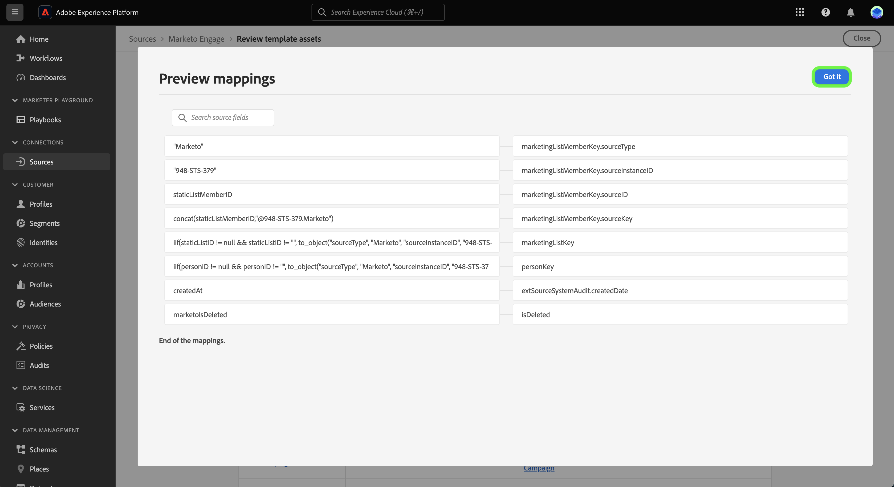

# (Alpha) Création d’un flux de données de sources à l’aide de modèles dans l’interface utilisateur

>[!IMPORTANT]
>
>Les modèles sont dans Alpha et ne sont actuellement pris en charge que par le [[!DNL Marketo Engage] source](../../connectors/adobe-applications/marketo/marketo.md). La documentation et les fonctionnalités peuvent être modifiées.

Adobe Experience Platform fournit des modèles préconfigurés que vous pouvez utiliser pour accélérer votre processus d’ingestion de données. Les modèles comprennent des ressources générées automatiquement telles que des schémas, des jeux de données, des règles de mappage, des espaces de noms d’identité et des flux de données que vous pouvez utiliser lors de l’importation de données d’une source vers un Experience Platform.

Avec les modèles, vous pouvez :

* Réduisez le délai d’ingestion par rapport à la valeur en accélérant la création de ressources basée sur ML.
* Minimiser les erreurs qui peuvent se produire pendant le processus d’ingestion manuelle des données.
* Mettez à jour les ressources générées automatiquement à tout moment en fonction de vos cas d’utilisation.

Le tutoriel suivant décrit les étapes à suivre pour utiliser des modèles dans l’interface utilisateur de Platform à l’aide du [[!DNL Marketo Engage] source](../../connectors/adobe-applications/marketo/marketo.md).

## Prise en main

Ce tutoriel nécessite une compréhension pratique des composants suivants de l’Experience Platform :

* [Sources](../../home.md) : Experience Platform permet d’ingérer des données provenant de diverses sources tout en vous offrant la possibilité de structurer, d’étiqueter et d’améliorer les données entrantes à l’aide des services de Platform.
* [[!DNL Experience Data Model (XDM)] Système](../../../xdm/home.md): Cadre normalisé selon lequel l’Experience Platform organise les données d’expérience client.
* [Sandbox](../../../sandboxes/home.md) : Experience Platform fournit des sandbox virtuelles qui divisent une instance de plateforme unique en environnements virtuels distincts pour favoriser le développement et l’évolution d’applications d’expérience numérique.

## Utilisation de modèles dans l’interface utilisateur de Platform {#use-templates-in-the-platform-ui}

>[!CONTEXTUALHELP]
>id="platform_sources_templates_accounttype"
>title="Sélection du type d’entreprise"
>abstract="Sélectionnez le type d’entreprise approprié à votre cas d’utilisation. Votre accès peut varier en fonction de votre compte d’abonnement Real-time Customer Data Platform."
>additional-url="https://experienceleague.adobe.com/docs/experience-platform/rtcdp/overview.html?lang=fr" text="Présentation de Real-Time CDP"

Dans l’interface utilisateur de Platform, sélectionnez **[!UICONTROL Sources]** dans le volet de navigation de gauche pour accéder à l’espace de travail [!UICONTROL Sources]. Le [!UICONTROL Catalogue] affiche diverses sources pouvant être utilisées pour créer un compte.

Vous pouvez sélectionner la catégorie appropriée dans le catalogue sur le côté gauche de votre écran. Vous pouvez également sélectionner la source de votre choix à l’aide de la barre de recherche.

Sous , [!UICONTROL Adobe des applications] catégorie, sélectionnez **[!UICONTROL Marketo Engage]** puis sélectionnez **[!UICONTROL Ajouter des données]**.

Une fenêtre contextuelle s’affiche, vous permettant de parcourir les modèles ou d’utiliser des schémas et des jeux de données existants. Pour utiliser des ressources générées automatiquement, sélectionnez **[!UICONTROL Parcourir les modèles]** puis sélectionnez **[!UICONTROL Sélectionner]**.

### Authentification

L’étape d’authentification s’affiche et vous invite à créer un compte ou à utiliser un compte existant.

#### Compte existant

Pour utiliser un compte existant, sélectionnez [!UICONTROL Compte existant] puis sélectionnez le compte à utiliser dans la liste qui s’affiche.

#### Nouveau compte

Pour créer un compte, sélectionnez **[!UICONTROL Nouveau compte]**, puis fournissez les informations de connexion source et les informations d’authentification du compte. Lorsque vous avez terminé, sélectionnez **[!UICONTROL Connexion à la source]** et accorder un certain temps à l’établissement de la nouvelle connexion.

### Sélectionner des modèles

Une fois votre compte authentifié et sélectionné, une liste de modèles s’affiche. Sélectionnez l’icône d’aperçu en regard du nom d’un modèle pour prévisualiser les exemples de données du modèle.

La fenêtre d’aperçu s’affiche, vous permettant d’explorer et d’examiner des données d’exemple de votre modèle. Lorsque vous avez terminé, sélectionnez **[!UICONTROL Compris]**.

Sélectionnez ensuite le modèle que vous souhaitez utiliser dans la liste. Vous pouvez sélectionner plusieurs modèles et créer plusieurs flux de données à la fois. Cependant, un modèle ne peut être utilisé qu’une seule fois par compte. Une fois les modèles sélectionnés, sélectionnez **[!UICONTROL Terminer]** et laissez quelques instants aux ressources à générer.

### Révision de ressources {#review-assets}

>[!CONTEXTUALHELP]
>id="platform_sources_templates_review"
>title="Vérification des ressources générées automatiquement"
>abstract="La génération de toutes les ressources peut prendre jusqu’à cinq minutes. Si vous choisissez de quitter la page, une notification vous sera envoyée pour renvoyer une fois les ressources terminées. Vous pouvez consulter les ressources une fois qu’elles ont été générées et effectuer des configurations supplémentaires dans votre flux de données à tout moment."

Le [!UICONTROL Vérification des ressources de modèle] affiche les ressources générées automatiquement dans le cadre de votre modèle. Dans cette page, vous pouvez afficher les schémas, les jeux de données, les espaces de noms d’identité et les flux de données générés automatiquement associés à votre connexion source.

Les flux de données générés automatiquement sont activés par défaut. Sélectionnez les ellipses (`...`) en regard du nom du flux de données, puis sélectionnez **[!UICONTROL Prévisualiser les mappages]** pour afficher les jeux de mappages créés pour votre flux de données.

Une page d’aperçu s’affiche, vous permettant d’examiner la relation de mappage entre vos champs de données source et vos champs de schéma cible. Une fois que vous avez consulté les mappages de votre flux de données. Sélectionner **[!UICONTROL J&#39;ai compris.]**

Vous pouvez mettre à jour vos flux de données à tout moment après leur exécution. Sélectionnez les ellipses (`...`) en regard du nom du flux de données, puis sélectionnez **[!UICONTROL Mise à jour du flux de données]**. Vous accédez à la page du workflow des sources dans laquelle vous pouvez mettre à jour les détails de votre flux de données, y compris les paramètres d’ingestion partielle, les diagnostics d’erreur et les notifications d’alerte, ainsi que le mappage de votre flux de données.

## Étapes suivantes

En suivant ce tutoriel, vous avez désormais créé des flux de données, ainsi que des ressources telles que des schémas, des jeux de données et des espaces de noms d’identité à l’aide de modèles. Pour obtenir des informations générales sur les sources, consultez la [présentation des sources](../../home.md).