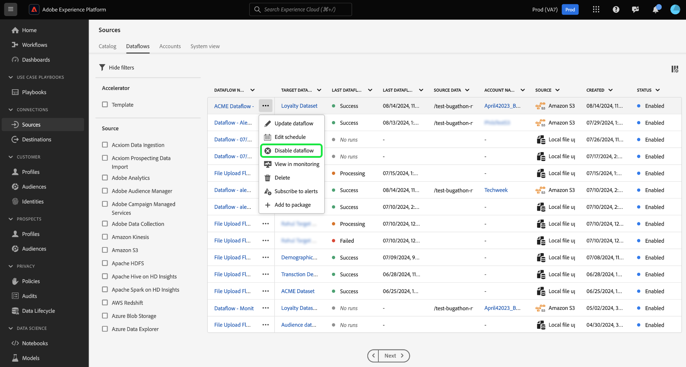
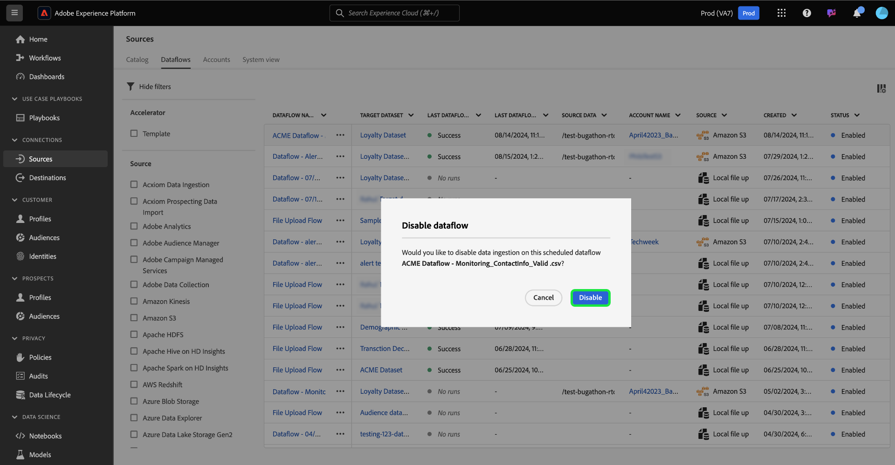

# Mise à jour des flux de données dans l’interface utilisateur

Lisez ce tutoriel pour savoir comment mettre à jour un flux de données existant, y compris ses configurations de planification et de mappage, à l’aide de l’espace de travail sources dans l’interface utilisateur de Adobe Experience Platform.

## Commencer

Ce tutoriel nécessite une compréhension du fonctionnement des composants suivants d’Adobe Experience Platform : 

* [Sources](../../home.md) : Experience Platform permet d’ingérer des données provenant de diverses sources tout en vous offrant la possibilité de structurer, d’étiqueter et d’améliorer les données entrantes à l’aide des services de Platform.
* [Sandbox](../../../sandboxes/home.md) : Experience Platform fournit des sandbox virtuels qui divisent une instance de plateforme unique en environnements virtuels distincts pour favoriser le développement et l’évolution d’applications d’expérience digitale.

## Mettre à jour des flux de données {#update-dataflows}

>[!CONTEXTUALHELP]
>id="platform_sources_dataflows_daysRemaining"
>title="Expiration du jeu de données"
>abstract="Cette colonne indique le nombre de jours restants au jeu de données cible avant son expiration automatique. Un flux de données échoue si le jeu de données cible expire. Pour éviter l’échec d’un flux de données, assurez-vous qu’un jeu de données cible est défini pour expirer à la date correcte. Consultez la documentation pour savoir comment mettre à jour les dates d’expiration."

Dans l’interface utilisateur de l’Experience Platform, sélectionnez **[!UICONTROL Sources]** dans le volet de navigation de gauche, puis **[!UICONTROL Flux de données]** dans l’en-tête supérieur.

>[!TIP]
>
>Vous pouvez trier et filtrer vos flux de données à l’aide de fonctionnalités de filtrage. Pour plus d’informations, consultez le guide sur le [filtrage des objets sources dans l’interface utilisateur](./filter.md) .

La page [!UICONTROL Flux de données] affiche une liste de tous les flux de données existants de votre organisation. Recherchez le flux de données à mettre à jour, puis sélectionnez les ellipses (`...`) à côté. Un menu déroulant s’affiche, affichant une liste d’options parmi lesquelles choisir, afin d’effectuer des configurations supplémentaires dans votre flux de données existant.

Pour mettre à jour votre flux de données, sélectionnez **[!UICONTROL Mettre à jour le flux de données]**.

Vous êtes dirigé vers le workflow des sources où vous pouvez mettre à jour certains aspects de votre flux de données, y compris ses détails dans l’étape [!UICONTROL Fournir des détails de flux de données].

### Mettre à jour le mappage {#update-mapping}

>[!NOTE]
>
>La fonction de modification du mappage n’est actuellement pas prise en charge pour les sources suivantes : Adobe Analytics, Adobe Audience Manager, API HTTP et [!DNL Marketo Engage].

Au cours de ce processus, vous pouvez également mettre à jour les jeux de mappages associés à votre flux de données.  L’interface de mappage affiche le mappage existant de votre flux de données et non un nouveau jeu de mappage recommandé. Les mises à jour du mappage ne sont appliquées qu’aux exécutions de flux de données planifiées à l’avenir. Les jeux de mappages d’un flux de données planifié pour une ingestion unique ne peuvent pas être mis à jour.

Utilisez l’interface de mappage pour modifier les jeux de mappages appliqués à votre flux de données. Pour obtenir des instructions complètes sur l’utilisation de l’interface de mappage, consultez le [guide de l’interface utilisateur de la préparation des données](../../../data-prep/ui/mapping.md) pour plus d’informations.

### Planning des mises à jour

Une fois que vous avez mis à jour les mappages de votre flux de données, vous pouvez mettre à jour votre planning d’ingestion pour ingérer votre flux de données avec ses nouvelles données de mappage. Vous pouvez uniquement mettre à jour le planning d’ingestion des flux de données qui ont été configurés pour l’ingestion selon un planning récurrent. Vous ne pouvez pas replanifier un flux de données qui a été configuré pour l’ingestion unique.

Vous pouvez également mettre à jour le planning d’ingestion de votre flux de données à l’aide de l’option de mise à jour en ligne fournie dans la page des flux de données.

Sur la page des flux de données, sélectionnez les ellipses (`...`) en regard du nom du flux de données, puis sélectionnez **[!UICONTROL Modifier la planification]** dans le menu déroulant qui s’affiche.

La boîte de dialogue **[!UICONTROL Modifier le planning]** vous fournit des options pour mettre à jour la fréquence d’ingestion et le taux d’intervalle de votre flux de données. Une fois que vous avez défini les valeurs de fréquence et d’intervalle mises à jour, sélectionnez **[!UICONTROL Enregistrer]**.

### Désactiver le flux de données

Vous pouvez désactiver votre flux de données à l’aide du même menu déroulant. Pour désactiver votre flux de données, sélectionnez **[!UICONTROL Désactiver le flux de données]**.

Sélectionnez ensuite [!UICONTROL Désactiver] dans la fenêtre contextuelle qui s’affiche.

Si et lorsque vous réactiverez ultérieurement ce flux de données, l’Experience Platform planifiera automatiquement les exécutions de renvoi pour couvrir la période pendant laquelle le flux de données a été désactivé. Par exemple, si le flux de données a été configuré pour s’exécuter toutes les heures et a été désactivé pendant 48 heures, lors de la réactivation de ce flux de données, l’Experience Platform crée 48 exécutions de renvoi pour traiter les intervalles manqués.

## Étapes suivantes

En suivant ce tutoriel, vous avez utilisé l’espace de travail [!UICONTROL Sources] pour mettre à jour le planning d’ingestion et les ensembles de mappages de votre flux de données.

Pour savoir comment effectuer ces opérations par programmation à l’aide de l’API [!DNL Flow Service], reportez-vous au tutoriel sur la [mise à jour des flux de données à l’aide de l’API Flow Service](../../tutorials/api/update-dataflows.md).
