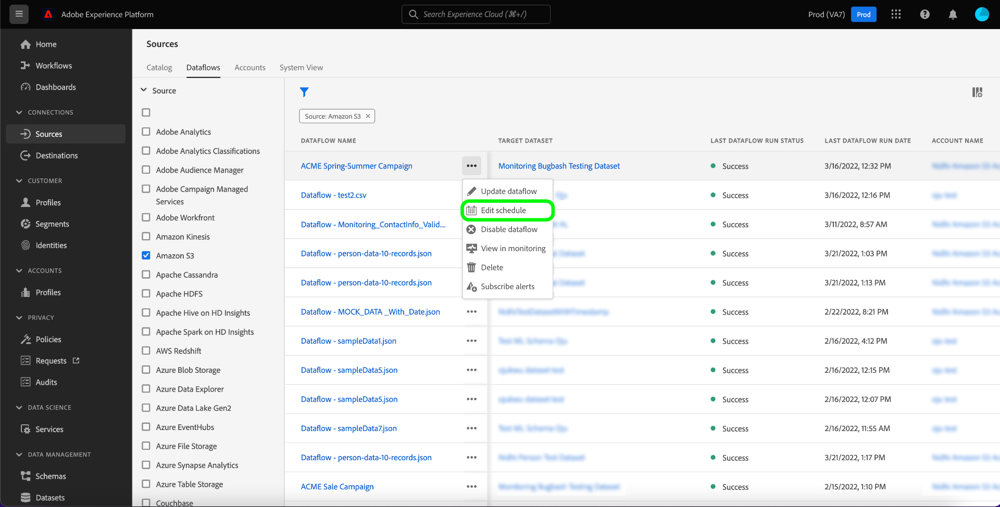

# Mise à jour des flux de données dans l’interface utilisateur

Ce tutoriel vous explique comment mettre à jour un flux de données existant, y compris sa planification et son mappage, à l’aide de l’espace de travail des sources.

## Prise en main

Ce tutoriel nécessite une compréhension du fonctionnement des composants suivants d’Adobe Experience Platform :

* [Sources](../../home.md) : Experience Platform permet d’ingérer des données provenant de diverses sources tout en vous offrant la possibilité de structurer, d’étiqueter et d’améliorer les données entrantes à l’aide des services de Platform.
* [Sandbox](../../../sandboxes/home.md) : Experience Platform fournit des sandbox virtuels qui divisent une instance de plateforme unique en environnements virtuels distincts pour favoriser le développement et l’évolution d’applications d’expérience digitale.

## Mettre à jour des flux de données {#update-dataflows}

>[!CONTEXTUALHELP]
>id="platform_sources_dataflows_daysRemaining"
>title="Expiration du jeu de données"
>abstract="Cette colonne indique le nombre de jours restants au jeu de données cible avant son expiration automatique. Un flux de données échoue si le jeu de données cible expire. Pour éviter l’échec d’un flux de données, assurez-vous qu’un jeu de données cible est défini pour expirer à la date correcte. Consultez la documentation pour savoir comment mettre à jour les dates d’expiration."

Dans l’interface utilisateur de Platform, sélectionnez **[!UICONTROL Sources]** dans le volet de navigation de gauche pour accéder à l’espace de travail [!UICONTROL Sources]. Sélectionnez **[!UICONTROL Flux de données]** dans l’en-tête supérieur pour afficher une liste des flux de données existants.

La page [!UICONTROL Flux de données] contient une liste de tous les flux de données existants, y compris des informations sur leur jeu de données cible, leur source et leur nom de compte correspondants.

Pour trier la liste, sélectionnez l’icône de filtre  en haut à gauche pour utiliser le panneau de tri.

Le panneau de tri fournit une liste de toutes les sources disponibles. Vous pouvez sélectionner plusieurs sources dans la liste pour accéder à une sélection filtrée de flux de données appartenant à différentes sources.

Sélectionnez la source que vous souhaitez utiliser pour afficher la liste de ses flux de données existants. Une fois que vous avez identifié le flux de données que vous souhaitez mettre à jour, sélectionnez les ellipses (`...`) en regard du nom du flux de données.

Un menu déroulant s’affiche, vous fournissant des options permettant de mettre à jour le flux de données que vous avez sélectionné. À partir de là, vous pouvez choisir de mettre à jour les jeux de mappages et le planning d’ingestion d’un flux de données. Vous pouvez également sélectionner des options pour inspecter le flux de données dans le tableau de bord de surveillance, vous abonner à des alertes et désactiver ou supprimer le flux de données.

Pour mettre à jour les informations de votre flux de données, sélectionnez **[!UICONTROL Mettre à jour le flux de données]**.

### Ajouter des données

L’étape [!UICONTROL Ajouter les données] apparaît. Sélectionnez le format de données approprié pour examiner le contenu de vos données sélectionnées, puis sélectionnez **[!UICONTROL Suivant]** pour continuer.

### Détails du flux de données

Sur la page [!UICONTROL Détails du flux de données] , vous pouvez fournir un nom et une description mis à jour pour votre flux de données et reconfigurer le seuil d’erreur de votre flux de données. Au cours de cette étape, vous pouvez également configurer ou modifier les paramètres de votre abonnement aux alertes.

Une fois que vous avez fourni vos valeurs mises à jour, sélectionnez **[!UICONTROL Suivant]**.

### Mappage

>[!NOTE]
>
>La fonction de modification du mappage n’est actuellement pas prise en charge pour les sources suivantes : Adobe Analytics, Adobe Audience Manager, API HTTP et [!DNL Marketo Engage].

La page [!UICONTROL Mapping] vous fournit une interface dans laquelle vous pouvez ajouter et supprimer des jeux de mappages associés à votre flux de données.

L’interface de mappage affiche le jeu de mappage existant de votre flux de données et non un nouveau jeu de mappage recommandé. Les mises à jour du mappage ne sont appliquées qu’aux exécutions de flux de données planifiées à l’avenir. Les jeux de mappages d’un flux de données planifié pour une ingestion unique ne peuvent pas être mis à jour.

À partir de là, vous pouvez utiliser l’interface de mappage pour modifier les jeux de mappages appliqués à votre flux de données. Pour obtenir des instructions complètes sur l’utilisation de l’interface de mappage, consultez le [guide de l’interface utilisateur de la préparation des données](../../../data-prep/ui/mapping.md) pour plus d’informations.

### Planification

L’étape [!UICONTROL Planification] s’affiche, ce qui vous permet de mettre à jour le planning d’ingestion de votre flux de données et d’ingérer automatiquement les données source sélectionnées avec les mappages mis à jour.

>[!NOTE]
>
>Vous ne pouvez pas replanifier un flux de données planifié pour une ingestion unique.

Vous pouvez également mettre à jour le planning d’ingestion de votre flux de données à l’aide de l’option de mise à jour en ligne fournie dans la page des flux de données.

Sur la page des flux de données, sélectionnez les ellipses (`...`) en regard du nom du flux de données, puis sélectionnez **[!UICONTROL Modifier la planification]** dans le menu déroulant qui s’affiche.

La boîte de dialogue **[!UICONTROL Modifier le planning]** vous fournit des options pour mettre à jour la fréquence d’ingestion et le taux d’intervalle de votre flux de données. Une fois que vous avez défini les valeurs de fréquence et d’intervalle mises à jour, sélectionnez **[!UICONTROL Enregistrer]**.

### Réviser

L’étape **[!UICONTROL Réviser]** s’affiche, ce qui vous permet de revoir votre flux de données avant qu’il ne soit mis à jour.

Une fois que vous avez examiné votre flux de données, sélectionnez **[!UICONTROL Terminer]** et laissez un certain temps au flux de données avec les nouveaux jeux de mappages à créer.

## Étapes suivantes

En suivant ce tutoriel, vous avez utilisé l’espace de travail [!UICONTROL Sources] pour mettre à jour le planning d’ingestion et les ensembles de mappages de votre flux de données.

Pour savoir comment effectuer ces opérations par programmation à l’aide de l’API [!DNL Flow Service], reportez-vous au tutoriel sur la [mise à jour des flux de données à l’aide de l’API Flow Service](../../tutorials/api/update-dataflows.md).
