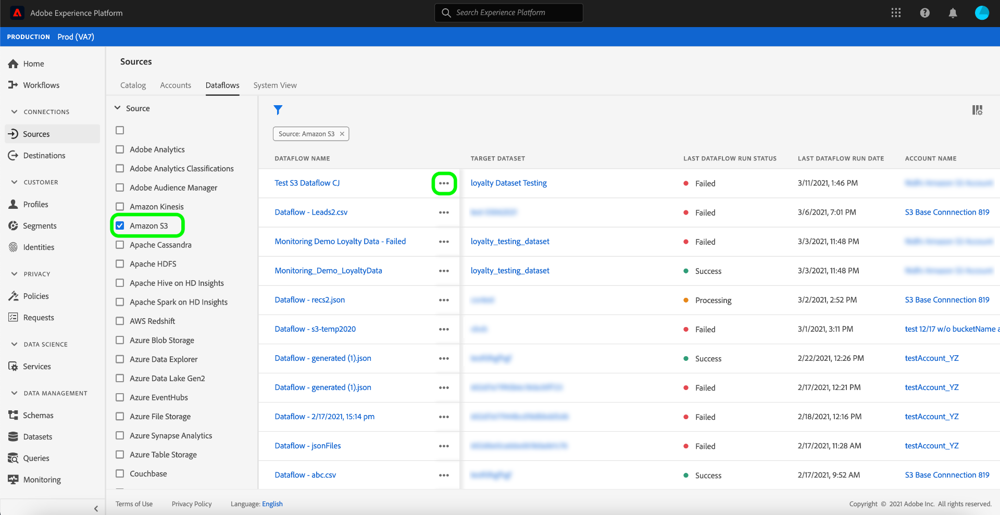

# Mettre à jour les flux de données dans l’interface utilisateur

Ce didacticiel décrit les étapes de mise à jour d&#39;un calendrier de flux de données, y compris sa fréquence d&#39;assimilation et son taux d&#39;intervalle, à l&#39;aide de l&#39;espace de travail [!UICONTROL Sources].

## Prise en main

Ce tutoriel nécessite une compréhension du fonctionnement des composants suivants d’Adobe Experience Platform :

- [Sources](../../home.md) : Experience Platform permet l’assimilation de données à partir de diverses sources tout en vous permettant de structurer, d’étiqueter et d’améliorer les données entrantes à l’aide des services de plate-forme.
- [Environnements de test](../../../sandboxes/home.md) : Experience Platform fournit des environnements de test virtuels qui divisent une instance de plateforme unique en environnements virtuels distincts pour favoriser le développement et l’évolution d’applications d’expérience numérique.

## Modifier le planning

Dans l’interface utilisateur de la plate-forme, sélectionnez **[!UICONTROL Sources]** dans le volet de navigation de gauche pour accéder à l’espace de travail [!UICONTROL Sources]. Sélectionnez **[!UICONTROL Flux de données]** dans l&#39;en-tête supérieur à la vue d&#39;une liste de flux de données existants.

La page [!UICONTROL Flux de données] contient une liste de tous les flux de données existants, y compris des informations sur leur état d&#39;exécution, leur date de dernière exécution et leur nom de compte.

Sélectionnez l’icône de filtre  en haut à gauche pour lancer le panneau de tri.

Le panneau de tri fournit une liste de toutes les sources disponibles. Vous pouvez sélectionner plusieurs sources dans la liste pour accéder à une sélection filtrée de flux de données appartenant à différentes sources.

Sélectionnez la source à utiliser pour afficher une liste de ses flux de données existants. Une fois que vous avez identifié le flux de données à replanifier, sélectionnez les points de suspension (`...`) en regard du nom du compte.

Un menu déroulant s&#39;affiche, vous offrant des options pour **[!UICONTROL Modifier la planification]**, **[!UICONTROL Désactiver le flux de données]**, **[!UICONTROL la Vue dans le contrôle]** et **[!UICONTROL Supprimer]**. Sélectionnez **[!UICONTROL Modifier la planification]** dans le menu.

La boîte de dialogue **[!UICONTROL Modifier la planification]** contient des options permettant de mettre à jour la fréquence d&#39;assimilation et le taux d&#39;intervalle de votre flux de données. Une fois que vous avez défini les valeurs de fréquence et d’intervalle mises à jour, sélectionnez **[!UICONTROL Enregistrer]**.

>[!NOTE]
>
>Vous ne pouvez pas replanifier un flux de données planifié pour une assimilation unique.

| Planification | Description |
| ---------- | ----------- |
| Fréquence | Fréquence à laquelle le flux de données va collecter les données. Les valeurs acceptables pour la modification de la planification des fréquences pour un flux de données existant sont les suivantes : `minute`, `hour`, `day` ou `week`. |
| Intervalle | L’intervalle désigne la période entre deux exécutions consécutives de flux. La valeur de l’intervalle doit être un entier non nul et doit être supérieure ou égale à `15`. |

Après quelques instants, une boîte de confirmation s’affiche en bas de l’écran pour confirmer une mise à jour réussie.

## Étapes suivantes

En suivant ce didacticiel, vous avez utilisé l&#39;espace de travail [!UICONTROL Sources] pour mettre à jour le calendrier d&#39;assimilation d&#39;un flux de données.

Pour savoir comment exécuter ces opérations par programmation à l&#39;aide de l&#39;API [!DNL Flow Service], reportez-vous au didacticiel de [mise à jour des flux de données à l&#39;aide de l&#39;API Flow Service](../../tutorials/api/update-dataflows.md).