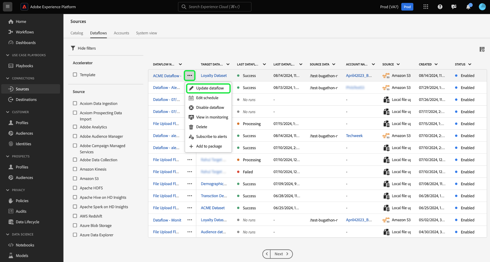

# Mettre à jour des flux de données dans l’interface utilisateur

Lisez ce tutoriel pour savoir comment mettre à jour un flux de données existant, y compris ses configurations de planification et de mappage, à l’aide de l’espace de travail des sources dans l’interface utilisateur de Adobe Experience Platform.

## Commencer

Ce tutoriel nécessite une compréhension du fonctionnement des composants suivants d’Adobe Experience Platform : 

* [Sources](../../home.md) : Experience Platform permet d’ingérer des données provenant de diverses sources tout en vous offrant la possibilité de structurer, d’étiqueter et d’améliorer les données entrantes à l’aide des services d’Experience Platform.
* [Sandbox](../../../sandboxes/home.md) : Experience Platform fournit des sandbox virtuels qui divisent une instance Experience Platform unique en environnements virtuels distincts pour favoriser le développement et l’évolution d’applications d’expérience digitale.

## Mettre à jour des flux de données {#update-dataflows}

>[!CONTEXTUALHELP]
>id="platform_sources_dataflows_daysRemaining"
>title="Expiration du jeu de données"
>abstract="Cette colonne indique le nombre de jours restants au jeu de données cible avant son expiration automatique. Un flux de données échoue si le jeu de données cible expire. Pour éviter l’échec d’un flux de données, assurez-vous qu’un jeu de données cible est défini pour expirer à la date correcte. Consultez la documentation pour savoir comment mettre à jour les dates d’expiration."

Dans l’interface utilisateur d’Experience Platform, sélectionnez **[!UICONTROL Sources]** dans le volet de navigation de gauche, puis sélectionnez **[!UICONTROL Dataflows]** dans l’en-tête supérieur.

>[!TIP]
>
>Vous pouvez trier et filtrer vos flux de données à l’aide des fonctionnalités de filtrage . Lisez le guide sur le [filtrage des objets sources dans l’interface utilisateur](./filter.md) pour plus d’informations.

La page [!UICONTROL Dataflows] affiche une liste de tous les flux de données existants de votre organisation. Recherchez le flux de données à mettre à jour, puis sélectionnez les points de suspension (`...`) en regard. Un menu déroulant s’affiche, affichant une liste d’options parmi lesquelles vous pouvez choisir, afin d’effectuer des configurations supplémentaires dans votre flux de données existant.

Pour mettre à jour votre flux de données, sélectionnez **[!UICONTROL Update dataflow]**.

Vous accédez au workflow des sources où vous pouvez procéder à la mise à jour d’aspects de votre flux de données, y compris ses détails dans l’étape [!UICONTROL Provide dataflow details].

### Mettre à jour le mappage {#update-mapping}

>[!NOTE]
>
>La fonction de modification du mappage n’est actuellement pas prise en charge pour les sources suivantes : Adobe Analytics, Adobe Audience Manager, API HTTP et [!DNL Marketo Engage].

Au cours de ce processus, vous pouvez également mettre à jour les jeux de mappages associés à votre flux de données.  L’interface de mappage affiche le mappage existant de votre flux de données et non un nouveau jeu de mappages recommandé. Les mises à jour de mappage ne sont appliquées qu’aux exécutions de flux de données planifiées à l’avenir. Les jeux de mappages d’un flux de données planifié pour une ingestion unique ne peuvent pas être mis à jour.

Utilisez l’interface de mappage pour modifier les jeux de mappages appliqués à votre flux de données. Pour obtenir des instructions complètes sur l’utilisation de l’interface de mappage, consultez le [guide de l’interface utilisateur de la préparation des données](../../../data-prep/ui/mapping.md) pour plus d’informations.

### Planning des mises à jour

Une fois que vous avez mis à jour les mappages de votre flux de données, vous pouvez mettre à jour votre planning d’ingestion pour ingérer votre flux de données avec ses nouvelles données de mappage. Vous pouvez uniquement mettre à jour le planning de l’ingestion des flux de données configurés pour l’ingestion selon un planning récurrent. Vous ne pouvez pas replanifier un flux de données configuré pour une ingestion unique.

Vous pouvez également mettre à jour le planning de l’ingestion de votre flux de données à l’aide de l’option de mise à jour en ligne fournie dans la page flux de données .

Sur la page flux de données , sélectionnez les points de suspension (`...`) à côté du nom du flux de données, puis sélectionnez **[!UICONTROL Edit schedule]** dans le menu déroulant qui s’affiche.

La boîte de dialogue **[!UICONTROL Edit schedule]** vous propose des options pour mettre à jour la fréquence d’ingestion et le taux d’intervalle de votre flux de données. Une fois que vous avez défini les valeurs de fréquence et d’intervalle mises à jour, sélectionnez **[!UICONTROL Save]**.

Lisez la section suivante pour plus d’informations sur le fonctionnement des plannings d’ingestion hebdomadaires.

#### Comprendre le planning d’ingestion hebdomadaire {#weekly}

Lorsque vous choisissez de définir votre flux de données pour qu’il s’exécute selon un planning hebdomadaire, le flux de données s’exécute en fonction de l’un des scénarios suivants :

* Si votre source de données a été créée mais qu’aucune donnée n’a encore été ingérée, le premier flux de données hebdomadaire s’exécute 7 jours après la date de création de la source. Cet intervalle de 7 jours commence toujours à partir de la création de la source, quelle que soit la date à laquelle vous avez configuré le planning. Après l’exécution initiale, le flux de données continue à s’exécuter toutes les semaines selon le planning configuré.
* Si les données de votre source ont déjà été ingérées et que vous planifiez une nouvelle ingestion hebdomadaire, le flux de données suivant s’exécutera 7 jours après la dernière ingestion réussie.

### Désactiver le flux de données

Vous pouvez désactiver votre flux de données à l’aide du même menu déroulant. Pour désactiver votre flux de données, sélectionnez **[!UICONTROL Disable dataflow]**.

Sélectionnez ensuite [!UICONTROL Disable] dans la fenêtre pop-up qui s’affiche.

Si vous réactivez ce flux de données par la suite, Experience Platform planifie automatiquement des exécutions de renvoi pour couvrir la période pendant laquelle le flux de données a été désactivé. Par exemple, si le flux de données a été configuré pour s’exécuter toutes les heures et a été désactivé pendant 48 heures, lors de la réactivation de ce flux de données, Experience Platform crée 48 exécutions de renvoi pour traiter les intervalles manqués.

## Étapes suivantes

Ce tutoriel vous a permis d’utiliser l’espace de travail [!UICONTROL Sources] pour mettre à jour le planning d’ingestion et les jeux de mappages de votre flux de données.

Pour savoir comment effectuer ces opérations par programmation à l’aide de l’API [!DNL Flow Service], reportez-vous au tutoriel sur la [mise à jour des flux de données à l’aide de l’API Flow Service](../../tutorials/api/update-dataflows.md).
