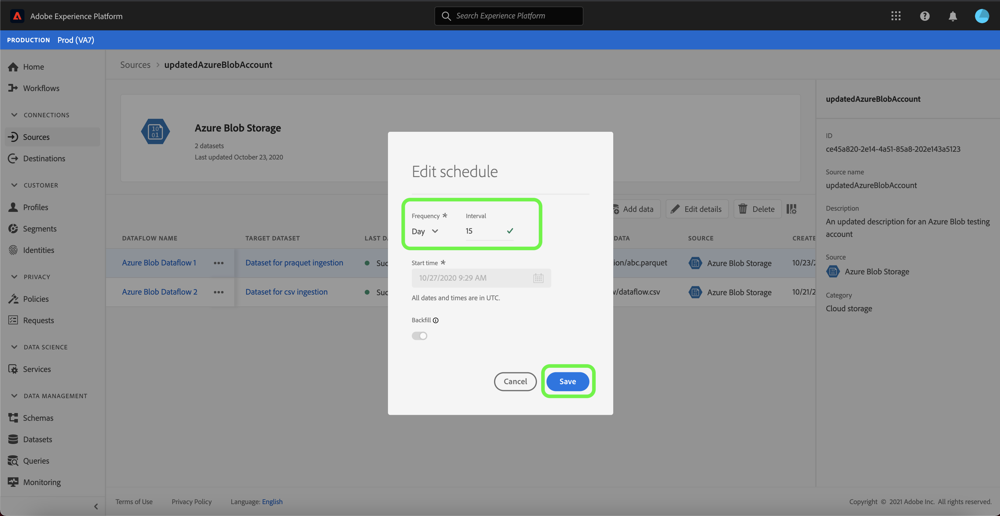

# Mettre à jour les détails du compte dans l’interface utilisateur

Dans certains cas, il peut être nécessaire de mettre à jour les détails d&#39;un compte de sources existantes. L&#39;espace de travail [!UICONTROL Sources] vous permet d&#39;ajouter, de modifier et de supprimer des détails d&#39;une connexion existante par lot ou en flux continu, y compris son nom, sa description et ses informations d&#39;identification.

L&#39;espace de travail [!UICONTROL Sources] vous permet également de modifier la planification des flux de données par lot, ce qui vous permet de mettre à jour sa fréquence d&#39;assimilation et son taux d&#39;intervalle.

Ce didacticiel décrit les étapes à suivre pour mettre à jour les détails et les informations d’identification d’un compte existant à partir de l’espace de travail [!UICONTROL Sources], ainsi que le calendrier d’assimilation d’un flux de données.

## Prise en main

Ce tutoriel nécessite une compréhension du fonctionnement des composants suivants d’Adobe Experience Platform :

- [Sources](../../home.md) : Experience Platform permet l’assimilation de données à partir de diverses sources tout en vous permettant de structurer, d’étiqueter et d’améliorer les données entrantes à l’aide des services de plate-forme.
- [Environnements de test](../../../sandboxes/home.md) : Experience Platform fournit des environnements de test virtuels qui divisent une instance de plateforme unique en environnements virtuels distincts pour favoriser le développement et l’évolution d’applications d’expérience numérique.

## Mettre à jour les comptes

Connectez-vous à l&#39;[interface utilisateur Experience Platform](https://platform.adobe.com), puis sélectionnez **[!UICONTROL Sources]** dans le volet de navigation de gauche pour accéder à l&#39;espace de travail [!UICONTROL Sources]. Sélectionnez **[!UICONTROL Comptes]** de l&#39;en-tête supérieur à la vue des comptes existants.

La page **[!UICONTROL Comptes]** s&#39;affiche. Cette page contient une liste de comptes consultables, y compris des informations sur leur source, leur nom d&#39;utilisateur, le nombre de flux de données et la date de création.

Sélectionnez l’icône de filtre  en haut à gauche pour lancer le panneau de tri.

Le panneau de tri fournit une liste de toutes les sources. Vous pouvez sélectionner plusieurs sources dans la liste pour accéder à une sélection filtrée de comptes associés à différentes sources.

Sélectionnez la source avec laquelle vous souhaitez travailler pour voir une liste de ses comptes existants. Une fois que vous avez identifié le compte à mettre à jour, sélectionnez les points de suspension (`...`) en regard du nom du compte.

Un menu déroulant s’affiche, vous offrant des options pour **[!UICONTROL Ajouter les données]**, **[!UICONTROL Modifier les détails]** et **[!UICONTROL Supprimer]**. Sélectionnez **[!UICONTROL Modifier les détails]** dans le menu pour mettre à jour votre compte.

La boîte de dialogue **[!UICONTROL Modifier les détails du compte]** vous permet de mettre à jour le nom, la description et les informations d&#39;identification d&#39;authentification d&#39;un compte. Une fois que vous avez mis à jour les informations de votre choix, sélectionnez **[!UICONTROL Enregistrer]**.

Après quelques instants, une boîte de confirmation s’affiche en bas de l’écran pour confirmer une mise à jour réussie.

## Modifier le planning

Vous pouvez modifier la planification d&#39;assimilation d&#39;un flux de données à partir de la page **[!UICONTROL Comptes]**. Dans la liste des comptes, sélectionnez le compte qui contient le flux de données à replanifier.

La page Flux de données s&#39;affiche. Cette page contient une liste de flux de données existants associés au compte que vous avez sélectionné. Sélectionnez les ellipses (`...`) en regard du flux de données à replanifier.

Un menu déroulant s’affiche, vous offrant des options pour **[!UICONTROL Modifier la planification]**, **[!UICONTROL Activer le flux de données]**, **[!UICONTROL la Vue dans la surveillance]** et **[!UICONTROL Supprimer]**. Sélectionnez **[!UICONTROL Modifier la planification]** dans le menu.

La boîte de dialogue **[!UICONTROL Modifier la planification]** contient des options permettant de mettre à jour la fréquence d&#39;assimilation et le taux d&#39;intervalle de votre flux de données. Une fois que vous avez défini les valeurs de fréquence et d’intervalle mises à jour, sélectionnez **[!UICONTROL Enregistrer]**.

| Planification | Description |
| ---------- | ----------- |
| Fréquence | Fréquence à laquelle le flux de données va collecter les données. Les valeurs acceptables pour la modification de la planification des fréquences pour un flux de données existant sont les suivantes : `minute`, `hour`, `day` ou `week`. |
| Intervalle | L’intervalle désigne la période entre deux exécutions consécutives de flux. La valeur de l’intervalle doit être un entier non nul et doit être supérieure ou égale à `15`. |

Après quelques instants, une boîte de confirmation s’affiche en bas de l’écran pour confirmer une mise à jour réussie.

## Étapes suivantes

En suivant ce didacticiel, vous avez utilisé l&#39;espace de travail [!UICONTROL Sources] pour mettre à jour les informations de compte et modifier votre calendrier de flux de données.

Pour savoir comment exécuter ces opérations par programmation à l&#39;aide de l&#39;API [!DNL Flow Service], consultez le didacticiel sur la [mise à jour des informations de connexion à l&#39;aide de l&#39;API Flow Service](../../tutorials/api/update.md).