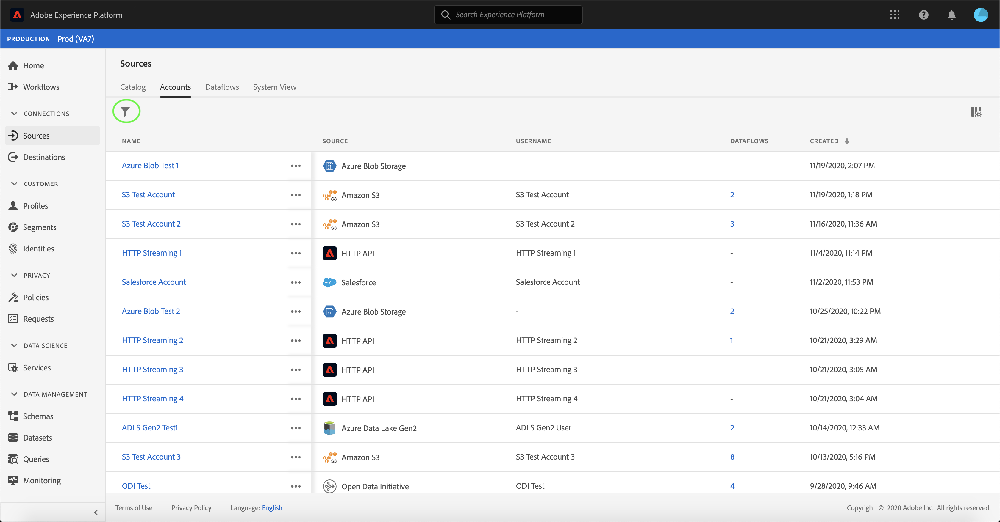
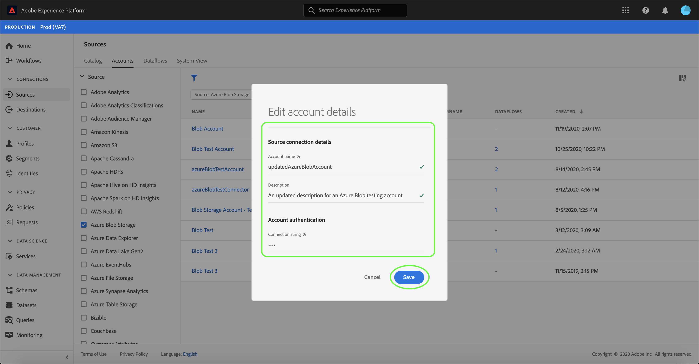

# Mise à jour des détails du compte dans l’interface utilisateur

Dans certains cas, il peut être nécessaire de mettre à jour les détails d’un compte de sources existant. L’espace de travail [!UICONTROL Sources] vous permet d’ajouter, de modifier et de supprimer les détails d’un lot ou d’une connexion en continu existante, y compris son nom, sa description et ses informations d’identification.

Ce tutoriel décrit les étapes à suivre pour mettre à jour les détails et les informations d’identification d’un compte existant à partir de l’espace de travail [!UICONTROL Sources] .

## Prise en main

Ce tutoriel nécessite une compréhension du fonctionnement des composants suivants d’Adobe Experience Platform :

- [Sources](../../home.md) : Experience Platform permet d’ingérer des données provenant de diverses sources tout en vous offrant la possibilité de structurer, d’étiqueter et d’améliorer les données entrantes à l’aide des services de Platform.
- [Sandbox](../../../sandboxes/home.md) : Experience Platform fournit des sandbox virtuels qui divisent une instance de plateforme unique en environnements virtuels distincts pour favoriser le développement et l’évolution d’applications d’expérience digitale.

## Mettre à jour des comptes

Connectez-vous à l’[interface utilisateur Experience Platform](https://platform.adobe.com) et sélectionnez ensuite **[!UICONTROL Sources]** dans le volet de navigation de gauche pour accéder à l’espace de travail [!UICONTROL Sources]. Sélectionnez **[!UICONTROL Comptes]** dans l’en-tête supérieur pour afficher les comptes existants.

La page **[!UICONTROL Comptes]** s’affiche. Cette page contient une liste des comptes consultables, y compris des informations sur leur source, leur nom d’utilisateur, le nombre de flux de données et la date de création.

Sélectionnez l’icône de filtre  en haut à gauche pour lancer le panneau de tri.

Le panneau de tri fournit une liste de toutes les sources. Vous pouvez sélectionner plusieurs sources dans la liste pour accéder à une sélection filtrée de comptes associés à différentes sources.

Sélectionnez la source que vous souhaitez utiliser pour afficher la liste de ses comptes existants. Une fois que vous avez identifié le compte à mettre à jour, sélectionnez les points de suspension (`...`) en regard du nom du compte.

Un menu déroulant s’affiche, vous fournissant des options pour **[!UICONTROL Ajouter des données]**, **[!UICONTROL Modifier les détails]** et **[!UICONTROL Supprimer]**. Sélectionnez **[!UICONTROL Modifier les détails]** dans le menu pour mettre à jour votre compte.

La boîte de dialogue **[!UICONTROL Modifier les détails du compte]** vous permet de mettre à jour le nom, la description et les informations d’authentification d’un compte. Une fois que vous avez mis à jour les informations souhaitées, sélectionnez **[!UICONTROL Enregistrer]**.

Au bout de quelques instants, une boîte de confirmation s’affiche en bas de l’écran pour confirmer une mise à jour réussie.

## Étapes suivantes

En suivant ce tutoriel, vous avez utilisé l’espace de travail [!UICONTROL Sources] pour mettre à jour les informations d’un compte source existant.

Pour savoir comment effectuer ces opérations par programmation à l’aide de l’API [!DNL Flow Service], reportez-vous au tutoriel sur la [mise à jour des informations de connexion à l’aide de l’API Flow Service](../../tutorials/api/update.md).
