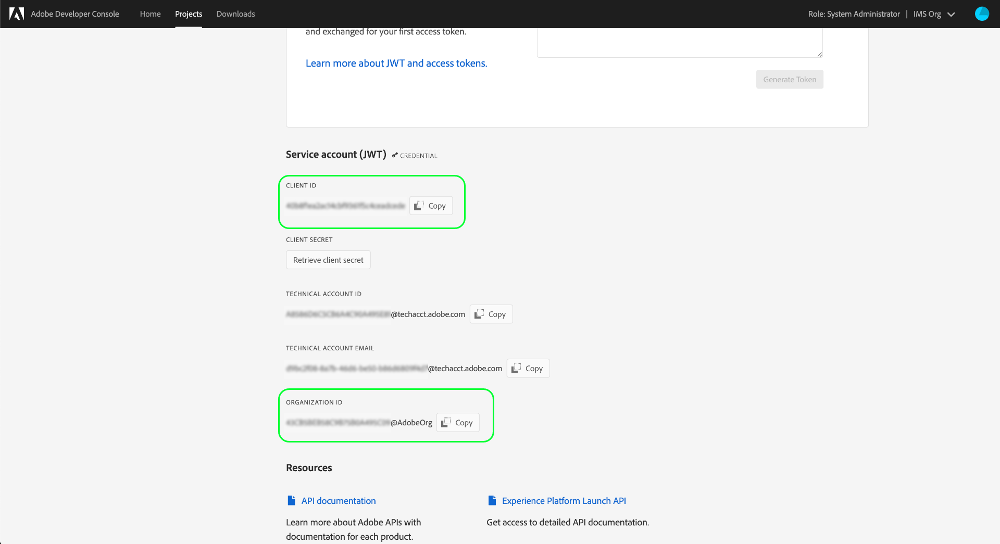

# Prise en main de l’API Reactor

Pour utiliser l’[API Reactor](https://www.adobe.io/experience-platform-apis/references/reactor/), chaque demande doit inclure les en-têtes d’authentification suivants :

* `Authorization: Bearer {ACCESS_TOKEN}`
* `x-api-key: {API_KEY}`
* `x-gw-ims-org-id: {ORG_ID}`

Ce guide explique comment utiliser Adobe Developer Console pour rassembler les valeurs de chacun de ces en-têtes afin que vous puissiez commencer à lancer des appels vers l’API Reactor.

## Obtenir l’accès développeur à Adobe Experience Platform

Avant de pouvoir générer des valeurs d’authentification pour l’API Reactor, vous devez disposer d’un accès développeur à Experience Platform. Pour obtenir l’accès développeur, suivez les étapes mentionnées au début du [tutoriel sur l’authentification dans Experience Platform](https://experienceleague.adobe.com/docs/experience-platform/landing/platform-apis/api-authentication.html?lang=fr). Une fois que vous avez terminé l’étape &quot;Obtenir un accès utilisateur&quot;, revenez à ce tutoriel pour générer les informations d’identification spécifiques à l’API Reactor.

## Génération des informations d’identification d’accès

À l’aide d’Adobe Developer Console, vous devez générer les trois informations d’identification d’accès suivantes :

* `{ORG_ID}`
* `{API_KEY}`
* `{ACCESS_TOKEN}`

ID de votre organisation (`{ORG_ID}`) et clé API (`{API_KEY}`) peut être réutilisé dans les appels API futurs après leur génération initiale. Cependant, votre jeton d’accès (`{ACCESS_TOKEN}`) est temporaire et doit être régénéré toutes les 24 heures.

Les étapes de génération de ces valeurs sont décrites en détail ci-dessous.

### Configuration ponctuelle

Accédez à [Adobe Developer Console](https://www.adobe.com/go/devs_console_ui) et connectez-vous avec votre Adobe ID. Suivez ensuite les étapes décrites dans le tutoriel sur la [création d’un projet vide](https://developer.adobe.com/developer-console/docs/guides/projects/projects-empty/) dans la documentation de Developer Console.

Une fois que vous avez créé un projet, sélectionnez **Ajouter une API** dans l’écran **Aperçu du projet**.


L’écran **Ajouter une API** s’affiche. Sélectionnez **Experience Platform Reactor API** dans la liste des API disponibles avant de sélectionner **Next (Suivant)**.


Sur l’écran suivant, vous êtes invité à créer des informations d’identification JSON Web Token (JWT) pour générer une nouvelle paire de clés ou charger votre propre clé publique. Pour ce tutoriel, sélectionnez l’option **Générer une paire de clés**, puis sélectionnez **Générer la paire de clés** dans le coin inférieur droit.


L’écran suivant confirme la génération réussie de la paire de clés, et un dossier compressé contenant un certificat public et une clé privée est automatiquement téléchargé sur votre ordinateur. Cette clé privée est nécessaire lors d’une étape ultérieure pour générer un jeton d’accès.

Sélectionnez **Suivant** pour continuer.


L’écran suivant vous invite à sélectionner un ou plusieurs profils de produit à associer à l’intégration de l’API.

>[!NOTE]
>
>Les profils de produit sont gérés par votre organisation via Adobe Admin Console et contiennent des jeux d’autorisations spécifiques pour les fonctionnalités granulaires. Les profils de produit et leurs autorisations ne peuvent être gérés que par des utilisateurs disposant de droits d’administrateur au sein de votre entreprise. Si vous ne savez pas quels profils de produit sélectionner pour l’API, contactez votre administrateur.

Sélectionnez les profils de produit souhaités dans la liste, puis sélectionnez **Enregistrer l’API configurée** pour terminer l’enregistrement de l’API.


Dès que l’API a été ajoutée au projet, le projet s’ouvre à nouveau sur la page de l’API Reactor Experience Platform. À partir de là, faites défiler l’écran jusqu’à la section **Compte de service (JWT)**, qui fournit les informations d’identification d’accès suivantes, requises dans tous les appels à l’API Reactor :

* **ID CLIENT** : l’identifiant du client est l’identifiant requis `{API_KEY}` qui doit être fourni dans l’en-tête `x-api-key`.
* **ID D’ORGANISATION** : l’ID d’organisation est la valeur `{ORG_ID}` qui doit être utilisée dans l’en-tête `x-gw-ims-org-id`.



### Authentification pour chaque session

Maintenant que vous disposez de vos valeurs `{API_KEY}` et `{ORG_ID}`, l’étape finale génère une valeur `{ACCESS_TOKEN}`.

>[!NOTE]
>
>Ces jetons expirent après 24 heures. Si vous utilisez cette intégration pour une application, il est préférable d’obtenir votre jeton du porteur par programmation à partir de votre application.

Selon votre cas d’utilisation, vous disposez de deux options pour générer vos jetons d’accès :

* [Génération manuelle de jetons](#manual)
* [Génération de jetons par programmation](#program)

#### Génération manuelle des jetons d’accès {#manual}

Ouvrez la clé privée que vous avez téléchargée précédemment dans un éditeur de texte ou un navigateur et copiez son contenu. Ensuite, revenez à Developer Console et collez la clé privée dans la section **Générer un jeton d’accès** de la page de l’API Reactor pour votre projet avant de sélectionner **Générer un jeton**.


Un nouveau jeton d’accès est généré et un bouton permettant de copier le jeton dans le presse-papiers est fourni. Cette valeur est utilisée pour l’en-tête `Authorization` requis et doit être fournie au format `Bearer {ACCESS_TOKEN}`.


#### Générer des jetons d’accès par programmation {#program}

Si vous utilisez votre intégration pour une application, vous pouvez générer des jetons d’accès par programmation par le biais des demandes d’API. Pour ce faire, vous devez obtenir les valeurs suivantes :

* Identifiant du client (`{API_KEY}`)
* Client secret (`{SECRET}`)
* Un jeton Web JSON (`{JWT}`)

Votre identifiant de client et votre secret peuvent être obtenus à partir de la page principale de votre projet, comme indiqué à l’[étape précédente](#one-time-setup).


Pour obtenir vos informations d’identification JWT, accédez à **Compte de service (JWT)** dans le volet de navigation de gauche, puis sélectionnez l’onglet **Générer JWT**. Sur cette page, sous **Générer le JWT personnalisé**, collez le contenu de votre clé privée dans la zone de texte fournie, puis sélectionnez **Générer le jeton**.


Le jeton JWT généré apparaît ci-dessous une fois le traitement terminé, ainsi qu’un exemple de commande cURL que vous pouvez utiliser pour tester le jeton si vous le souhaitez. Utilisez le bouton **Copier** pour copier le jeton dans le presse-papiers.


Une fois que vous avez rassemblé vos informations d’identification, vous pouvez intégrer l’appel API ci-dessous dans votre application afin de générer des jetons d’accès par programmation.

**Requête**

La requête doit envoyer une payload `multipart/form-data`, fournissant vos informations d’authentification comme illustré ci-dessous :

```shell
curl -X POST \
  https://ims-na1.adobelogin.com/ims/exchange/jwt/ \
  -H 'Content-Type: multipart/form-data' \
  -F 'client_id={API_KEY}' \
  -F 'client_secret={SECRET}' \
  -F 'jwt_token={JWT}'
```

**Réponse**

Une réponse réussie renvoie un nouveau jeton d’accès, ainsi que le nombre de secondes restant jusqu’à son expiration.

```json
{
  "token_type": "bearer",
  "access_token": "{ACCESS_TOKEN}",
  "expires_in": 86399999
}
```

| Propriété | Description |
| :-- | :-- |
| `access_token` | La valeur de jeton d’accès nouvellement générée. Cette valeur est utilisée pour l’en-tête `Authorization` requis et doit être fournie au format `Bearer {ACCESS_TOKEN}`. |
| `expires_in` | Durée restante jusqu’à l’expiration du jeton, en millisecondes. Une fois qu’un jeton expire, un nouveau jeton doit être généré. |

{style="table-layout:auto"}

## Étapes suivantes

En suivant les étapes de ce tutoriel, vous devriez disposer de valeurs valides pour `{ORG_ID}`, `{API_KEY}` et `{ACCESS_TOKEN}`. Vous pouvez désormais tester ces valeurs en les utilisant dans une simple requête cURL à l’API Reactor.

Commencez par lancer un appel API pour [répertorier toutes les entreprises](./endpoints/companies.md#list).

>[!NOTE]
>
>Il se peut que votre organisation ne contienne aucune société. Dans ce cas, la réponse sera un statut HTTP 404 (Not Found). Tant que vous n’obtenez pas d’erreur 403 (Forbidden), vos informations d’identification d’accès sont valides et fonctionnent.

Une fois que vous avez confirmé que vos informations d’identification d’accès fonctionnent, continuez à explorer le reste de la documentation de référence de l’API pour découvrir ses nombreuses fonctionnalités.

## Ressources supplémentaires

Bibliothèques et SDK JWT : [https://jwt.io/](https://jwt.io/)

Développement de l’API Postman : [https://www.postman.com/](https://www.postman.com/)
