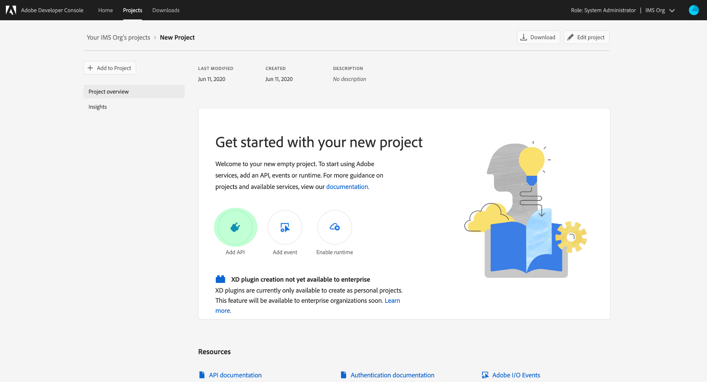
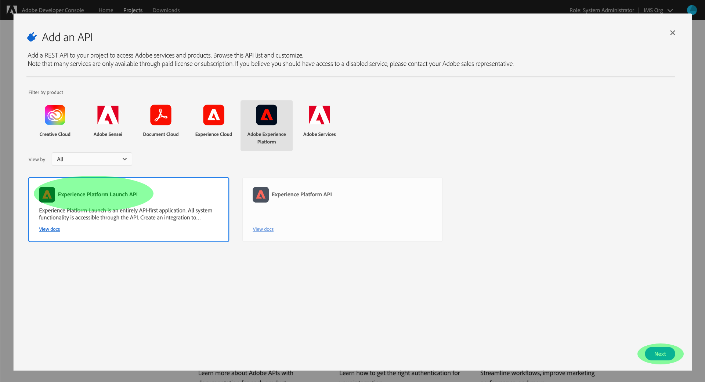
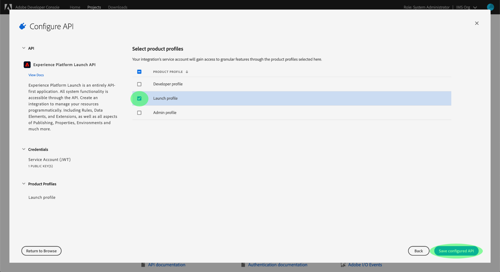

# S’authentifier et accéder à l’API Reactor

Pour utiliser l’[API Reactor](https://developer.adobe.com/experience-platform-apis/references/reactor/) afin de créer et de gérer des extensions de balises, chaque requête doit inclure les en-têtes d’authentification suivants :

* `Authorization: Bearer {ACCESS_TOKEN}`
* `x-api-key: {API_KEY}`
* `x-gw-ims-org-id: {ORG_ID}`
* `Accept: application/vnd.api+json;revision=1`
* `Content-Type: application/vnd.api+json`

Ce guide explique comment utiliser Adobe Developer Console pour rassembler les valeurs de chacun de ces en-têtes afin que vous puissiez commencer à lancer des appels vers l’API Reactor.

## Obtenir l’accès développeur à Adobe Experience Platform {#gain-developer-access}

Avant de pouvoir générer des valeurs d’authentification pour l’API Reactor, vous devez disposer d’un accès développeur à Experience Platform. Pour obtenir l’accès développeur, suivez les étapes mentionnées au début du [tutoriel sur l’authentification dans Experience Platform](/help/landing/api-authentication.md). Une fois que vous avez terminé l’étape [Obtenir l’accès utilisateur](/help/landing/api-authentication.md#gain-user-access), revenez à ce tutoriel pour générer les informations d’identification spécifiques à l’API Reactor.

## Génération des informations d’identification d’accès {#generate-access-credentials}

À l’aide d’Adobe Developer Console, vous devez générer les trois informations d’identification d’accès suivantes :

* `{ORG_ID}`
* `{API_KEY}`
* `{ACCESS_TOKEN}`

L’identifiant de votre organisation (`{ORG_ID}`) et la clé d’API (`{API_KEY}`) peuvent être réutilisés dans les appels d’API futurs après leur génération initiale. Cependant, votre jeton d’accès (`{ACCESS_TOKEN}`) est temporaire et doit être régénéré toutes les 24 heures.

Les étapes de génération de ces valeurs sont décrites en détail ci-dessous.

### Configuration ponctuelle {#one-time-setup}

Accédez à [Adobe Developer Console](https://www.adobe.com/go/devs_console_ui) et connectez-vous avec votre Adobe ID. Suivez ensuite les étapes décrites dans le tutoriel sur la [création d’un projet vide](https://developer.adobe.com/developer-console/docs/guides/projects/projects-empty/) dans la documentation de Developer Console.

Une fois que vous avez créé un projet, sélectionnez **Ajouter une API** dans l’écran **Aperçu du projet**.

L’écran **Ajouter une API** s’affiche. Sélectionnez **API Experience Platform Launch** dans la liste des API disponibles avant de sélectionner **Suivant**.

Sélectionnez ensuite le type d’authentification pour générer les jetons d’accès et accéder à l’API Experience Platform.

>[!IMPORTANT]
>
>Sélectionnez la méthode **[!UICONTROL OAuth Server-to-Server]**, car il s’agira de la seule méthode prise en charge à l’avenir. La méthode **[!UICONTROL Service Account (JWT)]** est obsolète. Bien que les intégrations utilisant la méthode d’authentification JWT continueront à fonctionner jusqu’au 1er janvier 2025, Adobe vous recommande vivement de migrer les intégrations existantes vers la nouvelle méthode OAuth de serveur à serveur avant cette date. Pour plus d’informations, reportez-vous à la section [!BADGE Obsolète]{type=negative} [Générer un jeton JSON Web Token (JWT)](/help/landing/api-authentication.md#jwt) dans le tutoriel sur l’authentification des API Experience Platform.

Sélectionnez **Suivant** pour continuer.

L’écran suivant vous invite à sélectionner un ou plusieurs profils de produit à associer à l’intégration de l’API.

>[!NOTE]
>
>Les profils de produit sont gérés par votre organisation via Adobe Admin Console et contiennent des jeux d’autorisations spécifiques pour les fonctionnalités granulaires. Les profils de produit et leurs autorisations ne peuvent être gérés que par des utilisateurs disposant de droits d’administrateur au sein de votre entreprise. Si vous ne savez pas quels profils de produit sélectionner pour l’API, contactez votre administrateur.

Sélectionnez les profils de produit souhaités dans la liste, puis sélectionnez **Enregistrer l’API configurée** pour terminer l’enregistrement de l’API.

### Collecter les informations d’identification {#gather-credentials}

Une fois que l’API a été ajoutée au projet, la page **[!UICONTROL Experience Platform API]** du projet affiche les informations d’identification suivantes, requises dans tous les appels aux API Experience Platform :

* `{API_KEY}` ([!UICONTROL Client ID])
* `{ORG_ID}` ([!UICONTROL Organization ID])

### Générer un jeton d’accès {#generate-access-token}

L’étape suivante consiste à générer des informations d’identification `{ACCESS_TOKEN}` à utiliser dans les appels API d’Experience Platform. Contrairement aux valeurs de `{API_KEY}` et `{ORG_ID}`, un nouveau jeton doit être généré toutes les 24 heures pour continuer à utiliser les API d’Experience Platform.

>[!TIP]
>
>Ces jetons expirent après 24 heures. Si vous utilisez cette intégration pour une application, il est préférable d’obtenir votre jeton du porteur par programmation à partir de votre application.

Selon votre cas d’utilisation, vous disposez de deux options pour générer vos jetons d’accès :

* [Génération manuelle de jetons](#manual)
* [Automatiser la génération des jetons](#auto-token)

#### Génération manuelle des jetons d’accès {#manual}

Pour générer manuellement une nouvelle `{ACCESS_TOKEN}`, accédez à **[!UICONTROL Credentials]** > **[!UICONTROL OAuth Server-to-Server]** et sélectionnez **[!UICONTROL Generate access token]**, comme illustré ci-dessous.

Un nouveau jeton d’accès est généré et un bouton permettant de copier le jeton dans le presse-papiers est fourni. Cette valeur est utilisée pour l’en-tête d’autorisation obligatoire et doit être fournie au format `Bearer {ACCESS_TOKEN}`.

#### Automatiser la génération des jetons {#auto-token}

Vous pouvez également utiliser un environnement et une collection Postman pour générer des jetons d’accès. Pour plus d’informations, consultez la section sur l’[utilisation de Postman pour authentifier et tester les appels API](/help/landing/api-authentication.md#use-postman) dans le guide d’authentification des API Experience Platform.

## Tester les informations d’identification d’API {#test-api-credentials}

En suivant les étapes de ce tutoriel, vous devriez disposer de valeurs valides pour `{ORG_ID}`, `{API_KEY}` et `{ACCESS_TOKEN}`. Vous pouvez désormais tester ces valeurs en les utilisant dans une simple requête cURL à l’API Reactor.

Commencez par lancer un appel API pour [répertorier toutes les entreprises](./endpoints/companies.md#list).

>[!NOTE]
>
>Il se peut que votre organisation ne contienne aucune société. Dans ce cas, la réponse sera un statut HTTP 404 (Not Found). Tant que vous n’obtenez pas d’erreur 403 (Forbidden), vos informations d’identification d’accès sont valides et fonctionnent.

Une fois que vous avez confirmé que vos informations d’identification d’accès fonctionnent, continuez à explorer le reste de la documentation de référence de l’API pour découvrir ses nombreuses fonctionnalités.

## Lecture d&#39;exemples d&#39;appels API {#read-sample-api-calls}

Chaque guide de point d’entrée fournit des exemples d’appels API pour démontrer comment formater vos requêtes. Il s’agit notamment de chemins d’accès, d’en-têtes requis et de payloads de requêtes correctement formatés. L’exemple JSON renvoyé dans les réponses de l’API est également fourni. Pour en savoir plus sur les conventions utilisées dans la documentation pour les exemples d’appels API, consultez la section relative à la [lecture d’exemples d’appels API](../../landing/api-guide.md#sample-api) dans le guide de prise en main des API d’Experience Platform.

## Étapes suivantes {#next-steps}

Maintenant que vous savez quels en-têtes utiliser, vous êtes prêt(e) à commencer à lancer des appels à l’API Reactor. Sélectionnez l’un des guides des points d’entrée pour commencer :

* [Documentation de référence sur l’API Reactor](https://developer.adobe.com/experience-platform-apis/references/reactor/)
* [Présentation du guide de l’API Reactor](/help/tags/api/overview.md)
