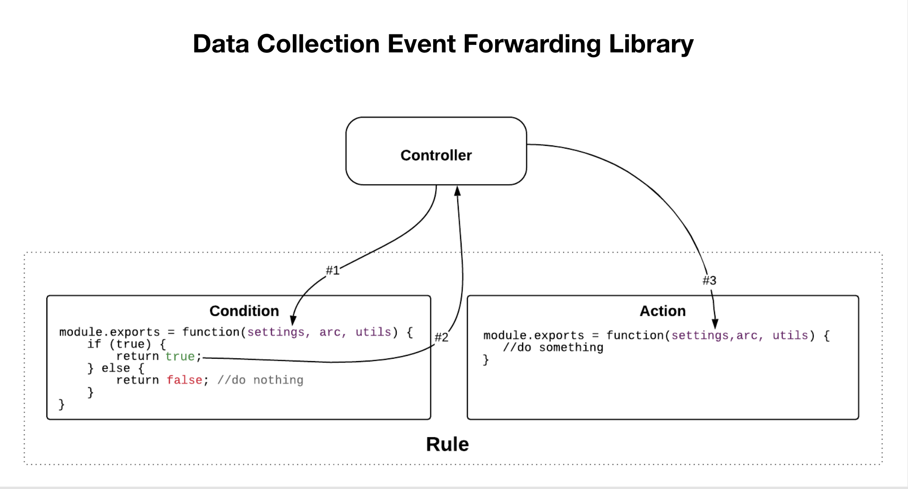

# Flux d’extension Edge

Dans les extensions Edge, chaque condition, action et type d’élément de donnée comporte à la fois une vue qui permet aux utilisateurs de modifier les paramètres et un module de bibliothèque leur permettant d’agir sur ces paramètres définis par l’utilisateur.

Comme le montre le diagramme de haut niveau suivant, la vue du type d’action de l’extension sera affichée dans un iframe dans l’application intégrée à Adobe Experience Platform. La vue est ensuite utilisée pour modifier les paramètres qui sont ensuite enregistrés dans Experience Platform. Lorsque la bibliothèque d’exécution des balises est créée, le module Bibliothèque de type d’action de l’extension ainsi que les paramètres définis par l’utilisateur sont inclus dans la bibliothèque d’exécution. Cette bibliothèque est ensuite déployée sur le nœud Edge. Les paramètres définis par l’utilisateur d’Experience Platform sont injectés dans le module Bibliothèque au moment de l’exécution.

Dans le diagramme suivant, vous pouvez voir le lien entre les événements, les conditions et les actions dans le flux de traitement des règles.

Le flux de traitement des règles contient les phases suivantes :

1. La méthode `settings` et la méthode `trigger` sont fournies au module de bibliothèque d’événements au démarrage.
1. Lorsque le module de bibliothèque d’événements détermine que l’événement s’est produit, le module de bibliothèque d’événements appelle `trigger`.
1. Experience Platform transmet les `settings` dans les modules de bibliothèque de type de condition de la règle dans lesquels les conditions sont évaluées.
1. Chaque type de condition effectue un renvoi indiquant si une condition est évaluée comme vraie.
1. Si toutes les conditions sont remplies, les actions de la règle sont exécutées.
