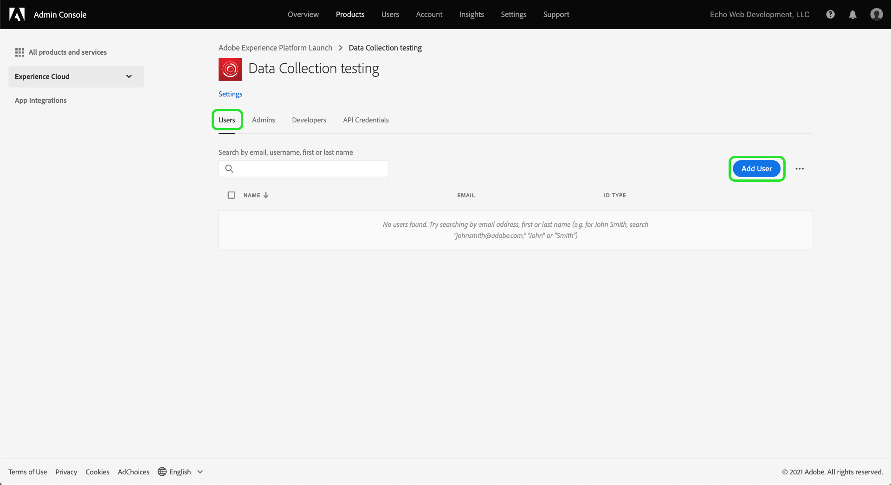
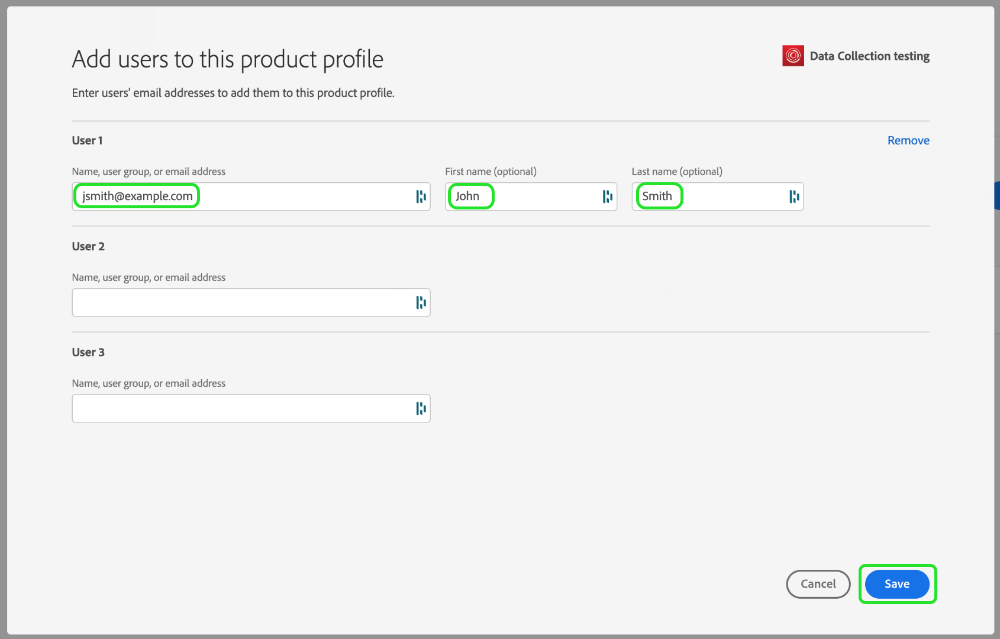

# Octroyer un accès utilisateur

>[!NOTE]
>
>Adobe Experience Platform Launch est désormais une suite de technologies destinées à la collecte de données dans Adobe Experience Platform. Plusieurs modifications terminologiques ont par conséquent été apportées à la documentation du produit. Reportez-vous au [document](../../term-updates.md) suivant pour consulter une référence consolidée des modifications terminologiques.

Avant de commencer à utiliser extension_package, vous devez configurer des comptes d’utilisateur et des autorisations pour les membres de votre équipe. Vous pouvez le faire avec [Adobe Admin Console](https://adminconsole.adobe.com/).

Ce document décrit les étapes pour accorder l’accès aux balises dans Adobe Experience Platform par l’intermédiaire d’Admin Console.

## Conditions préalables

Ce guide suppose que vous êtes un administrateur d’organisation tel qu’établi par Admin Console. Si vous avez besoin d’informations supplémentaires sur Admin Console et l’attribution de rôles, reportez-vous aux ressources suivantes :

* [Guide pour les administrateurs](https://helpx.adobe.com/fr/enterprise/administering/user-guide.html?topic=/enterprise/administering/morehelp/introduction.ug.js) : informations complètes sur Admin Console
* [Rôles d’administration des grands comptes](https://helpx.adobe.com/fr/enterprise/using/admin-roles.html) : en savoir plus sur les différents types de rôles d’administration. Pour le guide ci-dessous, nous supposerons que vous êtes un administrateur d’organisation.

## Choix de votre organisation

Votre administrateur d’organisation Adobe Experience Cloud doit se connecter à [Admin Console](https://adminconsole.adobe.com/). Le premier écran montre la vue d’ensemble.

Certains d’entre vous peuvent avoir accès à plusieurs organisations (Org). Pour ajouter la fonctionnalité de balises à l’organisation appropriée, sélectionnez le nom de l’organisation qui s’affiche dans le coin supérieur droit de l’écran. Sélectionnez ensuite l’organisation dans laquelle vous souhaitez utiliser les balises dans la liste déroulante.

## Création d’un profil de produit

Un profil de produit est un groupe. Les droits individuels sont attribués aux profils de produits et tous les utilisateurs du profil hériteront de ces droits.

Cliquez sur le lien **[!UICONTROL Produits]** en haut de l’écran, puis sur **[!UICONTROL Experience Cloud]** à gauche. Si lʼinterface utilisateur de la collecte de données nʼest pas répertoriée, les clients doivent contacter leur équipe de compte, et les partenaires doivent envoyer un e-mail à <ExchangeTechEC@adobe.com>.

La capture d’écran ci-dessus montre un exemple de profil, cependant, il se peut que vous n’en ayez pas encore. Pour en créer un, sélectionnez **[!UICONTROL Nouveau profil]**. À l’écran **Créer un profil**, ajoutez simplement un **Nom de profil** (test Collecte de données, par exemple) et une **Description** puis sélectionnez **[!UICONTROL Enregistrer]** :

Le profil de produit a maintenant été ajouté à l’organisation. Ajoutez ensuite des utilisateurs au profil de produit.

## Affecter des utilisateurs au profil de produits

Veuillez noter que le profil de produit affiche zéro pour les **UTILISATEURS AUTORISÉS** et les **ADMINISTRATEURS**. Cliquez sur le nom du profil de produit que vous avez créé (test Collecte de données dans notre exemple).

Sélectionnez l’onglet **[!UICONTROL Utilisateurs]**. Vous pouvez y rechercher des utilisateurs Adobe ID existants par adresse e-mail ou en ajouter de nouveaux en tant qu’utilisateurs de ce profil de produit. Sélectionnez **[!UICONTROL Ajouter un lien utilisateur]**.

Saisissez un nom, un groupe d’utilisateurs ou une adresse e-mail dans le champ de texte approprié. Dans la mesure du possible, il est recommandé d’inclure un prénom et un nom. Sélectionnez **[!UICONTROL Enregistrer]** pour ajouter l’utilisateur.

Lorsque vous aurez tous les utilisateurs dont vous avez besoin dans ce profil de produits, nous leur ajouterons des autorisations. Sélectionnez l&#39;onglet **[!UICONTROL Autorisations]**. Sur l’écran des autorisations, vous verrez **[!UICONTROL Propriétés]**, **[!UICONTROL Droits d’entreprise]** et **[!UICONTROL Droits de propriété]**. Sélectionnez **[!UICONTROL Modifier]**.

Pour créer des extensions, votre équipe doit disposer au minimum des autorisations suivantes :

* « Gérer les propriétés » à partir du groupe d’entreprise.
* « Gérer les extensions », « Gérer les environnements » et « Développer » à partir du groupe de propriétés.

Vous pouvez créer d’autres profils de produits avec des droits plus limités si vous le souhaitez, mais pour l’instant, il vous suffit de sélectionner **[!UICONTROL + Ajouter tout]** pour **Droits d’entreprise** et **Droits de propriété**. Veillez à sélectionner **[!UICONTROL Enregistrer]** sur chacun d’eux.

Jusqu’à présent, nous avons choisi l’organisation appropriée, créé un profil de produits, ajouté des utilisateurs au profil de produits et attribué des autorisations.

Cette opération termine la configuration requise dans Admin Console. Vous et les membres de votre équipe qui ont été configurés en tant qu’utilisateurs pouvez désormais vous connecter à l&#39;[interface utilisateur de la collecte de données](https://launch.adobe.com/).

## Confirmer l’approvisionnement

Une fois que votre société a accès aux balises et que vos utilisateurs sont configurés comme décrit ci-dessus, vous devez pouvoir accéder à l’environnement de production depuis l’[interface utilisateur de la collecte de données](https://launch.adobe.com/). Si vous avez reçu les privilèges d’accès pour les balises et que vous avez suivi les étapes Admin Console ci-dessus, mais que vous ne pouvez toujours pas vous connecter à l’interface utilisateur de la collecte de données, contactez les représentants de l’assistance Adobe.
