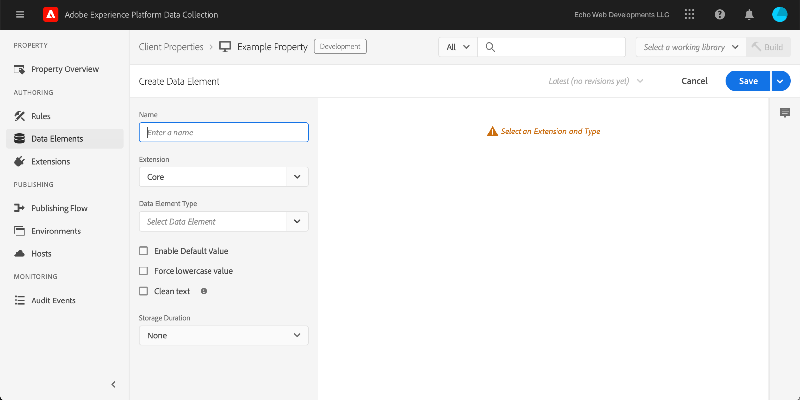
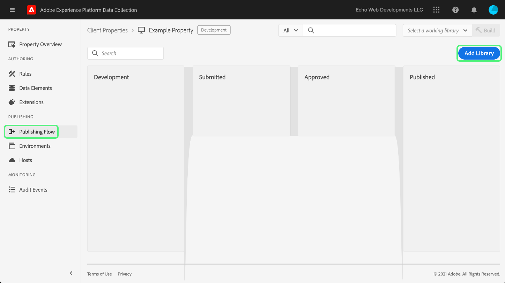
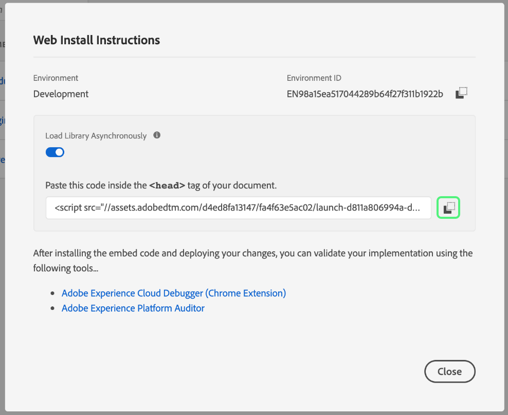

# Téléchargement et implémentation de tests de bout en bout

>[!NOTE]
>
>Adobe Experience Platform Launch est désormais une suite de technologies destinées à la collecte de données dans Adobe Experience Platform. Plusieurs modifications terminologiques ont par conséquent été apportées à la documentation du produit. Reportez-vous au [document](../../term-updates.md) suivant pour consulter une référence consolidée des modifications terminologiques.

Pour tester les extensions de balises dans Adobe Experience Platform, utilisez lʼAPI des balises et/ou les outils de ligne de commande pour télécharger vos packages dʼextension. Ensuite, utilisez l’interface utilisateur d’Experience Platform ou l’interface utilisateur de collecte de données pour installer votre package d’extension sur une propriété et exercer ses fonctionnalités dans une bibliothèque de balises et une version.

Ce document explique comment mettre en œuvre des tests de bout en bout pour votre extension.

>[!NOTE]
>
>Ce guide suppose que vous utilisez macOS avec Node.js et npm installés et disponibles.

## Valider votre extension {#validate}

Une fois que votre équipe est satisfaite des performances de votre extension et des résultats qu’elle voit dans l’outil [Sandbox](https://www.npmjs.com/package/@adobe/reactor-sandbox#running-the-sandbox), vous devez vous préparer à télécharger votre package d’extension vers les balises.

Avant de télécharger, vérifiez que les champs ou paramètres requis sont présents. Par exemple, il est recommandé de consulter votre [manifeste d’extension](../manifest.md), votre [configuration d’extension](../configuration.md), vos [vues](../web/views.md) et vos [modules de bibliothèque](../web/format.md) (au minimum).

Le fichier de logo en est un exemple précis : ajoutez une ligne `"iconPath": "example.svg",` à votre fichier `extension.json` et incluez ce fichier image de logo dans votre projet. Il s’agit du chemin d’accès relatif à l’icône qui s’affichera pour l’extension. Il ne doit pas commencer par une barre oblique. Il doit référencer un fichier SVG avec une extension `.svg`. Le SVG doit apparaître normalement lorsque son rendu est carré et peut être mis à l’échelle par l’interface utilisateur. Pour plus d’informations, consultez l’article [Comment mettre à l’échelle le SVG](https://css-tricks.com/scale-svg/).

>[!NOTE]
>
>Pour les extensions publiques, incluez un élément dans votre `extension.json` avec un lien vers votre liste Exchange. Votre [manifeste d’extension](../manifest.md) doit inclure une entrée de ce type : `"exchangeUrl":"https://www.adobeexchange.com/experiencecloud.details.12345.html"` pointant vers l’URL de votre liste Exchange.

## Créer une intégration Adobe I/O {#integration}

Pour utiliser l’API ou les outils de ligne de commande, vous avez besoin d’un compte technique avec Adobe I/O. Vous devez créer ce compte technique dans la console I/O, puis utiliser l’outil de téléchargement pour télécharger le package d’extension.

Pour plus d’informations sur la création d’un compte technique à utiliser avec les balises dans Adobe Experience Platform, reportez-vous au guide [Prise en main de l’API Reactor](../../api/getting-started.md).

>[!IMPORTANT]
>
>Pour créer une intégration dans Adobe I/O, vous devez être un administrateur d’organisation Experience Cloud ou un développeur d’organisation Experience Cloud.

Si vous ne pouvez pas créer d’intégration, il est probable que vous ne disposiez pas des autorisations appropriées. Un administrateur de l’organisation doit alors terminer les étapes pour vous ou vous devez être affecté en tant que développeur.

## Téléchargez votre package d’extension {#upload}

Maintenant que vous disposez des informations d’identification, vous êtes prêt à tester votre package d’extension de bout en bout.

Lorsque vous téléchargez votre package d’extension pour la première fois, il passe à l’état de `development`. Cela signifie qu’il n’est visible que par votre propre organisation, et uniquement avec une propriété marquée pour le développement de l’extension.

Utilisez la ligne de commande pour exécuter la commande suivante dans le répertoire contenant votre package .zip.

```bash
npx @adobe/reactor-uploader
```

`npx` vous permet de télécharger et d’exécuter un package npm sans véritablement l’installer sur votre machine. Il s’agit de la manière la plus simple d’exécuter le téléchargeur.

>[!NOTE]
> Par défaut, le téléchargeur attend des informations d’identification Adobe I/O pour un flux Oauth serveur à serveur. Informations d’identification de `jwt-auth` héritées
> peut être utilisé en exécutant `npx @adobe/reactor-uploader@v5.2.0` jusqu’à l’obsolescence le 1er janvier 2025. Paramètres requis
> pour exécuter la version `jwt-auth`, rendez-vous [ici](https://github.com/adobe/reactor-uploader/tree/cdc27f4f0e9fa3136b8cd5ca8c7271428b842452).

Le téléchargeur ne vous demande de saisir que quelques informations. Les `clientId` et `clientSecret` peuvent être récupérés à partir de la console Adobe I/O. Accédez à la [page Intégrations](https://console.adobe.io/integrations) dans la console I/O. Sélectionnez lʼorganisation adéquate dans la liste déroulante puis recherchez lʼintégration appropriée et cliquez sur **[!UICONTROL Afficher]**.

- Quel est votre `clientId` ? Copiez et collez-le à partir de la console I/O.
- Quel est votre `clientSecret` ? Copiez et collez-le à partir de la console I/O.
- Si vous appelez le téléchargeur depuis le répertoire contenant votre package .zip, vous pouvez simplement le sélectionner dans la liste au lieu de saisir le chemin d’accès.

Votre package d’extension sera ensuite téléchargé et le téléchargeur vous donnera l’ID du package d’extension.

>[!NOTE]
>
>Pendant le téléchargement ou l’application de correctifs, les packages d’extension sont placés en attente tandis que le système extrait le module et le déploie de manière asynchrone. Pendant ce processus, vous pouvez interroger l’ID de `extension_package` pour connaître son statut à l’aide de l’API et dans l’interface utilisateur. Une carte d’extension apparaît dans le catalogue portant la mention En attente.

>[!NOTE]
>
>Si vous prévoyez d’exécuter fréquemment le téléchargeur, intégrer toutes ces informations à chaque fois peut s’avérer fastidieux. Vous pouvez également les transmettre sous forme d’arguments à partir de la ligne de commande. Pour plus d’informations, consultez la section [Arguments de ligne de commande](https://www.npmjs.com/package/@adobe/reactor-uploader#command-line-arguments) des documents npm.

Si vous souhaitez gérer le chargement direct de votre extension à l’aide de l’API, consultez les exemples d’appels pour [création](../../api/endpoints/extension-packages.md/#create) ou [mise à jour](../../api/endpoints/extension-packages.md#update) d’un package d’extension dans la documentation API pour plus d’informations.

## Créer une propriété de développement {#property}

Une fois que vous êtes connecté à l’interface utilisateur et que vous avez sélectionné **[!UICONTROL Balises]** dans le volet de navigation de gauche, l’écran [!UICONTROL Propriétés] s’affiche. Une propriété est un conteneur pour les balises que vous souhaitez déployer et elle peut être utilisée sur un ou plusieurs sites.


La première fois que vous vous connectez, aucune propriété n’apparaît à l’écran. Cliquez sur **Nouvelle propriété** pour en créer une. Entrez un nom et une URL. Utilisez l’URL de votre site de test ou de la page sur laquelle vous comptez tester votre extension. Ce champ de domaine peut être utilisé par certaines extensions ou par une condition à l’aide de l’extension Core.

>[!NOTE]
>
>`localhost` ne fonctionnera pas comme valeur d’URL. Recourez plutôt à une valeur fictive quelconque à des fins de test si vous utilisez une URL `localhost`. Par exemple, exemple.com.

Pour utiliser cette propriété pour les tests de développement d’extension, vous devez développer les **OPTIONS AVANCÉES** et vérifier que la case **Configurer pour le développement d’extension** est cochée.


Sélectionnez **Enregistrer** en bas pour enregistrer votre nouvelle propriété.

L’écran Propriétés s’affiche. Cliquez sur le nom de la propriété que vous venez de créer. L’écran Présentation des propriétés s’affiche. Il fournit des liens vers chaque zone du système avec les liens de navigation globaux de la colonne de gauche.

## Installer votre extension {#install-extension}

Pour installer votre extension dans cette propriété, cliquez sur le lien **Extensions** dans les liens de navigation principaux de la colonne de gauche. L’extension **Core** s’affiche sur l’écran **Installé**. L’extension Core contient toutes les fonctionnalités de gestion des balises dans la collecte de données.


Pour ajouter votre extension, sélectionnez l’onglet **Catalogue**.


Celui-ci affiche les icônes de carte pour chaque extension disponible. Si votre extension ne s’affiche pas dans le catalogue, assurez-vous d’avoir complété les étapes ci-dessus dans les sections Configuration de la console d’administration Adobe et Création de votre package d’extension. Votre package d’extension peut également apparaître comme En attente si Experience Platform n’a pas terminé le traitement initial.

Si vous avez suivi les étapes précédentes et que vous ne voyez toujours pas de package d’extension En attente ou en Échec dans le catalogue, vous devez vérifier le statut de votre package d’extension directement à l’aide de l’API. Pour plus d’informations sur la manière d’effectuer l’appel API approprié, consultez la section [Récupérer un package d’extension](../../api/endpoints/extension-packages.md#lookup) dans la documentation de l’API.

Une fois le traitement de votre package d’extension terminé, sélectionnez **Installer** au bas de la carte.


L’écran de configuration s’ouvre (à condition que l’extension en ait une). Ajoutez les informations nécessaires pour configurer votre extension et cliquez sur **Enregistrer** en bas de la page. L’exemple d’écran de configuration illustré ici utilise l’extension Facebook, laquelle nécessite un Pixel ID.


Vous devriez maintenant voir l’écran des extensions **Installées** avec l’extension Core et votre extension.


## Créer des ressources pour tester votre extension {#resources}

Les extensions offrent de nouvelles fonctionnalités aux utilisateurs dʼAdobe Experience Platform. Celles-ci sont généralement affichées dans les éléments de données ou le créateur de règles.

### Éléments de données

L’objectif des éléments de données de balise est d’aider les utilisateurs à conserver les valeurs. Chaque élément de données est un mappage ou un pointeur vers les données sources. Un seul élément de données est une variable dont la valeur peut être mappée à des chaînes de requête, des URL, des valeurs de cookie, des variables JavaScript, etc. Sélectionnez **Éléments de données** dans la barre de navigation de gauche, puis **Créer un élément de données**.


Si nécessaire, les extensions peuvent définir des types d’éléments de données pour que votre extension fonctionne, ou simplement pour faciliter la tâche des utilisateurs. Lorsqu’une extension fournit des types d’éléments de données, ils s’affichent dans une liste déroulante pour les utilisateurs sur l’écran **Créer un élément de données** :



Lorsqu’un utilisateur sélectionne votre extension dans la liste déroulante **Extension**, la liste déroulante **Type d’élément de données** est renseignée avec tous les types d’élément de données fournis par votre extension. L’utilisateur peut ensuite mapper chaque élément de données à sa valeur source. Les éléments de données peuvent ensuite être utilisés lors de la création de règles dans l’Événement de modification des éléments de données ou l’Événement de code personnalisé pour déclencher l’exécution d’une règle. Un élément de données peut également être utilisé dans la condition de l’élément de données ou dans d’autres conditions, exceptions ou actions d’une règle.

Une fois l’élément de données créé (le mappage est configuré), les utilisateurs peuvent référencer les données sources simplement en référençant l’élément de données. Si la source de la valeur venait à changer (reconceptions de site, etc.), les utilisateurs n’auraient qu’à mettre à jour le mappage une seule fois dans l’interface utilisateur et tous les éléments de données recevraient automatiquement la nouvelle valeur source.

### Règles

Sélectionnez le lien **Règles** dans la barre de navigation de gauche, puis cliquez sur **Créer une règle**.


Tout d’abord, saisissez un nom de règle explicite. L’écran **Créer une règle** est configuré comme une instruction `if-then`.


Si un événement se produit, que les conditions sont remplies et qu’il n’y a aucune exception, l’action est déclenchée. Ce même flux existe dans les extensions où vous pouvez créer ou exploiter des événements, des conditions, des exceptions, des éléments de données ou des actions.

À l’aide de l’exemple d’extension Facebook, ajoutez un événement pour chaque chargement de page sur le site de test.


Le **Type d’événement** `Window Loaded` garantit le déclenchement de cette règle à chaque chargement de page sur le site de test. Sélectionnez **Conserver les modifications**. Pour cet exemple, ignorez les **Conditions** car la règle doit être déclenchée pour n’importe quelle page du site de test.

Sous **ACTIONS**, cliquez sur **Ajouter**. L’écran **Configuration de l’action** s’affiche. Vous devez ensuite choisir l’extension à laquelle la règle doit être appliquée et l’action à effectuer lorsque la règle est déclenchée. Sélectionnez **Facebook Pixel** dans la liste déroulante **Extension**, puis sélectionnez **Envoyer la page vue** dans la liste déroulante **Type d’action**. Sélectionnez **Conserver les modifications**, puis cliquez sur **Enregistrer** sur l’écran **Modifier la règle** suivant.


Lors du test de votre extension, sélectionnez les événements, conditions, etc. pertinents. fourni par votre extension dans n’importe quel nombre de règles.

## Publier vos modifications {#publish}

Dans la navigation principale, cliquez sur **Publication**, puis sur le lien **Ajouter une nouvelle bibliothèque** :



Une bibliothèque est un ensemble d’instructions qui définit la façon dont les extensions, les éléments de données et les règles interagissent les uns avec les autres, ainsi qu’avec votre site web. Les bibliothèques sont compilées dans des versions. Une bibliothèque peut contenir autant de modifications que l’utilisateur souhaite faire ou tester.

Sur l’écran **Créer une bibliothèque**, ajoutez un nom dans le champ de texte **Nom**. Les balises fournissent un environnement de développement par défaut appelé **Développement**. Sélectionnez **Développement** dans la liste déroulante **Environnement**. Pour plus de simplicité, ajoutez toutes les ressources disponibles. Sélectionnez **Ajouter toutes les ressources modifiées**, puis cliquez sur **Enregistrer**.

>[!NOTE]
>
>Quand vous ajoutez une ressource à une bibliothèque, un instantané de cette ressource est pris à ce moment précis et est ajouté à la bibliothèque. Lorsque vous apportez des modifications à vos ressources ultérieurement (par exemple, suite à des correctifs que vous devez apporter), vous devrez également mettre à jour la bibliothèque pour inclure les dernières modifications apportées à vos ressources. Le bouton **Ajouter toutes les ressources modifiées** est également utile à cet effet.


Maintenant que toutes les modifications ont été incluses dans la bibliothèque nouvellement créée (nommée **dev** dans l’exemple fourni), sélectionnez **Enregistrer et créer dans le développement**.


Une fois le processus de création terminé, un indicateur de **réussite** vert s’affiche en regard du nom de la bibliothèque.


La bibliothèque de balises est maintenant publiée et disponible à l’utilisation. La page de test doit utiliser la bibliothèque nouvellement créée afin de tester le comportement de la page pour l’utilisateur final dans un navigateur.

## Installation de balises sur un site de test {#install-data-collection-tags}

Les instructions d’installation sont disponibles dans l’onglet Environnements. Cette page affiche tous les environnements disponibles et vous permet également d’en créer d’autres. La bibliothèque ayant été publiée dans l’environnement de développement, sélectionnez l’icône en forme de boîte dans la colonne **INSTALLER** de la ligne **Développement**.


La boîte de dialogue **Instructions dʼinstallation web** de lʼenvironnement de développement sʼaffiche. Sélectionnez l’icône Copier pour copier l’intégralité de la balise `<script>`.



Terminez l’installation en plaçant cette balise `<script>` unique dans la section `<head>` de votre modèle de site ou document. Rendez-vous ensuite sur le site de test pour examiner le comportement de votre bibliothèque de balises publiée.

## Test {#test}

Vous trouverez ci-dessous une liste des commandes de console utiles à la validation de votre extension sur votre site ou page de test.

- `_satellite.setDebug(true);` active le mode de débogage et génère des instructions de connexion utiles dans la console.
- L’objet `_satellite._container` contient des informations utiles sur la bibliothèque déployée, y compris des détails sur la version, les éléments de données, les règles et les extensions inclus.

L’objectif de ce test est de vérifier la fonctionnalité de la bibliothèque déployée et de s’assurer que le package d’extension se comporte comme prévu une fois compilé dans une bibliothèque.

Lorsque vous découvrez des modifications à apporter à votre package d’extension, le processus d’itération est similaire au processus de développement.

1. Apportez des modifications au code de votre projet.
1. Validez les modifications à l’aide de l’outil Sandbox.
1. Utilisez l’outil Packager pour créer un package .zip.
1. Utilisez l’outil de téléchargement pour télécharger votre nouveau package .zip. Ce processus suit les mêmes instructions qu’auparavant concernant le téléchargement initial. Cependant, vous remarquerez que, puisqu’il existe déjà un package d’extension de ce nom en mode de développement, ce nouveau package remplace l’ancienne version au lieu d’en créer une autre.

   >[!NOTE]
   >
   >Les arguments peuvent être transmis sur la ligne de commande afin de gagner du temps et éviter ainsi la saisie répétée des informations d’identification. Pour plus d’informations à ce sujet, consultez la [documentation de reactor-uploader](https://www.npmjs.com/package/@adobe/reactor-uploader).
1. L’étape d’installation peut être ignorée lors de la mise à jour d’un package existant.
1. Modifier des ressources - si la configuration de l’un de vos composants d’extension a été modifiée, vous devez mettre à jour ces ressources dans l’interface utilisateur.
1. Ajoutez vos dernières modifications à votre bibliothèque et effectuez une nouvelle génération.
1. Effectuez une autre série de tests.
