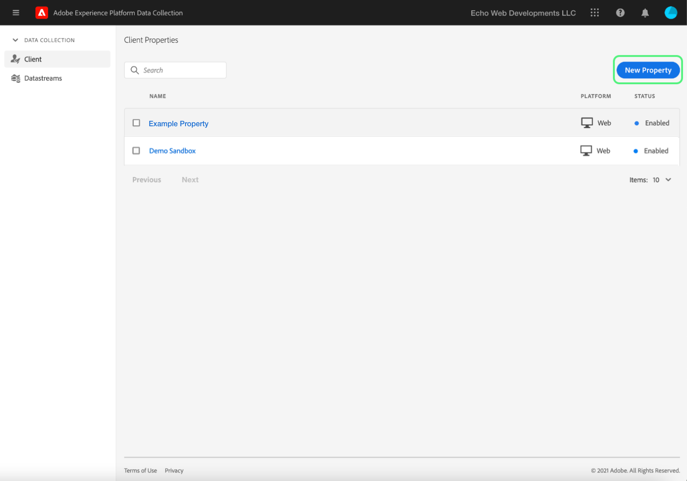
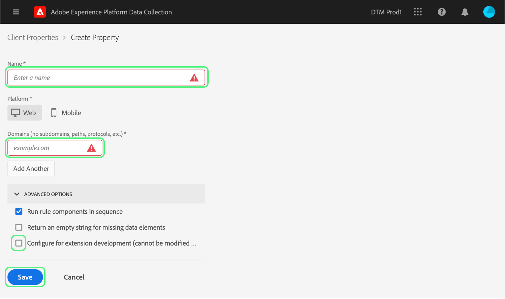

# Téléchargement et implémentation de tests de bout en bout

>[!NOTE]
>
>Adobe Experience Platform Launch est désormais une suite de technologies destinées à la collecte de données dans Adobe Experience Platform. Plusieurs modifications terminologiques ont par conséquent été apportées à la documentation du produit. Reportez-vous au [document](../../term-updates.md) suivant pour consulter une référence consolidée des modifications terminologiques.

Pour tester les extensions de balises dans Adobe Experience Platform, utilisez lʼAPI des balises et/ou les outils de ligne de commande pour télécharger vos packages dʼextension. Utilisez ensuite lʼinterface utilisateur de collecte de données pour installer votre package dʼextension sur une propriété et exercer ses fonctionnalités dans une bibliothèque de balises et une version.

Ce document explique comment mettre en œuvre des tests de bout en bout pour votre extension.

>[!NOTE]
>
>Ce guide suppose que vous utilisez MacOS avec Node.js et npm installés et disponibles.

## Valider votre extension {#validate}

Une fois que votre équipe est satisfaite des performances de votre extension et des résultats quʼelle voit dans lʼoutil [Sandbox](https://www.npmjs.com/package/@adobe/reactor-sandbox#running-the-sandbox), vous devez vous préparer à télécharger votre package dʼextension vers les balises.

Avant de télécharger, vérifiez que les champs ou paramètres requis sont présents. Par exemple, il est recommandé de consulter votre [manifeste dʼextension](../manifest.md), votre [configuration dʼextension](../configuration.md), vos [vues](../web/views.md) et vos [modules de bibliothèque](../web/format.md) (au minimum).

Le fichier de logo en est un exemple précis : ajoutez une ligne `"iconPath": "example.svg",` à votre fichier `extension.json` et incluez ce fichier image de logo dans votre projet. Il sʼagit du chemin relatif à lʼicône qui sʼaffichera pour lʼextension. Il ne doit pas commencer par une barre oblique. Il doit référencer un fichier SVG avec une extension `.svg`. Le SVG doit apparaître normalement lorsque son rendu est carré et peut être mis à lʼéchelle par lʼinterface utilisateur. Pour plus dʼinformations, consultez lʼarticle [Comment mettre à lʼéchelle le SVG](https://css-tricks.com/scale-svg/).

>[!NOTE]
>
>Pour les extensions publiques, incluez un élément dans votre `extension.json` avec un lien vers votre liste Exchange. Votre [manifeste d’extension](../manifest.md) doit inclure une entrée de ce type : `"exchangeUrl":"https://www.adobeexchange.com/experiencecloud.details.12345.html"` pointant vers l’URL de votre liste Exchange.

## Créer une intégration Adobe I/O {#integration}

Pour utiliser lʼAPI ou les outils de ligne de commande, vous devez disposer dʼun compte technique auprès dʼAdobe I/O. Vous devez créer le compte technique dans la console I/O, puis utiliser lʼoutil téléchargeur pour télécharger le package dʼextension.

Pour plus dʼinformations sur la création dʼun compte technique à utiliser avec les balises dans Adobe Experience Platform, reportez-vous au guide [Jetons dʼaccès](https://developer.adobelaunch.com/api/guides/access_tokens/).

>[!IMPORTANT]
>
>Pour créer une intégration dans Adobe I/O, vous devez être un administrateur d’organisation Experience Cloud ou un développeur d’organisation Experience Cloud.

Si vous ne pouvez pas créer dʼintégration, il est probable que vous ne disposiez pas des autorisations appropriées. Dans ce cas, un administrateur de lʼorganisation devra procéder à ces étapes à votre place ou vous affecter en tant que développeur.

## Téléchargez votre package d’extension {#upload}

À présent que vous disposez des informations dʼidentification, vous êtes prêt à tester votre package dʼextension de bout en bout.

Lorsque vous téléchargez votre package d’extension pour la première fois, il passe à l’état de `development`. Cela signifie que celui-ci nʼest visible que par votre propre organisation et uniquement avec une propriété qui a été marquée pour le développement dʼextensions.

Utilisez la ligne de commande pour exécuter la commande suivante dans le répertoire contenant votre package .zip.

```bash
npx @adobe/reactor-uploader
```

`npx` vous permet de télécharger et d’exécuter un package npm sans véritablement l’installer sur votre machine. Il s’agit de la manière la plus simple d’exécuter le téléchargeur.

Le téléchargeur vous demande de saisir plusieurs informations. LʼID de compte technique, la clé dʼAPI et dʼautres informations peuvent être récupérés à partir de la console Adobe I/O. Accédez à la [page Intégrations](https://console.adobe.io/integrations) dans la console I/O. Sélectionnez lʼorganisation appropriée dans la liste déroulante, recherchez lʼintégration appropriée et sélectionnez **[!UICONTROL Vue]**.

- Quel est le chemin d’accès à votre clé privée ? /path/to/private.key. Il s’agit de l’emplacement où vous avez enregistré votre clé privée à l’étape 2 ci-dessus.
- Quel est votre ID d’organisation ? Copiez et collez ceci à partir de la page dʼaperçu de la console I/O que vous avez laissée ouverte auparavant.
- Quel est votre ID de compte technique ? Copiez et collez ceci à partir de la console I/O.
- Quelle est votre clé d’API ? Copiez et collez ceci à partir de la console I/O.
- Quʼest-ce que le secret client ? Copiez et collez ceci à partir de la console I/O.
- Quel est le chemin d’accès au package d’extension que vous souhaitez télécharger ? /path/to/extension_package.zip. Si vous appelez le téléchargeur depuis le répertoire contenant votre package .zip, vous pouvez simplement le sélectionner dans la liste au lieu de saisir le chemin d’accès.

Votre package d’extension sera ensuite téléchargé et le téléchargeur vous donnera l’ID du package d’extension.

>[!NOTE]
>
>Pendant le téléchargement ou l’application de correctifs, les modules d’extension sont placés en attente tandis que le système extrait le module et le déploie de manière asynchrone. Pendant ce processus, vous pouvez interroger lʼID du `extension_package` pour connaître son état à lʼaide de lʼAPI et de lʼinterface utilisateur de collecte de données. Une carte dʼextension sʼaffiche alors dans le catalogue avec le statut En attente.

>[!NOTE]
>
>Si vous prévoyez dʼexécuter fréquemment le téléchargeur, intégrer toutes ces informations à chaque fois peut sʼavérer fastidieux. Vous pouvez également les transmettre en tant quʼarguments à partir de la ligne de commande. Pour plus d’informations, consultez la section [Arguments de ligne de commande](https://www.npmjs.com/package/@adobe/reactor-uploader#command-line-arguments) des documents npm.

## Créer une propriété de développement {#property}

Une fois que vous êtes connecté à lʼinterface utilisateur de la collecte de données, lʼécran Propriétés sʼaffiche. Une propriété est un conteneur pour les balises que vous souhaitez déployer et elle peut être utilisée sur un ou plusieurs sites.



Lors de votre première connexion, aucune propriété ne sʼaffiche à lʼécran. Cliquez sur **Nouvelle propriété** pour en créer une. Entrez un nom et une URL. Utilisez lʼURL de votre site de test ou de la page sur laquelle vous allez tester votre extension. Ce champ de domaine peut être utilisé par certaines extensions ou par une condition à lʼaide de lʼextension Core.

>[!NOTE]
>
>`localhost` ne fonctionnera pas en tant que valeur URL. Utilisez plutôt une valeur fictive pour les tests si vous utilisez une URL `localhost`. Par exemple, exemple.com.

Pour utiliser cette propriété pour les tests de développement dʼextension, vous devez développer les **OPTIONS AVANCÉES** et vérifier que la case **Configurer pour le développement dʼextension** est cochée.



Sélectionnez **Enregistrer** en bas pour enregistrer votre nouvelle propriété.

Lʼécran Propriétés sʼaffiche. Cliquez sur le nom de la propriété que vous venez de créer. Lʼécran Aperçu de la propriété sʼaffiche. Il fournit des liens vers chaque zone du système au moyen des liens de navigation globale dans la colonne de gauche.

## Installer votre extension {#install-extension}

Pour installer votre extension dans cette propriété, cliquez sur le lien **Extensions** dans les liens de navigation principaux de la colonne de gauche. Lʼextension **Core** sʼaffiche sur lʼécran **Installé**. Lʼextension Core contient toutes les fonctionnalités de gestion des balises dans la collecte de données.


Pour ajouter votre extension, sélectionnez lʼonglet **Catalogue**.


Celui-ci affiche les icônes de carte pour chaque extension disponible. Si votre extension nʼest pas affichée dans le catalogue, assurez-vous dʼavoir suivi les étapes ci-dessus dans les sections Configuration de la console dʼadministration Adobe et Création de votre package dʼextension. Votre package dʼextension peut également sʼafficher comme En attente si Platform nʼa pas terminé le traitement initial.

Si vous avez suivi les étapes précédentes et que vous ne voyez toujours pas de package dʼextension avec le statut En attente ou Échec dans le catalogue, vous devez vérifier le statut de votre package dʼextension directement à lʼaide de lʼAPI. Pour plus dʼinformations sur la manière dʼeffectuer lʼappel API approprié, consultez la section [Récupération dʼun package dʼextension](https://developer.adobelaunch.com/api/reference/1.0/extension_packages/fetch/) dans la documentation de lʼAPI.

Une fois le traitement de votre package dʼextension terminé, sélectionnez **Installer** au bas de la carte.


Lʼécran de configuration sʼaffiche (si lʼextension en possède un). Ajoutez les informations nécessaires pour configurer votre extension et cliquez sur **Enregistrer** en bas de la page. Lʼexemple dʼécran de configuration illustré ici utilise lʼextension Facebook qui nécessite un ID Pixel.


Vous devriez maintenant voir l’écran des extensions **Installées** avec l’extension Core et votre extension.


## Créer des ressources pour tester votre extension {#resources}

Les extensions offrent de nouvelles fonctionnalités aux utilisateurs dʼAdobe Experience Platform. Elles sont généralement affichées dans les éléments de données ou le créateur de règles.

### Éléments de données

Lʼobjectif des éléments de données de balises consiste à aider les utilisateurs à conserver les valeurs. Chaque élément de données est un mappage ou un pointeur vers les données sources. Un seul élément de données est une variable dont la valeur peut être mappée à des chaînes de requête, des URL, des valeurs de cookie, des variables JavaScript, etc. Sélectionnez **Éléments de données** dans la barre de navigation de gauche et **Créer un élément de données**.


Si nécessaire, les extensions peuvent définir des types d’éléments de données pour que votre extension fonctionne, ou simplement pour faciliter la tâche des utilisateurs. Lorsquʼune extension fournit des types dʼéléments de données, ils sʼaffichent dans une liste déroulante pour les utilisateurs sur lʼécran **Créer un élément de données** :


Lorsquʼun utilisateur sélectionne votre extension dans la liste déroulante **Extension**, la liste déroulante **Type dʼélément de données** est renseignée avec tous les types dʼélément de données fournis par votre extension. L’utilisateur peut ensuite mapper chaque élément de données à sa valeur source. Les éléments de données peuvent ensuite être utilisés lors de la création de règles dans l’Événement de modification des éléments de données ou l’Événement de code personnalisé pour déclencher l’exécution d’une règle. Un élément de données peut également être utilisé dans la condition de lʼélément de données ou dans dʼautres conditions, exceptions ou actions dʼune règle.

Une fois l’élément de données créé (le mappage est configuré), les utilisateurs peuvent référencer les données sources simplement en référençant l’élément de données. Si la source de la valeur change un jour (modification de la conception du site, etc.) les utilisateurs nʼont besoin de mettre à jour le mappage quʼune seule fois dans lʼinterface utilisateur de la collecte de données et tous les éléments de données recevront automatiquement la nouvelle valeur source.

### Règles

Sélectionnez le lien **Règles** dans la barre de navigation de gauche, puis **Créer une règle**.


Commencez par saisir un nom explicite pour la règle. Lʼécran **Créer une règle** est configuré comme une instruction `if-then`.


Si un événement se produit, que les conditions sont remplies et qu’il n’y a aucune exception, l’action est déclenchée. Ce même flux existe dans les extensions où vous pouvez créer ou exploiter des événements, des conditions, des exceptions, des éléments de données ou des actions.

À lʼaide de lʼexemple de lʼextension Facebook, ajoutez un événement pour chaque occurrence de chargement de page sur le site de test.


Le `Window Loaded` **type dʼévénement** garantit que chaque fois quʼune page est chargée sur le site de test, cette règle est déclenchée. Sélectionnez **Conserver les modifications**. Pour cet exemple, ignorez les **conditions** car la règle doit être déclenchée pour nʼimporte quelle page du site de test.

Sous **ACTIONS**, cliquez sur **Ajouter**. Lʼécran **Configuration de lʼaction** sʼaffiche. Vous devez ensuite choisir lʼextension à laquelle la règle doit être appliquée, ainsi que lʼaction qui doit se produire lorsque la règle est déclenchée. Sélectionnez **Facebook Pixel** dans la liste déroulante **Extension**, puis **Envoyer la page vue** dans la liste déroulante **Type dʼaction**. Cliquez sur **Conserver les modifications**, puis sur **Enregistrer** sur lʼécran suivant **Modifier la règle**.


Lors du test de votre extension, sélectionnez tous les événements, conditions, etc. pertinents. fourni par votre extension dans n’importe quel nombre de règles.

## Publier vos modifications {#publish}

Dans la navigation principale, cliquez sur **Publication**, puis sur le lien **Ajouter une nouvelle bibliothèque** :


Une bibliothèque est un ensemble d’instructions qui définit la façon dont les extensions, les éléments de données et les règles interagissent les uns avec les autres, ainsi qu’avec votre site web. Les bibliothèques sont compilées dans des versions. Une bibliothèque peut contenir autant de modifications que l’utilisateur souhaite faire ou tester.

Sur lʼécran **Créer une bibliothèque**, ajoutez un nom dans le champ de texte **Nom**. Les balises fournissent un environnement de développement par défaut appelé **Développement**. Sélectionnez **Développement** dans la liste déroulante **Environnement**. Pour des raisons de simplicité, ajoutez toutes les ressources disponibles. Cliquez sur **Ajouter toutes les ressources modifiées**, puis sur **Enregistrer**.

>[!NOTE]
>
>Quand vous ajoutez une ressource à une bibliothèque, un instantané de cette ressource est pris à ce moment précis et est ajouté à la bibliothèque. Lorsque vous apportez des modifications à vos ressources ultérieurement (par exemple, suite à des correctifs que vous devez apporter), vous devrez également mettre à jour la bibliothèque pour inclure les dernières modifications apportées à vos ressources. Le bouton **Ajouter toutes les ressources modifiées** est également utile à cet effet.


À présent que toutes les modifications ont été incluses dans la bibliothèque créée (nommée **dev** dans lʼexemple fourni), cliquez sur **Enregistrer et créer vers le développement**.


Une fois le processus de création terminé, un indicateur de **réussite** vert sʼaffiche en regard du nom de la bibliothèque.


La bibliothèque de balises est désormais publiée et disponible. La page de test doit utiliser la nouvelle bibliothèque afin de tester le comportement de la page pour lʼutilisateur final dans un navigateur.

## Installation de balises sur un site de test {#install-data-collection-tags}

Les instructions dʼinstallation sont disponibles dans lʼonglet Environnements. Cette page affiche tous les environnements disponibles et vous permet également dʼen créer dʼautres. Comme la bibliothèque a été publiée dans lʼenvironnement de développement, sélectionnez lʼicône en forme de boîte dans la colonne **INSTALLER** de la ligne **Développement**.


La boîte de dialogue **Instructions dʼinstallation web** de lʼenvironnement de développement sʼaffiche. Sélectionnez lʼicône Copier pour copier lʼintégralité de la balise `<script>`.


Terminez lʼinstallation en plaçant cette balise `<script>` unique dans la section `<head>` de votre document ou modèle de site. Rendez-vous ensuite sur le site de test pour examiner le comportement de votre bibliothèque de balises publiée.

## Test {#test}

Vous trouverez ci-dessous une liste de commandes de console utiles pour valider votre extension sur votre page ou site de test.

- `_satellite.setDebug(true);` active le mode débogage et génère des instructions de journalisation utiles dans la console.
- Lʼobjet `_satellite._container` contient des informations utiles sur la bibliothèque déployée, y compris des détails sur la version, les éléments de données, les règles et les extensions inclus.

Lʼobjectif de ces tests est de vérifier les fonctionnalités de la bibliothèque déployée et de sʼassurer que le package dʼextension se comporte comme prévu une fois quʼil a été compilé dans une bibliothèque.

Lorsque vous découvrez des modifications à apporter à votre package d’extension, le processus d’itération est similaire au processus de développement.

1. Apporter des modifications au code de votre projet..
1. Validez les modifications à lʼaide de lʼoutil Sandbox.
1. Utilisez l’outil Packager pour créer un package .zip.
1. Utilisez lʼoutil téléchargeur pour télécharger votre nouveau package .zip. Le processus suit les mêmes instructions que précédemment concernant le téléchargement initial. Cependant, étant donné quʼil existe déjà un package dʼextension de ce nom en mode développement, ce nouveau package remplacera lʼancienne version au lieu dʼen créer une nouvelle.

   >[!NOTE]
   >
   >Les arguments peuvent être transmis sur la ligne de commande pour gagner du temps en évitant la saisie répétée des informations dʼidentification. Pour plus dʼinformations à ce sujet, consultez la [documentation de lʼoutil téléchargeur](https://www.npmjs.com/package/@adobe/reactor-uploader).
1. Lʼétape dʼinstallation peut être ignorée lors de la mise à jour dʼun package existant.
1. Modifiez les ressources : si la configuration de lʼun de vos composants dʼextension a été modifiée, vous devrez mettre à jour ces ressources dans lʼinterface utilisateur de la collecte de données.
1. Ajoutez vos dernières modifications dans votre bibliothèque et effectuez une nouvelle génération.
1. Effectuez une autre série de tests.
