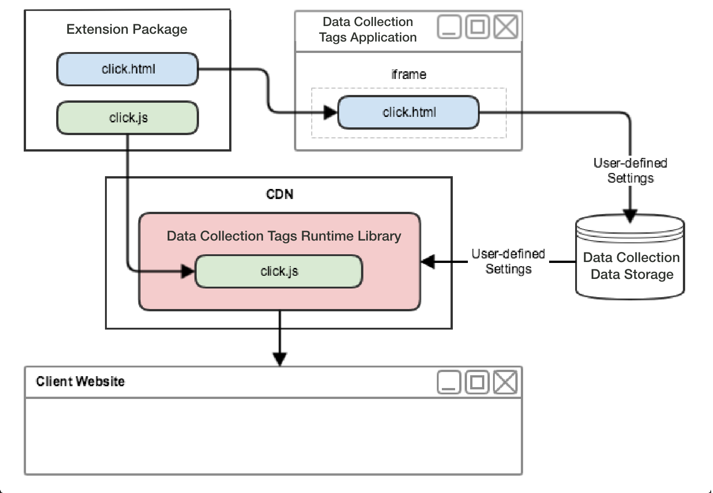
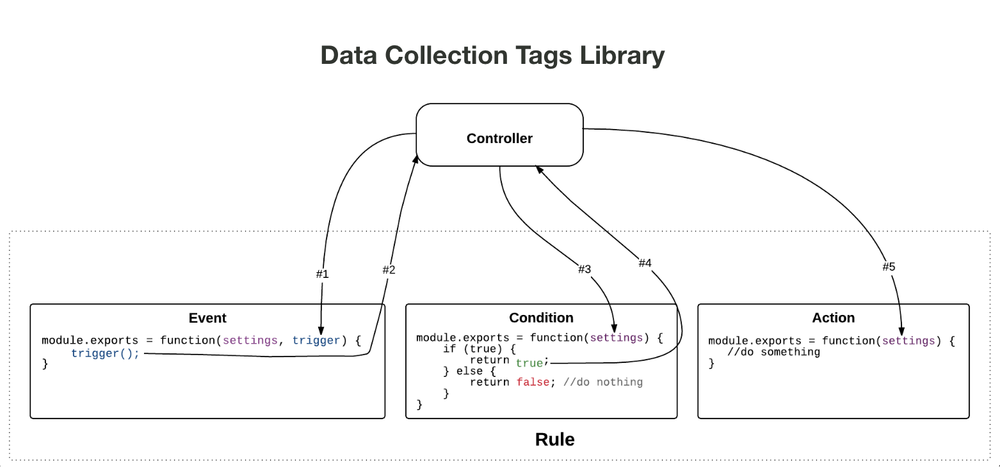

# Flux d’extension web

Dans les extensions web, chaque type d’événement, de condition, d’action et d’élément de données comporte à la fois une vue qui permet aux utilisateurs de modifier les paramètres et un module de bibliothèque leur permettant d’agir sur ces paramètres définis par l’utilisateur.

Comme le montre le diagramme de haut niveau suivant, la vue de type d’événement de l’extension sera affichée dans un iframe dans l’application intégrée à Adobe Experience Platform. L’utilisateur utilise ensuite la vue pour modifier les paramètres qui sont ensuite enregistrés dans Experience Platform. Lorsque la bibliothèque d’exécution des balises est créée, le module Bibliothèque de types d’événement de l’extension ainsi que les paramètres définis par l’utilisateur sont inclus dans la bibliothèque d’exécution. Au moment de l’exécution, Experience Platform injectera les paramètres définis par l’utilisateur dans le module Bibliothèque.

Dans le diagramme suivant, vous pouvez voir le lien entre les événements, les conditions et les actions dans le flux de traitement des règles.

Le flux de traitement des règles contient les phases suivantes :

1. La méthode `settings` et la méthode `trigger` sont fournies au module de bibliothèque d’événements au démarrage.
1. Lorsque le module de bibliothèque d’événements détermine que l’événement s’est produit, le module de bibliothèque d’événements appelle `trigger`.
1. Les balises transmettent les `settings` dans les modules de bibliothèque de conditions de la règle où les conditions sont évaluées.
1. Chaque module de bibliothèque de conditions renvoie si une condition est évaluée comme vraie.
1. Si toutes les conditions sont remplies, les actions de la règle sont exécutées.
