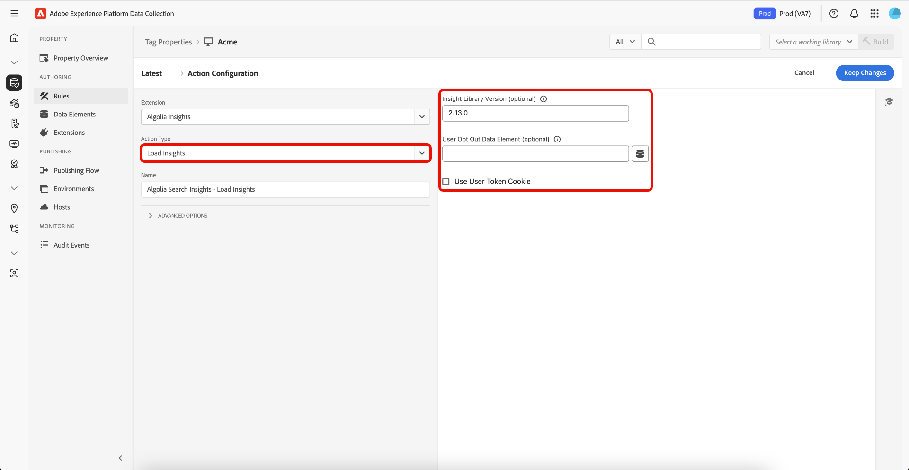
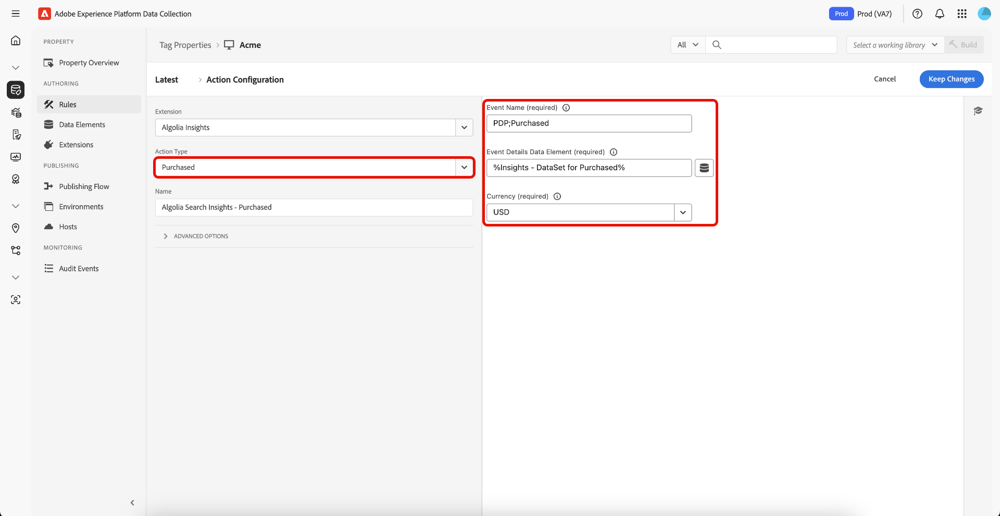

# Présentation de l’extension [!DNL Algolia] Tags

L’extension [!DNL Algolia] Tags permet aux spécialistes marketing de configurer facilement des règles qui envoient des données d’interaction utilisateur aux [!DNL Algolia], ce qui vous permet de proposer des expériences IA Search et Discovery plus personnalisées.

Cette extension est optimisée par une fonctionnalité clé :

* **[!DNL Algolia]Insights** : capture et envoie automatiquement les événements d’interaction utilisateur à [!DNL Algolia], ce qui permet des analyses puissantes, des expériences personnalisées et une pertinence de recherche améliorée.

## Conditions préalables {#prerequisites}

Vous devez disposer d’un compte [!DNL Algolia] valide pour utiliser cette extension. Accédez à la page [[!DNL Algolia] inscription](https://dashboard.algolia.com/users/sign_up) pour créer un compte si vous n’en avez pas déjà un.

### Collecter les détails de configuration requis {#configuration-details}

Pour vous connecter [!DNL Algolia] Adobe Experience Platform, vous aurez besoin des informations suivantes :

| Informations d’identification | Description | Exemple |
| --- | --- | --- |
| ID de l’application | Votre ID d’application se trouve dans la section [ Clés API ](https://www.algolia.com/account/api-keys/all) de votre tableau de bord [!DNL Algolia]. | 0ABCDEFG12 |
| Clé API de recherche | Votre clé d’API de recherche se trouve dans la section [Clés d’API](https://www.algolia.com/account/api-keys/all) de votre tableau de bord de [!DNL Algolia]. | 1234a12345678901b1234567890c1ab1 |

## Installation et configuration de l’extension [!DNL Algolia] Insights {#install-configure}

Pour installer l’extension [!DNL Algolia] Insights, accédez à la [!UICONTROL Data Collection UI] et sélectionnez **[!UICONTROL Tags]** dans le volet de navigation de gauche. À partir de là, sélectionnez une propriété à laquelle ajouter l’extension ou créez-en une nouvelle.

Une fois la propriété sélectionnée ou créée, sélectionnez **[!UICONTROL Extensions]** dans le volet de navigation de gauche, puis sélectionnez l’onglet **[!UICONTROL Catalog]** . Recherchez la carte [!DNL Algolia] Insights , puis sélectionnez **[!UICONTROL Install]**.


Dans la vue de configuration qui s’affiche, vous devez fournir les détails suivants :

| Propriété | Description |
| --- | --- |
| [!UICONTROL Application ID] | Saisissez les [!UICONTROL Application Id] que vous avez précédemment collectées dans la section [détails de la configuration](#configuration-details). |
| [!UICONTROL Search API Key] | Saisissez les [!UICONTROL Search API Key] que vous avez précédemment collectées dans la section [détails de la configuration](#configuration-details). |
| [!UICONTROL Index Name] | Le [!UICONTROL Index Name] contient les produits ou le contenu.  Cet index sera utilisé par défaut. |
| [!UICONTROL User Token Data Element] | L’élément de données qui renverra le jeton d’utilisateur. |
| [!UICONTROL Authenticated User Token Data Element] | Définissez l’élément de données qui renverra le jeton d’utilisateur authentifié. |
| [!UICONTROL Currency Code] | Saisissez le code de devise au format ISO-4217, tel que USD ou EUR. Ce champ prend en charge les éléments de données. |


## Types d’actions de l’extension [!DNL Algolia] Insights {#action-types}

[!DNL Algolia] prend en charge un ensemble d’événements standard prédéfinis, chacun avec des contextes et des propriétés spécifiques. Les actions disponibles dans l’extension [!DNL Algolia] s’alignent sur ces types d’événements, ce qui facilite la classification et la configuration des événements que vous envoyez à [!DNL Algolia] en fonction de leur type.

### Charger les informations {#load-insights}

>[!NOTE]
>
>Dans la plupart des cas, il est recommandé de charger [!DNL Algolia] Insights sur chaque page de votre site.

Ajoutez l’action **[!UICONTROL Load Insights]** à votre règle de balise là où elle est la plus pertinente pour charger [!DNL Algolia] Insights en fonction du contexte de votre règle. Cette action charge la bibliothèque `search-insights.js` sur la page.

Créez une règle de balise ou ouvrez-en une existante. Définissez les conditions en fonction de vos besoins, puis sélectionnez **[!UICONTROL Algolia]** comme [!UICONTROL Extension] et **[!UICONTROL Load Insights]** comme [!UICONTROL Action Type].

| Propriété | Description |
| --- | --- |
| [!UICONTROL Insight Library Version] | Version d’[!DNL Algolia] Insights. La valeur par défaut est de `2.17.3`. |
| [!UICONTROL User Opt Out Data Element] | L’élément de données qui capture la préférence de suivi de l’utilisateur. |
| [!UICONTROL Use User Token Cookie] | Cochez cette case pour [!DNL Algolia] permettre de générer un cookie de jeton d’utilisateur. Par défaut, cette option est définie sur `true`. |



### Cliqué {#clicked}

Ajoutez l’action **[!UICONTROL Click]** à votre règle de balise pour envoyer les événements sur lesquels l’utilisateur a cliqué aux [!DNL Algolia]. Créez une règle de balise ou ouvrez-en une existante. Définissez les conditions en fonction de vos besoins, puis sélectionnez **[!UICONTROL Algolia]** comme [!UICONTROL Extension] et **[!UICONTROL Clicked]** comme [!UICONTROL Action Type].

| Propriété | Description |
| --- | --- |
| [!UICONTROL Event Name] | Nom de l’événement qui peut être utilisé pour affiner davantage cet événement de clic. |
| [!UICONTROL Event Details Data Element] | L’élément de données renvoie les détails de l’événement au format JSON, notamment : <ul><li>`indexName`</li><li>`objectIDs`</li><li>`queryID` (facultatif)</li><li>`positions` (facultatif)</li><li>`price` (facultatif)</li><li>`quantity` (facultatif)</li><li>`discount` (facultatif)</li><li>`objectData` (facultatif)</li><li>`currency` (facultatif)</li></ul> |


>[!NOTE]
>
>Si `queryID` et `positions` sont inclus, l’événement est classé comme **ID d’objet sur lesquels l’utilisateur a cliqué après la recherche**. Sinon, il est classé comme un événement **Clicked object IDs**.
><br>
>Si l’élément de données ne fournit pas de `indexName`, le **Nom d’index par défaut** est utilisé lors de l’envoi de l’événement.


Pour plus d’informations sur les catégories d’événement, consultez la [Identifiants d’objet sur lesquels vous avez cliqué après recherche](https://www.algolia.com/doc/api-reference/api-methods/clicked-object-ids-after-search/)
et les guides [ID d’objet cliqués](https://www.algolia.com/doc/api-reference/api-methods/clicked-object-ids/).

### Converti {#converted}

Ajoutez l’action **[!UICONTROL Converted]** à votre règle de balise pour envoyer les événements convertis à [!DNL Algolia]. Créez une règle de balise ou ouvrez-en une existante. Définissez les conditions en fonction de vos besoins, puis sélectionnez **[!UICONTROL Algolia]** comme [!UICONTROL Extension] et **[!UICONTROL Converted]** comme [!UICONTROL Action Type].

| Propriété | Description |
| --- | --- |
| [!UICONTROL Event Name] | Nom de l’événement qui sera utilisé pour affiner davantage cet événement **convert**. |
| [!UICONTROL Event Details Data Element] | L’élément de données renvoie les détails de l’événement, notamment : <ul><li>`indexName`</li><li>`objectIDs`</li><li>`queryID` (facultatif)</li><li>`recordID` (facultatif)</li></ul> |

>[!NOTE]
>
>Si l’élément de données contient des `queryId`, l’événement est classé comme **Converti après la recherche**. Sinon, il sera classé comme un événement **Converti**.
><br>
>Si l’élément de données ne fournit pas de `indexName`, le **Nom d’index par défaut** est utilisé lors de l’envoi de l’événement.


Pour plus d’informations sur les catégories d’événement, consultez les guides [ID d’objet convertis après recherche](https://www.algolia.com/doc/api-reference/api-methods/converted-object-ids-after-search/) et [ID d’objet convertis](https://www.algolia.com/doc/api-reference/api-methods/converted-object-ids/).

### Ajouté au panier {#added-to-cart}

Ajoutez l’action **[!UICONTROL Added to Cart]** à votre règle de balise pour envoyer les événements ajoutés au panier aux [!DNL Algolia]. Créez une règle de balise ou ouvrez-en une existante. Définissez les conditions en fonction de vos besoins, puis sélectionnez **[!UICONTROL Algolia]** comme [!UICONTROL Extension] et **[!UICONTROL Added to cart]** comme [!UICONTROL Action Type].

| Propriété | Description |
| --- | --- |
| [!UICONTROL Event Name] | Nom de l’événement qui sera utilisé pour affiner davantage cet événement **ajouter au panier**. |
| [!UICONTROL Event Details Data Element] | L’élément de données renvoie les détails de l’événement au format JSON, notamment : <ul><li>`indexName`</li><li>`objectIDs`</li><li>`objectData`</li><li>`price`</li><li>`quantity`</li><li>`discount` (facultatif)</li><li>`queryID` (facultatif)</li><li>`currency` (facultatif)</li></ul>. |

>[!NOTE]
>
>Si l’élément de données contient des `queryId`, l’événement est classé comme **Ajouté aux ID d’objet de panier après la recherche**. Sinon, il sera classé comme un événement **Ajouté aux ID d’objet de panier**.
><br>
>Si l’élément de données ne fournit pas de `indexName`, le **Nom d’index par défaut** est utilisé lors de l’envoi de l’événement.
><br>
>Si les éléments de données par défaut ne répondent pas à vos besoins, un élément de données personnalisé peut être créé pour renvoyer les détails de l’événement souhaité.


Pour plus d’informations sur les catégories d’événement, consultez les guides [Ajout aux ID d’objet de panier après recherche](https://www.algolia.com/doc/api-reference/api-methods/added-to-cart-object-ids-after-search/) et [Ajout aux ID d’objet de panier](https://www.algolia.com/doc/api-reference/api-methods/added-to-cart-object-ids/).

### Purchased {#purchased}

Ajoutez l’action **[!UICONTROL Purchased]** à votre règle de balise pour envoyer les événements achetés à [!DNL Algolia]. Créez une règle de balise ou ouvrez-en une existante. Définissez les conditions en fonction de vos besoins, puis sélectionnez **[!UICONTROL Algolia]** comme [!UICONTROL Extension] et **[!UICONTROL Purchased]** comme [!UICONTROL Action Type].

| Propriété | Description |
| --- | --- |
| [!UICONTROL Event Name] | Nom de l’événement qui sera utilisé pour affiner davantage cet événement **achat**. |
| [!UICONTROL Event Details Data Element] | L’élément de données renvoie les détails de l’événement au format JSON, notamment : <ul><li>`indexName`</li><li>`objectIDs`</li><li>`objectData`</li><li>`price`</li><li>`quantity`</li><li>`discount` (facultatif)</li><li>`queryID` (facultatif)</li><li>`currency` (facultatif)</li></ul>. |

>[!NOTE]
>
>L’action Achat récupère les données d’événement du stockage du navigateur en fonction des ID d’article achetés. Si l’un des articles achetés contient un `queryID` dans ses données stockées, l’événement est classé comme **ID d’objet achetés après la recherche**. Sinon, il sera classé comme événement **ID d’objet achetés**.
><br>
>Cette approche permet à l’événement d’achat d’inclure automatiquement tout le contexte pertinent (identifiant de requête, nom d’index, prix, quantité, remise) des interactions antérieures de l’utilisateur avec les articles.



Pour plus d’informations sur les catégories d’événement, reportez-vous à la section [ID d’objet achetés après recherche](https://www.algolia.com/doc/api-reference/api-methods/purchased-object-ids-after-search/)
et les guides [ID des objets achetés](https://www.algolia.com/doc/api-reference/api-methods/purchased-object-ids/).

### Consulté {#viewed}

Ajoutez l’action **[!UICONTROL Viewed]** à votre règle de balise pour envoyer les événements achetés à [!DNL Algolia]. Créez une règle de balise ou ouvrez-en une existante. Définissez les conditions en fonction de vos besoins, puis sélectionnez **[!UICONTROL Algolia]** comme [!UICONTROL Extension] et **[!UICONTROL Viewed]** comme [!UICONTROL Action Type].

| Propriété | Description |
| --- | --- |
| [!UICONTROL Event Name] | Nom de l’événement qui sera utilisé pour affiner davantage cet événement **vue**. |
| [!UICONTROL Event Details Data Element] | L’élément de données renvoie les détails de l’événement au format JSON, notamment : <ul><li>`indexName`</li><li>`objectIDs`</li></ul> |

>[!NOTE]
>
>Si l’élément de données ne fournit pas d’`indexName`, le **Nom d’index par défaut** est utilisé lors de l’envoi de l’événement.


Pour plus d’informations sur l’événement d’affichage, consultez le guide [ID d’objet affichés](https://www.algolia.com/doc/api-reference/api-methods/viewed-object-ids/).

## Éléments de données de l’extension [!DNL Algolia] Insights {#data-elements}

[!DNL Algolia] prend en charge un ensemble d’éléments de données prédéfinis, chacun avec des propriétés et des contextes spécifiques. Les sections suivantes décrivent les éléments de données disponibles dans l’extension [!DNL Algolia] Insights.

### DataSet {#dataset}

L’élément de données DataSet récupère les données associées aux éléments HTML, qui sont ensuite utilisées dans les actions [!DNL Algolia]. Cet élément de données stocke automatiquement les données d’événement récupérées dans le stockage du navigateur pour une utilisation ultérieure (comme dans les événements de conversion ou d’achat).

**Configuration générale :**

| Propriété | Description |
| --- | --- |
| [!UICONTROL Hit Element Div/Class Name] | Le Nom de l’élément HTML et/ou le Nom de classe CSS contenant les attributs du jeu de données, y compris `data-insights-object-id` et éventuellement `data-insights-query-id` et `data-insights-position` sur l’élément HTML. |
| [!UICONTROL Index Name Element Div/Class Name] | Nom de l’élément HTML et/ou Nom de classe CSS qui contient les attributs de jeu de données (`data-indexname`) sur l’élément HTML. |

**Configuration De Commerce (Facultatif) :**

| Propriété | Description |
| --- | --- |
| [!UICONTROL Price Data Element] | Élément de données qui renvoie le prix de l’article. Le cas échéant, elles sont incluses dans les données d’événement stockées pour les événements commerciaux. |
| [!UICONTROL Quantity Data Element] | Élément de données qui renvoie la quantité de l’article. La valeur par défaut est 1 s’il n’est pas fourni. |
| [!UICONTROL Discount Data Element] | Élément de données qui renvoie la valeur décimale de remise pour l’article. |
| [!UICONTROL Currency Code] | Code de devise au format ISO-4217. Si aucun code de devise n’est spécifié, la devise par défaut de la configuration de l’extension est utilisée. |

**Remplacements (facultatifs) :**

Ces champs vous permettent de remplacer le comportement par défaut de récupération des données des attributs du jeu de données HTML.

| Propriété | Description |
| --- | --- |
| [!UICONTROL Record ID Data Element] | Remplacez l’approche par défaut pour utiliser l’URL de page comme ID d’enregistrement. L’ID d’enregistrement est utilisé pour stocker et rechercher les données à envoyer à [!DNL Algolia] pour ce produit/cette page. |
| [!UICONTROL Query ID Data Element] | L’ID de requête est récupéré à partir du jeu de données sur l’élément HTML. Pour remplacer ce comportement, utilisez cette propriété pour fournir un élément de données qui renvoie l’ID de requête sous la forme d’une chaîne. |
| [!UICONTROL Object IDs Data Element] | Les ID d’objet sont récupérés à partir du jeu de données sur l’élément HTML. Pour remplacer ce comportement, utilisez cette propriété pour fournir un élément de données qui renvoie les ID d’objet sous la forme d’un tableau. |
| [!UICONTROL Positions Data Element] | Les positions sont récupérées à partir du jeu de données sur l&#39;élément HTML. Pour remplacer ce comportement, utilisez cette propriété pour fournir un élément de données qui renverra les positions sous la forme d’un tableau. |
| [!UICONTROL Index Name Data Element] | Le Nom de l’index est récupéré à partir du jeu de données sur l’élément HTML. Pour remplacer ce comportement, utilisez cette propriété pour fournir un élément de données qui renverra le nom de l’index sous la forme d’une chaîne. |


Cet élément de données renvoie :

```javascript
{
  timestamp,
  queryID,
  indexName,
  objectIDs,
  positions,
  objectData,  // Optional: commerce data if price is provided
  currency,    // Optional: if provided
  recordID
}
```

Exemple d’HTML contenant un jeu de données :

```html
<div data-indexname="acme_master_default_products" class="instant-search-comp__hits">
  <div class="hit-card"
    data-insights-object-id="${hit.objectID}"
    data-insights-position="${hit.__position}"
    data-insights-query-id="${hit.__queryID}">
    <h4 class="hit-name">...</h4>   
  </div>
</div>
```

### Chaîne de requête {#query-string}

L’élément de données Chaîne de requête extrait les données de la chaîne de requête URL pour les utiliser dans des actions [!DNL Algolia].

| Propriété | Description |
| --- | --- |
| [!UICONTROL Object ID Param Name] | Nom du paramètre de requête contenant l’ID d’objet. |
| [!UICONTROL Index Name Param Name] | Nom du paramètre de requête contenant le nom de l’index. |
| [!UICONTROL Query ID Param Name] | Nom du paramètre de requête qui contient l’identifiant de requête. |
| [!UICONTROL Position Param Name] | Nom du paramètre de requête contenant la position. |


Cet élément de données renvoie :

```javascript
{
  timestamp,
  queryID,
  indexName,
  objectIDs,
  positions
}
```

Exemple d’HTML contenant des paramètres de requête :

```html
<a href="product.html?objectID=${hit.objectID}&queryID=${hit.__queryID}&indexName=${indexName}&position=${hit.position}">Read More</a>
```

### Stockage {#storage}

L’élément de données de stockage récupère les données du stockage de la session du navigateur pour les utiliser dans des actions [!DNL Algolia]. Cet élément de données peut également être utilisé pour augmenter les données stockées avec des informations commerciales supplémentaires.

Cet élément de données récupère les détails de l’événement qui étaient précédemment stockés dans le stockage de session (généralement par l’élément de données DataSet lors des événements de clic). Les données sont automatiquement supprimées pendant les événements de conversion, sauf si la suppression est explicitement désactivée.

**Remplacements (facultatifs) :**

| Propriété | Description |
| --- | --- |
| [!UICONTROL Record ID Data Element] | L’ID d’enregistrement est utilisé comme clé pour rechercher les données d’événement stockées dans le stockage du navigateur. L’URL de la page est l’ID d’enregistrement par défaut. Pour remplacer ce comportement, utilisez cette propriété pour fournir un élément de données qui renvoie l’ID d’enregistrement sous la forme d’une chaîne. |
| [!UICONTROL Price Data Element] | Élément de données qui renvoie le prix de l’article. Le cas échéant, les données d’événement stockées seront mises à jour avec les informations de prix. |
| [!UICONTROL Quantity Data Element] | Élément de données qui renvoie la quantité de l’article. Le cas échéant, les données d’événement stockées sont mises à jour avec les informations de quantité. |
| [!UICONTROL Discount Data Element] | Élément de données qui renvoie la valeur décimale de remise pour l’article. Le cas échéant, les données d’événement stockées sont mises à jour avec des informations de remise. |
| [!UICONTROL Currency Code] | Saisissez le code de devise au format ISO-4217. Le cas échéant, les données d’événement stockées sont mises à jour avec les informations de devise. |


Cet élément de données renvoie ce qui est stocké dans le stockage de session, y compris les données commerciales augmentées :

```javascript
{
  timestamp,
  queryID,
  indexName,
  objectIDs,
  positions,      // If available from original event
  objectData,     // Optional: commerce data if price is provided
  currency,       // Optional: if provided
  recordID
}
```

## Clic ou conversion après la recherche {#clicked-converted-after-search}

Les événements *Cliqué après la recherche* ou *Converti après la recherche* nécessitent un `queryID` et `positions` est également requis pour les événements *Cliqué après la recherche*. Ces propriétés sont disponibles lorsque l’indicateur `insights` est activé dans les paramètres de requête InstantSearch et/ou Autocomplete. Reportez-vous aux ressources suivantes pour savoir comment configurer Insights pour votre site :

* [Configuration des informations sur la saisie semi-automatique](https://www.algolia.com/doc/ui-libraries/autocomplete/api-reference/autocomplete-js/autocomplete/#param-insights)
* [Configuration des informations sur InstantSearch.js](https://www.algolia.com/doc/guides/building-search-ui/events/js/#set-the-insights-option-to-true)
* [Prise en main des événements de clic et de conversion](https://www.algolia.com/doc/guides/sending-events/implementing/how-to/sending-events-backend/)
* [Envoi  [!DNL Algolia]  événements Insights](https://www.algolia.com/doc/ui-libraries/autocomplete/guides/sending-algolia-insights-events/)
* [[!DNL Algolia] Référentiel GitHub de l’extension Launch](https://github.com/algolia/algolia-launch-extension)
* [Documentation InstantSearch.js](https://www.algolia.com/doc/guides/building-search-ui/what-is-instantsearch/js/)
* [[!DNL Algolia]  Documentation de l’API Insights ](https://www.algolia.com/doc/rest-api/insights/)
* [Référentiel de code d’extension Algolia Launch](https://github.com/algolia/algolia-launch-extension)

## Étapes suivantes {#next-steps}

Ce guide explique comment envoyer des données à [!DNL Algolia] à l’aide de l’extension de balise [!DNL Algolia Insights]. Si vous prévoyez d’envoyer également des événements côté serveur à [!DNL Algolia], vous pouvez maintenant procéder à l’installation et à la configuration de l’extension de transfert d’événement [[!DNL Conversions API] event](../../server/algolia/overview.md).

Pour plus d’informations sur les balises dans Experience Platform, consultez la [présentation des balises](../../../home.md).
