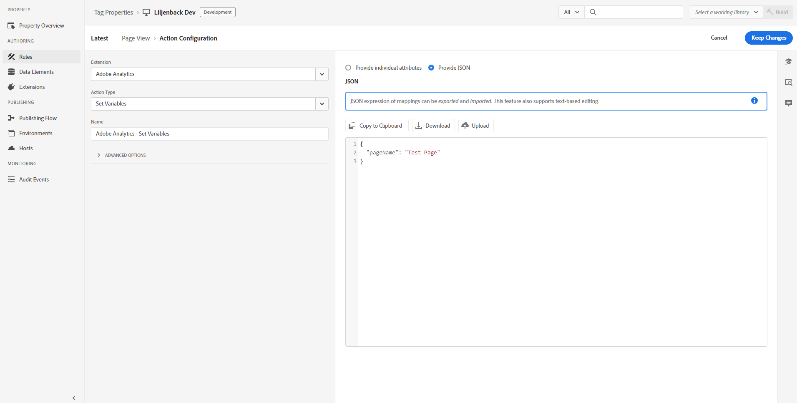

# Présentation de lʼextension Adobe Analytics

>[!NOTE]
>
>Adobe Experience Platform Launch est désormais une suite de technologies destinées à la collecte de données dans Adobe Experience Platform. Plusieurs modifications terminologiques ont par conséquent été apportées à la documentation du produit. Reportez-vous au [document](../../../term-updates.md) suivant pour consulter une référence consolidée des modifications terminologiques.

Cette référence vous permet d’obtenir plus d’informations sur la configuration de l’extension Adobe Analytics et sur les options disponibles lors de l’utilisation de cette extension pour créer une règle.

## Configuration de l’extension Adobe Analytics

Cette section fournit des informations sur les options disponibles lors de la configuration de l’extension Adobe Analytics.

Si lʼextension Adobe Analytics nʼest pas encore installée, ouvrez votre propriété, puis cliquez sur **[!UICONTROL Extensions > Catalogue]**, survolez lʼextension Adobe Analytics et cliquez sur **[!UICONTROL Installer]**.

Pour configurer l’extension, ouvrez l’onglet Extensions, survolez-la avec la souris, puis cliquez sur **[!UICONTROL Configurer]**.


## Gestion des bibliothèques

Sélectionnez une option dans la section Library Management (Gestion des bibliothèques) de la page de configuration. Les options de configuration disponibles sont les suivantes :

### Gestion de la bibliothèque à ma place

#### Report Suites (Suites de rapports)

Spécifiez une ou plusieurs suites de rapports pour chacun des environnements suivants :

* Développement
* Évaluation
* Production

### Utilisation de la bibliothèque déjà installée sur la page

#### Set the following report suites on tracker (Définition des suites de rapports suivantes sur le suivi)

Si vous sélectionnez cette option, spécifiez une ou plusieurs suites de rapports pour chacun des environnements suivants :

* Développement
* Évaluation
* Production

#### Utilisation du module Activity Map

Activity Map est chargé en tant que module distinct (comme le module AAM). Par défaut, Activity Map est activé, mais si vous préférez le désactiver, vous pouvez le faire en décochant la case lors de la configuration.

#### Tracker is accessible on the global variable named (Le suivi est accessible sur la variable globale nommée)

Cochez cette case pour que l’objet de suivi soit utilisé globalement. Par exemple, vous pouvez définir la variable `window.s.pageName` n’importe où sur votre site.

### Chargement de la bibliothèque à partir d’une URL personnalisée

#### HTTP URL (URL HTTP)

Spécifiez l’URL où se trouve la bibliothèque.

#### HTTPS URL (URL HTTPS)

Spécifiez l’URL où se trouve la bibliothèque.

#### Set the following report suites on tracker (Définition des suites de rapports suivantes sur le suivi)

Si vous sélectionnez cette option, spécifiez une ou plusieurs suites de rapports pour chacun des environnements suivants :

* Développement
* Évaluation
* Production

#### Tracker is accessible on the global variable named (Le suivi est accessible sur la variable globale nommée)

Spécifiez l’objet de suivi à utiliser globalement.

### Saisie d’un code de bibliothèque personnalisé

#### Open Editor (Ouvrir l’éditeur)

Permet d’insérer le code [AppMeasurement.js](https://experienceleague.adobe.com/docs/analytics/implementation/js/overview.html?lang=fr) de base. Ce code est renseigné automatiquement lors de l’utilisation de la méthode de configuration automatique.

>[!NOTE]
>
>Le programme de validation utilisé dans lʼéditeur de code de balises est conçu pour identifier les problèmes liés au code écrit par le développeur. Le code qui a fait lʼobjet dʼun processus de minimisation (tel que le code AppMeasurement.js téléchargé depuis le Gestionnaire de code) peut être faussement signalé comme ayant des problèmes par le programme de validation de balises, ce qui peut généralement être ignoré.

#### Set the following report suites on tracker (Définition des suites de rapports suivantes sur le suivi)

Si vous sélectionnez cette option, spécifiez une ou plusieurs suites de rapports pour chacun des environnements suivants :

* Développement
* Évaluation
* Production

#### Tracker is accessible on the global variable named (Le suivi est accessible sur la variable globale nommée)

Spécifiez l’objet de suivi à utiliser globalement.

## General (Général)

Sélectionnez une option dans la section General (Général) de la page de configuration. Les options de configuration disponibles sont les suivantes :

### Enable EU compliance for Adobe Analytics (Activer la conformité UE pour Adobe Analytics)

Permet d’activer ou de désactiver le suivi selon le cookie de confidentialité de l’UE.

Lorsque vous cochez la case Conformité UE, le champ [!UICONTROL Nom du cookie de suivi] sʼaffiche. Le cookie de suivi remplace le nom du cookie de suivi par défaut. Vous pouvez personnaliser le nom utilisé par les balises pour effectuer le suivi de votre statut dʼexclusion pour la réception dʼautres cookies.

Lorsqu’une page est chargée, le système vérifie si un cookie appelé sat\_track est défini (ou le nom du cookie personnalisé spécifié dans la page Edit Property (Modifier une propriété)). Prenez en compte les points suivants :

* Si le cookie n’existe pas ou si le cookie existe et est défini sur une valeur autre que true, le chargement de l’outil est ignoré lorsque ce paramètre est activé. En d’autres termes, les parties de la règle qui utilisent cet outil ne sont pas appliquées. Si une règle contient des analyses avec la mise en conformité avec les normes de l’UE activée et du code de page tiers, et que la valeur du cookie est définie sur false, le code de page tiers continue de fonctionner. Les variables d’analyse ne seront toutefois pas définies.
* Si le cookie existe mais est défini sur true, l’outil se charge normalement.

Il vous incombe de définir le cookie sat\_track (ou le cookie personnalisé) sur false si un visiteur opt-out. Vous pouvez pour cela utiliser du code personnalisé :

```javascript
_satellite.cookie.set("sat_track", "false");
```

Vous devez également disposer d’un mécanisme pour définir ce cookie sur true si vous souhaitez qu’un visiteur puisse opt-in ultérieurement :

```javascript
_satellite.cookie.set("sat_track", "true");
```

### Character Set (Jeu de caractères)

Détermine le mode d’encodage de la demande d’image. Si votre mise en œuvre ou votre site utilise des caractères non ASCII, il est important de définir le jeu de caractères ici. Vous pouvez sélectionner un jeu de caractères prédéfini ou spécifier un jeu de caractères personnalisé. Adobe recommande d’utiliser le même codage de caractères que sur votre site. En règle générale, cette valeur est UTF-8.

Un jeu de caractères peut être défini dans un code personnalisé Analytics à l’aide de la variable `s.charSet`.
Pour plus d’informations sur les jeux de caractères, consultez la [documentation charSet](https://experienceleague.adobe.com/docs/analytics/implementation/vars/config-vars/charset.html?lang=fr).

### Currency Code (Code de devise)

Détermine le taux de conversion à appliquer aux chiffres d’affaires et aux événements de devise. Si votre site permet aux visiteurs d’acheter en plusieurs devises, la définition du code de devise garantit que le montant monétaire est converti et stocké correctement.

Pour plus d’informations sur les codes de devise pris en charge, consultez [currencyCode](https://experienceleague.adobe.com/docs/analytics/implementation/vars/config-vars/currencycode.html?lang=fr).

### Serveur de suivi

Utilisé pour les mises en œuvre de cookies propriétaires afin de déterminer l’emplacement de celui-ci. Si vous utilisez le service Experience Cloud ID, Adobe conseille de ne pas renseigner ce champ.

Un serveur de suivi peut être défini dans un code personnalisé Analytics à l’aide de la variable `s.trackingServer`.

Voir [trackingServer](https://experienceleague.adobe.com/docs/analytics/implementation/vars/config-vars/trackingserver.html?lang=fr) dans le guide de mise en œuvre d’Adobe Analytics.

### Serveur de suivi SSL

Utilisé pour les mises en œuvre de cookies propriétaires SSL afin de déterminer l’emplacement de ce dernier. Si vous utilisez le service Experience Cloud ID, Adobe conseille de ne pas renseigner ce champ. Si elles ne sont pas définies, les données SSL utilisent le serveur de suivi.

Un serveur de suivi SSL peut être défini dans un code personnalisé Analytics à l’aide de la variable `s.trackingServerSecure`.

Voir [trackingServerSecure](https://experienceleague.adobe.com/docs/analytics/implementation/vars/config-vars/trackingserversecure.html?lang=fr).

## Variables globales

Utilisez cette section pour configurer des [eVars et des props](https://experienceleague.adobe.com/docs/analytics/implementation/vars/page-vars/evar.html?lang=fr) et pour créer des hiérarchies.

Les variables globales sont des variables définies sur l’objet de suivi Analytics lorsque cet objet est initialisé sur la page. Toutes les variables définies ici seront définies lorsque l’objet de suivi sera créé sur chaque page. Une fois ces variables définies, elles sont identiques à toutes les autres variables définies. En particulier, cela signifie qu’une règle peut changer, modifier ou effacer ces variables.

Si votre application web envoie généralement une balise par page, cette section peut vous aider à définir facilement vos variables à un seul endroit. Si votre application envoie plusieurs balises par page (par exemple dans une application d’une seule page) et que vous devez effacer vos variables et les réinitialiser à l’aide du même objet de suivi, il est plus simple d’utiliser des règles pour définir et effacer vos variables.

## Link Tracking (Suivi des liens)

Sélectionnez une option dans la section Link Tracking (Suivi des liens) de la page de configuration. Les options de configuration disponibles sont les suivantes :

### Enable ClickMap (Activer ClickMap)

[ClickMap](https://experienceleague.adobe.com/docs/analytics/analyze/activity-map/activity-map.html?lang=fr) est un plug-in d’Internet Explorer et de Firefox et un module de Reports &amp; Analytics.

### Track download links (Suivi des liens de téléchargement)

Permet d’effectuer le suivi des liens vers des fichiers téléchargeables de votre site.

Voir [s.trackDownLoadLinks](https://experienceleague.adobe.com/docs/analytics/implementation/vars/config-vars/trackdownloadlinks.html?lang=fr).

### Download Extensions (Téléchargement d’extensions)

Si l’option Track Download Links (Suivre les liens de téléchargement) est activée, vous pouvez sélectionner les extensions des liens de fichiers inclus dans le rapport de téléchargements. Si votre site contient des liens vers des fichiers contenant l’une des extensions répertoriées, les URL de ces liens apparaissent dans les rapports.

Voir [s.linkDownloadFileTypes](https://experienceleague.adobe.com/docs/analytics/implementation/vars/config-vars/linkdownloadfiletypes.html?lang=fr).

### Track outbound links (Suivi des liens sortants)

Permet de déterminer si un lien faisant l’objet d’un clic est un lien de sortie.

Voir [s.trackExternalLinks](https://experienceleague.adobe.com/docs/analytics/implementation/vars/config-vars/trackexternallinks.html?lang=fr).

**Points à prendre en compte concernant les applications d’une seule page :** en raison du codage de certains sites web d’applications d’une seule page, un lien interne sur le site peut ressembler à un lien sortant.

Vous pouvez utiliser l’une des méthodes suivantes pour suivre les liens sortants à partir des sites des applications d’une seule page :

* Si vous ne souhaitez pas suivre les liens sortants à partir de vos applications d’une seule page, insérez une entrée dans la section Never Track (Ne jamais effectuer de suivi). Par exemple : `http://testsite.com/spa/\#`. Tous les liens \# vers cet hôte sont ignorés. Tous les autres liens sortants vers d’autres hôtes tels que [https://www.google.com](https://www.google.com) sont suivis.
* Si vous souhaitez suivre certains liens sur vos applications d’une seule page, utilisez la section Always Track (Toujours effectuer le suivi).

Par exemple, si vous disposez d’une page spa/\#/about, vous pouvez placer « about » dans la section Always Track (Toujours effectuer le suivi).

La page « about » est le seul lien sortant qui est suivi. Tous les autres liens de la page ([https://www.google.com](https://www.google.com), par exemple) ne sont pas suivis.

>[!NOTE]
>
>Ces deux options s’excluent mutuellement.

### Conserver les paramètres d’URL

Permet de conserver les chaînes de requête.

Voir [s.linkLeaveQueryString](https://experienceleague.adobe.com/docs/analytics/implementation/vars/config-vars/linkleavequerystring.html?lang=fr).

## Cookies

Configurez la description des champs des paramètres globaux des cookies utilisés pour le déploiement de l’extension Adobe Analytics. Les options de configuration disponibles sont les suivantes :

### Visitor ID (Identifiant visiteur)

Valeur unique qui représente un client dans les systèmes en ligne et hors ligne.

Voir [visitorID](https://experienceleague.adobe.com/docs/analytics/implementation/vars/config-vars/visitorid.html?lang=fr).

### Visitor Namespace (Espace de nom du visiteur)

Variable permettant d’identifier le domaine avec lequel les cookies sont définis.

Voir [visitorNamespace](https://experienceleague.adobe.com/docs/analytics/implementation/vars/config-vars/visitornamespace.html?lang=fr).

### Domain Periods (Nombre de points du domaine)

Domaine sur lequel les cookies `s_cc` et `s_sq` sont définis en déterminant le nombre de points contenus du domaine de l’URL de la page. Cette variable est également utilisée par certains plug-ins pour déterminer le domaine correct afin de définir le cookie du plug-in.

Voir [s.cookieDomainPeriods](https://experienceleague.adobe.com/docs/analytics/implementation/vars/config-vars/cookiedomainperiods.html?lang=fr).

### First-Party Domain Periods (Nombre de points du domaine propriétaire)

La variable `fpCookieDomainPeriods` concerne les cookies définis par JavaScript (`s_sq`, `s_cc`, plug-ins), qui sont intrinsèquement des cookies propriétaires, même si votre mise en œuvre utilise les domaines tiers 2o7.net ou omtrdc.net.

Voir [s.fpCookieDomainPeriods](https://experienceleague.adobe.com/docs/analytics/implementation/vars/config-vars/fpcookiedomainperiods.html?lang=fr).

### Cookie Lifetime (Durée de vie du cookie)

Permet de déterminer la durée de vie d’un cookie.

Voir [s.cookieLifetime](https://experienceleague.adobe.com/docs/analytics/implementation/vars/config-vars/cookielifetime.html?lang=fr).

### Cookies sécurisés

Cette variable permet à AppMeasurement d’écrire des cookies sécurisés.

Voir [writeSecureCookies](https://experienceleague.adobe.com/docs/analytics/implementation/vars/config-vars/writesecurecookies.html?lang=fr)


## Personnaliser le code de page

Utilisez l’éditeur pour personnaliser le code de votre page.

## Adobe Audience Manager

Utilisez cette section de la configuration de l’extension pour spécifier comment Audience Manager fonctionne avec Analytics.

Activez **Automatically share Analytics data with Audience Manager** (Partage automatique des données Analytics avec Audience Manager).

Les options suivantes s’affichent :


Adobe Audience Manager attribue le sous-domaine Audience Manager. Il est parfois appelé « Partner Name » (Nom de partenaire) ou « Partner Subdomain » (Sous-domaine partenaire). Contactez votre conseiller Adobe ou l’Assistance clientèle si vous ne connaissez pas votre nom de partenaire.

Vous pouvez configurer les paramètres avancés en sélectionnant **Afficher les paramètres avancés** et en saisissant vos préférences.


Pour plus d’informations sur chaque paramètre, cliquez sur l’icône d’information ou consultez la [documentation d’Adobe Audience Manager](https://experienceleague.adobe.com/docs/audience-manager/user-guide/aam-home.html?lang=fr).

## Types d’actions de l’extension Analytics

Cette section décrit les types d’actions disponibles dans l’extension Analytics.

L’extension Analytics fournit les actions suivantes :

* [Définir des variables](#set-variables)
* [Send Beacon (Envoyer la balise)](#send-beacon)
* [Effacer des variables](#clear-variables)

### Définir des variables {#set-variables}

>[!IMPORTANT]
>
>Vous ne pouvez pas envoyer la balise avec l’action &quot;set variables&quot; (définir des variables). Pour envoyer la balise, vous devez sélectionner l’action &quot;envoyer la balise&quot;.

Vous pouvez choisir entre deux vues différentes dans **Définir des variables** :

>[!BEGINTABS]

>[!TAB Fournir des attributs individuels]

Dans cette vue, vous pouvez spécifier différentes variables telles que `eVars`, `Props`, `Events`.


#### eVars

Définissez une ou plusieurs [eVars](https://experienceleague.adobe.com/docs/analytics/implementation/vars/page-vars/evar.html?lang=fr).

1. Sélectionnez une eVar dans la liste déroulante.
1. Indiquez si vous souhaitez définir l’eVar comme valeur (Set As) ou copier une autre eVar (Duplicate From).
1. Fournissez une valeur à définir, ou sélectionnez l’eVar à dupliquer.
1. (Facultatif) Cliquez sur Ajouter une eVar pour définir d’autres eVars.
1. Sélectionnez **[!UICONTROL Conserver les modifications]**.

#### Props

Définissez une ou plusieurs [props](https://experienceleague.adobe.com/docs/analytics/implementation/vars/page-vars/prop.html?lang=fr).

1. Sélectionnez une prop dans la liste déroulante.
1. Indiquez si vous souhaitez définir la prop comme valeur (Set As) ou copier une autre eVar (Duplicate From).
1. Fournissez une valeur à définir, ou sélectionnez l’eVar dont vous souhaitez dupliquer la prop.
1. (Facultatif) Cliquez sur **[!UICONTROL Ajouter une prop]** pour définir dʼautres props.
1. Sélectionnez **[!UICONTROL Conserver les modifications]**.

#### Événements

Définissez un ou plusieurs [événements](https://experienceleague.adobe.com/docs/analytics/implementation/vars/page-vars/events/events-overview.html?lang=fr).

1. Sélectionnez un événement dans la liste déroulante.
1. (Facultatif) Sélectionnez ou spécifiez un élément de données utilisé pour la [sérialisation des événements](https://experienceleague.adobe.com/docs/analytics/implementation/vars/page-vars/events/event-serialization.html?lang=fr).
1. (Facultatif) Cliquez sur **[!UICONTROL Ajouter un événement]** pour définir dʼautres événements.
1. Sélectionnez **[!UICONTROL Conserver les modifications]**.

>[!TAB Vue JSON]

Dans cette vue, vous pouvez afficher et modifier une version JSON de l’action **Définir les variables**.



#### JSON

Dans l’action **Set Variables** (Définir des variables), utilisez la vue JSON pour charger, copier ou télécharger des données JSON et les stocker sur votre appareil.

Cependant, certaines limites existent :

* **Code personnalisé** : si vous utilisez du code personnalisé pour renseigner des variables, il ne s’affichera pas dans la vue JSON. À la place, une alerte s’affiche lors de l’affichage, de la copie ou du téléchargement du fichier JSON, indiquant que les modifications effectuées via le code personnalisé ne seront pas incluses.
* **Copier à partir de l’attribut d’URL** : la copie d’une valeur à partir d’une URL n’est pas prise en charge dans la vue JSON. Une alerte s’affiche pour indiquer cette limitation.
* **Variables abandonnées** : les variables abandonnées ou obsolètes s’affichent dans la vue JSON et une alerte s’affiche pour informer que les variables retirées ont été définies.
* **Éléments de données** : les éléments de données sont représentés dans la vue JSON. Si les données JSON sont copiées vers une autre propriété de balises, les éléments de données correspondants peuvent ne pas y être définis et ne se résolvent pas correctement lorsqu’ils sont exécutés.

>[!ENDTABS]

#### Hierarchy (Hiérarchie)

Définissez la variable [Hiérarchie](https://experienceleague.adobe.com/docs/analytics/implementation/vars/page-vars/hier.html?lang=fr) d’Analytics.

Spécifiez chaque niveau dans la hiérarchie.

Si vous le souhaitez, configurez des hiérarchies supplémentaires.

#### Nom de la page

Cette valeur fait référence au nom d’une page donnée et correspond à la variable [`pageName`](https://experienceleague.adobe.com/docs/analytics/implementation/vars/page-vars/pagename.html?lang=fr) dans Analytics.

>[!IMPORTANT]
>
>Dans les implémentations Adobe Experience Manager, cette variable indique à AEM où stocker le rapport Analytics récupéré. Pour que les rapports soient correctement conservés, la chaîne de nom de page doit être formatée en tant que chemin d’accès au site séparé par des deux-points.
>
>Par exemple, une page web à `content/we-retail/language-masters/en/men.html` doit avoir une valeur de nom de page `content:we-retail:language-masters:en:men`.

#### Other information (Autres informations)

Spécifiez d’autres informations utilisées par vos pages.

Ces paramètres incluent :

* Page URL (URL de la page)
* Server (Serveur)
* Canal
* Référent
* Campaign
* Identifiant d’achat

  Spécifiez une valeur ou un paramètre de requête.

* State (État)
* Zip (Code postal)
* Transaction ID (ID de transaction)

Ces paramètres se trouvent dans le menu « Variables globales » en cochant la case « Paramètres supplémentaires ».

#### Custom Page Code (Code de page personnalisé)

**Description**

Utilisez l’éditeur pour spécifier le code personnalisé de votre page.

**Settings** (Paramètres)

1. Sélectionnez **[!UICONTROL Ouvrir lʼéditeur]**.
1. Saisissez le Custom Code.
1. Sélectionnez **[!UICONTROL Enregistrer]**.

### Send Beacon (Envoyer la balise) {#send-beacon}

#### Increment a pageview - s.t()

Sélectionnez cette option si vous souhaitez incrémenter une page vue.

#### Do not increment a pageview - s.tl()

Sélectionnez cette option si vous ne souhaitez pas incrémenter une page vue.

**Settings** (Paramètres)

1. Sélectionnez un type de lien.

   Vous pouvez sélectionner l’un des types suivants :

   * Custom Link (Lien personnalisé).
   * Download Link (Lien de téléchargement).
   * Exit Link (Lien de sortie).

1. Définissez le paramètre du lien sélectionné.
   * Custom Link (Lien personnalisé) : spécifiez le nom du lien.
   * Download Link (Lien de téléchargement) : spécifiez un nom de fichier.
   * Exit Link (Lien de sortie) : spécifiez l’URL de destination.
1. Sélectionnez **[!UICONTROL Conserver les modifications]**.

### Effacer des variables {#clear-variables}

Il n’existe aucune option de configuration si ce type d’action est sélectionné.
