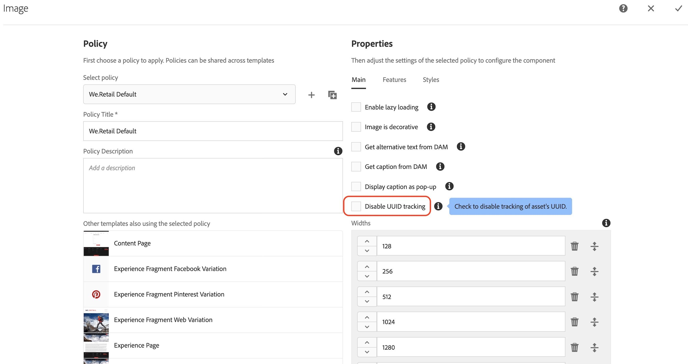

# Présentation de l’extension AEM Asset Insights

>[!NOTE]
>
>Adobe Experience Platform Launch est désormais une suite de technologies destinées à la collecte de données dans Adobe Experience Platform. Plusieurs modifications terminologiques ont par conséquent été apportées à la documentation du produit. Reportez-vous au [document](../../../term-updates.md) suivant pour consulter une référence consolidée des modifications terminologiques.

Cette extension est destinée à être utilisée avec [AEM Asset Insights](https://experienceleague.adobe.com/docs/experience-manager-65/assets/managing/touch-ui-configuring-asset-insights.html?lang=fr). Plus précisément, elle remplace le processus « pageTracker » et le code incorporé. Lorsqu’elle est configurée, cette extension envoie les mesures *Impression* et *Clic* sur les ressources à Adobe Analytics, après quoi elles sont importées dans les rapports AEM Asset Insights. Les mesures sur les ressources peuvent ensuite faire l’objet de rapports à l’aide des espaces de travail AEM Asset Insights et Projet Adobe Analytics.

## Conditions préalables aux extensions

### Analytics

Les rapports AEM Aseet dans Analytics contiennent trois dimensions AEM :

* ID de ressource
* Source de ressources
* Ressource ayant fait l’objet d’un clic

Il existe également deux mesures :
* Impressions de ressources
* Clics sur les ressources.

Ces rapports doivent être activés à l’aide de l’administrateur Analytics (cliquez sur **[!UICONTROL Analytics] > [!UICONTROL Admin] > [!UICONTROL Suites de rapports] > `<report suite>` > [!UICONTROL Modifier les paramètres] > [!UICONTROL AEM] > [!UICONTROL Compte rendu des performances d’AEM Assets]**) avant de pouvoir être renseignés à l’aide de cette extension.

L&#39;extension de balise « *Adobe Analytics* » pour Adobe Experience Platform doit être installée dans la même propriété Web.

### Adobe Experience Manager (AEM)

1. Activez [AEM Asset Insights](https://experienceleague.adobe.com/docs/experience-manager-65/assets/managing/touch-ui-configuring-asset-insights.html?lang=fr). Dans AEM, sélectionnez **[!UICONTROL Outils > Ressources]**, puis ouvrez le panneau **[!UICONTROL Configuration d’Insights]**.

1. Désactivez le suivi UUID.

   >[!IMPORTANT]
   >
   >Cette extension ne fonctionne *pas* si le paramètre de configuration des ressources AEM **[!UICONTROL Désactiver le suivi d’UUID]** est coché. Ce paramètre est désélectionné par défaut.

   

## Configurer Adobe Experience Manager (AEM)

Cette section décrit comment configurer AEM avec des balises dans Adobe Experience Platform, comment activer Asset Insight dans AEM et comment activer le suivi UUID pour Assets.

### Intégration d’AEM avec des balises

L’intégration recommandée de [Platform](https://experienceleague.adobe.com/docs/experience-manager-learn/sites/integrations/experience-platform-launch/overview.html?lang=fr) avec Adobe Experience Manager s’effectue avec Adobe I/O.

1. [Connexion d’AEM à Launch à l’aide d’Adobe I/O](https://experienceleague.adobe.com/docs/experience-manager-learn/sites/integrations/experience-platform-launch/connect-aem-launch-adobe-io.html?lang=fr).

2. [Création dʼune configuration Adobe Experience Platform Cloud Service](https://experienceleague.adobe.com/docs/experience-manager-learn/sites/integrations/experience-platform-launch/create-launch-cloud-service.html?lang=fr).

### Activer Asset Insight dans AEM

Pour obtenir des instructions sur l’activation d’Assets Insights, consultez le [guide de l’utilisateur Experience Manager 6.5 Assets](https://experienceleague.adobe.com/docs/experience-manager-65/assets/managing/touch-ui-configuring-asset-insights.html?lang=fr).

### Activer le suivi UUID pour Assets

Effectuez le suivi des ressources dans Analytics à l’aide de l’UUID de la ressource dans AEM.

Pour activer le suivi avec l’UUID de la ressource, ouvrez la console de politique des composants du modèle modifiable et désélectionnez la propriété « Désactiver le suivi UUID ». (Par défaut, cette propriété est sélectionnée pour le composant d’image OOTB.)

Après avoir activé l’UUID, l’élément de données « data-asset-id » devrait être renseigné avec l’UUID de la ressource. Analytics effectue le suivi du clic ou de l’impression de la ressource avec cet UUID.

## Utilisation des extensions

Cette extension comporte deux événements et une action.

* **Ressource ayant fait l’objet d’un clic :** Un _événement_ qui se déclenche lorsque le visiteur clique sur une ressource AEM activée pour le suivi et comportant une destination (attribut href).

* **Ressource ayant fait l’objet d’un clic (pas de destination) :** Un _événement_ qui se déclenche lorsque le visiteur clique sur une ressource AEM activée pour le suivi et ne comportant pas de destination (pas d’attribut href).

* **Définir des variables AA :** une _action_ qui définit les variables Analytics réservées à AEM Assets (variables de données contextuelles `a.assets.source`, `a.assets.idlist` et `a.asset.clickedid`) en fonction de l’événement utilisé et de la configuration de l’événement et de l’action. Cette extension n’utilise aucun événement, prop ou eVar Analytics.

### Impressions de ressources

Ajoutez l’action « Définir des variables AA » sur une règle de balise nouvelle ou existante qui se déclenche sur chaque page et envoie une demande d’image Analytics. L’action « Définir des variables AA » doit s’afficher **avant** l’action « Adobe Analytics - Envoyer la balise ». Des actions supplémentaires peuvent être ajoutées si nécessaire.

Dans la page de configuration **[Définir des variables AA]**, sélectionnez l’option **[Ressources consultées]** (par défaut). Ceci définit uniquement l’événement Impressions pour les ressources réellement consultées par le visiteur.

>[!NOTE]
>
>Bien que cela ne soit pas recommandé, l’action « Définir des variables AA » prend également en charge une option « chargée », qui envoie des impressions de ressources pour chaque ressource de la page, que le visiteur les ait consultées ou non.

### Clics sur les ressources

Configurez une deuxième règle à l’aide de l’événement « Ressource ayant fait l’objet d’un clic » et de l’action « Définir des variables AA ». L’événement « Ressource ayant fait l’objet d’un clic » doit être configuré de sorte que « Demande d’image de ressource ayant fait l’objet d’un clic » soit défini sur « On PageLoad » (par défaut). Cette règle ne nécessite aucune action Adobe Analytics (telle que « Envoyer la balise »), car l’identifiant de ressource sera enregistré dans `sessionStorage` et envoyé par la règle Impressions suivante.

L’événement « Ressource ayant fait l’objet d’un clic » prend également en charge le paramètre « Demande d’image de ressource ayant fait l’objet d’un clic » défini sur « À la suite d’un clic ». Cette opération envoie immédiatement la mesure des clics à Analytics et nécessite également une action « Envoyer la balise » d’Analytics.

Configurez une troisième règle qui se déclenche lorsqu’il y a des ressources sur les pages qui n’ont pas de destination (pas d’attribut `href`). Au minimum, la nouvelle règle doit utiliser l’événement « Ressource ayant fait l’objet d’un clic (Pas de destination) », ainsi que les actions « Définir des variables AA » et « Adobe Analytics - Envoyer la balise ». D’autres conditions et actions peuvent être ajoutées si nécessaire.

### Conseils relatifs aux tests d’extensions

Configurez trois règles comme décrit ci-dessus :

* Impressions de ressources
* Clics sur les ressources
* Clics sur les ressources sans destination

**Impressions**

1. Accédez à une page qui contient des ressources AEM.

1. Si aucune ressource n’est visible dans le navigateur, faites défiler l’écran jusqu’à ce que vous puissiez voir au moins une ressource et cliquez sur cette ressource ou accédez simplement à une autre page.

1. Examinez la demande d’image Analytics.

   Si `a.assets.idlist` contient des identifiants de ressources visibles sur la page précédente, la règle fonctionne correctement.

   Si `a.assets.idlist` n’est pas dans la demande d’image, il s’agit probablement de l’une des deux raisons suivantes :

   * Il n’y a jamais eu de ressource dans la zone d’affichage du navigateur.

   * Aucune ressource sur la page n’était configurée avec [Statistiques sur les ressources](https://experienceleague.adobe.com/docs/experience-manager-65/assets/managing/touch-ui-configuring-asset-insights.html?lang=fr) activé dans AEM.

**Clics**

1. Accédez à une page qui contient des ressources AEM.

1. Cliquez sur l’une des ressources.

Dans la requête d’image Analytics qui en résulte (à partir de la page suivante), si `a.assets.idlist` contient les identifiants de ressource sur la page de destination et que `a.assets.clickedid` contient l’identifiant de la ressource ayant fait l’objet d’un clic sur la page d’origine, la règle fonctionne correctement.

Si `a.assets.clickedid` n’est pas dans la requête d’image, c’est certainement parce que la ressource ayant fait l’objet d’un clic n’avait pas activé [Statistiques sur les ressources](https://experienceleague.adobe.com/docs/experience-manager-65/assets/managing/touch-ui-configuring-asset-insights.html?lang=fr) dans AEM.

**Clics sans destination**

1. Accédez à une page qui contient au moins une ressource AEM qui n’a pas de destination (pas d’attribut `href`).

1. Sélectionnez cette ressource.

Dans la demande d’image Analytics qui en résulte, si `a.assets.clickedid` comporte l’identifiant de ressource, la règle fonctionne correctement.

Si `a.assets.clickedid` n’est pas dans la requête d’image, c’est certainement parce que [Statistiques sur les ressources](https://experienceleague.adobe.com/docs/experience-manager-65/assets/managing/touch-ui-configuring-asset-insights.html?lang=fr) n’était pas activé sur la ressource ayant fait l’objet d’un clic dans AEM.
