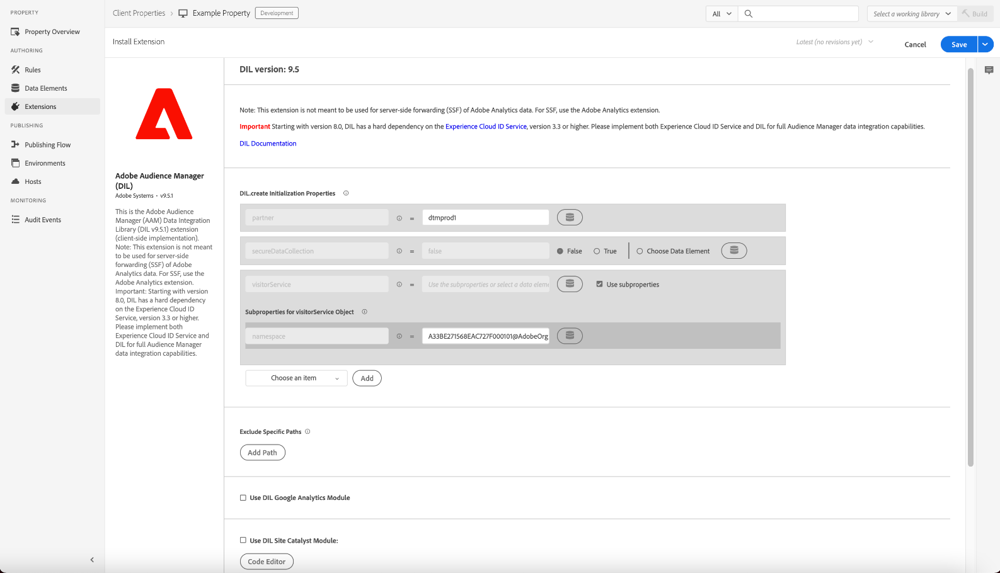

# Présentation de l’extension Adobe Audience Manager

>[!NOTE]
>
>Adobe Experience Platform Launch est désormais une suite de technologies destinées à la collecte de données dans Adobe Experience Platform. Plusieurs modifications terminologiques ont par conséquent été apportées à la documentation du produit. Reportez-vous au [document](../../../term-updates.md) suivant pour consulter une référence consolidée des modifications terminologiques.

Avec l’extension de balises d’Audience Manager, vous pouvez intégrer le code DIL utilisé par Audience Manager à vos propriétés dans Adobe Experience Platform 

Utilisez cette référence pour obtenir des informations sur les options disponibles lors de l’utilisation de cette extension pour créer une règle.

>[!NOTE]
>
>Cette extension n’est pas destinée à être utilisée pour le transfert d’événement des données d’Adobe Analytics. Pour le transfert d’événement, utilisez [l’extension Adobe Analytics](../analytics/overview.md).

## Configuration de l’extension Adobe Audience Manager

Si l’extension Adobe Audience Manager n’est pas encore installée, ouvrez votre propriété, puis cliquez sur **[!UICONTROL Extensions > Catalog]**, survolez l’extension Adobe Audience Manager avec la souris et cliquez sur **[!UICONTROL Install]**.

Pour configurer l’extension, ouvrez l’onglet [!UICONTROL Extensions], survolez l’extension avec la souris, puis cliquez sur **[!UICONTROL Configure]**.

### Paramètres DIL

Configurez vos paramètres DIL. Les options de configuration disponibles sont les suivantes :

#### Version de DIL

Affiche la version de la Data Integration Library (« Bibliothèque d’intégration de données », ou DIL).

Ce paramètre ne peut pas être modifié.

#### Exclusion de chemins d’accès spécifiques

Si l’URL correspond à l’un des chemins exclus, l’extension n’est pas chargée.

Cliquez sur **[!UICONTROL Add Path]** pour spécifier une URL exclue.

Activez les Regex si l’URL est une expression régulière.

#### Utilisation du module Site Catalyst pour DIL

Le [module SiteCatalyst](https://experiencecloud.adobe.com/resources/help/fr_FR/aam/r_dil_sc_init.html) fonctionne avec la DIL pour envoyer des éléments de balises Analytics à Audience Manager.

Utilisez l’éditeur de code pour configurer le fichier siteCatalyst.init.

Vous pouvez aussi créer une note contenant des informations sur cette configuration.

#### Utilisation du module Google Analytics pour DIL

Activez le [module Google Analytics](https://experiencecloud.adobe.com/resources/help/fr_FR/aam/dil-google-universal-analytics.html).

#### Propriétés d’initialisation DIL.create

Ajoutez les propriétés d’initialisation utilisées par [DIL.create](https://experiencecloud.adobe.com/resources/help/fr_FR/aam/r_dil_create.html) et la sous-propriété de l’espace de noms pour l’[objet visitorService](https://experiencecloud.adobe.com/resources/help/fr_FR/aam/r_dil_visitor_service.html). Dans l’éditeur de code, deux exemples d’utilisation sont inclus dans les commentaires de code.

Cliquez sur **[!UICONTROL Choose an Item]** pour ajouter des propriétés supplémentaires.

Survolez les icônes « i » avec la souris pour connaître les fonctions de chaque propriété. Vous trouverez plus d’informations sur les propriétés dans la [documentation DIL pour Audience Manager](https://experiencecloud.adobe.com/resources/help/fr_FR/aam/r_dil_create.html).

Cliquez sur **[!UICONTROL Save]** quand vous avez fini de configurer l’extension.

## Types d’actions de l’extension Adobe Audience Manager

Cette section décrit les types d’actions disponibles dans l’extension Audience Manager.

L’extension Adobe Audience Manager permet d’effectuer les actions suivantes dans la partie « Then » d’une règle :

### Exécuter un code personnalisé

Exécutez le code personnalisé configuré dans l’éditeur de code.

Saisissez le code de votre choix dans l’éditeur de code, puis attribuez un nom au code. Ce code sera disponible dans la partie « Then » du créateur de règles.

Vous pouvez aussi ajouter une note avec des informations sur cette configuration.
