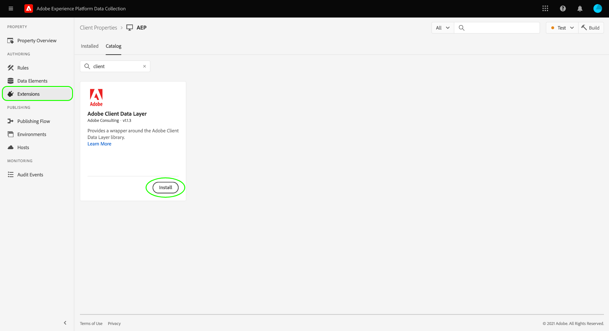

# Extension Adobe Client Data Layer

Cette documentation fournit des exemples et des bonnes pratiques sur l’utilisation de l’extension Adobe Client Data Layer.

<!-- 
(Missing document?)
If you would like to have more details on development consideration, [please reach this page](./dev.md). 
-->

## Installation

Pour installer l’extension, accédez au catalogue d’extensions dans l’interface utilisateur d’Experience Platform ou l’interface utilisateur de collecte de données et sélectionnez Couche de données client Adobe.



<!-- 
(GitHub link?)
There is also the possibility to fork this project. You can download this github project, realize the change that you deem required for your specific use-case and re-upload it on your Organization as a private extension.
This installation will not be supported on our end.<br>
>[!NOTE]
>
> _Consider renaming the extension name in the extension.json file_ 
-->

## Vue d’extension

Par défaut, le script ACDL crée une couche de données avec le nom de variable `adobeDataLayer`. La vue d’extension vous offre la possibilité de modifier ce nom si vous le souhaitez. Le nom que vous avez défini sera instancié lors du chargement des balises.

>[!NOTE]
>
>Lors du changement du nom de l’objet, l’objet `adobeDataLayer` d’origine est toujours instancié, puis dupliqué vers le nouveau nom de variable que vous avez sélectionné.

## Événements

L’extension vous permet d’écouter les événements de la couche de données. Les activités d’événement suivantes sont disponibles :

### Écoute de toutes les modifications apportées aux données

Si vous sélectionnez cette option, votre écouteur d’événement écoute toute modification apportée à la couche de données.

>[!IMPORTANT]
>
>L’envoi des événements ne modifie pas la couche de données elle-même.

L’exemple d’événement push suivant est suivi par l’écouteur :

* `adobeDataLayer.push({"data":"something"})`
* `adobeDataLayer.push({"event":"myevent","data":"something"})`

L’exemple d’événement push suivant ne serait pas suivi par l’écouteur :

* `adobeDataLayer.push({"event":"myevent"})`

### Écoute de tous les événements

Si vous sélectionnez cette option, votre écouteur d’événement écoute tout événement transmis à la couche de données.

L’exemple d’événement push suivant est suivi par l’écouteur :

* `adobeDataLayer.push({"event":"myevent"})`
* `adobeDataLayer.push({"event":"myevent","data":"something"})`

L’exemple d’événement push suivant ne serait pas suivi par l’écouteur :

* ` adobeDataLayer.push({"data":"something"}) `

### Écoute d’un événement spécifique

Si vous spécifiez un événement, l’écouteur d’événement suit tout événement correspondant à une chaîne spécifique.

Par exemple, si vous définissez `myEvent` lors de l’utilisation de cette configuration, l’écouteur ne suit que l’événement push suivant :

* `adobeDataLayer.push({"event":"myEvent"})`

Vous pouvez également modifier la portée de votre écouteur d’événement. Les différentes options sont résumées ci-dessous :

* `all` : il s’agit de l’option par défaut qui déclenche la règle chaque fois que la condition que vous avez sélectionnée ci-dessus a été remplie par le passé ou sera remplie à l’avenir. Il s’agit de l’option la plus sûre si vous utilisez une implémentation asynchrone.
* `future` : cette option ne déclenche la règle que si de nouveaux événements push correspondant à votre condition sont envoyés à la couche de données.
* `past` : cette option déclenche la règle uniquement pour les anciens événements push correspondant à votre condition. Les nouvelles notifications push correspondant à votre condition sont ignorées et ne déclenchent plus la règle.

## Actions

Les sections suivantes décrivent les actions prises en charge par l’extension.

### Réinitialisation de la couche de données

L’extension vous permet de réinitialiser la longueur de couche de données, ce qui peut vous aider à maintenir une taille limitée pour une application monopage.

Cependant, il n’est actuellement pas possible de supprimer complètement les informations définies précédemment pendant les méthodes push.

L’action **Réinitialiser et définir l’état calculé** copie le dernier état calculé, vide l’objet de couche de données et envoie à nouveau le dernier état.

### Push to Data Layer (Envoi vers couche de données)

L’extension vous fournit une action permettant de pousser le contenu JSON vers la couche de données elle-même.Cette action permet d’utiliser des éléments de données directement dans le fichier JSON. Dans l’éditeur JSON, les éléments de données doivent être référencés à l’aide de la notation de pourcentage (par exemple, `%dataElementName%`).

```json
{
    "page": {
        "url": "%url%",
        "previous_url": "%previous_url%",
        "concatenated_values": "static string %dataElement%"
    }
}
```

## Éléments de données

Les sections ci-dessous couvrent les types d’éléments de données uniques fournis par l’extension.

### État calculé

L’élément de données État calculé de la couche de données peut renvoyer l’une des deux valeurs suivantes, selon la manière dont vous le configurez :

* État complet de la couche de données : par défaut, l’état complet calculé de la couche de données est renvoyé.
* Chemin spécifique : vous pouvez spécifier le chemin que vous souhaitez renvoyer dans votre couche de données. Les chemins sont spécifiés à l’aide de la notation par points (par exemple, `data.foo`).

### Taille de couche de données

Cet élément de données renvoie la taille de la couche de données. La taille de la couche de données est représentée par le nombre d’éléments qui ont été transmis à cet objet.

Compte tenu de la liste suivante d’événements push, cet élément de données renvoie l’entier `2` :

```js
adobeDataLayer.push({"event":"myEvent"})
adobeDataLayer.push({"data":{"foo":"bar"}})
```
