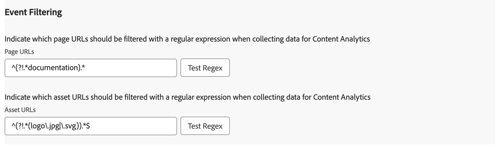

# Présentation de l’extension Adobe Content Analytics

L’extension de balise [!DNL Adobe Content Analytics] permet le suivi des événements liés au contenu sur un site web. L’extension envoie des données de contenu (expériences et ressources) à un flux de données dans Adobe Experience Cloud à partir de propriétés web via Experience Platform Edge Network.

L’extension vous permet de diffuser des données d’événement spécifiques liées au contenu dans Platform afin que vous puissiez utiliser ces données dans vos rapports d’analyse de contenu dans Customer Journey Analytics.

Ce document explique comment configurer l’extension de balise dans l’interface utilisateur des balises.

## Installation de l’extension de balise Adobe Content Analytics {#install}

>[!NOTE]
>
>L’extension de balise Adobe Content Analytics est automatiquement installée dans le cadre de la propriété de balise automatiquement créée lors de l’utilisation de l’assistant de configuration guidé [Content Analytics](https://experienceleague.adobe.com/en/docs/analytics-platform/using/content-analytics/configuration/guided){target="_blank"}.

### Installation manuelle

En cas de configuration manuelle, l’extension de balise Adobe Content Analytics nécessite l’installation d’une propriété sur . Si vous ne l’avez pas déjà fait, consultez la documentation sur la [création d’une propriété de balise](https://experienceleague.adobe.com/en/docs/platform-learn/implement-in-websites/configure-tags/create-a-property).

Après avoir créé une propriété ou lorsque vous sélectionnez la propriété créée à l’aide de l’assistant de configuration guidé [Content Analytics](https://experienceleague.adobe.com/en/docs/analytics-platform/using/content-analytics/configuration/guided), ouvrez la propriété et sélectionnez l’onglet **[!UICONTROL Extensions]** dans la barre latérale gauche.

Sélectionnez l’onglet **[!UICONTROL Catalogue]**. Dans la liste des extensions disponibles, recherchez l’extension **[!DNL Adobe Content Analytics]** et sélectionnez **[!UICONTROL Installer]**.

Après avoir sélectionné **[!UICONTROL Installer]**, vous devez configurer l’extension de balise Adobe Content Analytics et enregistrer la configuration.

<!--
## Configure schema

The [Content Analytics guided configuration wizard](https://experienceleague.adobe.com/en/docs/analytics-platform/using/content-analytics/configuration/guided) automatically populates the proper value for the **[!UICONTROL Tenant Schema Name]**. 

>[!WARNING]
>
>Do not modify the value for **[!UICONTROL Tenant Schema Name]**.

-->

## Configurer les flux de données

L’assistant [Configuration guidée par Content Analytics](https://experienceleague.adobe.com/en/docs/analytics-platform/using/content-analytics/configuration/guided) sélectionne automatiquement la valeur appropriée pour les **[!UICONTROL Sandbox]** et **[!UICONTROL Flux de données de production]**. Vous pouvez éventuellement configurer un **[!UICONTROL Flux de données d’évaluation]** et un **[!UICONTROL Flux de données de développement]** supplémentaires.

Vous pouvez remplacer les valeurs automatiques sélectionnées pour **[!UICONTROL Sandbox]** et **[!UICONTROL Flux de données de production]** si vous souhaitez utiliser Content Analytics sur un autre sandbox et avec différents flux de données. Ce faisant, vous pouvez sélectionner un sandbox et des flux de données à partir des menus déroulants disponibles, ou sélectionner **[!UICONTROL Saisir des valeurs]** et saisir un identifiant de flux de données personnalisé pour chaque environnement.

>[!IMPORTANT]
>
>Lorsque vous configurez un autre sandbox et des flux de données, assurez-vous que les éléments suivants sont présents :
>
>* le sandbox sélectionné n’est pas déjà associé à une autre configuration Content Analytics, et
>* le service Experience Platform est configuré pour un flux de données sélectionné avec un jeu de données d’événement d’expérience Content Analytics activé.

Consultez le guide sur [les flux de données](../../../../datastreams/overview.md) pour savoir comment configurer un flux de données.

## Configurer la capture et la définition de l’expérience

Dans la section **[!UICONTROL Capture et définition d’expérience]**, vous pouvez activer l’option **[!UICONTROL Inclure des expériences]** pour inclure des expériences lors de la collecte de données pour Content Analytics.

1. Activez **[!UICONTROL Inclure des expériences]**.
1. Facultatif. spécifiez les paramètres de rendu du contenu sur votre site web. Les paramètres consistent en zéro ou plusieurs combinaisons d’une **[!UICONTROL Expression régulière du domaine]** et **[!UICONTROL Paramètres de requête]**.
   1. Saisissez une **[!UICONTROL Expression régulière du domaine]** par exemple `^(?!.*\b(store|help|admin)\b)`.
   1. Spécifiez une liste de paramètres de requête séparés par des virgules **[!UICONTROL par exemple]** `outdoors, patio, kitchen`.
1. Sélectionnez **[!UICONTROL Supprimer]** si vous souhaitez supprimer une combinaison de paramètres d’expression régulière de domaine et de requête.
1. Sélectionnez **[!UICONTROL Ajouter une expression régulière]** si vous souhaitez ajouter une autre combinaison d’une expression régulière et de paramètres de requête.

## Configuration du filtrage des événements

Dans la section **[!UICONTROL Filtrage des événements]** , vous pouvez modifier les expressions régulières pour filtrer les **[!UICONTROL URL de page]** et les **[!UICONTROL URL d’Assets]** lors de la collecte de données pour Content Analytics. Les expressions régulières que vous avez définies dans l’assistant [Configuration guidée d’Analytics de contenu](https://experienceleague.adobe.com/en/docs/analytics-platform/using/content-analytics/configuration/guided) sont automatiquement renseignées.

### Exemples

* Vous souhaitez exclure toutes les pages de documentation de Content Analytics. Utilisez l’expression régulière suivante : `^(?!.*documentation).*`
* Vous souhaitez exclure toutes les images JPEG et SVG de logo de Content Analytics. Utilisez l’expression régulière suivante : `^(?!.*(logo\.jpg|\.svg)).*$`

Vous pouvez utiliser **[!UICONTROL Tester l’expression régulière]** pour tester votre expression régulière dans le **[!UICONTROL Testeur d’expression régulière]**.

