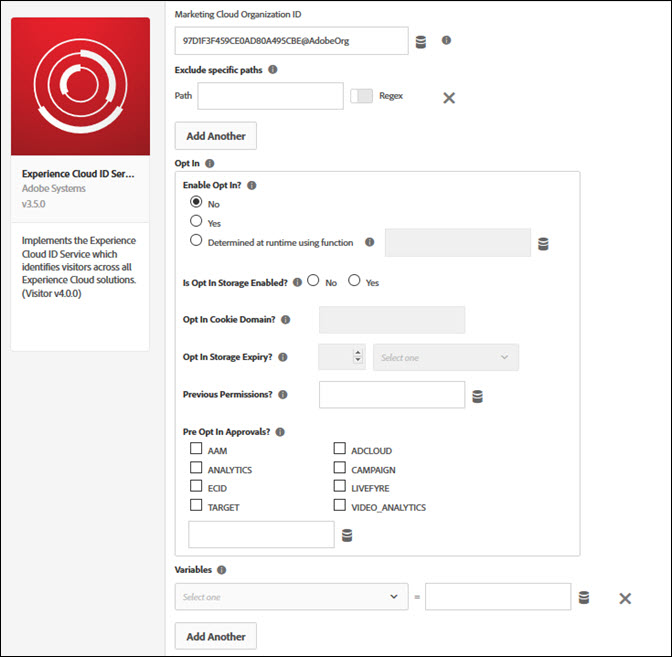

# Présentation de lʼextension Service d’identités d’Adobe Experience Cloud

>[!NOTE]
>
>Adobe Experience Platform Launch est désormais une suite de technologies destinées à la collecte de données dans Adobe Experience Platform. Plusieurs modifications terminologiques ont par conséquent été apportées à la documentation du produit. Reportez-vous au [document](../../../term-updates.md) suivant pour consulter une référence consolidée des modifications terminologiques.

Cette référence vous permet dʼobtenir plus dʼinformations sur la configuration de lʼextension du service Experience Cloud ID dʼAdobe et sur les options disponibles lors de lʼutilisation de cette extension afin de créer une règle.

Utilisez cette extension pour intégrer le service d’identités d’Experience Cloud à votre propriété. Grâce au service d’identités d’Experience Cloud, vous pouvez créer et stocker des identifiants uniques et persistants pour les personnes qui visitent votre site.

## Configuration de l’extension Experience Cloud ID

Cette section fournit des informations relatives aux options disponibles lors de la configuration de l’extension Experience Cloud ID.

Si lʼextension Experience Cloud ID nʼest pas encore installée, ouvrez votre propriété, puis cliquez sur **[!UICONTROL Extensions > Catalogue]**, survolez lʼextension Experience Cloud ID avec votre souris et cliquez sur **[!UICONTROL Installer]**.

Pour configurer l’extension, ouvrez l’onglet Extensions, survolez-la avec la souris, puis cliquez sur **[!UICONTROL Configurer]**.

Les options de configuration disponibles sont les suivantes :

### Experience Cloud Organization ID (ID d’organisation d’Experience Cloud)

ID de votre organisation Experience Cloud.

Votre ID est une chaîne alphanumérique de 24 caractères suivie par `@AdobeOrg`. Si vous ne connaissez pas votre ID, contactez l’Assistance clientèle.

### Exclusion de chemins d’accès spécifiques

L’ID Experience Cloud ID ne se charge pas si l’URL correspond à l’un des chemins spécifiés.

(Facultatif) Activez les Regex s’il s’agit d’une expression régulière.

Cliquez sur **[!UICONTROL Ajouter]** pour exclure un autre chemin.

### Opt-in (Accord préalable)

Utilisez les options Opt-in (Accord préalable) pour déterminer si les visiteurs doivent accepter les services Adobe sur votre site, ainsi que pour savoir si des cookies peuvent être créés pour suivre l’activité des visiteurs.

L’option Opt-in (Accord préalable) est le point de référence centralisé pour toutes les bibliothèques côté client de la solution Platform afin de déterminer si des cookies peuvent être créés sur l’appareil ou le navigateur d’un utilisateur lors de sa visite sur votre site. L’opt-in ne prend pas en charge la collecte ou le stockage des préférences d’autorisation des utilisateurs.

**Activer Opt-in (Accord préalable) ?**

L’option sélectionnée détermine si votre site web attend le consentement pour suivre les activités d’un visiteur sur votre site web.

Il existe trois options :

* **No** (Non) : n’attend pas le consentement pour suivre le visiteur. Il s’agit du comportement par défaut si vous ne sélectionnez pas d’option.
* **Yes** (Oui) : attend le consentement pour suivre le visiteur.
* **Determined at runtime using function** (Déterminé lors de l’exécution à l’aide de la fonction) : déterminer par programmation si la valeur est true (vrai) ou false (faux) lors de l’exécution. Si vous sélectionnez cette option, le champ Select Data Element (Sélectionner l’élément de données) devient disponible. Sélectionnez un élément de données pouvant déterminer si le consentement doit être attendu. Cet élément de données correspond à une valeur booléenne. Vous pouvez, par exemple, sélectionner un élément de données qui fournit le consentement en fonction du pays du visiteur, s’il se trouve ou non dans l’UE.

**L’Opt-in (Accord préalable) de stockage est-il Enabled (Activé) ?**

S’il est activé, le consentement est stocké dans un cookie propriétaire sur votre domaine. S’il n’est pas activé, les paramètres de consentement sont conservés dans votre CMP ou dans un cookie que vous gérez.

**Opt In Cookie Domain?** (Domaine du cookie Opt-in ?)

Utilisez ce paramètre facultatif pour spécifier le domaine dans lequel le cookie Opt-in (Accord préalable) est stocké si le stockage est activé. Vous pouvez entrer un domaine ou sélectionner un élément de données contenant le domaine.

**Opt In Storage Expiry?** (Expiration du stockage Opt-in ?)

Indiquez quand le cookie Opt-in (Accord préalable) expire si le stockage est activé, en secondes.

Saisissez un nombre, puis sélectionnez une unité de temps dans la liste déroulante. Par exemple, saisissez 2 et sélectionnez **[!UICONTROL Semaines]**. La valeur par défaut est de 13 mois.

**Permissions?** (Autorisations ?)

Transmettez le consentement précédent à la bibliothèque Opt-in (Accord préalable). Sélectionnez un élément de données contenant le consentement. Le type d’élément doit être un objet ou une chaîne JSON. Remplace les accords Opt-in (Accord préalable) dans les approbations.

Exemple :

`"{"aa":true,"aam":true,"ecid":true}"`

**Pre Opt In Approvals?** (Opt-in dans les approbations ?)

Définissez les catégories qui sont approuvées ou refusées lorsqu’aucune préférence n’a été définie par le visiteur. Le consentement est supposé pour les solutions sélectionnées à partir du moment où la page est chargée. Le type d’élément doit être un objet ou une chaîne JSON (exemple : `{aam: true}`).

### Variables

Définissez les paires nom-valeur comme propriétés d’instance Experience Cloud ID. Utilisez la liste déroulante pour sélectionner une variable, puis saisissez ou sélectionnez une valeur. Pour plus dʼinformations sur chaque variable, reportez-vous à la [documentation sur le service d’identités d’Experience Cloud](https://experiencecloud.adobe.com/resources/help/fr_FR/mcvid/mcvid-overview.html).

## Types d’actions de l’extension Experience Cloud ID

Cette section décrit les types d’actions disponibles dans l’extension Experience Cloud ID.

### Types d’actions

#### Set Customer IDs (Définition des ID de client)

Définissez un ou plusieurs ID de client.

1. Saisissez le code d’intégration.

   Le code d’intégration doit contenir la valeur configurée en tant que source de données dans Audience Manager ou dans Customer Attributes (Attributs du client).

1. Sélectionnez une valeur.

   La valeur doit être un ID d’utilisateur. Les éléments de données sont mieux adaptés aux valeurs dynamiques, tels que les identifiants du système interne d’un client spécifique.

1. Sélectionnez un état d’authentification.

   Les options disponibles sont les suivantes :

   * Unknown (Inconnu)
   * Authenticated (Authentifié)
   * Logged out (Déconnecté)

1. (Facultatif) Cliquez sur **[!UICONTROL Ajouter]** pour définir dʼautres ID de client.
1. Sélectionnez **[!UICONTROL Conserver les modifications]**.
