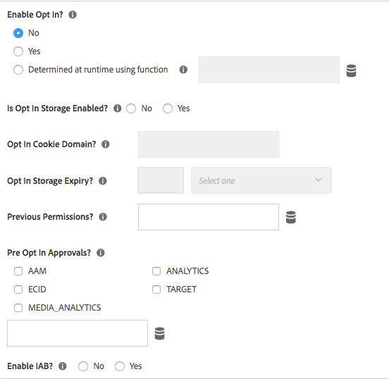
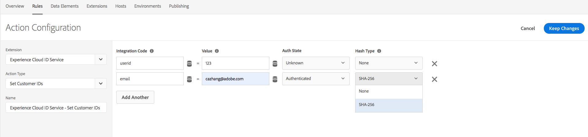
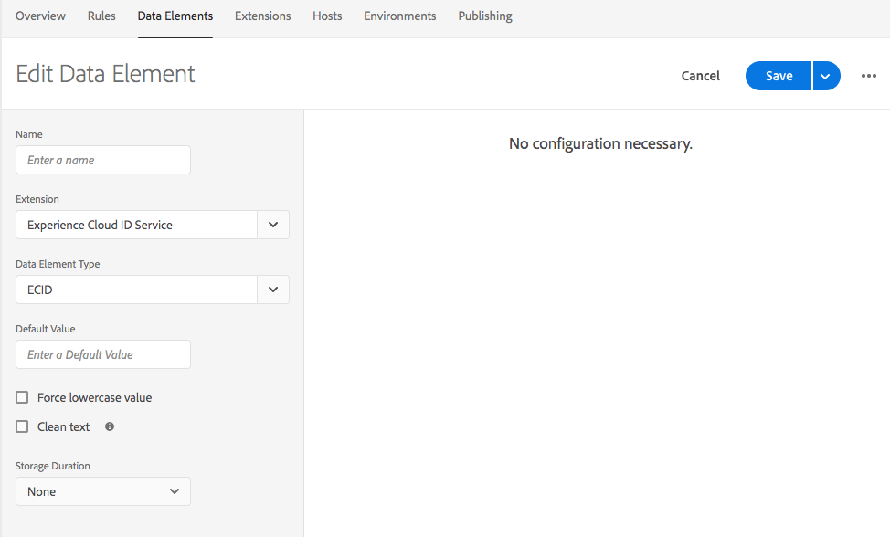
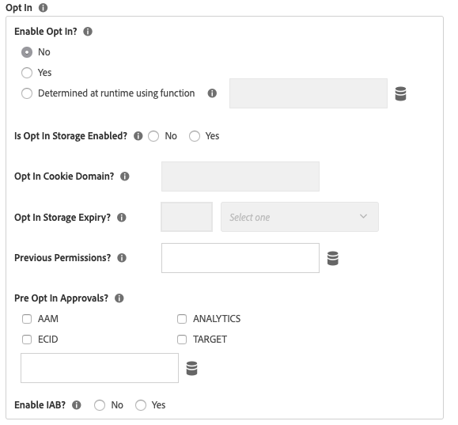

# Notes de mise à jour de l’extension Service d’identités d’Adobe Experience Cloud

Ce document contient les notes de mise à jour de l’extension Adobe Experience Cloud Identity Service pour les balises. Pour les notes de mise à jour d’Experience Cloud Identity Service lui-même, reportez-vous à la [documentation d’Identity Service](https://experienceleague.adobe.com/docs/id-service/using/release-notes/release-notes.html?lang=fr).

## 17 Oct 2022

### Extension 5.5.0 d’Experience Cloud ID

* L’extension prend désormais en charge la version 5.5.0 du [client JS visiteur](https://github.com/Adobe-Marketing-Cloud/id-service). Reportez-vous aux [notes de mise à jour des visiteurs](https://github.com/Adobe-Marketing-Cloud/id-service/releases/tag/5.5.0) pour obtenir des informations spécifiques.

## 9 Mars 2022

### Extension 5.4.0 d’Experience Cloud ID

* Cette version contient la dernière version 5.4.0 de Visitor, avec les mises à jour suivantes :

   * Possibilité de configurer la durée de vie du cookie `s_ecid` à l’aide de la configuration cookieLifetime
   * Mise à jour pour un problème de navigateur Firefox qui se produit lorsqu’une page est chargée dans un iFrame enfant

## 10 Oct 2021

### Extension 5.3.1 d’Experience Cloud ID

* Cette version contient la dernière version de Visitor 5.3.0, qui comporte les nouvelles mises à jour suivantes :

   * Algorithme mis à jour pour générer l’ECID local.
   * Dernier accord préalable avec les indicateurs `Secure` et `SameSite` pour le cookie de confidentialité
   * Correction d’un problème de navigateur Firefox lorsqu’une page est chargée dans un iFrame enfant

## 12 janvier 2021

### Extension 5.2.0 d’Experience Cloud ID

* Mise à jour du correctif VisitorJS 5.2.0 avec un correctif pour lʼélément de données ECID qui ne pouvait pas être mis à jour lors de la réception du consentement.

## 3 novembre 2020

### Extension 5.2.1 d’Experience Cloud ID

* Ce patch contient un correctif permettant d’écrire des cookies à partir d’un iFrame avec l’attribut `SameSite=None` dans le navigateur Google Chrome.

## 27 octobre 2020

### Extension 5.1.0 d’Experience Cloud ID

* Ajouter la configuration `sameSiteCookie` pour spécifier l’attribut `SameSite` du cookie `AMCV`.
Cette configuration prend en charge les valeurs suivantes pour l’attribut `SameSite` :

   * `Strict`
   * `Lax`
   * `None`

Les détails de ces valeurs d’attribut sont sur [web.dev](https://web.dev/samesite-cookies-explained/) et [chrome](https://www.chromium.org/updates/same-site).

## 13 août 2020

### Extension 5.0.1 d’Experience Cloud ID

* Mise à jour du patch VisitorJS 5.0.1 avec un correctif pour l’ajout de l’indicateur d_cf lorsque la chaîne de consentement IAB a été modifiée.

## mardi 15 juin 2020

### Extension 5.0.0 d’Experience Cloud ID

* Ajout du support pour le `IAB TCF` - Transparency and Consent Framework - `Version 2.0`.

## mardi 13 avril 2020

### Extension 4.6.0 d’Experience Cloud ID

* L’indicateur `loadSSL` est activé par défaut. Tous les appels au service d’identités seront par défaut en `https`. Les clients peuvent définir ce paramètre sur false s’ils souhaitent appeler le service d’identités en HTTP à partir de leurs pages non SSL.
* Mise à jour de la fonction utilisée pour détecter la version d’Internet-Explorer (IE), afin de corriger un problème signalé par ESLint.
* Correction d’un bogue pour un problème de performances sur Internet-Explorer (IE) 11 lorsque l’inclusion pre-approval est accordée à ECID et que ce dernier est mis à jour ultérieurement.

## jeudi 22 janvier 2020

### Extension 4.5.2 d’Experience Cloud ID

* Mise à jour du fichier visitor.js vers la version 4.5.2.
* La version 4.5.1 du fichier visitor.js comprend un correctif relatif au plug-in IAB pour l’inclusion.
* Mise à jour de la méthode `setCustomerIDs` pour rejeter les ID vides envoyés.

## mercredi 7 janvier 2020

### Extension 4.4.2 d’Experience Cloud ID

* Mise à jour du fichier visitor.js vers la version 4.4.2.
* Améliorations de la méthode `getVisitorValues` pour récupérer les valeurs plus rapidement.

## vendredi 19 septembre 2019

### Extension 4.4.1 d’Experience Cloud ID

* Mise à jour du fichier visitor.js vers la version 4.4.1
* Correction d’un bogue concernant l’obtention de l’entrée de preApprovals en opt-in
* VIDEO_ANALYTICS renommé MEDIA_ANALYTICS dans preOptInApprovals

  

## jeudi 17 juillet 2019

### Extension 4.4.0 d’Experience Cloud ID

* Mise à jour du fichier visitor.js vers la version 4.4.0
* Ajout de la prise en charge du hachage SHA-256 pour setCustomerIDs

  

## mardi 13 mai 2019

### Extension 4.3.1 d’Experience Cloud ID

* Mise à jour du fichier visitor.js vers la version 4.3
* Type d’élément de données ajouté pour ECID dans le cadre de l’extension de balise

  

## 9 avril 2019

### Extension 4.2.0 d’Experience Cloud ID

* Mise à jour du fichier visitor.js vers la version 4.2 incluant la prise en charge du plug-in IAB TCF pour Audience Manager.

## mardi 25 février 2019

### Extension 4.1.0 d’Experience Cloud ID

* Mise à jour de visitor.js vers la version 4.1, qui mettait à jour publishDestinations par nouvelle modification de l’API. Avec cette mise à jour, les informations du référent de la page peuvent être exposées pendant la synchronisation ID, si nécessaire.

## samedi 15 février 2019

### Extension 4.0.0 d’Experience Cloud ID

* Mise à jour du fichier visitor.js vers la version 4.0
* Ajout d’options de configuration pour le nouvel objet intégré d’accord préalable. Les paramètres d’accord préalable peuvent être utilisés pour supprimer les cookies et les appels de balises des solutions Adobe pour mieux prendre en charge les réglementations comme le RGPD

  

## mercredi 20 mars 2018

### Extension 3.1.0 d’Experience Cloud ID

* Mise à jour du fichier visitor.js vers la version 3.1
* Ajout de deux propriétés de configuration : `resetBeforeVersion` et `serverState`.
