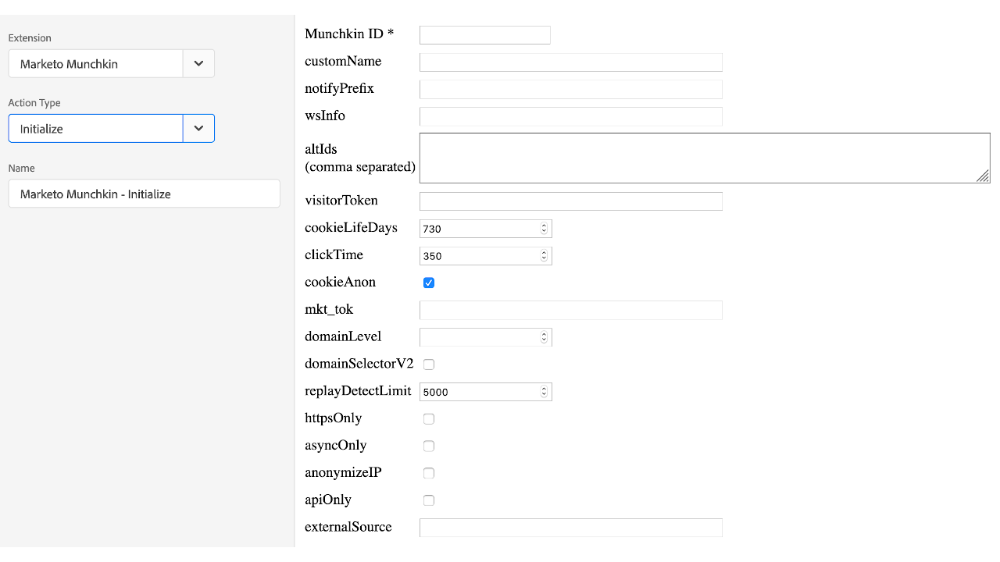
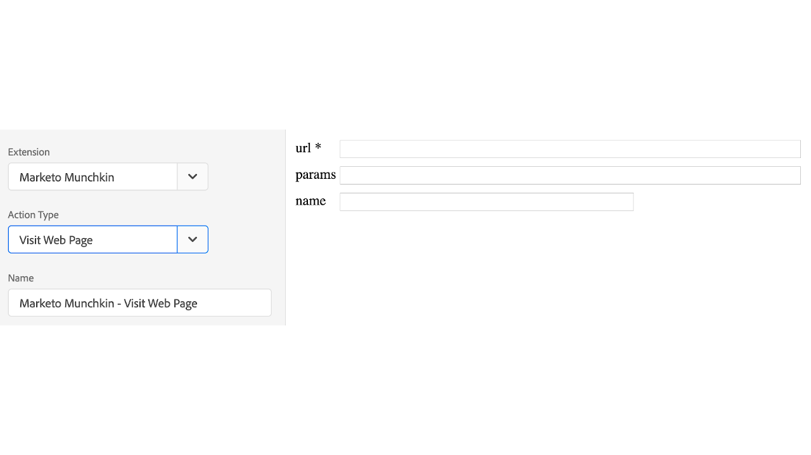
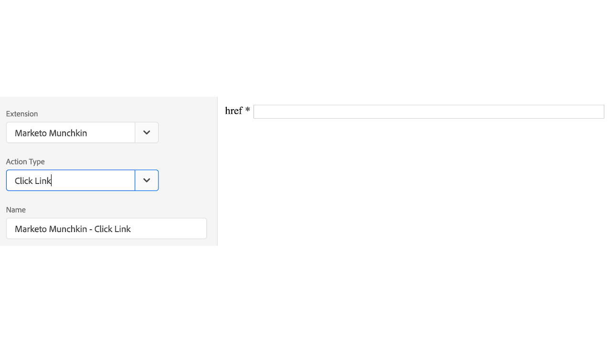

# Présentation de l’extension Marketo Munchkin

Utilisez cette extension pour intégrer le code de suivi [!DNL Marketo Munchkin] JavaScript à votre propriété. [!DNL Marketo Munchkin] JavaScript permet de suivre les visites de pages des utilisateurs finaux et d’accéder à vos pages de destination Marketo et à vos pages web externes.

## Installer l’extension Marketo Munchkin

Si [!DNL Marketo Munchkin] extension n’est pas encore installée, ouvrez votre propriété, puis cliquez sur **[!UICONTROL Extensions > Catalogue]**, survolez l’extension [!DNL Marketo Munchkin] avec la souris et cliquez sur **[!UICONTROL Installer]**.

Cette extension n’a pas besoin d’être configurée.

## Types d’action de l’extension Marketo Munchkin

Cette section décrit les types d’actions disponibles dans l’extension [!DNL Marketo Munchkin].

### Initialiser

**Munchkin ID : (obligatoire)** ID de compte Munchkin situé sous Admin > Intégration > Menu Munchkin.

**Configurations :** tous les paramètres configurables sont détaillés [ici](https://developers.marketo.com/javascript-api/lead-tracking/configuration/).

### Visite de page web

**url : (obligatoire)** chemin d’accès au fichier URL utilisé pour enregistrer la visite d’une page.

**params :** chaîne de requête des paramètres que vous souhaitez enregistrer.

**name :** nom personnalisé de la ressource de la page Web.

### Lien de clic

**href : (obligatoire)** chemin d’accès au fichier URL utilisé pour enregistrer un clic sur les liens.
