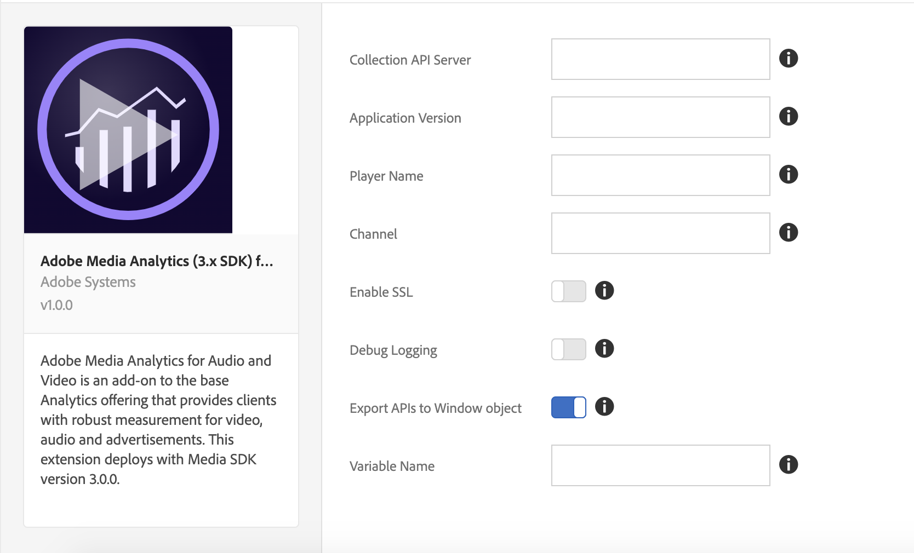

# Présentation de lʼextension Adobe Media Analytics (3.x SDK) for Audio and Video

Pour plus d’informations sur l’installation, la configuration et la mise en œuvre de l’extension Adobe Media Analytics (SDK 3.x) for Audio and Video (extension Media Analytics), utilisez cette documentation. Les options disponibles lors de l’utilisation de cette extension pour créer une règle, ainsi que des exemples et des liens vers des exemples, sont inclus.

L’extension Media Analytics (MA) ajoute le SDK principal JavaScript Media (SDK Media 3.x). Cette extension est une fonctionnalité qui permet d’ajouter l’instance `Media` de suivi à un site ou à un projet acceptant les balises. L’extension MA requiert deux extensions supplémentaires :

* [Extension Analytics](../analytics/overview.md)
* [L’extension Experience Cloud ID](../id-service/overview.md)

>[!IMPORTANT]
>
>Cette extension est déployée avec le SDK Media 3.x, qui n’a pas de compatibilité descendante avec le SDK Media 2.x. Puisque la version 2.x a été abandonnée, veuillez mettre à jour vers la version 3.x.

Après avoir inclus les trois extensions mentionnées ci-dessus dans votre projet acceptant les balises, vous pouvez procéder de deux façons :

* Utiliser les API `Media` de votre application web
* Inclure ou créer une extension spécifique au lecteur qui associe des événements de lecteur multimédia spécifiques aux API sur l’instance de suivi `Media`. Cette instance est exposée via l’extension MA.

## Installation et configuration de l’extension MA

* **Installer :** Pour installer l’extension MA, ouvrez la propriété d’extension, cliquez sur **[!UICONTROL Extensions > Catalog]**, survolez l’extension **[!UICONTROL Adobe Media Analytics (3.x SDK) for Audio and Video]** avec votre souris et cliquez sur **[!UICONTROL Install]**.

* **Configurer :** Pour configurer l’extension MA, ouvrez l’onglet [!UICONTROL Extensions], survolez l’extension avec votre souris, puis cliquez sur **[!UICONTROL Configure]** :



### Options de configuration :

| Option | Description |
| :--- | :--- |
| Collection API Server | Définit le serveur d’API Media Collection (contactez votre représentant Adobe pour obtenir ce serveur) |
| Application Version | La version de l’application/du SDK du lecteur multimédia |
| Nom du lecteur | Le nom du lecteur multimédia en cours d’utilisation (par exemple, « AVPlayer », « Lecteur HTML5 », « Mon lecteur personnalisé ») |
| Canal | Propriété du nom de canal |
| Debug Logging | Activation ou désactivation de la journalisation |
| Enable SSL | Activation ou désactivation de l’envoi de pings via HTTPS |
| Export APIs to Window Object | Activer ou désactiver l’exportation des API Media Analytics vers la portée globale |
| Variable Name | Une variable utilisée pour exporter les API de Media Analytics sous l’objet `window` |

**Rappel :** l’extension MA requiert les extensions [Analytics](../analytics/overview.md) et [Experience Cloud ID](../id-service/overview.md). Vous devez également ajouter ces extensions à la propriété de votre extension et les configurer.

## Utilisation de l’extension MA

### Utilisation depuis une page web/application JavaScript

L’extension MA exporte les API Media dans l’objet global window en activant le paramètre « Export APIs to Window Object » dans la page [!UICONTROL Configuration]. Il exporte les API sous le nom de variable configuré. Par exemple, si le nom de variable est configuré pour être `ADB`, vous pouvez alors accéder aux API Media via `window.ADB.Media`.

>[!IMPORTANT]
>
>L’extension MA exporte les API uniquement lorsque `window["CONFIGURED_VARIABLE_NAME"]` n’est pas défini et ne remplace pas les variables existantes.

1. **API Media :** `window["CONFIGURED_VARIABLE_NAME"].Media`

   Expose toutes les API et constantes du SDK Media : [https://adobe-marketing-cloud.github.io/media-sdks/reference/javascript_3x/APIReference.html](https://adobe-marketing-cloud.github.io/media-sdks/reference/javascript_3x/APIReference.html)

1. **Créer une instance de suivi Media :** `window["CONFIGURED_VARIABLE_NAME"].Media.getInstance`

   **Valeur renvoyée :** Une instance de suivi `Media` pour le suivi d’une session de médias.

   ```javascript
   var Media = window["CONFIGURED_VARIABLE_NAME"].Media;
   
   var tracker = Media.getInstance();
   ```

1. A l’aide de l’instance de suivi Media, suivez la [documentation de l’API JS](https://adobe-marketing-cloud.github.io/media-sdks/reference/javascript_3x/index.html) pour mettre en œuvre le suivi des médias.

Vous pouvez obtenir l’exemple de lecteur ici : [MA Sample Player](https://github.com/Adobe-Marketing-Cloud/media-sdks/tree/master/samples/launch/js/3.x). Le lecteur d’exemple fait office de référence pour expliquer comment utiliser l’extension MA pour prendre en charge directement Media Analytics à partir d’une application web.


### Utilisation à partir d’autres extensions

L’extension MA expose `media` en tant que module partagé aux autres extensions. (Pour plus d’informations sur les modules partagés, voir la [documentation sur les modules partagés](../../../extension-dev/web/shared.md).)

>[!IMPORTANT]
>
>Les modules partagés ne sont accessibles que depuis d’autres extensions. En d’autres termes, une page web ou une application JavaScript ne peuvent pas accéder aux modules partagés ni utiliser `turbine` (voir l’exemple de code ci-dessous) en dehors d’une extension.

1. **API Media :** `media` Module partagé

   Expose toutes les API et constantes du SDK Media : [https://adobe-marketing-cloud.github.io/media-sdks/reference/javascript_3x/APIReference.html](https://adobe-marketing-cloud.github.io/media-sdks/reference/javascript_3x/APIReference.html)

1. Créez l’instance de suivi Media comme suit :

   **Valeur renvoyée :** Une instance de suivi `Media` pour le suivi d’une session de médias.

   ```javascript
   var Media =
     turbine.getSharedModule('adobe-media-analytics', 'media');
   
   var tracker = Media.getInstance();
   ```

1. A l’aide de l’instance de suivi Media, suivez la [documentation de l’API JS](https://adobe-marketing-cloud.github.io/media-sdks/reference/javascript_3x/index.html) pour mettre en œuvre le suivi des médias.

>[!NOTE]
>
>**Tests :** pour tester votre extension dans cette version, vous devez télécharger votre extension sur [Experience Platform](../../../extension-dev/submit/upload-and-test.md), où vous avez accès à toutes les extensions dépendantes.
