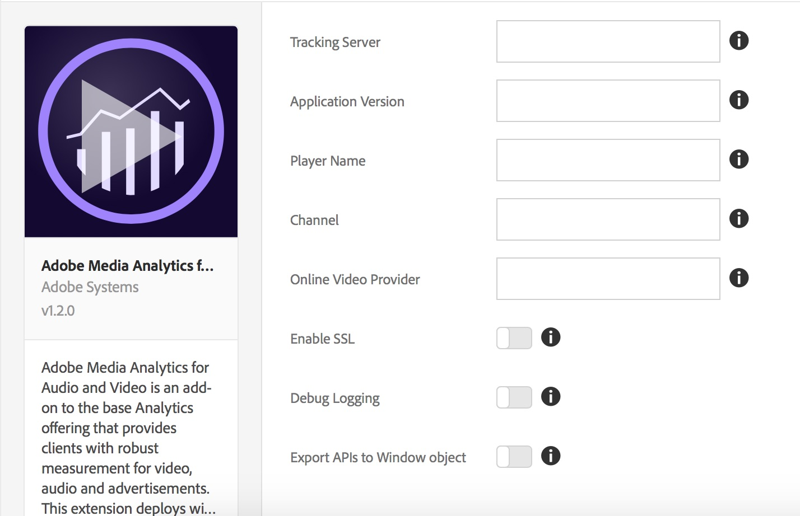

# Présentation de l’extension Adobe Media Analytics for Audio and Video

Pour plus d’informations sur l’installation, la configuration et la mise en œuvre de l’extension Adobe Media Analytics for Audio and Video (extension Media Analytics), utilisez cette documentation. Les options disponibles lors de l’utilisation de cette extension pour créer une règle, ainsi que des exemples et des liens vers des exemples, sont inclus.

L’extension Media Analytics (MA) ajoute le SDK principal JavaScript Media (SDK Media 2.x). Cette extension permet dʼajouter lʼinstance de suivi `MediaHeartbeat` à un site de balise ou à un projet. L’extension MA requiert deux extensions supplémentaires :

* [Extension Analytics](../analytics/overview.md)
* [L’extension Experience Cloud ID](../id-service/overview.md)

>[!IMPORTANT]
>
>Le suivi audio requiert l’extension Analytics version 1.6 ou ultérieure.

Après avoir inclus les trois extensions mentionnées ci-dessus dans votre projet de balise, vous pouvez procéder de deux façons :

* Utiliser les API `MediaHeartbeat` de votre application web
* Inclure ou créer une extension spécifique au lecteur qui associe des événements de lecteur multimédia spécifiques aux API sur l’instance de suivi `MediaHeartbeat`. Cette instance est exposée via l’extension MA.

## Installation et configuration de l’extension MA

* **Installation -** Pour installer l’extension MA, ouvrez la propriété de votre extension, puis sélectionnez **[!UICONTROL Extensions > Catalogue]** et placez le curseur sur l’extension **[!UICONTROL Adobe Media Analytics for Audio and Video]** et sélectionnez **[!UICONTROL Installer]**.

* **Configurer -** Pour configurer l’extension MA, ouvrez l’onglet [!UICONTROL Extensions], placez le curseur sur l’extension, puis cliquez sur **[!UICONTROL Configurer]** :



### Options de configuration :

| Option | Description |
| :--- | :--- |
| Serveur de suivi | Définit le serveur pour le suivi des pulsations multimédia (il ne s’agit pas du même serveur que votre serveur de suivi Analytics) |
| Application Version | La version de l’application/du SDK du lecteur multimédia |
| Nom du lecteur | Le nom du lecteur multimédia en cours d’utilisation (par exemple, « AVPlayer », « Lecteur HTML5 », « Mon lecteur personnalisé ») |
| Canal | Propriété du nom de canal |
| Online Video Provider | Nom de la plateforme vidéo en ligne sur laquelle le contenu est distribué |
| Debug Logging | Activation ou désactivation de la journalisation |
| Enable SSL | Activation ou désactivation de l’envoi de pings via HTTPS |
| Export APIs to Window Object | Activer ou désactiver l’exportation des API Media Analytics vers la portée globale |
| Variable Name | Une variable utilisée pour exporter les API de Media Analytics sous l’objet `window` |

**Rappel :** l’extension MA requiert les extensions [Analytics](../analytics/overview.md) et [Experience Cloud ID](../id-service/overview.md). Vous devez également ajouter ces extensions à la propriété de votre extension et les configurer.

## Utilisation de l’extension MA

### Utilisation depuis une page web/application JavaScript

L’extension MA exporte les API MediaHeartbeat dans l’objet fenêtre global en activant le paramètre « Exporter les API vers l’objet fenêtre » de la page [!UICONTROL Configuration]. Il exporte les API sous le nom de variable configuré. Par exemple, si le nom de variable est configuré pour être `ADB`, vous pouvez alors accéder à MediaHeartbeat via `window.ADB.MediaHeartbeat`.

>[!IMPORTANT]
>
>L’extension MA exporte les API uniquement lorsque `window["CONFIGURED_VARIABLE_NAME"]` n’est pas défini et ne remplace pas les variables existantes.

1. **Créer une instance MediaHeartbeat** : `window["CONFIGURED_VARIABLE_NAME"].MediaHeartbeat.getInstance`

   **Paramètres** : un objet délégué valide exposant ces fonctions.

   | Méthode |  Description   |
   | :--- | :--- |
   | `getQoSObject()` | Retourne l’instance `theMediaObject` contenant les informations actuelles sur la qualité de service QoS. Cette méthode est appelée à plusieurs reprises au cours d’une session de lecture. La mise en œuvre du lecteur doit toujours retourner les plus récentes données QoS disponibles. |
   | `getCurrentPlaybackTime()` | Renvoie la position actuelle du curseur de lecture. Pour le suivi VOD, la valeur est indiquée en secondes à partir du début de l’élément média. Pour le suivi LIVE/LIVE, la valeur est indiquée en secondes à partir du début du programme. |

   **Valeur renvoyée** : une promesse qui est résolue avec une instance `MediaHeartbeat` ou rejetée avec un message d’erreur.

1. **Accéder aux constantes MediaHeartbeat :** `window["CONFIGURED_VARIABLE_NAME"].MediaHeartbeat`

   Cette opération expose toutes les constantes et les méthodes statiques de la classe [`MediaHeartbeat`](https://adobe-marketing-cloud.github.io/media-sdks/reference/javascript/MediaHeartbeat.html).

   Vous pouvez obtenir l’exemple de lecteur ici : [MA Sample Player](https://github.com/Adobe-Marketing-Cloud/media-sdks/tree/master/samples/launch/js/2.x). Le lecteur d’exemple fait office de référence pour expliquer comment utiliser l’extension MA pour prendre en charge directement Media Analytics à partir d’une application web.

1. Créez l’instance de suivi MediaHeartbeat comme suit :

   ```javascript
   var MediaHeartbeat = window["CONFIGURED_VARIABLE_NAME"].MediaHeartbeat;
   
   var delegate = {
       getCurrentPlaybackTime: this._getCurrentPlaybackTime.bind(this),
       getQoSObject: this._getQoSObject.bind(this),
   };
   
   var config = {
       playerName: "Custom Player",
       ovp: "Custom OVP",
       channel: "Custom Channel"
   };
   
   var self = this;
   MediaHeartbeat.getInstance(delegate, config).then(function(instance) {
       self._mediaHeartbeat = instance;
       // Do Tracking using the MediaHeartbeat instance.
   }).catch(function(err){
       // Getting MediaHeartbeat instance failed.
   });
   ```

### Utilisation à partir d’autres extensions

L’extension MA expose les modules partagés `get-instance` et `media-heartbeat` à d’autres extensions. (Pour plus d’informations sur les modules partagés, voir la [documentation sur les modules partagés](../../../extension-dev/web/shared.md).)

>[!IMPORTANT]
>
>Les modules partagés ne sont accessibles que depuis d’autres extensions. En d’autres termes, une page web ou une application JavaScript ne peuvent pas accéder aux modules partagés ni utiliser `turbine` (voir l’exemple de code ci-dessous) en dehors d’une extension.

1. **Créer une instance MediaHeartbeat** `get-instance` : module partagé

   **Paramètres** :

   * Un objet délégué valide exposant ces fonctions :

     | Méthode |  Description   |
     | :--- | :--- |
     | `getQoSObject()` | Retourne l’instance `MediaObject` contenant les informations actuelles sur la qualité de service QoS. Cette méthode est appelée à plusieurs reprises au cours d’une session de lecture. La mise en œuvre du lecteur doit toujours retourner les plus récentes données QoS disponibles. |
     | `getCurrentPlaybackTime()` | Renvoie la position actuelle du curseur de lecture. Pour le suivi VOD, la valeur est indiquée en secondes à partir du début de l’élément média. Pour le suivi LIVE/LIVE, la valeur est indiquée en secondes à partir du début du programme. |

   * Un objet de configuration facultatif exposant ces propriétés :

     | Propriété | Description | Obligatoire |
     | :--- | :--- | :--- |
     | Online Video Provider | Nom de la plateforme vidéo en ligne sur laquelle le contenu est distribué. | Non. Le cas échéant, remplace la valeur définie pendant la configuration de l’extension. |
     | Nom du lecteur | Le nom du lecteur multimédia en cours d’utilisation (par exemple, « AVPlayer », « Lecteur HTML5 », « Mon lecteur personnalisé ») | Non. Le cas échéant, remplace la valeur définie pendant la configuration de l’extension. |
     | Canal | Propriété du nom de canal | Non. Le cas échéant, remplace la valeur définie pendant la configuration de l’extension. |

   **Valeur renvoyée** : une promesse qui est résolue avec une instance `MediaHeartbeat` ou rejetée avec un message d’erreur.

1. **Accéder aux constantes MediaHeartbeat** `media-heartbeat` : module partagé

   Ce module expose toutes les constantes et les méthodes statiques de cette classe : [https://adobe-marketing-cloud.github.io/media-sdks/reference/javascript/MediaHeartbeat.html](https://adobe-marketing-cloud.github.io/media-sdks/reference/javascript/MediaHeartbeat.html).

1. Créez l’instance de suivi MediaHeartbeat comme suit :

   ```javascript
   var getMediaHeartbeatInstance =
     turbine.getSharedModule('adobe-video-analytics', 'get-instance');
   
   var MediaHeartbeat =
     turbine.getSharedModule('adobe-video-analytics', 'media-heartbeat');
     ...
   
   var delegate = {
       getCurrentPlaybackTime: this._getCurrentPlaybackTime.bind(this),
       getQoSObject: this._getQoSObject.bind(this),
   }
   
   var config = {
       playerName: "Custom Player",
       ovp: "Custom OVP",
       channel: "Custom Channel"
   }
   ...
   
   var self = this;
   getMediaHeartbeatInstance(delegate, config).then(function(instance) {
       self._mediaHeartbeat = instance;
       ...
       // Do Tracking using the MediaHeartbeat instance.
   }).catch(function(err){
       // Getting MediaHeartbeat instance failed.
   });
   
   ...
   ```

1. À l’aide de l’instance Pulsations multimédia, consultez la [documentation JS du SDK multimédia](https://experienceleague.adobe.com/docs/media-analytics/using/legacy-implementations/legacy-media-sdks/setup-javascript/set-up-js-2.html) et la [documentation de l’API JS](https://adobe-marketing-cloud.github.io/media-sdks/reference/javascript/index.html) pour mettre en œuvre le suivi multimédia.

>[!NOTE]
>
>**Tests :** pour tester votre extension dans cette version, vous devez télécharger votre extension sur [Experience Platform](../../../extension-dev/submit/upload-and-test.md), où vous avez accès à toutes les extensions dépendantes.


<!--
## Leveraging the sample HTML5 player

You can obtain the MA extension sample HTML5 player here: [HTML5 Sample Player](https://github.com/adobe/reactor-adobe-va-sample-player). The sample player acts as a reference to create video player extensions and to showcase using the MA extension to support media tracking.

### Sample player extension action types

This section describes the action types available in the Sample Player extension.

#### Open Video

The _Open Video_ action provides various configurations for creating and customizing an HTML5 player, providing a video to play and enabling/disabling Adobe Video Analytics tracking.

**Action Configuration / Player Settings:** Note the CSS Selector setting which specifics the `<div>` in the web page where the player is added. Note also that the _Enable Adobe Analytics_ checkbox is checked in the Analytics Settings pane.


* [\[...\]/openVideo/openVideo.jsx](https://github.com/adobe/reactor-adobe-va-sample-player/blob/master/src/view/actions/openVideo/openVideo.jsx) -

  UI Code to configure the Action is defined here.

* [\[...\]/actions/openVideo.js](https://github.com/adobe/reactor-adobe-va-sample-player/blob/master/src/lib/actions/openVideo.js) - This file exports a function that gets executed when the Action is triggered as part of the tag rule.

  This is a code snippet from `openVideo.js` where the `openVideo` Action is executed:

  ```javascript
    function openVideo(settings) {
        let player;
        try {
            Logger.info(LOG_TAG, `Executing action with ${JSON.stringify(settings)}`);

            player = new PlayerFacade(settings);
            PlayerStore.registerPlayer(player);
            player.load(settings.media);
        } catch (ex) {
            Logger.error(LOG_TAG, `Creating player for action openVideo failed with error ${ex.message}`);

            // Cleanup from DOM.
            if (player) {
                player.destroy();
            }
        }
    }
    ...
  ```

* [\[...\]/analytics/adobeAnalyticsProvider.js](https://github.com/adobe/reactor-adobe-va-sample-player/blob/master/src/lib/helpers/analytics/adobeAnalyticsProvider.js) - This file implements Video Analytics tracking by using Shared Modules exposed by the VA extension.

### Sample player extension basic deployment

Once the Sample Player extension is installed, you'll need to create at least one rule to properly deploy it. The Image below shows a sample rule that opens the specified video when the core extension fires the `DOMLoaded` event.


After you have saved this rule, you will need to add it to a Library, and then build and deploy so that you can test the behavior.

-->
