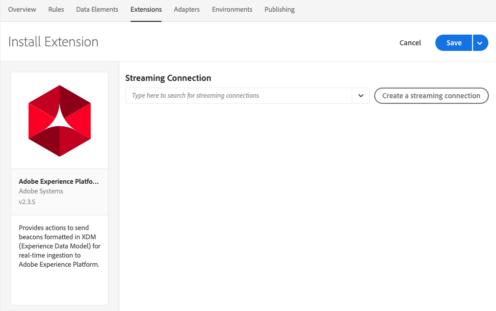

# Extension Adobe Experience Platform Demo

>[!NOTE]
>
>Cette extension sera abandonnée au profit du [SDK Web Adobe Experience Platform](../web-sdk/overview.md).

Les fonctionnalités de cette extension sont transférées vers une nouvelle extension. Voici une rapide comparaison des fonctionnalités actuelles.

| Extension Experience Platform Demo | SDK web Experience Platform |
| ------------------ | ----------- |
| Prise en charge des ID client personnalisés | Prise en charge des ID client personnalisés |
| Interface utilisateur de mappage côté client pour XDM | Création dans ECID (pas besoin de visitor.js) |
| Possibilité de créer une connexion continu | Prise en charge de l’inclusion |
| | Prise en charge de XDM en tant qu’élément de données |
| | Prise en charge des domaines de premier niveau |
| | Outils de débogage intégrés |
| | Collecte automatique du contexte du navigateur |
| | Entièrement open source |

## Configuration de l’extension Adobe Experience Platform

Cette section fournit une référence pour les options disponibles lors de la configuration de l’extension Adobe Experience Platform.

Si l’extension Adobe Experience Platform n’est pas encore installée, ouvrez votre propriété, puis cliquez sur **[!UICONTROL Extensions > Catalog]**, survolez l’extension Adobe Experience Platform et cliquez sur **[!UICONTROL Install]**.

Pour configurer l’extension, ouvrez l’onglet [!UICONTROL Extensions], survolez l’extension avec la souris, puis cliquez sur **[!UICONTROL Configure]**.

### Connexion en continu

Le choix d’une connexion en continu est la première étape pour commencer à envoyer des données en continu vers Adobe Experience Platform. Vous pouvez sélectionner une connexion dans la zone de liste déroulante de connexion en continu. Connexion en continu est un champ obligatoire. Si aucune connexion en continu n’est créée, vous pouvez en créer une en cliquant sur le bouton **[!UICONTROL Create a streaming connection]**.

Si vous sélectionnez **[!UICONTROL Create a streaming connection]**, une fenêtre modale s’affiche.

Le modal contient les champs avec des valeurs préremplies qui peuvent être modifiées en fonction de vos besoins. Si vous prévoyez de créer plusieurs connexions en continu, n’oubliez pas que le champ **[!UICONTROL Data Source]** doit être unique. Toute tentative pour créer une autre connexion en continu à l’aide d’une **[!UICONTROL Data Source]** utilisée sur une autre connexion échouera.

Une fois que vous avez sélectionné un point d’entrée de connexion en continu, l’URL et la source du point d’entrée de connexion en continu s’affichent.

## Types d’actions de l’extension Adobe Experience Platform

Cette section décrit les types d’actions disponibles dans l’extension Adobe Experience Platform.

### Send Beacon (Envoyer la balise) {#send-beacon}

Le type d’action à utiliser pour envoyer des données à Adobe Experience Platform.

Il faut d’abord sélectionner le jeu de données où les données seront stockées. En général, les jeux de données ont la forme d’un tableau où sont stockées les données envoyées via la connexion en continu. Vous devez créer des jeux de données au sein d’Adobe Experience Platform avant d’utiliser ce type d’action.

Une fois que vous avez sélectionné le jeu de données où les données seront stockées, les détails du schéma associé au jeu de données sélectionné s’affichent.

### Mappage de schéma

Après avoir sélectionné le jeu de données, vous pouvez définir votre mappage de schéma.

Le champ Valeur source accepte une valeur ou un élément de données. Vous pouvez ajouter un élément de données en cliquant sur le bouton de l’élément de données situé à côté du champ valeur source.

Le champ de schéma cible contient le chemin d’un champ XDM défini dans le schéma de jeu de données. Pour les champs définis plus précisément dans la hiérarchie de schéma, vous pouvez utiliser le point comme séparateur des parties du chemin d’accès (par exemple timeSeriesEvents.eventType).

### Sélecteur de champ de schéma

L’extension permet aussi de sélectionner un champ de schéma cible à l’aide d’un sélecteur visuel. Si vous cliquez sur le bouton cible situé en regard de l’entrée du champ de schéma cible, un modal s’affiche et montre l’arborescence du schéma du jeu de données. Vous pouvez sélectionner un champ, puis cliquer sur le bouton **Sélectionner** et l’entrée du champ de schéma cible sera mise à jour avec le chemin XDM correct.

### Champs d’identité au sein d’Adobe Experience Platform

Les schémas de données d’enregistrement et les schémas de données de séries chronologiques peuvent contenir un ou plusieurs champs d’identité. Les champs d’identité se combinent pour former une représentation d’identité unique d’un objet et incluent des informations comme un identifiant CRM, un Experience Cloud ID (ECID), un cookie de navigateur, un ID publicitaire ou d’autres identifiants dans différents domaines.

Les champs d’identité peuvent être définis de deux manières au sein du schéma :

1. Les schémas d’enregistrement et de séries temporelles contiennent tous deux un champ spécial appelé `xdm:identityMap` contenant une carte des identités.
1. Les champs clés peuvent être marqués comme des champs « Identité » au sein du schéma.

### Champs d’identité au sein de l’extension Adobe Experience Platform

Pour chaque champ de schéma défini comme champ d’identité, une ligne est ajoutée à la section de mappage de schéma. Chaque ligne ajoutée contient le champ de schéma cible prérempli avec le chemin de schéma XDM correspondant. Un champ de schéma est aussi un champ d’identité s’il y a une icône profil à côté du champ.

Les champs d’identité principaux étant obligatoires, vous ne pouvez pas supprimer les lignes qui les contiennent de la section de mappage de schéma.

Un champ de schéma défini comme champ d’identité non principal sera automatiquement ajouté à la section de mappage de schéma, mais l’entrée valeur source peut rester vide. Ce champ peut être supprimé. Ce champ sera ignoré si l’entrée valeur source correspondante est vide.

Une icône d’avertissement s’affiche à côté de chaque champ d’identité non principal ne contenant aucune valeur.

Une section d’identité s’affiche si votre schéma contient un champ `xdm:identityMap`. Vous pouvez utiliser cette section si vous préférez envoyer des données liées aux identités à l’aide du champ `xdm:identityMap`.

La section de mappage d’identité peut contenir plusieurs lignes. Chaque ligne peut définir un certain type d’identité. Pour chaque identité, vous pouvez définir plusieurs attributs, à savoir le type, l’état d’authentification et la valeur, ainsi qu’indiquer s’il s’agit de l’identité principale ou non.

Si la section de mappage d’identité comporte plusieurs identités, une seule identité peut être marquée comme identité principale.

Si l’un des schémas comporte un champ `xdm:identityMap` et qu’un autre champ est marqué comme champ d’identité principal, la colonne « primary » de la section de mappage d’identité ne sera pas visible.

### Champs obligatoires

Certains schémas comporteront des champs obligatoires au niveau supérieur. Les plus fréquents sont `timestamp` et `_id`. Si ces champs ne sont pas définis, l’envoi de la balise échouera. Vous pouvez définir ces champs dans la section de mappage de schéma.

Si votre section de mappage de schéma ne contient pas les champs `timestamp` ou `_id`, mais que le schéma de jeu de données les requiert, l’extension Adobe Experience Platform envoie une balise contenant des valeurs générées automatiquement afin que l’envoi n’échoue pas. Les valeurs générées automatiquement ne sont ajoutées aux données de balise que si vous n’avez pas défini ces champs dans la section de mappage de schéma.
