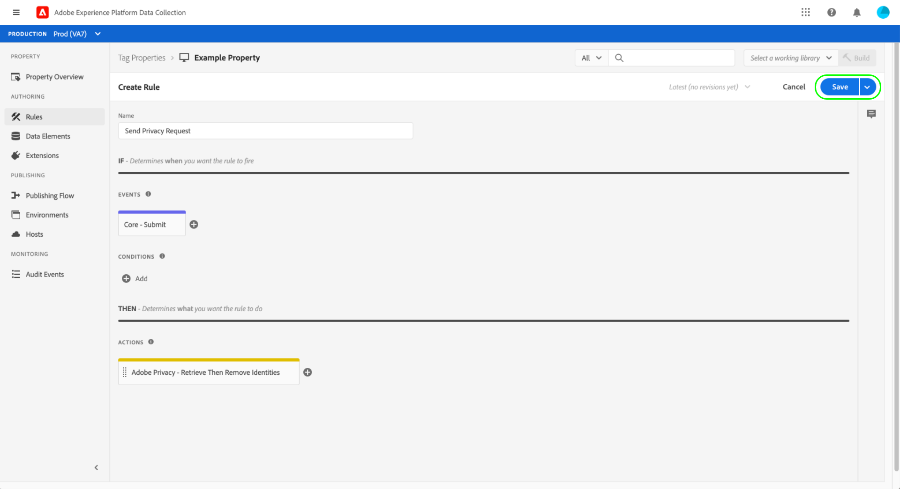

# Présentation de l’extension Adobe Privacy

L’extension de balise d’Adobe Privacy vous permet de collecter et de supprimer les identifiants d’utilisateur affectés aux utilisateurs finaux par les solutions Adobe sur les appareils côté client. Les identifiants collectés peuvent alors être envoyés à [Adobe Experience Platform Privacy Service](../../../../privacy-service/home.md) pour accéder ou supprimer les données personnelles de l’individu concerné dans les applications Adobe Experience Cloud prises en charge.

Ce guide explique comment installer et configurer l’extension Adobe Privacy dans l’interface utilisateur d’Experience Platform ou l’interface utilisateur de la collecte de données.

>[!NOTE]
>
>Si vous préférez installer ces fonctionnalités sans utiliser de balises, reportez-vous à la section [Présentation de la bibliothèque JavaScript de confidentialité](../../../../privacy-service/js-library.md) pour savoir comment implémenter à l’aide du code brut.

## Installation et configuration de l’extension 

Sélectionnez **[!UICONTROL Extensions]** dans le volet de navigation de gauche, suivi de l’onglet **[!UICONTROL Catalog]** . Utilisez la barre de recherche pour réduire la liste des extensions disponibles jusqu’à ce que vous trouviez Adobe Privacy. Sélectionnez **[!UICONTROL Install]** pour continuer.

L’écran suivant vous permet de configurer les sources et solutions à partir desquelles l’extension doit collecter les identifiants. Les solutions suivantes sont prises en charge pour l’extension :

* Adobe Analytics (AA)
* Adobe Audience Manager (AAM)
* Adobe Target
* Service d’identités d’Adobe Experience Cloud (Visiteur ou ECID)
* Adobe Advertising Cloud (AdCloud)

Sélectionnez une ou plusieurs solutions, puis sélectionnez **[!UICONTROL Update]**.

L’écran se met à jour afin d’afficher les entrées pour les paramètres de configuration requis en fonction des solutions que vous avez sélectionnées.

À l’aide du menu déroulant ci-dessous, vous pouvez également ajouter des paramètres supplémentaires spécifiques à une solution à la configuration.

>[!NOTE]
>
>Voir la section sur les [paramètres de configuration](../../../../privacy-service/js-library.md#config-params) dans la présentation de la bibliothèque JavaScript de confidentialité pour plus d’informations sur les valeurs de configuration acceptées pour chaque solution prise en charge.

Une fois que vous avez terminé d’ajouter des paramètres pour les solutions sélectionnées, sélectionnez **[!UICONTROL Save]** pour enregistrer la configuration.

## Utilisation de l’extension  {#using}

L’extension Adobe Privacy fournit trois types d’actions qui peuvent être utilisés dans une [règle](../../../ui/managing-resources/rules.md) lorsqu’un certain événement se produit et que les conditions sont remplies :

* **[!UICONTROL Retrieve Identities]** : les informations d’identité stockées de l’utilisateur sont récupérées.
* **[!UICONTROL Remove Identities]** : les informations d’identité stockées de l’utilisateur sont supprimées.
* **[!UICONTROL Retrieve Then Remove Identities]** : les informations d’identité stockées de l’utilisateur sont récupérées, puis supprimées.

Pour chacune des actions ci-dessus, vous devez fournir une fonction JavaScript de rappel qui accepte et gère les données d’identité récupérées en tant que paramètre d’objet. À partir de là, vous pouvez stocker ces identités, les afficher ou les envoyer au [API Privacy Service](../../../../privacy-service/api/overview.md) selon vos besoins.

Lors de l’utilisation de l’extension de balise d’Adobe Privacy, vous devez fournir la fonction de rappel requise sous la forme d’un élément de données. Reportez-vous à la section suivante pour savoir comment configurer cet élément de données.

### Définition d’un élément de données pour gérer les identités

Commencez le processus de création d’un nouvel élément de données en sélectionnant **[!UICONTROL Data Elements]** dans le volet de navigation de gauche, suivi de **[!UICONTROL Add Data Element]**. Une fois que vous êtes sur l’écran de configuration, sélectionnez **[!UICONTROL Core]** pour l’extension et **[!UICONTROL Custom Code]** pour le type d’élément de données. À partir de là, sélectionnez **[!UICONTROL Open Editor]** dans le panneau de droite.

Dans la boîte de dialogue qui s’affiche, définissez une fonction JavaScript qui gérera les identités récupérées. Le rappel doit accepter un seul argument de type objet (`ids` dans l’exemple ci-dessous). La fonction peut ensuite gérer les identifiants comme vous le souhaitez et peut également appeler les variables et fonctions disponibles globalement sur votre site pour un traitement ultérieur.

>[!NOTE]
>
>Pour plus d’informations sur la structure de l’objet `ids` que la fonction de rappel doit traiter, reportez-vous à la section [exemples de code](../../../../privacy-service/js-library.md#samples) fourni dans la présentation de la bibliothèque JavaScript de confidentialité.

Lorsque vous avez terminé, sélectionnez **[!UICONTROL Save]**.

Vous pouvez continuer à créer d’autres éléments de données de code personnalisé si vous avez besoin de différents rappels pour différents événements.

### Création d’une règle avec une action de confidentialité

Après avoir configuré un élément de données de rappel pour gérer les identifiants récupérés, vous pouvez créer une règle qui invoque l’extension Adobe Privacy chaque fois qu’un événement spécifique se produit sur votre site, ainsi que toutes les autres conditions dont vous avez besoin.

Lors de la configuration de l’action pour la règle, sélectionnez **[!UICONTROL Adobe Privacy]** pour l’extension. Pour le type d’action, sélectionnez l’une des options suivantes : [trois fonctions](#using) fourni par l’extension.

Le panneau de droite vous invite à sélectionner un élément de données qui servira de rappel à l’action. Sélectionnez l’icône de la base de données () et choisissez l’élément de données que vous avez créé précédemment dans la liste. Sélectionnez **[!UICONTROL Keep Changes]** pour continuer.

À partir de là, vous pouvez continuer à configurer la règle afin que l’action Adobe Privacy se déclenche sous les événements et conditions dont vous avez besoin. Lorsque vous êtes satisfait(e), sélectionnez **[!UICONTROL Save]**.

Vous pouvez désormais ajouter la règle à une bibliothèque pour la déployer comme version sur votre site Web à des fins de test. Pour plus d’informations, consultez le guide sur le [flux de publication des balises](../../../ui/publishing/overview.md).

## Désactivation ou désinstallation de l’extension

Après avoir installé l’extension, vous pouvez la désactiver ou la supprimer. Cliquez sur **[!UICONTROL Configure]** sur la carte Adobe Privacy des extensions installées, puis sélectionnez **[!UICONTROL Disable]** ou **[!UICONTROL Uninstall]**.

## Étapes suivantes

Ce guide décrit l’utilisation de l’extension de balise d’accès à des informations personnelles Adobe dans l’interface utilisateur. Pour plus d’informations sur les fonctionnalités fournies par l’extension, y compris des exemples d’utilisation du code brut, voir la section [Présentation de la bibliothèque JavaScript de confidentialité](../../../../privacy-service/js-library.md) dans la documentation du Privacy Service.
