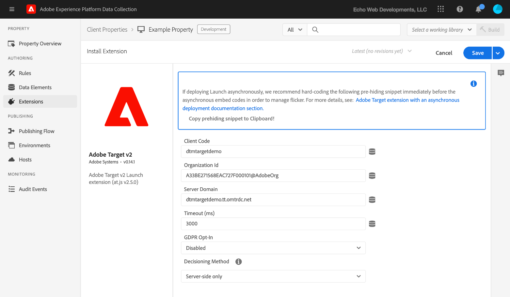

# Présentation de l’extension Adobe Target v2

Utilisez cette référence pour obtenir des informations sur les options disponibles lors de l’utilisation de cette extension pour créer une règle.

## Configuration de l’extension Adobe Target v2

>[!IMPORTANT]
>
>L’extension Adobe Target requiert le fichier at.js 2.x.

Si l’extension Adobe Target n’est pas encore installée, ouvrez votre propriété, puis cliquez sur **[!UICONTROL Extensions > Catalog]**, survolez l’extension Target et cliquez sur **[!UICONTROL Install]**.

Pour configurer l’extension, ouvrez l’onglet Extensions, survolez l’extension avec la souris, puis cliquez sur **[!UICONTROL Configure]**.



### Paramètres at.js

Tous les paramètres at.js, à l’exception de la temporisation, sont automatiquement extraits de la configuration at.js de l’interface utilisateur de Target. L’extension récupère les paramètres de l’interface utilisateur de Target uniquement lors de l’ajout initial. De ce fait, tous les paramètres doivent être gérés dans l’interface utilisateur si d’autres mises à jour sont nécessaires.

Les options de configuration disponibles sont les suivantes :

#### Client Code (Code client)

Le code client est l’identifiant de compte de Target. Cette valeur doit presque toujours être conservée comme valeur par défaut. Elle peut être modifiée à l’aide d’éléments de données.

#### Organization ID (ID d’organisation)

Cet identifiant associe votre mise en œuvre à votre compte Adobe Experience Cloud. Cette valeur doit presque toujours être conservée comme valeur par défaut. Elle peut être modifiée à l’aide d’éléments de données.

#### Server Domain (Domaine du serveur)

Le domaine du serveur fait référence au domaine dans lequel les requêtes Target sont envoyées. Cette valeur doit presque toujours être conservée comme valeur par défaut.

#### Opt-in RGPD (Accord préalable RGPD)

Lorsque cette option est activée, Adobe Target fournit une fonctionnalité d’accord préalable aidant à prendre en charge la stratégie de gestion du consentement. Cette fonctionnalité permet aux clients de décider comment et à quel moment la balise Target est déclenchée. Pour plus d’informations sur la fonctionnalité d’accord préalable d’Adobe, voir [Confidentialité et Règlement général sur la protection des données (RGPD)](https://experienceleague.adobe.com/docs/target/using/implement-target/before-implement/privacy/cmp-privacy-and-general-data-protection-regulation.html?lang=fr).

#### Timeout (Délai d’expiration) (ms)

Si la réponse de Target n’est pas reçue au cours de la période définie, la demande expire et le contenu par défaut s’affiche. Des tentatives de requêtes supplémentaires sont effectuées pendant la session du visiteur. La valeur par défaut de 3 000 ms peut différer du délai d’expiration configuré dans l’interface utilisateur de Target.

Pour plus d’informations sur le fonctionnement du délai d’expiration, consultez l’[aide d’Adobe Target](https://experienceleague.adobe.com/docs/target/using/implement-target/client-side/deploy-at-js/implementing-target-without-a-tag-manager.html?lang=fr).

## Types d’actions de l’extension Target

Cette section décrit les types d’actions disponibles dans l’extension Target.

L’extension Target permet d’effectuer les actions suivantes dans la partie « Then » d’une règle :

### Load Target (Charger Target)

Ajoutez cette action à votre règle de balise pour charger Target dans le cadre de votre règle. Cette opération charge la bibliothèque at.js sur la page. Dans la plupart des mises en œuvre, Target doit être chargé sur chacune des pages de votre site. Adobe recommande d’utiliser l’action Charger Target uniquement si elle est précédée d’un appel de Target. Dans le cas contraire, vous pourriez rencontrer des problèmes, comme un retard de l’appel d’Analytics.

Aucune configuration n’est nécessaire.

### Chargement de Target avec prise de décision sur l’appareil

Ajoutez cette action à votre règle de balise pour charger Target avec [la prise de décision sur l’appareil](https://experienceleague.adobe.com/docs/target/using/implement-target/client-side/at-js-implementation/on-device-decisioning/on-device-decisioning.html?lang=fr) activée dans le cadre de votre règle. Cela charge la bibliothèque at.js sur la page avec la prise de décision sur l’appareil activée. Dans la plupart des mises en œuvre, Target doit être chargé sur chacune des pages de votre site. Adobe recommande d’utiliser l’action Charger Target avec la prise de décision sur l’appareil uniquement si elle est précédée d’un appel de Target. Dans le cas contraire, vous pourriez rencontrer des problèmes, comme un retard de l’appel d’Analytics.

>[!IMPORTANT]
>
>N’utilisez une requête de chargement de page avec la prise de décision sur l’appareil que si elle est déjà configurée. L’ajout de cette action à votre règle augmentera la taille de votre lot de lancement final, car il inclut le moteur de règles de prise de décision sur l’appareil.

### Add Params to All Requests (Ajout de paramètres à toutes les requêtes)

Ce type d’action permet d’ajouter des paramètres à toutes les requêtes Target. L’action Load Target (Charger Target) doit avoir été utilisée au préalable.

1. Indiquez le nom et la valeur du paramètre que vous souhaitez ajouter.
1. Cliquez sur l’icône Ajouter pour ajouter d’autres paramètres.

### Add Params to Page Load Request (Ajout de paramètres à la requête de chargement de page)

Ce type d’action permet d’ajouter des paramètres spécifiquement à vos requêtes de chargement de page. L’action Load Target (Charger Target) doit avoir été utilisée au préalable.

1. Indiquez le nom et la valeur du paramètre que vous souhaitez ajouter.
1. Cliquez sur l’icône Ajouter pour ajouter d’autres paramètres.

### Déclencher la requête de chargement de page

Ce type d’action permet à Target de déclencher une requête au chargement de votre page. L’action Load Target (Charger Target) doit avoir été utilisée au préalable.

Vous devez spécifier si vous souhaitez activer le masquage du corps pour éviter le scintillement, ainsi que le style utilisé lors du masquage de l’élément de corps. Les options disponibles sont les suivantes :

* **Body Hiding** (Masquage du corps) : vous pouvez activer ou désactiver ce paramètre. La valeur par défaut est Enabled (Activé), ce qui signifie que la balise HTML BODY est masquée.
* **Style masqué du corps :** la valeur par défaut est body{opacity:0}. Cette valeur peut être changée en autre chose, comme body{display:none}.

Pour plus d’informations, reportez-vous à la [documentation d’aide en ligne de Target](https://experienceleague.adobe.com/docs/target/using/implement-target/client-side/mbox-implement/advanced-mboxjs-settings.html?lang=fr).

### Trigger View (Déclenchement d’affichage)

L’action Vue Déclencheur peut être appelée à chaque nouveau chargement de page ou lorsqu’un composant fait l’objet d’un nouveau rendu sur une page. La vue Déclencheur doit être implémentée pour les applications d’une seule page.

1. Spécifiez le nom d’affichage qui doit être déclenché.
1. Précisez si le déclenchement de la vue doit être attribué à une impression de reporting en cochant la case Page. Si l’affichage est corrélé à un composant qui est à nouveau rendu et n’est pas attribué à une impression de reporting, ne cochez pas la case Page.

Pour plus d’informations sur le déclenchement d’un affichage, reportez-vous à la [`triggerView()`documentation d’aide](https://experienceleague.adobe.com/docs/target/using/implement-target/client-side/functions-overview/adobe-target-triggerview-atjs-2.html?lang=fr).

## Déploiement de base d’Adobe Target

Une fois que l’extension Target est installée, créez au moins une règle pour la déployer correctement. Vous devez d’abord charger la bibliothèque Target (at.js), définir les paramètres que vous souhaitez utiliser avec la requête de chargement de page, puis déclencher la requête de chargement de page.

Une règle Target avec cette mise en œuvre de base ressemble à ceci :


Une fois cette règle enregistrée, vous devez l’ajouter à une bibliothèque et la créer/déployer afin de pouvoir tester son comportement.

## Extension Adobe Target avec déploiement asynchrone

Les balises peuvent être déployées de manière asynchrone. Si vous chargez la bibliothèque de balises avec Target de manière asynchrone, alors Target sera également chargé de manière asynchrone. Ce scénario est entièrement pris en charge, mais il faut tenir compte d’un autre aspect.

Avec les déploiements asynchrones, il est possible que la page termine de rendre le contenu par défaut avant que la bibliothèque Target ne soit complètement chargée et que le contenu ait été permuté. Cela peut entraîner un « scintillement », c’est-à-dire que le contenu par défaut s’affiche brièvement avant d’être remplacé par le contenu personnalisé spécifié par Target. Pour éviter ce scintillement, nous vous suggérons d’utiliser un fragment de code de pré-masquage préalable et de charger le lot de balise de manière asynchrone pour éviter tout scintillement de contenu.

Voici quelques éléments à garder à l’esprit lors de l’utilisation du fragment de code de masquage préalable :

* Le code doit être ajouté avant de charger le code intégré d’en-tête de balise.
* Ce code ne peut pas être géré par des balises. Il doit donc être ajouté directement à la page.
* La page s’affiche lorsque le premier des événements suivants se produit :
   * Lorsque la réponse de chargement de page a été reçue
   * Lorsque la requête de chargement de page arrive à expiration
   * Lorsque le fragment lui-même arrive à expiration.
* L’action « Déclencher la requête de chargement de page » doit être utilisée sur toutes les pages qui utilisent le fragment de code de masquage préalable afin de réduire la durée de ce dernier.
* Le masquage du corps doit également être activé dans l’action Requête de chargement de page de la règle Chargement de page que vous utilisez pour Target. Dans le cas contraire, tous les chargements de page restent masqués pendant le délai d’expiration.

Le fragment de code de masquage préalable se présente comme suit et peut être réduit. Les options configurables se trouvent à la fin :

```js
;(function(win, doc, style, timeout) {
  var STYLE_ID = 'at-body-style';

  function getParent() {
    return doc.getElementsByTagName('head')[0];
  }

  function addStyle(parent, id, def) {
    if (!parent) {
      return;
    }

    var style = doc.createElement('style');
    style.id = id;
    style.innerHTML = def;
    parent.appendChild(style);
  }

  function removeStyle(parent, id) {
    if (!parent) {
      return;
    }

    var style = doc.getElementById(id);

    if (!style) {
      return;
    }

    parent.removeChild(style);
  }

  addStyle(getParent(), STYLE_ID, style);
  setTimeout(function() {
    removeStyle(getParent(), STYLE_ID);
  }, timeout);
}(window, document, "body {opacity: 0 !important}", 3000));
```

Par défaut, le fragment de code masque au préalable l’ensemble HTML BODY. Dans certains cas, il est possible de ne masquer que certains éléments HTML et non la totalité de la page. Vous pouvez y parvenir en personnalisant le paramètre de style. Remplacez-le par un élément qui masque préalablement uniquement certaines régions de la page.

Par exemple, si vous disposez de deux régions identifiées par les ID container-1 et container-2, le style peut être remplacé par ce qui suit :

```css
#container-1, #container-2 {opacity: 0 !important}
```

À la place du code par défaut :

```css
body {opacity: 0 !important}
```

Par défaut, le fragment de code de masquage préalable expire à 3 000 ms ou 3 secondes. Cette valeur peut être personnalisée.
