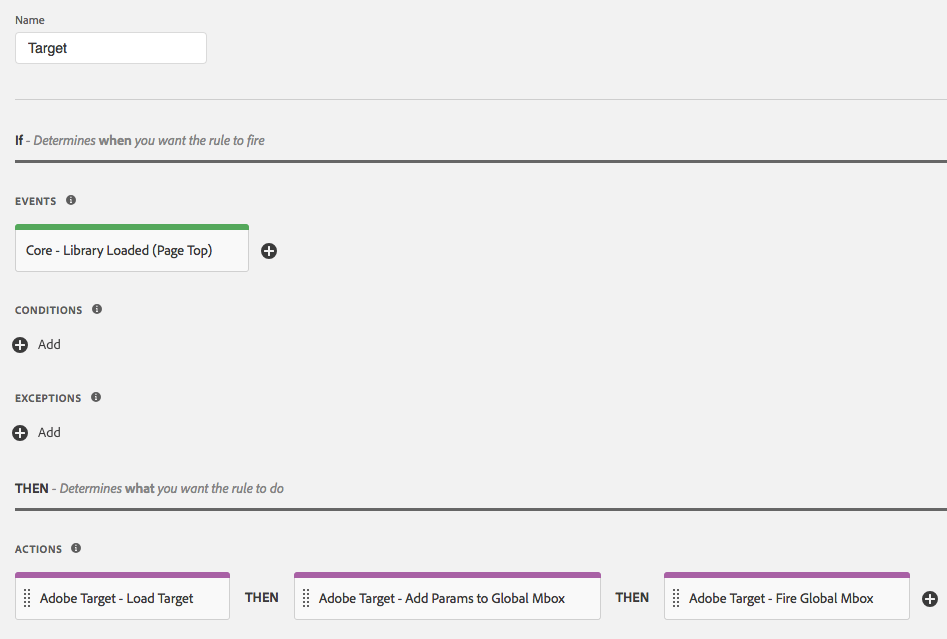

# Présentation de l’extension Adobe Target

Utilisez cette référence pour obtenir des informations sur les options disponibles lors de l’utilisation de cette extension pour créer une règle.

## Configurer l’extension Adobe Target

>[!IMPORTANT]
>
> L’extension Adobe Target requiert at.js. Elle ne prend pas en charge mbox.js.

Si l’extension Adobe Target n’est pas encore installée, ouvrez votre propriété, puis cliquez sur **[!UICONTROL Extensions > Catalog]**, survolez l’extension Target et cliquez sur **[!UICONTROL Install]**.

Pour configurer l’extension, ouvrez l’onglet [!UICONTROL Extensions], survolez l’extension, puis cliquez sur **[!UICONTROL Configure]**.


### Paramètres at.js

Tous les paramètres at.js, à l’exception de la temporisation, sont automatiquement extraits de la configuration at.js de l’interface utilisateur Target. L’extension récupère les paramètres de l’interface utilisateur de Target uniquement lors de l’ajout initial. De ce fait, tous les paramètres doivent être gérés dans l’interface utilisateur si d’autres mises à jour sont nécessaires.

Les options de configuration disponibles sont les suivantes :

#### Client Code (Code client)

Le code client est l’identifiant de compte de Target. Cette valeur doit presque toujours être conservée comme valeur par défaut.

Il peut être modifié à l’aide d’éléments de données.

#### Organization ID (ID d’organisation)

Cet identifiant associe votre mise en œuvre à votre compte Adobe Experience Cloud. Cette valeur doit presque toujours être conservée comme valeur par défaut.

Il peut être modifié à l’aide d’éléments de données.

#### Global Mbox Name (Nom de mbox globale)

Indique le nom de votre requête Target globale. Par défaut, ce nom est target-global-mbox, sauf si vous l’avez modifié dans l’interface utilisateur de Target avant d’ajouter l’extension.

Il peut être modifié à l’aide d’éléments de données.

#### Server Domain (Domaine du serveur)

Le domaine vers lequel les requêtes Target sont envoyées. Cette valeur doit presque toujours être conservée comme valeur par défaut.

#### Cross domain (Interdomaine)

Détermine où Target définit des cookies dans les navigateurs.

* **Disabled** (Désactivé) : définit les cookies dans le domaine propriétaire uniquement. Il s’agit du paramètre par défaut.
* **Enabled** (Activé) : définit des cookies dans le domaine propriétaire et dans le domaine Target tiers (le « Server Domain », domaine du serveur).

#### Timeout (Délai d’expiration) (ms)

Si la réponse de Target n’est pas reçue au cours de la période définie, la demande expire et le contenu par défaut s’affiche. Des tentatives de requêtes supplémentaires sont effectuées pendant la session du visiteur. La valeur par défaut de 3 000 ms peut différer du délai d’expiration configuré dans l’interface utilisateur de Target.

Pour plus d’informations sur le fonctionnement du délai d’expiration, consultez l’[aide d’Adobe Target](https://experienceleague.adobe.com/docs/target/using/implement-target/client-side/deploy-at-js/implementing-target-without-a-tag-manager.html?lang=fr).

#### Autres paramètres at.js disponibles dans l’interface utilisateur de Target

Plusieurs paramètres disponibles sur la page [!UICONTROL Edit at.js settings] de l’interface utilisateur de Target ne font pas partie de l’extension Target. Voici quelques solutions suggérées :

* Auto-create global mbox (Créer automatiquement la mbox globale) : ce paramètre est remplacé par l’action Fire Global Mbox (Déclencher la mbox globale) dans l’extension Target.
* Library Header (En-tête de bibliothèque) : ce paramètre ne fait pas partie de l’extension Target. Placez le code devant être chargé avant at.js dans une action Core Extension (Extension Core) > Custom Code (Code personnalisé) avant d’utiliser l’action Load Target (Charger Target).
* Library Footer (Pied de page de bibliothèque) : ce paramètre ne fait pas partie de l’extension Target. Placez le code devant être chargé après at.js dans une action Core Extension (Extension Core) > Custom Code (Code personnalisé) après avoir utilisé l’action Load Target (Charger Target).

## Types d’actions de l’extension Target

Cette section décrit les types d’actions disponibles dans l’extension Target.

L’extension Target permet d’effectuer les actions suivantes dans la partie « Then » d’une règle :

### Load Target (Charger Target)

Ajoutez cette action à votre règle de balise pour charger Target dans le cadre de votre règle. Cette opération charge la bibliothèque at.js sur la page. Dans la plupart des mises en œuvre, Target doit être chargé sur chacune des pages de votre site.

Aucune configuration n’est nécessaire.

### Add mbox params (Ajouter des paramètres mbox)

Ajoutez des paramètres à toutes les requêtes de mbox. L’action Load Target (Charger Target) doit avoir été utilisée au préalable.

1. Indiquez le nom et la valeur du paramètre que vous souhaitez ajouter.
1. Cliquez sur l’icône **plus (+)** pour ajouter d’autres paramètres.

### Add global mbox params (Ajouter des paramètres de mbox globale)

Ajoutez des paramètres uniquement à vos requêtes de mbox globale. L’action Load Target (Charger Target) doit avoir été utilisée au préalable.

1. Indiquez le nom et la valeur du paramètre que vous souhaitez ajouter.
1. Cliquez sur l’icône **plus (+)** pour ajouter d’autres paramètres.

### Fire global mbox (Déclencher la mbox globale)

Déclenchez la mbox globale sur votre page. L’action Load Target (Charger Target) doit avoir été utilisée au préalable.

Indiquez s’il convient d’activer le masquage du corps pour éviter le scintillement, ainsi que le style utilisé lors du masquage de l’élément de corps.

Les options disponibles sont les suivantes :

* **Body Hiding** (Masquage du corps) : vous pouvez activer ou désactiver ce paramètre. La valeur par défaut est Enabled (Activé), ce qui signifie que la balise HTML BODY est masquée.
* **Body Hidden Style** (Style masqué du corps) : la valeur par défaut est `body{opacity:0}`. Cette valeur peut être modifiée et remplacée par autre chose, par exemple `body{display:none}`.

Pour plus d’informations, reportez-vous à la [documentation d’aide en ligne de Target](https://experienceleague.adobe.com/docs/target/using/implement-target/client-side/mbox-implement/advanced-mboxjs-settings.html?lang=fr).

## Déploiement de base d’Adobe Target

Une fois que l’extension Target est installée, vous devez créer au moins une règle pour la déployer correctement. Vous devez d’abord charger la bibliothèque Target (at. js), spécifier les paramètres à utiliser avec la mbox globale et déclencher la mbox globale.

Une règle Target avec cette mise en œuvre de base ressemble à ceci :



Une fois cette règle enregistrée, vous devez l’ajouter à une bibliothèque et la créer/déployer afin de pouvoir tester le comportement.

## Extension Adobe Target avec déploiement asynchrone

Les balises peuvent être déployées de manière asynchrone. Si vous chargez la bibliothèque de balises avec Target de manière asynchrone, alors Target sera également chargé de manière asynchrone. Ce scénario est entièrement pris en charge, mais il faut tenir compte d’un autre aspect.

Avec les déploiements asynchrones, il est possible que la page termine de rendre le contenu par défaut avant que la bibliothèque Target ne soit complètement chargée et que le contenu ait été permuté. Cela peut entraîner un « scintillement », c’est-à-dire que le contenu par défaut s’affiche brièvement avant d’être remplacé par le contenu personnalisé spécifié par Target. Pour éviter ce scintillement, nous vous suggérons d’utiliser un fragment de code de pré-masquage préalable et de charger le lot de balise de manière asynchrone pour éviter tout scintillement de contenu.

Voici quelques éléments à garder à l’esprit lors de l’utilisation du fragment de code de masquage préalable :

* Le code doit être ajouté avant de charger le code intégré d’en-tête de balise.
* Ce code ne peut pas être géré par des balises. Il doit donc être ajouté directement à la page.
* La page s’affiche lorsque l’un des événements suivants se produit en premier lieu :
   * Lorsque la réponse mbox globale a été reçue.
   * Lorsque la demande de mbox globale expire.
   * Lorsque le fragment lui-même arrive à expiration.
* L’action « Déclencher la mbox globale » doit être utilisée sur toutes les pages utilisant le fragment de code de masquage préalable afin de réduire la durée de ce dernier.

Le fragment de code de masquage préalable se présente comme suit et peut être réduit. Les options configurables se trouvent à la fin :

```javascript
;(function(win, doc, style, timeout) {
  var STYLE_ID = 'at-body-style';

  function getParent() {
    return doc.getElementsByTagName('head')[0];
  }

  function addStyle(parent, id, def) {
    if (!parent) {
      return;
    }

    var style = doc.createElement('style');
    style.id = id;
    style.innerHTML = def;
    parent.appendChild(style);
  }

  function removeStyle(parent, id) {
    if (!parent) {
      return;
    }

    var style = doc.getElementById(id);

    if (!style) {
      return;
    }

    parent.removeChild(style);
  }

  addStyle(getParent(), STYLE_ID, style);
  setTimeout(function() {
    removeStyle(getParent(), STYLE_ID);
  }, timeout);
}(window, document, "body {opacity: 0 !important}", 3000));
```

Par défaut, le fragment de code masque au préalable l’ensemble HTML BODY. Dans certains cas, il est possible de ne masquer que certains éléments HTML et non la totalité de la page. Vous pouvez y parvenir en personnalisant le paramètre de style. Remplacez-le par un élément qui masque préalablement uniquement certaines régions de la page.

Par exemple, si vous disposez de deux régions identifiées par les ID container-1 et container-2, le style peut être remplacé par ce qui suit :

```css
#container-1, #container-2 {opacity: 0 !important}
```

À la place du code par défaut :

```css
body {opacity: 0 !important}
```

Par défaut, le fragment de code de masquage préalable expire à 3 000 ms ou 3 secondes. Cette valeur peut être personnalisée.
