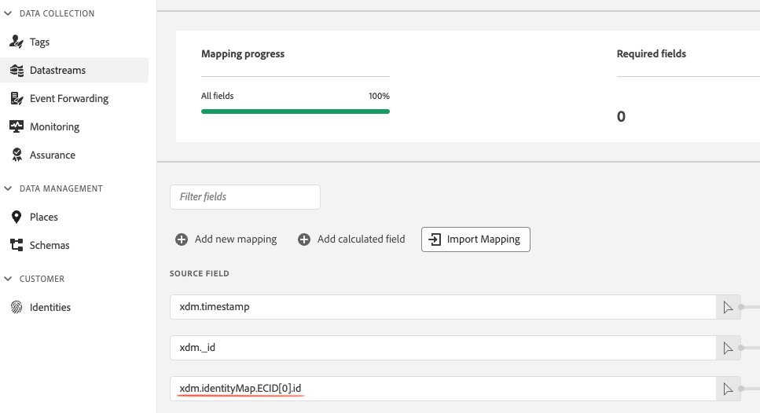

# Accès à l’ECID

Le [!DNL Experience Cloud Identity (ECID)] est un identifiant persistant attribué à un utilisateur ou une utilisatrice qui visite votre site web. Dans certains cas, vous pouvez préférer accéder au [!DNL ECID] (l’envoyer à un tiers, par exemple). Un autre cas d’utilisation consiste à définir le [!DNL ECID] dans un champ XDM personnalisé, en plus de l’avoir dans le mappage d’identité.

Vous pouvez accéder à l’ECID par le biais de [Préparation des données pour la collecte de données](/help/datastreams/data-prep.md) (recommandé) ou par le biais de balises.

## Accès à l’ECID par le biais de la préparation des données (méthode préférée) {#accessing-ecid-data-prep}

Cette méthode utilise [Préparation des données pour la collecte de données](/help/datastreams/data-prep.md) pour configurer un mappage personnalisé pour la `ECID`.

Consultez la documentation [Préparation des données pour la collecte de données](/help/datastreams/data-prep.md) pour savoir comment utiliser cette fonctionnalité.

Si vous souhaitez définir l’ECID dans un champ XDM personnalisé, en plus de l’avoir dans le mappage d’identités, vous pouvez le faire en définissant l’`source` sur le chemin suivant :

```js
xdm.identityMap.ECID[0].id
```

Définissez ensuite la cible sur un chemin XDM où le champ est de type `string`.



## Balises

Si vous devez accéder au [!DNL ECID] côté client, utilisez l’approche des balises comme décrit ci-dessous.

1. Assurez-vous que votre propriété est configurée avec le [séquencement des composants de règle](/help/tags/ui/managing-resources/rules.md#sequencing) activé.
1. Créez une nouvelle règle. Cette règle doit être utilisée exclusivement pour capturer le [!DNL ECID] sans autre action importante.
1. Ajoutez un événement [!UICONTROL Library Loaded] à la règle.
1. Ajoutez une action [!UICONTROL Code personnalisé] à la règle avec le code suivant (en supposant que le nom que vous avez configuré pour l’instance SDK soit `alloy` et qu’il n’existe pas déjà un élément de données du même nom) :

   ```js
    return alloy("getIdentity")
      .then(function(result) {
        _satellite.setVar("ECID", result.identity.ECID);
      });
   ```

1. Enregistrez la règle.

Vous devriez ensuite pouvoir accéder au [!DNL ECID] dans les règles suivantes à l’aide de `%ECID%` ou `_satellite.getVar("ECID")`, comme vous le feriez pour tout autre élément de données.
