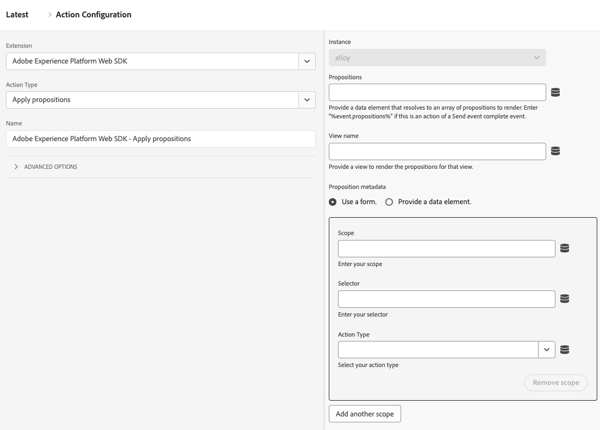

# Appliquer les propositions

Le type d’action **[!UICONTROL Appliquer des propositions]** vous permet d’effectuer le rendu des propositions dans des applications d’une seule page sans incrémenter de mesures. Ce type d’action est utile lorsque vous travaillez avec des applications monopages où des parties de la page sont rendues de nouveau, ce qui peut remplacer toutes les personnalisations déjà appliquées à la page.

1. Connectez-vous à [CX Enterprise](https://experience.adobe.com?lang=fr) à l’aide de vos informations d’identification Adobe ID.
1. Accédez à **[!UICONTROL Collecte de données]** > **[!UICONTROL Balises]**.
1. Sélectionnez la propriété de balise de votre choix.
1. Accédez à **[!UICONTROL Règles]**, puis sélectionnez la règle de votre choix.
1. Sous [!UICONTROL Actions], sélectionnez une action existante ou créez-en une.
1. Définissez le champ déroulant [!UICONTROL Extension] sur **[!UICONTROL Adobe Experience Platform Web SDK]**, puis définissez le [!UICONTROL Type d’action] sur **[!UICONTROL Appliquer les propositions]**.

## Cas d’utilisation

Vous pouvez utiliser ce type d’action pour différents cas d’utilisation, tels que :

1. **Rendu des offres de mbox HTML**. Les propositions explicitement demandées via une portée ou une surface à partir d’une action **[!UICONTROL Envoyer l’événement]** ne sont pas automatiquement rendues. Vous pouvez utiliser le type d’action **[!UICONTROL Appliquer des propositions]** pour indiquer à Web SDK où effectuer leur rendu en spécifiant les métadonnées de proposition.
2. **Effectuez le rendu des offres pour une vue sur une application monopage**. Lors du rendu d’un événement de changement de vue, si les données d’analyse ne sont pas encore prêtes, vous pouvez utiliser l’action **[!UICONTROL Appliquer les propositions]** pour effectuer le rendu des propositions d’affichage en haut de la page. Voir [événements en haut et en bas de la page (Deuxième page vue - Option 2)](/help/collection/use-cases/personalization/top-bottom-page-events.md) pour plus d’informations. Pour l&#39;utiliser, saisissez un **[!UICONTROL Nom de la vue]** dans le formulaire.
3. **Restituer des propositions**. Lorsque votre site utilise un framework comme React pour effectuer à nouveau le rendu du contenu, vous devrez peut-être appliquer une nouvelle personnalisation. Dans ce cas, vous pouvez utiliser le type d&#39;action **[!UICONTROL Appliquer les propositions]**.

Ce type d’action n’envoie pas d’événement d’affichage pour les propositions rendues. Il effectue le suivi des propositions générées afin qu’elles puissent être incluses dans les appels **[!UICONTROL Envoyer l’événement]** suivants.

## Champs disponibles

Ce type d&#39;action prend en charge les champs suivants :

* **[!UICONTROL Instance]** : instance SDK à laquelle l’action s’applique. Ce menu déroulant est désactivé si votre implémentation utilise une seule instance SDK.
* **[!UICONTROL Propositions]** : tableau d’objets de proposition dont vous souhaitez effectuer à nouveau le rendu.
* **[!UICONTROL Nom de la vue]** : nom de la vue dont le rendu doit être effectué.
* **[!UICONTROL Métadonnées de proposition]** : objet qui détermine la manière dont les offres HTML peuvent être appliquées. Vous pouvez fournir ces informations par le biais du formulaire ou d’un élément de données. Il contient les propriétés suivantes :
   * **[!UICONTROL Périmètre]**
   * **[!UICONTROL Sélecteur]**
   * **[!UICONTROL Type d’action]**
