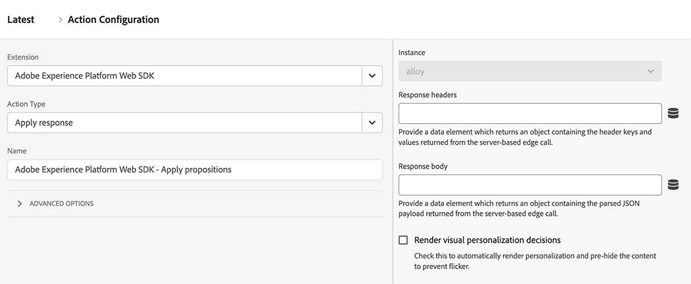

# Appliquer la réponse

Le type d’action **[!UICONTROL Apply response]** permet d’effectuer différentes actions en fonction d’une réponse d’Edge Network. Ce type d’action est généralement utilisé dans les déploiements hybrides où le serveur effectue un appel initial à l’Edge Network, puis ce type d’action prend la réponse de cet appel et initialise le SDK Web dans le navigateur. L’utilisation de ce type d’action peut réduire les temps de chargement des clients pour les cas d’utilisation de personnalisation hybride.

1. Connectez-vous à [experience.adobe.com](https://experience.adobe.com?lang=fr) à l’aide de vos informations d’identification Adobe ID.
1. Accédez à **[!UICONTROL Data Collection]** > **[!UICONTROL Tags]**.
1. Sélectionnez la propriété de balise de votre choix.
1. Accédez à **[!UICONTROL Rules]**, puis sélectionnez la règle de votre choix.
1. Sous [!UICONTROL Actions], sélectionnez une action existante ou créez-en une.
1. Définissez le champ déroulant du [!UICONTROL Extension] sur **[!UICONTROL Adobe Experience Platform Web SDK]**, puis définissez le [!UICONTROL Action type] sur **[!UICONTROL Apply response]**.

## Cas d’utilisation

* **Répartition manuelle entre la collecte de données et la personnalisation** : vous pouvez déclencher une action [Envoyer l’événement](send-event.md) avec des décisions de rendu définies sur `false`, puis laisser une règle « Envoyer l’événement terminé » capturer la promesse. La première action de cette règle peut être « Appliquer la réponse ». Ce workflow vous permet de différer la manipulation DOM jusqu’à ce que le code de votre organisation termine un autre travail.
* **Réponse Edge reçue de l&#39;extérieur de Web SDK** : si vous utilisez une autre bibliothèque pour communiquer avec Edge Network, vous pouvez permettre à Web SDK de gérer toujours la réponse d&#39;Edge Network à l&#39;aide de cette action.

## Champs disponibles

Ce type d’action prend en charge les options de configuration suivantes :

* **[!UICONTROL Instance]** : instance SDK à laquelle l’action s’applique. Ce menu déroulant est désactivé si votre implémentation utilise une seule instance SDK.
* **[!UICONTROL Response headers]** : sélectionnez l’élément de données qui renvoie un objet contenant les clés et valeurs d’en-tête renvoyées par l’appel au serveur Edge Network.
* **[!UICONTROL Response body]** : sélectionnez l’élément de données qui renvoie l’objet contenant la payload JSON fournie par la réponse Edge Network.
* **[!UICONTROL Render visual personalization decisions]** : activez cette option pour effectuer automatiquement le rendu du contenu de personnalisation fourni par Edge Network et pré-masquer le contenu pour éviter le scintillement.
