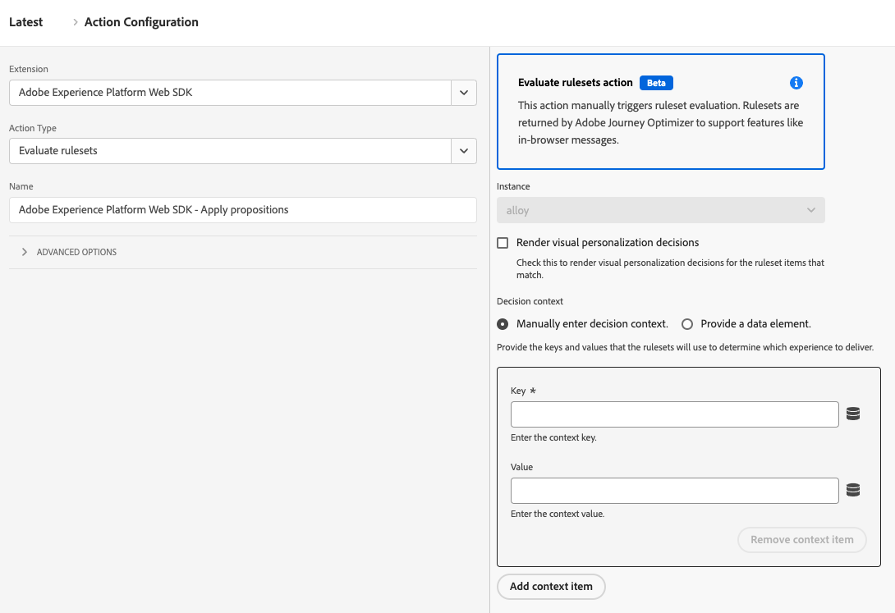

# Évaluation d’ensembles de règles

Le type d’action **[!UICONTROL Evaluate rulesets]** vous permet de déclencher manuellement des évaluations d’ensemble de règles. Les ensembles de règles sont renvoyés par Adobe Journey Optimizer pour prendre en charge des fonctionnalités telles que les messages dans le navigateur.

1. Connectez-vous à [experience.adobe.com](https://experience.adobe.com?lang=fr) à l’aide de vos informations d’identification Adobe ID.
1. Accédez à **[!UICONTROL Data Collection]** > **[!UICONTROL Tags]**.
1. Sélectionnez la propriété de balise de votre choix.
1. Accédez à **[!UICONTROL Rules]**, puis sélectionnez la règle de votre choix.
1. Sous [!UICONTROL Actions], sélectionnez une action existante ou créez-en une.
1. Définissez le champ déroulant du [!UICONTROL Extension] sur **[!UICONTROL Adobe Experience Platform Web SDK]**, puis définissez le [!UICONTROL Action type] sur **[!UICONTROL Evaluate rulesets]**.

## Champs disponibles

Ce type d’action prend en charge les options suivantes :

* **[!UICONTROL Render visual personalization decisions]** : une case à cocher qui, lorsqu’elle est activée, rend des décisions de personnalisation visuelles pour les éléments d’ensemble de règles qui correspondent.
* **[!UICONTROL Decision context]** : mappage clé-valeur utilisé lors de l’évaluation des ensembles de règles Adobe Journey Optimizer pour la prise de décision sur l’appareil. Vous pouvez fournir le contexte de décision manuellement ou par le biais d&#39;un élément de données.
