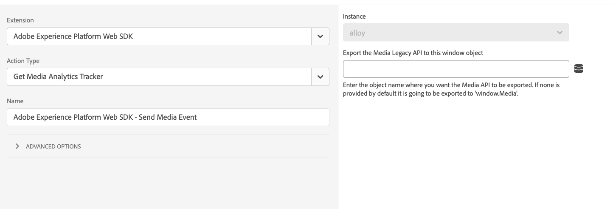

# Obtention du suivi Media Analytics

L’action **[!UICONTROL Get Media Analytics tracker]** est utilisée pour obtenir l’API Media Analytics héritée. Lors de la configuration de l’action et qu’un nom d’objet est fourni, l’API Media Analytics héritée est exportée vers cet objet de fenêtre. Cette action est utile pour passer de l’ancienne version de Media Analytics à Streaming Media Analytics.

1. Connectez-vous à [experience.adobe.com](https://experience.adobe.com?lang=fr) à l’aide de vos informations d’identification Adobe ID.
1. Accédez à **[!UICONTROL Data Collection]** > **[!UICONTROL Tags]**.
1. Sélectionnez la propriété de balise de votre choix.
1. Accédez à **[!UICONTROL Rules]**, puis sélectionnez la règle de votre choix.
1. Sous [!UICONTROL Actions], sélectionnez une action existante ou créez-en une.
1. Définissez le champ déroulant du [!UICONTROL Extension] sur **[!UICONTROL Adobe Experience Platform Web SDK]**, puis définissez le [!UICONTROL Action type] sur **[!UICONTROL Get Media Analytics tracker]**.

Cette action contient un seul champ que vous pouvez configurer :

* **[!UICONTROL Export the Media Legacy API to this window object]** : sélectionne l’objet vers lequel exporter l’API héritée du média. Si aucun n’est fourni, l’action exporte l’API vers `window.Media`.
